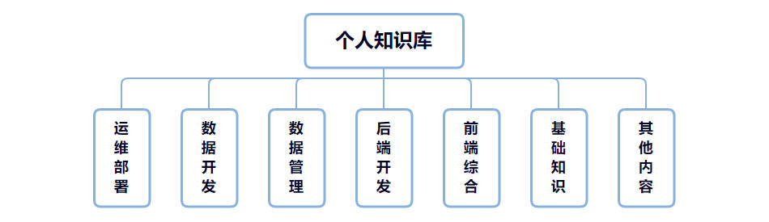

# **本站地图**

# **运维部署**

<!-- panels:start -->

<!-- div:left-panel -->

[【Django】Django-Vue-Admin安装记录](src/运维部署/Django-Vue-Admin安装记录)

[【Django】Django安装记录](src/运维部署/Django安装记录)

[【Docker】Docker安装部署记录](src/运维部署/Docker安装部署记录)

[【Docker】Docker的常用命令](src/运维部署/Docker的常用命令)

[【Docker】Docker的相关概念](src/运维部署/Docker的相关概念)

[【Docker】Docker的实验特性开启](src/运维部署/Docker的实验特性开启)

[【Docker】Docker的镜像加速设置](src/运维部署/Docker的镜像加速设置)

[【Docker】Docker环境变量失效问题处理](src/运维部署/Docker环境变量失效问题处理)

[【Docsify】Docsify安装记录](src/运维部署/Docsify安装记录)

[【DolphinScheduler】DolphinScheduler安装部署记录](src/运维部署/DolphinScheduler安装部署记录)

[【Git】Git编译安装记录](src/运维部署/Git编译安装记录)

[【Git】Windows版Git安装记录](src/运维部署/Windows版Git安装记录)

[【Git】Git相关操作](src/运维部署/Git相关操作)

[【Hadoop】Hadoop安装部署记录](src/运维部署/Hadoop安装部署记录)

[【Hadoop】DataNode的上线下线操作](src/运维部署/DataNode的上线下线操作)

[【HBase】HBase安装部署记录](src/运维部署/HBase安装部署记录)

[【Hive】Hive安装部署记录](src/运维部署/Hive安装部署记录)

[【Java】JDK安装配置记录](src/运维部署/JDK安装配置记录)

[【Kafka】Kafka安装部署记录](src/运维部署/Kafka安装部署记录)

[【Kafka】基于Docker的Kafka安装记录](src/运维部署/基于Docker的Kafka安装记录)

[【Kafka】EFAK安装部署记录](src/运维部署/EFAK安装部署记录)

[【Linux】Centos7安装配置记录](src/运维部署/Centos7安装配置记录)

[【Linux】Linux磁盘挂载记录](src/运维部署/Linux磁盘挂载记录)

[【Linux】Centos7端口相关操作](src/运维部署/Centos7端口相关操作)

[【Linux】虚机集群搭建记录](src/运维部署/虚机集群搭建记录)

[【Linux】Windows安装Linux子系统](src/运维部署/Windows安装Linux子系统)

<!-- div:right-panel -->

[【Linux】制作yum源进行离线安装记录](src/运维部署/制作yum源进行离线安装记录)

[【Linux】Linux的常用命令](src/运维部署/Linux的常用命令)

[【Linux】Linux的高级文本命令](src/运维部署/Linux的高级文本命令)

[【Linux】Linux批量添加用户](src/运维部署/Linux批量添加用户)

[【Linux】SSH免密登录设置](src/运维部署/SSH免密登录设置)

[【Linux】Crontab定时任务设置](src/运维部署/Crontab定时任务设置)

[【Linux】Ubuntu的apt-get源设置](src/运维部署/Ubuntu的apt-get源设置)

[【Maven】Maven安装配置记录](src/运维部署/Maven安装配置记录)

[【Maven】Windows版Maven安装配置记录](src/运维部署/Windows版Maven安装配置记录)

[【MySQL】MySQL安装配置记录](src/运维部署/MySQL安装配置记录)

[【MySQL】Windows版MySQL安装记录](src/运维部署/Windows版MySQL安装记录)

[【Navicat】Navicat_Premium15安装方式](src/运维部署/Navicat_Premium15安装方式)

[【Neo4j】Docker版Neo4j安装记录](src/运维部署/Docker版Neo4j安装记录)

[【Neo4j】Windows版Neo4j安装记录](src/运维部署/Windows版Neo4j安装记录)

[【Neo4j】Neo4j_Desktop下载安装记录](src/运维部署/Neo4j_Desktop下载安装记录)

[【Node】Node环境安装记录](src/运维部署/Node环境安装记录)

[【PowerDesiger】PowerDesiger安装记录](src/运维部署/PowerDesiger安装记录)

[【Python】Python环境安装记录](src/运维部署/Python环境安装记录)

[【Python】Windows版Python安装记录](src/运维部署/Windows版Python安装记录)

[【Redis】Redis安装部署记录](src/运维部署/Redis安装部署记录)

[【Spark】Spark安装部署记录](src/运维部署/Spark安装部署记录)

[【Spark】SparkSQL与Hive整合记录](src/运维部署/SparkSQL与Hive整合记录)

[【VMware】VMware_Pro_16安装方式](src/运维部署/VMware_Pro_16安装方式)

[【ZooKeeper】ZooKeeper安装部署记录](src/运维部署/ZooKeeper安装部署记录)

<!-- panels:end -->

# **数据开发**

## Hadoop

<!-- panels:start -->

<!-- div:left-panel -->

[HDFS的命令行操作](src/数据开发/HDFS的命令行操作)

[HDFS的API使用](src/数据开发/HDFS的API使用)

[HDFS的block大小设置](src/数据开发/HDFS的block大小设置)

[HDFS的写入读取机制](src/数据开发/HDFS的写入读取机制)

[HDFS的Checkpoint机制](src/数据开发/HDFS的Checkpoint机制)

[HDFS的心跳机制](src/数据开发/HDFS的心跳机制)

[HDFS的HA机制](src/数据开发/HDFS的HA机制)

[HDFS的安全模式](src/数据开发/HDFS的安全模式)

[NameNode的元数据管理及内存分配](src/数据开发/NameNode的元数据管理及内存分配)

[MapReduce的数据处理流程](src/数据开发/MapReduce的数据处理流程)

[MapReduce的可指定组件](src/数据开发/MapReduce的可指定组件)

<!-- div:right-panel -->

[MapReduce自定义bean对象实现序列化](src/数据开发/MapReduce自定义bean对象实现序列化)

[MapReduce的Map和Reduce个数](src/数据开发/MapReduce的Map和Reduce个数)

[MapReduce的分组topN高效实现](src/数据开发/MapReduce的分组topN高效实现)

[MapReduce的FileInputFormat切片机制](src/数据开发/MapReduce的FileInputFormat切片机制)

[MapReduce的DistributedCache分布式缓存](src/数据开发/MapReduce的DistributedCache分布式缓存)

[MapReduce的MapSideJoin和ReduceSideJoin](src/数据开发/MapReduce的MapSideJoin和ReduceSideJoin)

[MapReduce的推测执行算法及原理](src/数据开发/MapReduce的推测执行算法及原理)

[MapReduce在Yarn上的运行流程](src/数据开发/MapReduce在Yarn上的运行流程)

[Yarn的资源参数配置](src/数据开发/Yarn的资源参数配置)

[Yarn的任务调度策略](src/数据开发/Yarn的任务调度策略)

<!-- panels:end -->

## Hive

<!-- panels:start -->

<!-- div:left-panel -->

[Hive的交互命令和配置](src/数据开发/Hive的交互命令和配置)

[Hive的数据类型](src/数据开发/Hive的数据类型)

[Hive的DDL语言](src/数据开发/Hive的DDL语言)

[Hive的数据导入导出](src/数据开发/Hive的数据导入导出)

[Hive的查询语法](src/数据开发/Hive的查询语法)

<!-- div:right-panel -->

[Hive的函数](src/数据开发/Hive的函数)

[HQL转化为MapReduce的过程](src/数据开发/HQL转化为MapReduce的过程)

[Hive底层与数据库交互的过程](src/数据开发/Hive底层与数据库交互的过程)

[Hive的调优方法](src/数据开发/Hive的调优方法)

<!-- panels:end -->

## Spark

<!-- panels:start -->

<!-- div:left-panel -->

[Spark的相关概念](src/数据开发/Spark的相关概念)

[Spark的创建RDD方法](src/数据开发/Spark的创建RDD方法)

[Spark的Transformatin](src/数据开发/Spark的Transformatin)

[Spark的Action](src/数据开发/Spark的Action)

[Spark的StandAlone模式执行流程](src/数据开发/Spark的StandAlone模式执行流程)

[Spark的Yarn_Cluster模式执行流程](src/数据开发/Spark的Yarn_Cluster模式执行流程)

[Spark的WordCount执行流程](src/数据开发/Spark的WordCount执行流程)

[Spark的cache/persist](src/数据开发/Spark的cachepersist)

[Spark的checkpoint](src/数据开发/Spark的checkpoint)

[Spark的广播变量](src/数据开发/Spark的广播变量)

[Spark的自定义分区器](src/数据开发/Spark的自定义分区器)

[Spark的自定义排序](src/数据开发/Spark的自定义排序)

<!-- div:right-panel -->

[Spark的分组TopN](src/数据开发/Spark的分组TopN)

[Spark的序列化问题](src/数据开发/Spark的序列化问题)

[SparkStreaming的使用](src/数据开发/SparkStreaming的使用)

[SparkSQL的基本使用](src/数据开发/SparkSQL的基本使用)

[SparkSQL的DataFrame编程](src/数据开发/SparkSQL的DataFrame编程)

[SparkSQL的DataSet编程](src/数据开发/SparkSQL的DataSet编程)

[SparkSQL的RDD/DF/DS互转](src/数据开发/SparkSQL的RDDDFDS互转)

[SparkSQL的自定义函数](src/数据开发/SparkSQL的自定义函数)

[Spark的开发调优](src/数据开发/Spark的开发调优)

[Spark的参数调优](src/数据开发/Spark的参数调优)

[Spark的数据倾斜](src/数据开发/Spark的数据倾斜)

<!-- panels:end -->

## Flink

<!-- panels:start -->

<!-- div:left-panel -->

[Flink的相关概念](src/数据开发/Flink的相关概念)

[Flink的Task阶段划分](src/数据开发/Flink的Task阶段划分)

[Flink的Slot](src/数据开发/Flink的Slot)

[Flink的Time分类](src/数据开发/Flink的Time分类)

[Flink的Window分类](src/数据开发/Flink的Window分类)

[Flink的Watermark](src/数据开发/Flink的Watermark)

[Flink的CheckPointing](src/数据开发/Flink的CheckPointing)

[Flink的State](src/数据开发/Flink的State)

<!-- div:right-panel -->

[Flink的侧流输出](src/数据开发/Flink的侧流输出)

[Flink的ExactlyOnce](src/数据开发/Flink的ExactlyOnce)

[Flink的StateBackend](src/数据开发/Flink的StateBackend)

[Flink的实时TopN](src/数据开发/Flink的实时TopN)

[Flink的历史数据累加](src/数据开发/Flink的历史数据累加)

[Flink的自定义Operator](src/数据开发/Flink的自定义Operator)

[基于Flink的实时离线数据整合](src/数据开发/基于Flink的实时离线数据整合)

[Flink连接Mysql的No_suitable_driver_found_for_jdbc问题处理](src/数据开发/Flink连接Mysql的No_suitable_driver_found_for_jdbc问题处理)

<!-- panels:end -->

## Neo4j

[Neo4j的命令行操作](src/数据开发/Neo4j的命令行操作)

[Python操作Neo4j](src/数据开发/Python操作Neo4j)

[Neo4j导入CSV文件](src/数据开发/Neo4j导入CSV文件)

[Neo4j导入CSV文件的Couldn't_load_the_external_resource问题处理](src/数据开发/Neo4j导入CSV文件的Couldn't_load_the_external_resource问题处理)

[Docker版Neo4j的neo4j-import](src/数据开发/Docker版Neo4j的neo4j-import)

## HBase

<!-- panels:start -->

<!-- div:left-panel -->

[HBase的命令行操作](src/数据开发/HBase的命令行操作)

[HBase的API使用](src/数据开发/HBase的API使用)

[HBase的RowKey设计原则](src/数据开发/HBase的RowKey设计原则)

[HBase的BulkLoadar](src/数据开发/HBase的BulkLoadar)

<!-- div:right-panel -->

[HBase的数据模型](src/数据开发/HBase的数据模型)

[HBase的读写流程](src/数据开发/HBase的读写流程)

[HBase的协处理器](src/数据开发/HBase的协处理器)

[HBase的过滤器](src/数据开发/HBase的过滤器)

<!-- panels:end -->

## Kafka

<!-- panels:start -->

<!-- div:left-panel -->

[Kafka的相关概念](src/数据开发/Kafka的相关概念)

[Kafka的命令行操作](src/数据开发/Kafka的命令行操作)

[Kafka的基础API使用](src/数据开发/Kafka的基础API使用)

[Kafka的acks应答机制](src/数据开发/Kafka的acks应答机制)

[Kafka的一致性实现机制](src/数据开发/Kafka的一致性实现机制)

[Kafka的幂等性实现](src/数据开发/Kafka的幂等性实现)

[Kafka的事务控制](src/数据开发/Kafka的事务控制)

<!-- div:right-panel -->

[消费者组的再均衡分配策略](src/数据开发/消费者组的再均衡分配策略)

[消费者组的再均衡流程](src/数据开发/消费者组的再均衡流程)

[Kafka的静态成员功能](src/数据开发/Kafka的静态成员功能)

[生产者的消息发送流程及相关参数](src/数据开发/生产者的消息发送流程及相关参数)

[Kafka的物理存储结构](src/数据开发/Kafka的物理存储结构)

[基于目标端事务的ExactlyOnce数据消费](src/数据开发/基于目标端事务的ExactlyOnce数据消费)

[Kafka的Timed_out_waiting_for_connection_while_in_state_CONNECTING问题处理](src/数据开发/Kafka的Timed_out_waiting_for_connection_while_in_state_CONNECTING问题处理)

<!-- panels:end -->

## Flume

<!-- panels:start -->

<!-- div:left-panel -->

[Flume的相关概念](src/数据开发/Flume的相关概念)

[Flume的Source](src/数据开发/Flume的Source)

[Flume的Interceptor](src/数据开发/Flume的Interceptor)

[Flume的Channel](src/数据开发/Flume的Channel)

[Flume的Sink](src/数据开发/Flume的Sink)

<!-- div:right-panel -->

[Flume的Selector](src/数据开发/Flume的Selector)

[Flume的Grouping_Processor](src/数据开发/Flume的Grouping_Processor)

[Flume的自定义组件](src/数据开发/Flume的自定义组件)

[基于Flume和LFTP的非结构化文件同步](src/数据开发/基于Flume和LFTP的非结构化文件同步)

<!-- panels:end -->

## Sqoop

[Sqoop安装记录](src/数据开发/Sqoop安装记录)

[Sqoop的相关操作](src/数据开发/Sqoop的相关操作)

[Sqoop对Oracle进行入库/回调](src/数据开发/Sqoop对Oracle进行入库回调)

## Redis

[Redis命令行操作](src/数据开发/Redis命令行操作)

[Redis的API使用](src/数据开发/Redis的API使用)

## Zookeeper

[Zookeeper的命令行操作](src/数据开发/Zookeeper的命令行操作)

[Zookeeper的API使用](src/数据开发/Zookeeper的API使用)

[Zookeeper的数据模型和监听机制](src/数据开发/Zookeeper的数据模型和监听机制)

[Zookeeper的选举机制](src/数据开发/Zookeeper的选举机制)

## MySQL

[MySQL中utf8的校对规则](src/数据开发/MySQL中utf8的校对规则)

[MySQL拆分字段转为多行](src/数据开发/MySQL拆分字段转为多行)

[MySQL数据库备份](src/数据开发/MySQL数据库备份)

[Excel自定义日期通过Navicat入库后转为5位数字问题处理](src/数据开发/Excel自定义日期通过Navicat入库后转为5位数字问题处理)

## Oracle

[Oracle的TRANSLATE函数](src/数据开发/Oracle的TRANSLATE函数)

# **数据管理**

## 数据管理 Data Management

[数据管理基本概念](src/数据管理/数据管理基本概念)

[数据管理框架](src/数据管理/数据管理框架)

[数据管理的知识领域](src/数据管理/数据管理的知识领域)

[数据管理的其他主题](src/数据管理/数据管理的其他主题)

## 数据处理道德 Data Handling Ethics

[数据处理道德框架](src/数据管理/数据处理道德框架)

[数据处理道德的基本概念](src/数据管理/数据处理道德的基本概念)

[数据隐私法背后的原则](src/数据管理/数据隐私法背后的原则)

[违反道德原则的数据实践](src/数据管理/违反道德原则的数据实践)

[数据道德文化的建立](src/数据管理/数据道德文化的建立)

## 数据治理 Data Governance

[数据治理框架](src/数据管理/数据治理框架)

[数据治理的基本概念](src/数据管理/数据治理的基本概念)

[数据治理组织和运营模型](src/数据管理/数据治理组织和运营模型)

[数据专员的职责和类型](src/数据管理/数据专员的职责和类型)

[数据资产价值评估](src/数据管理/数据资产价值评估)

[数据治理活动](src/数据管理/数据治理活动)

[数据治理工具和技术](src/数据管理/数据治理工具和技术)

[数据治理实施指南](src/数据管理/数据治理实施指南)

[数据治理指标](src/数据管理/数据治理指标)

## 数据架构 Data Architecture

# **后端开发**

## Java

<!-- panels:start -->

<!-- div:left-panel -->

[Java的基础语法](src/后端开发/Java的基础语法)

[Java的面向对象](src/后端开发/Java的面向对象)

[Java的常用类](src/后端开发/Java的常用类)

[Java的集合](src/后端开发/Java的集合)

[Java的异常处理](src/后端开发/Java的异常处理)

[Java的IO流操作](src/后端开发/Java的IO流操作)

<!-- div:right-panel -->

[Java的多线程](src/后端开发/Java的多线程)

[Java的网络编程](src/后端开发/Java的网络编程)

[Java的反射使用](src/后端开发/Java的反射使用)

[Lambda表达式的使用](src/后端开发/Lambda表达式的使用)

[DateTimeFormatter的使用](src/后端开发/DateTimeFormatter的使用)

<!-- panels:end -->

## Python

<!-- panels:start -->

<!-- div:left-panel -->

[Python的基础语法](src/后端开发/Python的基础语法)

[Python的函数](src/后端开发/Python的函数)

[Python的面向对象](src/后端开发/Python的面向对象)

[Python的序列](src/后端开发/Python的序列)

[Python的异常处理](src/后端开发/Python的异常处理)

[Python的文件操作](src/后端开发/Python的文件操作)

[基于urllib的ajax数据爬取](src/后端开发/基于urllib的ajax数据爬取)

[时间序列模型Prophet使用](src/后端开发/时间序列模型Prophet使用)

[每日疫苗接种数据自动处理流程](src/后端开发/每日疫苗接种数据自动处理流程)

[基于selenium的相关应用记录](src/后端开发/基于selenium的相关应用记录)

[解压rar/zip文件并识别路径](src/后端开发/解压rarzip文件并识别路径)

[基于smtplib的邮件发送](src/后端开发/基于smtplib的邮件发送)

<!-- div:right-panel -->

[基于Place API和Geocoder的经纬度查询](src/后端开发/基于Place_API和Geocoder的经纬度查询)

[基于ddddocr的图片验证码识别](src/后端开发/基于ddddocr的图片验证码识别)

[pandas导入Excel到数据库](src/后端开发/pandas导入Excel到数据库)

[pandas导入HTML表格到数据库](src/后端开发/pandas导入HTML表格到数据库)

[基于filestools的watermark添加](src/后端开发/基于filestools的watermark添加)

[Python的Microsoft_Visual_C++_14.0_is_required问题处理](src/后端开发/Python的Microsoft_Visual_C++_14.0_is_required问题处理)

[Python的Can_not_execute_setup.py问题处理](src/后端开发/Python的Can_not_execute_setup.py问题处理)

[pandas的type object 'object' has no attribute 'dtype'问题处理](src/后端开发/pandas的type_object_'object'_has_no_attribute_'dtype'问题处理)

[numpy的numpy.core.multiarray failed to import问题处理](src/后端开发/numpy的numpy.core.multiarray_failed_to_import问题处理)

[Python的ModuleNotFoundError_No_module_named_'_ctypes'问题处理](src/后端开发/Python的ModuleNotFoundError_No_module_named_'_ctypes'问题处理)

[selenium的click使用try后失效问题处理](src/后端开发/selenium的click使用try后失效问题处理)

[输出MySQL数据结构为Markdown文件](src/后端开发/输出MySQL数据结构为Markdown文件)

<!-- panels:end -->

## Scala

<!-- panels:start -->

<!-- div:left-panel -->

[Scala的基础语法](src/后端开发/Scala的基础语法)

[Scala的面向对象](src/后端开发/Scala的面向对象)

[Scala的集合框架](src/后端开发/Scala的集合框架)

[Scala的模式匹配](src/后端开发/Scala的模式匹配)

[Scala的并发编程](src/后端开发/Scala的并发编程)

<!-- div:right-panel -->

[Scala的柯里化](src/后端开发/Scala的柯里化)

[Scala的隐式](src/后端开发/Scala的隐式)

[Scala的泛型](src/后端开发/Scala的泛型)

[Scala的连接符号](src/后端开发/Scala的连接符号)

[Scala的while读取io流死循环问题处理](src/后端开发/Scala的while读取io流死循环问题处理)

<!-- panels:end -->

## Shell

<!-- panels:start -->

<!-- div:left-panel -->

[Shell脚本执行方法](src/后端开发/Shell脚本执行方法)

[Shell的变量](src/后端开发/Shell的变量)

[Shell的运算符](src/后端开发/Shell的运算符)

[Shell的条件判断](src/后端开发/Shell的条件判断)

[Shell的流程控制](src/后端开发/Shell的流程控制)

<!-- div:right-panel -->

[Shell的函数](src/后端开发/Shell的函数)

[Shell脚本调试](src/后端开发/Shell脚本调试)

[Hive和Oracle数据比对](src/后端开发/Hive和Oracle数据比对)

[DolphinScheduler部署脚本](src/后端开发/DolphinScheduler部署脚本)

<!-- panels:end -->

# **前端综合**

## HTML

<!-- panels:start -->

<!-- div:left-panel -->

[HTML的基础标签](src/前端综合/HTML的基础标签)

[HTML的格式化标签](src/前端综合/HTML的格式化标签)

[HTML的样式标签](src/前端综合/HTML的样式标签)

[HTML的列表标签](src/前端综合/HTML的列表标签)

[HTML的表单标签](src/前端综合/HTML的表单标签)

<!-- div:right-panel -->

[HTML的链接标签](src/前端综合/HTML的链接标签)

[HTML的引入标签](src/前端综合/HTML的引入标签)

[HTML的全局属性](src/前端综合/HTML的全局属性)

[HTML的字符实体](src/前端综合/HTML的字符实体)

<!-- panels:end -->

## CSS

<!-- panels:start -->

<!-- div:left-panel -->

[CSS的使用方式](src/前端综合/CSS的使用方式)

[CSS的选择器](src/前端综合/CSS的选择器)

[CSS的长度单位](src/前端综合/CSS的长度单位)

[CSS的颜色单位](src/前端综合/CSS的颜色单位)

[CSS的盒模型](src/前端综合/CSS的盒模型)

<!-- div:right-panel -->

[元素的显示设置](src/前端综合/元素的显示设置)

[元素的浮动](src/前端综合/元素的浮动)

[元素的定位](src/前端综合/元素的定位)

[CSS的字体与段落](src/前端综合/CSS的字体与段落)

<!-- panels:end -->

## JavaScript

<!-- panels:start -->

<!-- div:left-panel -->

[JavaScript的基础语法](src/前端综合/JavaScript的基础语法)

[JavaScript的面向对象](src/前端综合/JavaScript的面向对象)

[浅拷贝和深拷贝](src/前端综合/浅拷贝和深拷贝)

[JavaScript的序列化](src/前端综合/JavaScript的序列化)

[JavaScript的内建结构](src/前端综合/JavaScript的内建结构)

[JavaScript的解构赋值](src/前端综合/JavaScript的解构赋值)

<!-- div:right-panel -->

[HTML DOM的节点操作](src/前端综合/HTML_DOM的节点操作)

[HTML DOM的文档加载](src/前端综合/HTML_DOM的文档加载)

[HTML DOM的CSS样式操作](src/前端综合/HTML_DOM的CSS样式操作)

[HTML DOM的事件对象](src/前端综合/HTML_DOM的事件对象)

[BOM相关操作](src/前端综合/BOM相关操作)

[基于MapVGL的热力图开发](src/前端综合/基于MapVGL的热力图开发)

<!-- panels:end -->

## jQuery

[jQuery的核心函数](src/前端综合/jQuery的核心函数)

[jQuery的方法](src/前端综合/jQuery的方法)

[jQuery的事件绑定](src/前端综合/jQuery的事件绑定)

[回到顶部插件GoUp使用](src/前端综合/回到顶部插件GoUp使用)

## Django

<!-- panels:start -->

<!-- div:left-panel -->

[Django的项目创建](src/前端综合/Django的项目创建)

[Django的应用创建](src/前端综合/Django的应用创建)

[Django的模板创建](src/前端综合/Django的模板创建)

[Django的静态文件配置](src/前端综合/Django的静态文件配置)

[Django的默认数据库变更](src/前端综合/Django的默认数据库变更)

[Django的模型使用](src/前端综合/Django的模型使用)

[Django的数据库操作](src/前端综合/Django的数据库操作)

<!-- div:right-panel -->

[Django的表单使用](src/前端综合/Django的表单使用)

[Django的视图使用](src/前端综合/Django的视图使用)

[Django的映射配置](src/前端综合/Django的映射配置)

[Django渲染表单后显示This_field_is_required问题处理](src/前端综合/Django渲染表单后显示This_field_is_required问题处理)

[Django启动项目一直Performing_system_checks问题处理](src/前端综合/Django启动项目一直Performing_system_checks问题处理)

[基于Django的Neo4j知识图谱系统](src/前端综合/基于Django的Neo4j知识图谱系统)

[知识图谱系统嵌入DVAdmin](src/前端综合/知识图谱系统嵌入DVAdmin)

<!-- panels:end -->

## Docsify

[Docsify的多页设置](src/前端综合/Docsify的多页设置)

[Docsify的导航栏设置](src/前端综合/Docsify的导航栏设置)

[Docsify的插件使用](src/前端综合/Docsify的插件使用)

# **基础知识**

## 数据结构和算法

## 项目管理 Project Management

<!-- panels:start -->

<!-- div:left-panel -->

[项目整合管理](src/基础知识/项目整合管理)

[项目范围管理](src/基础知识/项目范围管理)

[项目进度管理](src/基础知识/项目进度管理)

[项目成本管理](src/基础知识/项目成本管理)

[项目质量管理](src/基础知识/项目质量管理)

[项目资源管理](src/基础知识/项目资源管理)

<!-- div:right-panel -->

[项目沟通管理](src/基础知识/项目沟通管理)

[项目相关方管理](src/基础知识/项目相关方管理)

[项目风险管理](src/基础知识/项目风险管理)

[项目采购管理](src/基础知识/项目采购管理)

[敏捷开发管理](src/基础知识/敏捷开发管理)

<!-- panels:end -->

# **其他内容**

[Markdown公式语法](src/其他内容/Markdown公式语法)

[IDEA相关操作](src/其他内容/IDEA相关操作)

[Eclipse相关操作](src/其他内容/Eclipse相关操作)

[PotPlayer快捷键](src/其他内容/PotPlayer快捷键)

[Windows查看保存的wifi密码](src/其他内容/Windows查看保存的wifi密码)

***

