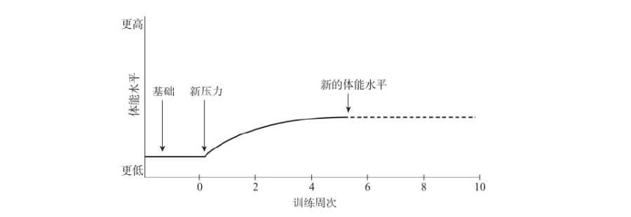

## 训练

### 训练计划

- 增加压力时，务必将所选择的压力沉痼保持4到周，然后再进行改变。
- 增加压力的四个变量
  - 训练量
    - 单日训练总量
  - 强度
    - 配速
  - 恢复
    - 间隔的休息分钟数
  - 频率
    - 每周次数

- 在赛后第一天进行训练，因为在身体承受压力48小时后训练带来的肌肉不适要比身体承受压力24小时后更严重。

### 步频

- 以每分钟180步的步频奔跑，可以将跑步带来的落地冲击力减至最小。
- 步频越慢，滞空时间越长，意味着把自身重量抬得越高，下一次落地时就会更重地撞击地面。
- 许多小伤病的出现，正式由落地时产生的冲击力引起的。

### 落地冲击力

- 将落地冲击力减至最小的方式是假装在滚过地面，而不是双脚交替在地面上跳跃。
- 试着不要把脚落在身体前方，这个动作通常会有制动作用，会在换脚落地时增加冲击力。
- 试着让双脚向后落，落得离身体更近些，靠近身体中心。

### 脚的着地

- 全脚掌或脚跟着地的一大优势在于可以减轻腓肠肌所承受的压力，并将着地的压力更多地转移到更大块的大腿肌肉上。
- 前脚掌着地会增大出现小腿疼痛的可能性。
- 使用脚跟先着地的话，每次脚着地后身体向前移动时，便可以试着想象自己正在摆动双脚滚过地面。
- 如果你的腓肠肌（小腿后群肌之一）或者胫骨（小腿内侧的长骨）感觉不适，试着主要使用全脚掌或者脚跟着地，这样尝试几周，看看是否能够解决你的问题。一般情况下，单单专注在达到每分钟180步的步频上，往往就会促使你用全脚掌或者脚跟着地，你都不需要去思考脚是如何着地的。
- 着地的时候脚趾尽量不要外翻。让别人站在你的前方，看着你跑向他们，让他们注意一下当你的脚着地的时候，脚趾是指向前方还是指向侧面。着地时脚外翻通常会带来小腿内侧的胫骨疼痛。

### 呼吸

- 在正常的大气条件下，呼吸不适有时候与剧烈运动（尤其是跑步）相关，而这并不是由肺部缺氧引起的，而是由于肺部的二氧化碳增加，才使得你想要更大口地呼吸。
- 跑得越辛苦，二氧化碳就会被越快地输送到肺部，而因此产生的二氧化碳的增加会促使更重地呼吸，以降低该气体在肺部的浓度。这也能帮助将O2维持在当前运动所需的浓度上。
- 大部分有技巧的跑者都采用2—2节奏，尤其是跑得相当辛苦时，这样很舒服，还能使数量可观的空气进出肺部。即便是在轻松跑、乳酸门槛跑、间歇跑和重复训练时，最好也使用2—2的好节奏。

## 体能

