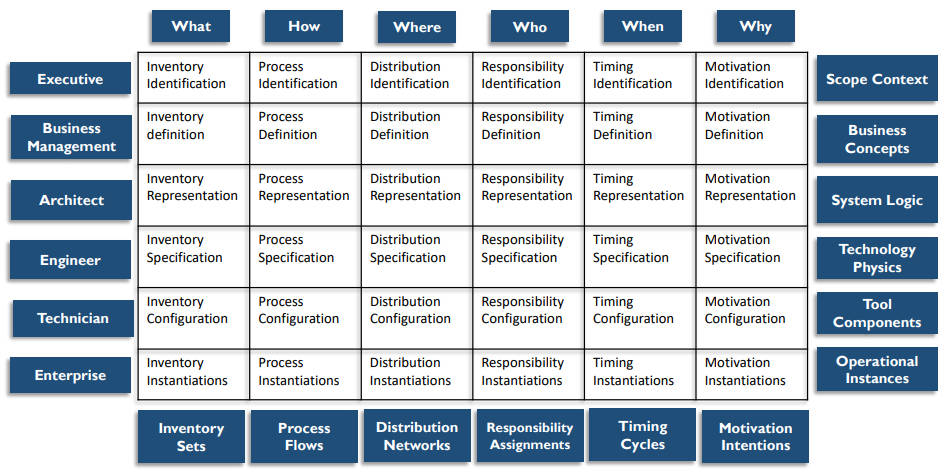
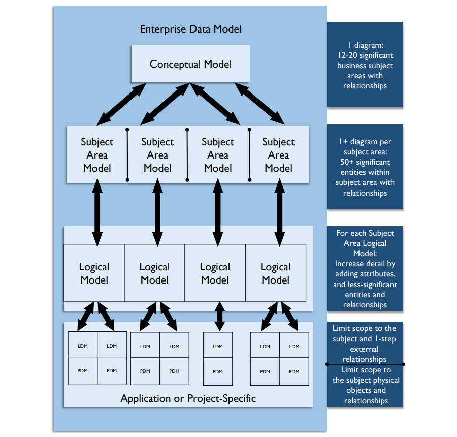
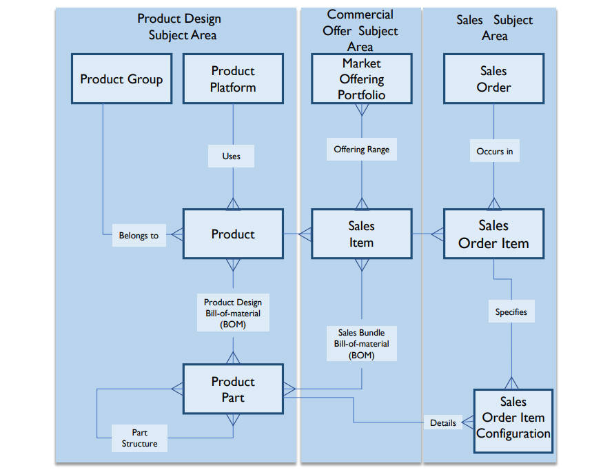

# **数据架构基本概念**

- 企业架构涵盖多个领域，包括业务、数据、应用和技术，管理良好的企业架构实践可以帮助组织了解其系统的当前状态、促进向理想状态的改变、实现监管合规以及提高效率
- 数据架构是数据管理的基础，以不同的抽象级别表示组织的数据，以便可以理解这些数据，并且管理层可以据此做出决策
- 最详细的数据架构设计文档是正式的企业数据模型，包括数据名称、全面数据和元数据定义、概念的和逻辑的实体和关系，以及业务规则（data names, comprehensive data and Metadata definitions, conceptual and logical entities and relationships, and business rules）
- 物理数据模型（Physical data models）也属于企业数据模型，但其是数据建模和设计的产物，而不是数据架构的产物

## 数据架构的基本组成部分

- 数据架构成果（Data Architecture outcomes）
  - 各个级别的模型、定义和数据流，通称数据架构工件（artifacts）
- 数据架构活动（Data Architecture activities）
  - 形成、部署和实现（form, deploy and fulfill）数据架构目标
- 数据架构行为（Data Architecture behavior）
  - 影响企业数据架构的各种角色之间的协作、思维方式和技能（collaborations, mindsets, and skills ）

## 数据架构的驱动因素

数据架构的目标是成为业务战略和技术执行之间的桥梁

- 战略性地让组织做好准备，以快速发展其产品、服务和数据，以利用新兴技术的固有商业机会
- 将业务需求转化为数据和系统要求，以便始终拥有所需的数据
- 管理企业的复杂数据和信息交付（complex data and information delivery）
- 促进（facilitate ）IT和业务的一致
- 充当变革、转型和敏捷（change, transformation, and agility）的推动者

## 数据架构的成果和实践

### 数据架构的主要成果

- 数据存储和处理需求（Data storage and processing requirements）
- 满足企业当前和长期的数据需求的结构和规划设计（Designs of structures and plans that meet the current and long-term data requirements of the enterprise）

### 数据架构定义和维护的内容

- 定义组织中数据的当前状态
- 为数据和组件提供标准的业务术语表
- 使数据架构与企业策略和业务架构保持一致
- 表达战略数据需求
- 概述高层级集成设计以满足这些需求
- 与企业架构路线图进行整合

### 数据架构实践的总体内容

- 使用数据架构工件（主蓝图）来定义数据需求、指导数据集成、控制数据资产，以及使数据投资与业务战略保持一致
- 与从事改进业务或IT系统开发的各种利益相关者合作、学习并影响他们
- 使用数据架构通过通用业务术语表建立企业的语义（semantics）

## 企业架构领域（Enterprise Architecture Domains）

### 企业业务架构（Enterprise Business Architecture）

- 目的（Purpose）
  - 确定企业如何为客户和其他利益相关者创造价值（To identify how an enterprise creates value for customers and other stakeholder）
- 元素（Elements）
  - 业务模型、流程、能力、服务、事件、策略、术语（Business models, processes, capabilities, services, events, strategies, vocabulary）
- 依赖（Dependencies）
  - 建立其他领域的需求（Establishes requirements for the other domains）
- 角色（Roles）
  - 业务架构师和分析师、业务数据专员（Business architects and analysts, business data stewards）

### 企业数据架构（Enterprise Data Architecture）

- 目的（Purpose）
  - 描述应如何组织和管理数据（To describe how data should be organized and managed）
- 元素（Elements）
  - 数据模型、数据定义、数据映射规范、数据流、结构化数据API（Data models, data definitions, data mapping specifications, data flows, structured data APIs）
- 依赖（Dependencies）
  - 管理业务架构创建和所需的数据（Manages data created and required by business architecture）
- 角色（Roles）
  - 数据架构师和建模师、数据专员（Data architects and modelers, data stewards）

### 企业应用架构（Enterprise Applications Architecture）

- 目的（Purpose）
  - 描述企业中应用程序的结构和功能（To describe the structure and functionality of applications in an enterprise）
- 元素（Elements）
  - 业务系统、软件包、数据库（Business systems, software packages, databases）
- 依赖（Dependencies）
  - 根据业务需求对指定数据进行操作（Acts on specified data according to business requirements）
- 角色（Roles）
  - 应用架构师（Applications architects）

### 企业技术架构（Enterprise Technology Architecture）

- 目的（Purpose）
  - 描述使系统能够工作和交付价值所需的物理技术（To describe the physical technology needed to enable systems to function and deliver value）
- 元素（Elements）
  - 技术平台、网络、安全、集成工具（Technical platforms, networks, security, integration tools）
- 依赖（Dependencies）
  - 托管和执行应用架构（Hosts and executes the application architecture ）
- 角色（Roles）
  - 基础设施架构师（Infrastructure architects）

## 企业架构框架（ Enterprise Architecture Frameworks）

- 架构框架是用于开发范围广泛的相关架构的基础结构，架构框架提供了思考和理解架构的方法，代表架构的架构

### Zachman框架

- 6*6的矩阵包括描述企业所需的完整模型集及其之间的关系，并未定义如何创建模型，只显示应该存在哪些模型，框架分类按单元格（疑问和转换的交集）表示，每个单元格代表一种独特的设计工件，每个工件表示特定视角如何回答基本问题
- 列：沟通的疑问（communication interrogatives），可以询问任何实体的基本问题

  - 什么
  - 清单（inventory），用于构建架构的实体
  - 如何
    - 过程（process），执行的活动
  - 在哪
    - 分布（distribution），业务位置和技术位置
  - 谁
    - 责任（responsibility），角色和组织
  - 何时
    - 定时（timing），间隔、事件、周期和时间表
  - 为什么
    - 动机（motivation），目标、策略和方式
- 行：具体化转换（reification transformations），将抽象实例转化为具体实例的必须步骤，分布代表计划者、所有者、设计者、构建者、实施者和用户的视角

  - 识别（Identification）【计划者】
    - 执行视角（executive perspective）
    - 业务背景（business context）
    - 定义识别模型范围的**业务元素列表**
  - 定义（Definition）【所有者】
    - 业务管理视角（business management perspective）
    - 业务概念（business concepts）
    - 阐明**业务概念之间的关系**，由执行领导作为所有者在定义模型中定义
  - 表示（Representation）【设计者】
    - 架构师视角（architect perspective）
    - 业务逻辑（business logic）
    - **系统逻辑模型**详细说明系统需求和不受约束的设计，由作为表示模型的设计师的架构师表示
  - 规范（Specification）【构建者】
    - 工程师视角（engineer perspective）
    - 业务实体（business physics）
    - 在工程师作为构建的规范模型中指定的特定技术、人员、成本和时间框架的约束下，优化设计以实现特定用途的**物理模型**
  - 配置（Configuration）【实施者】
    - 技术视角（technician perspective）
    - 组件装配（component assemblies）
    - **采用特定技术的、脱离背景的视图**，显示组件如何由技术人员作为实施者在配置模型中组装和操作配置
  - 实例（Instantiation）【用户】
    - 用户视角（user perspective）
    - 操作类（operations classes）
    - 用户作为参与者使用的**实际功能实例**，这个视角没有模型

## 企业数据架构（Enterprise Data Architecture）

- 企业数据架构为对组织重要的元素确定标准术语和设计
- 数据在组织中流动时，其被保护、集成、存储、记录、编目、共享、报告、分析和交付给利益相关者（secured, integrated, stored, recorded, catalogued, shared, reported on, analyzed, and delivered to stakeholders），在此过程中，数据可能被验证、增强、链接、认证、聚合、匿名化、用于分析直到存档或清除（verified, enhanced, linked, certified, aggregated, anonymized, and used for analytics until archived or purged），因此企业数据架构描述必须包括企业数据模型（如数据结构和数据规范）和数据流设计
  - 企业数据模型（EDM, Enterprise Data Model）
    - 一个整体的（holistic）、企业级的（enterprise-level）、独立于实施（implementation-independent）的概念或逻辑数据模型
    - 包括关键企业数据实体（即业务概念）及之间的关系、关键指导业务规则和一些关键属性
    - 应由利益相关者审批，以便就其有效代表企业达成共识
  - 数据流设计（Data Flow Design）
    - 定义跨数据库、应用、平台和网络的存储和处理的需求和主蓝图
    - 数据流将数据移动映射到业务流程、位置、业务角色和技术组件

### 企业数据模型（Enterprise Data Model ）

- 包括通用（企业范围的概念和逻辑模型）和特定于应用或项目的数据模型，以及定义、规范、映射和业务规则
- 企业数据模型通常以层级形式增量和迭代构建
  - 企业主题域的概念性概述
  - 每个主题域的实体和关系视图
  - 归属同一主题域的详细的逻辑视图
  - 特定应用或项目的逻辑和物理模型

- 各层级都是企业数据模型的一部分，并通过链接创建了在横向和纵向上跟踪实体的路径
  - 纵向
    - 每个层级的模型映射到其他层级的模型，模型血缘通过这些映射创建
  - 横向
    - 实体和关系可能出现在同一层级的多个模型中
    - 以一个主题为中心的逻辑模型中的实体可能与其他主题的实体相关，这些实体被标记为主题域的外部（external）

- 关系可能跨越主题域边界，企业数据模型中每个实体都应只处于一个主题域，但可以与其他主题域的实体有联系

- 概念企业数据模型（conceptual enterprise data model）由主题域模型组合而成，可以使用自下而上或自上而下的方法来构建企业数据模型

  - 自下而上
    - 主题域结构基于现有数据模型

  - 自上而下
    - 从形成主题域开始，然后用模型填充主题域
  - 建议结合使用两种方法，使用现有模型自下而上开始，再将主题域建模委派给项目（projects）进行填充以完成企业数据模型
    - starting with bottom-up using existing models and completing the enterprise data model by populating the models by delegating Subject Area modeling to projects

- 主题域鉴别器（discriminator），即形成主题域结构的原则，必须在整个企业数据模型中保持一致
- 常用的主题域划分原则：
  - 使用规范化规则，按系统组合（即资金）划分主题域，按数据治理结构和数据所有权（组织）形成主题域
  - 使用高级过程（基于业务价值链）
  - 使用业务能力（基于企业架构）
- 使用规范化规则形成的主题域通常对数据架构工作最有效

### 数据流设计（Data Flow Design）

- 数据流是一种数据血缘文档，描述数据如何在业务过程和系统中移动
