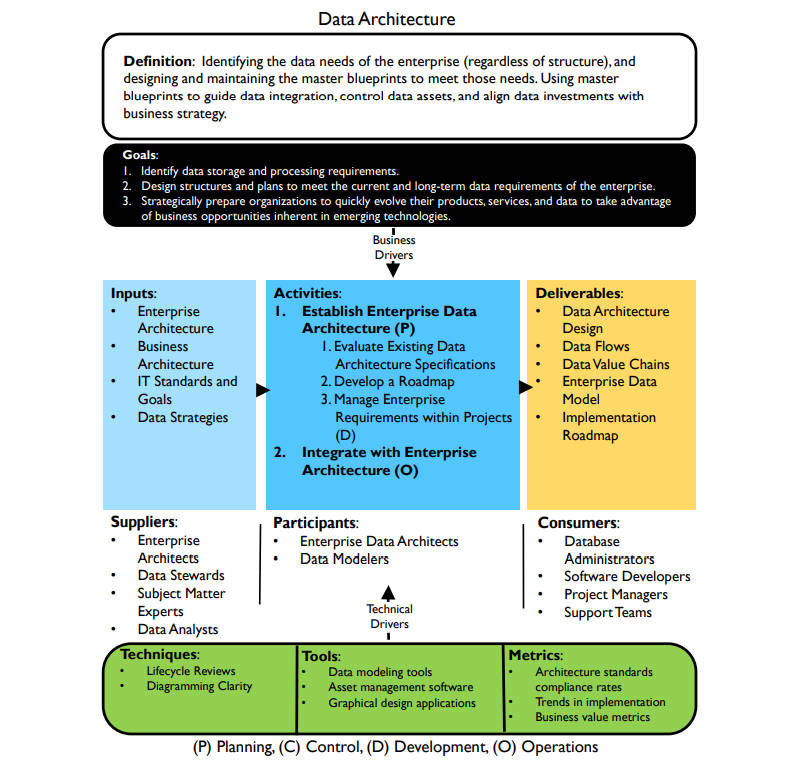

# **数据架构框架**

## 定义

- 确定企业的数据需求（无论结构如何），并设计和维护主蓝图以满足这些需求。使用主蓝图来指导数据集成、控制数据资产，并使数据投资和业务策略保持一致（Identifying the data needs of the enterprise (regardless of structure), and designing and maintaining the master blueprints to meet those needs. Using master blueprints to guide data integration, control data assets, and align data investments with business strategy.）

## 目标

1. 确定数据存储和处理需求（Identify data storage and processing requirements. ）
2. 设计满足企业当前和长期数据需求的结构和计划（Design structures and plans to meet the current and long-term data requirements of the enterprise.）
3. 战略性地准备组织以快速发展其产品、服务和数据，以利用新兴技术的固有商业机会（Strategically prepare organizations to quickly evolve their products, services, and data to take advantage of business opportunities inherent in emerging technologies.）

## 输入

- 企业架构（Enterprise Architecture）
- 业务架构（Business Architecture）
- IT标准和目标（IT Standards and Goals）
- 数据策略（Data Strategies）

## 提供者

- 企业架构师（Enterprise Architects）
- 数据专员（Data Stewards）
- 主题专家（Subject Matter Experts）
- 数据分析师（Data Analysts）

## 活动

1. 【规划】建立企业数据架构（Establish Enterprise Data Architecture）
   1. 评估现有数据架构规范（Evaluate Existing Data Architecture Specifications）
   2. 制定路线图（Develop a Roadmap）
   3. 【开发】管理项目内的企业需求（Manage Enterprise Requirements within Projects）
2. 【运营】与企业架构整合（Integrate with Enterprise Architecture）

## 参与者

- 企业数据架构师（Enterprise Data Architects）
- 数据建模师（Data Modelers）

## 交付

- 数据架构设计（Data Architecture Design）
- 数据流（Data Flows）
- 数据价值链（Data Value Chains）
- 企业数据模型（Enterprise Data Model）
- 实施路线图（Implementation Roadmap）

## 消费者

- 数据库管理员（Database Administrators）
- 软件开发人员（Software Developers）
- 项目经理（Project Managers）
- 支持团队（Support Teams）

## 技术

- 生命周期审查（Lifecycle Reviews）
- 图示清晰（Diagramming Clarity）

## 工具

- 数据建模工具（Data modeling tools）
- 资产管理软件（Asset management software）
- 图形设计应用程序（Graphical design applications）

## 指标

- 架构标准合规率（Architecture standards compliance rates）
- 实施趋势（Trends in implementation）
- 业务价值指标（Business value metric）