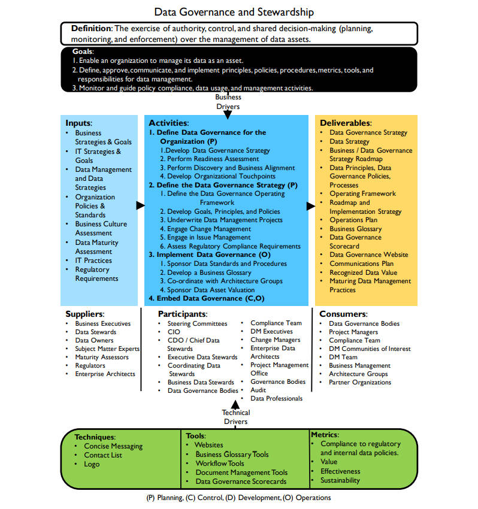

## **数据治理框架**

### 定义

- 对数据资产管理行使权限、进行控制、共同决定重要事项（规划、监控和执行）（The exercise of authority, control, and shared decision-making (planning, monitoring, and enforcement) over the management of data assets.）
  - decision-making：the process of deciding about something important, especially in a group of people or in an organization

### 目标

1. 使组织能够将数据作为资产进行管理（Enable an organization to manage its data as an asset.）
2. 定义、批准、沟通和实施数据管理的原则、制度、流程、指标、工具和职责（Define, approve, communicate, and implement principles, policies, procedures, metrics, tools, and responsibilities for data management. ）
3. 监控和指导制度合规、数据使用和管理活动（Monitor and guide policy compliance, data usage, and management activities.）

### 输入

- 业务策略 & 目标（Business Strategies & Goals）
- IT策略 & 目标（IT Strategies & Goals）
- 数据管理和数据策略 （Data Management and Data Strategies）
- 组织原则 & 标准（Organization Policies & Standards）
- 商业文化评估（Business Culture Assessment）
- 数据成熟度评估（Data Maturity Assessment）
- IT实践（IT Practices）
- 监管要求（Regulatory Requirements）

### 提供者

- 业务主管（Business Executives）
- 数据专员（Data Stewards）
- 数据所有者（Data Owners）
- 主题专家（Subject Matter Experts）
- 成熟度评估员（Maturity Assessors）
- 监管人员（Regulators）
- 企业架构师（Enterprise Architects）

### 活动

1. 【规划】为组织定义数据治理（Define Data Governance for the Organization）

   1. 制定数据治理策略（Develop Data Governance Strategy）
      - develop：develop something to think of or produce a new idea, product, etc. and make it successful
   2. 进行准备情况评估（Perform Readiness Assessment）
   3. 进行探索和业务协调（Perform Discovery and Business Alignment）
   4. 制定组织触点（Develop Organizational Touch points）

2. 【计划】确定数据治理策略（Define the Data Governance Strategy）

   1. 确定数据治理运营框架（Define the Data Governance Operating Framework）

   2. 制定目标、原则和制度（Develop Goals, Principles, and Policies）
   3. 承保数据管理项目（Underwrite Data Management Projects）
   4. 吸引变革管理（Engage Change Management）
   5. 吸引问题管理（Engage in Issue Management）
   6. 评估监管合规要求（Assess Regulatory Compliance Requirements）

3. 【运营】实施数据治理（Implement Data Governance）
   1. 实施数据标准和流程（Sponsor Data Standards and Procedures）
   2. 制定业务术语表（Develop a Business Glossary）
   3. 与架构组进行协调（Co-ordinate with Architecture Groups）
   4. 实施数据资产价值评估（Sponsor Data Asset Valuation）
4. 【控制 运营】嵌入数据治理（Embed Data Governance）

### 参与者

- 指导委员会（Steering Committees）
- 首席信息官（CIO）
- 首席数据官（CDO / Chief Data Stewards）
- 执行数据专员（Executive Data Stewards）
- 协调数据专员（Coordinating Data Stewards）
- 业务数据专员（Business Data Stewards）
- 数据治理人员（Data Governance Bodies）
- 合规团队（Compliance Team）
- DM执行人员（DM Executives）
- 变革经理（Change Managers）
- 企业数据架构师（Enterprise Data Architects）
- 项目管理办公室（Project Management Office）
- 治理人员（Governance Bodies）
- 审计（Audit）
- 数据专业人员（Data Professionals）

### 交付

- 数据治理策略（Data Governance Strategy）
- 数据策略（Data Strategy）
- 业务 / 数据治理战略路线图（Business / Data Governance Strategy Roadmap）
- 数据原则、数据治理制度、流程（Data Principles, Data Governance Policies, Processes）
- 运营框架（Operating Framework）
- 路线图和实施策略（Roadmap and Implementation Strategy）
- 运营计划（Operations Plan）
- 业务术语表（Business Glossary）
- 数据治理记分卡（Data Governance Scorecard）
- 数据治理网站（Data Governance Website）
- 沟通计划（Communications Plan）
- 经过认可的数据价值（Recognized Data Value）
- 成熟的数据管理实践（Maturing Data Management Practices）

### 消费者

- 数据治理人员（Data Governance Bodies）
- 项目经理（Project Managers）
- 合规团队（Compliance Team）
- DM兴趣社区（DM Communities of Interest）
- DM团队（DM Team）
- 业务管理（Business Management）
- 架构组（Architecture Groups）
- 合作机构（Partner Organizations）

### 技术

- 简明消息（Concise Messaging）
- 联系人列表（Contact List）
- 图标（Logo）

### 工具

- 网站（Websites）
- 业务术语工具（Business Glossary Tools）
- 工作流工具（Workflow Tools）
- 文档管理工具（Document Management Tools）
- 数据治理记分卡（Data Governance Scorecards）

### 指标

- 遵守监管政策和内部数据制度（Compliance to regulatory and internal data policies）
- 价值（Value）
- 有效性（Effectiveness）
- 持续性（Sustainability）