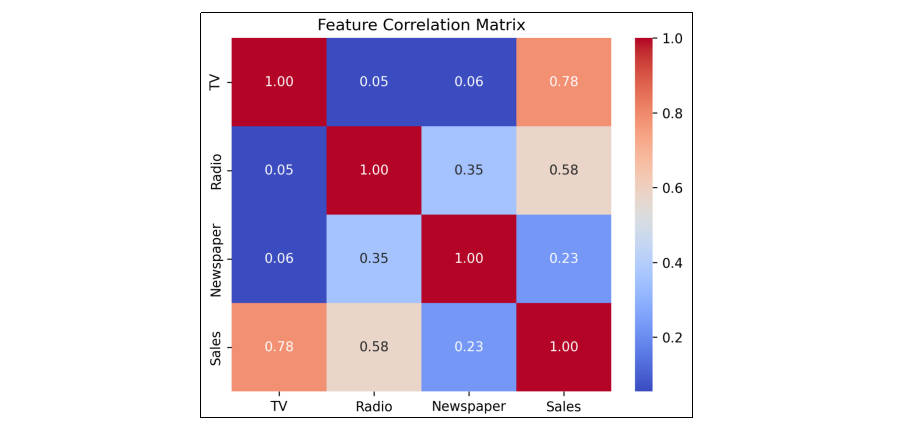
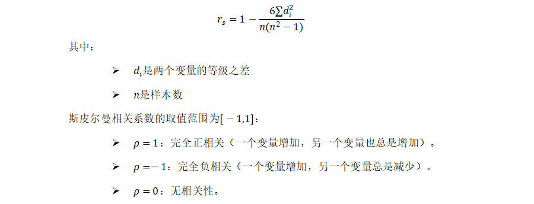
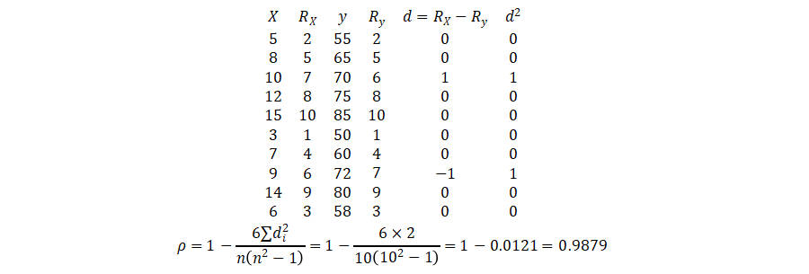
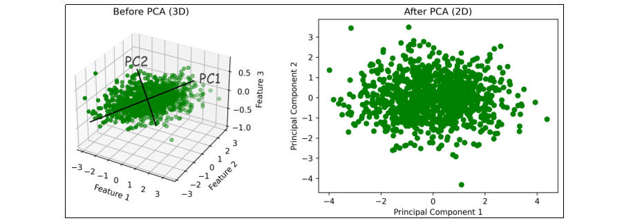

# 特征工程

## 特征工程的概念

- 特征工程（Feature Engineering）指通过对原始数据的处理、转换和构造，生成新的特征或选择有效的特征，从而提高模型的性能。特征工程是将原始数据转换为可以更好地表示问题的特征形式，帮助模型更好地理解和学习数据中的规律。优秀的特征工程可以显著提高模型的表现；反之，忽视特征工程可能导致模型性能欠佳。
- 特征工程是一个迭代过程。特征工程取决于具体情境。其需要大量的数据分析和领域知识。原因在于特征的有效编码可由所用的模型类型、预测变量与输出之间的关系以及模型要解决的问题来确定。在此基础上，辅以不同类型的数据集（如文本与图像）则可能更适合不同的特征工程技术。

## 特征工程的分类

### 特征选择

- 从原始特征中挑选出与目标变量关系最密切的特征，剔除冗余、无关或噪声特征。这样可以减少模型的复杂度、加速训练过程、并减少过拟合的风险。
- 特征选择不会创建新特征，也不会改变数据结构。

#### 过滤法（Filter Method）

- 基于统计测试（如卡方检验、相关系数、信息增益等）来评估特征与目标变量之间的关系，选择最相关的特征。

#### 包裹法（Wrapper Method）

- 使用模型（如递归特征消除 RFE）来评估特征的重要性，并根据模型的表现进行特征选择。

#### 嵌入法（Embedded Method）

- 使用模型本身的特征选择机制（如决策树的特征重要性，L1正则化的特征选择）来选择最重要的特征。

### 特征转换

- 对数据进行数学或统计处理，使其变得更加适合模型的输入要求。

#### 归一化（Normalization）

- 将特征缩放到特定的范围（通常是0到1之间）。适用于对尺度敏感的模型（如KNN、SVM）。

#### 标准化（Standardization）

- 通过减去均值并除以标准差，使特征的分布具有均值0，标准差1。

#### 对数变换

- 对于有偏态的分布（如收入、价格等），对数变换可以将其转化为更接近正态分布的形式。

#### 类别变量的编码

- 独热编码（One-Hot Encoding）：将类别型变量转换为二进制列，常用于无序类别特征。
- 标签编码（Label Encoding）：将类别型变量映射为整数，常用于有序类别特征。
- 目标编码（Target Encoding）***\*：\****将类别变量的每个类别替换为其对应目标变量的平均值或其他统计量。
- 频率编码（Frequency Encoding）***\*：\****将类别变量的每个类别替换为该类别在数据集中的出现频率。

### 特征构造

- 特征构造是基于现有的特征创造出新的、更有代表性的特征。通过组合、转换、或者聚合现有的特征，形成能够更好反映数据规律的特征。

#### 交互特征

- 将两个特征组合起来，形成新的特征。例如，两个特征的乘积、和或差等。
- 例如，将年龄与收入结合创建新的特征，可能能更好地反映某些模式。

#### 统计特征

- 从原始特征中提取统计值，例如求某个时间窗口的平均值、最大值、最小值、标准差等。
- 例如，在时间序列数据中，你可以从原始数据中提取每个小时、每日的平均值。

#### 日期和时间特征

- 从日期时间数据中提取如星期几、月份、年份、季度等特征。
- 例如，将“2000-01-01”转换为“星期几”、“是否节假日”、“月初或月末”等特征。

### 特征降维

- 当数据集的特征数量非常大时，特征降维可以帮助减少计算复杂度并避免过拟合。通过降维方法，可以在保持数据本质的情况下减少特征的数量。

#### 主成分分析（PCA）

- 通过线性变换将原始特征映射到一个新的空间，使得新的特征（主成分）尽可能地保留数据的方差。

#### 线性判别分析（LDA）

- 一种监督学习的降维方法，通过最大化类间距离与类内距离的比率来降维。

#### t-SNE（t分布随机近邻嵌入，t-Distributed Stochastic Neighbor Embedding）

- 一种非线性的降维技术，特别适合可视化高维数据。

#### 自编码器（Auto Encoder）

- 一种神经网络模型，通过压缩编码器来实现数据的降维。

## 特征工程常用方法

- 对于一个模型来说，有些特征可能很关键，而有些特征可能用处不大。如某个特征取值较接近，变化很小，可能与结果无关。或某几个特征相关性较高，可能包含冗余信息。因此，特征选择在特征工程中是最基本、也最常见的操作。
- 另外，在训练模型时有时也会遇到维度灾难，即特征数量过多。我们希望能在确保不丢失重要特征的前提下减少维度的数量，来降低训练模型的难度。所以在特征工程中，也经常会用到特征降维方法。

### 低方差过滤法

- 对于特征的选择，可以直接基于方差来判断，这是最简单的。低方差的特征意味着该特征的所有样本值几乎相同，对预测影响极小，可以将其去掉。

```python
from sklearn.feature_selection import VarianceThreshold

# 低方差过滤：删除方差低于0.01的特征
var_thresh = VarianceThreshold(threshold=0.01)
X_filtered = var_thresh.fit_transform(X)
```

```python
import numpy as np

# 构造特征
a = np.random.randn(100)
print(np.var(a)) # 1.0657636845659872

# b = np.random.randn(100) * 0.1
b = np.random.normal(5, 0.1, size=100)
print(np.var(b)) # 0.009054644772700201

# 构造特征向量（输入数据X）
X = np.vstack((a, b)).T
print(X)
print(X.shape)

# 低方差过滤
from sklearn.feature_selection import VarianceThreshold
vt = VarianceThreshold(0.01)
X_filtered = vt.fit_transform(X)
print(X_filtered)
print(X_filtered.shape)
```

### 相关系数法

- 通过计算特征与目标变量或特征之间的相关性，筛选出高相关性特征（与目标相关）或剔除冗余特征（特征间高度相关）。

#### 皮尔逊相关系数

- 皮尔逊相关系数（Pearson Correlation）用于衡量两个变量的线性相关性，取值范围[−1,1]。


- 例如，现有一数据集包括不同渠道广告投放金额与销售额。使用pandas.DataFrame.corrwith(method="pearson")计算各个特征与标签间的皮尔逊相关系数。

```
"","TV","Radio","Newspaper","Sales"
"1",230.1,37.8,69.2,22.1
"2",44.5,39.3,45.1,10.4
"3",17.2,45.9,69.3,9.3
...
```

```python
import pandas as pd

# 读取数据
advertising = pd.read_csv('../../data/advertising.csv')
print(advertising.head())
print(advertising.describe())
print(advertising.shape)

# 数据预处理
# 去掉第一列ID
advertising.drop(advertising.columns[0], axis=1, inplace=True)
# 去掉空值
advertising.dropna(inplace=True)
# 提取特征和标签（目标值）
X = advertising.drop("Sales", axis=1)
y = advertising["Sales"]

print(X.shape)
print(y.shape)

# 计算皮尔逊相关系数
print(X.corrwith(y, method="pearson"))
'''
TV           0.782224
Radio        0.576223
Newspaper    0.228299
dtype: float64
'''

corr_matrix = advertising.corr(method="pearson")
print(corr_matrix)
'''
                 TV     Radio  Newspaper     Sales
TV         1.000000  0.054809   0.056648  0.782224
Radio      0.054809  1.000000   0.354104  0.576223
Newspaper  0.056648  0.354104   1.000000  0.228299
Sales      0.782224  0.576223   0.228299  1.000000
'''

# 将相关系数矩阵画成热力图
import seaborn as sns
import matplotlib.pyplot as plt

sns.heatmap(corr_matrix, annot=True, cmap="coolwarm", fmt=".2f")
plt.title("Feature Correlation Matrix")
plt.show()
```



#### 斯皮尔曼相关系数

- 斯皮尔曼相关系数（Spearman’s Rank Correlation Coefficient）的定义是等级变量之间的皮尔逊相关系数。用于衡量两个变量之间的单调关系，即当一个变量增加时，另一个变量是否总是增加或减少（不要求是线性关系）。适用于非线性关系或数据不符合正态分布的情况。



- 例如，现有一组每周学习时长与数学考试成绩的数据，按数值由小到大排出X、y的等级，并计算等级差：



```python
import pandas as pd

# 每周学习时长
X = [[5], [8], [10], [12], [15], [3], [7], [9], [14], [6]]
# 数学考试成绩
y = [55, 65, 70, 75, 85, 50, 60, 72, 80, 58]

# 计算斯皮尔曼相关系数
X = pd.DataFrame(X)
y = pd.Series(y)
print(X.corrwith(y, method="spearman"))
# 0.987879
```

### 主成分分析

- 主成分分析（PCA，Principal Component Analysis）是一种常用的降维技术，通过线性变换将高维数据投影到低维空间，同时保留数据的主要变化模式。



- 使用sklearn.decomposition.PCA进行主成分分析。参数n_components若为小数则表示保留多少比例的信息，为整数则表示保留多少个维度。

```python
import numpy as np
import matplotlib.pyplot as plt
from sklearn.decomposition import PCA

# 生成数据
X = np.random.randn(1000, 3)
print(X.shape)

# 使用PCA进行降维，将3维数据降为2维
pca = PCA(n_components=2)
X_pca = pca.fit_transform(X)
print(X_pca.shape)

# 可视化
# 转换前的3维数据可视化
fig = plt.figure(figsize=(12, 4))
ax1 = fig.add_subplot(121, projection='3d')
ax1.scatter(X[:, 0], X[:, 1], X[:, 2], c="g")
ax1.set_title('Before PCA(3D)')
ax1.set_xlabel('Feature1')
ax1.set_ylabel('Feature2')
ax1.set_zlabel('Feature3')
# 转换后的2维数据可视化
ax2 = fig.add_subplot(122)
ax2.scatter(X_pca[:, 0], X_pca[:, 1], c="g")
ax2.set_title('After PCA(2D)')
ax2.set_xlabel('Principal Component1')
ax2.set_ylabel('Principal Component2')
plt.show()


# 手动构建线性相关的三组特征数据
n = 1000
# 定义两个主成分方向向量
pc1 = np.random.normal(0, 1, n)
pc2 = np.random.normal(0, 0.2, n)
# 定义不重要的第三主成分（噪声）
noise = np.random.normal(0, 0.05, n)
# 构建3个特征的输入数据X
X = np.vstack((pc1 + pc2, pc1 - pc2, pc2 + noise)).T
print(X.shape)

# 使用PCA进行降维，将3维数据降为2维
pca = PCA(n_components=2)
X_pca = pca.fit_transform(X)
print(X_pca.shape)

# 可视化
# 转换前的3维数据可视化
fig = plt.figure(figsize=(12, 4))
ax1 = fig.add_subplot(121, projection='3d')
ax1.scatter(X[:, 0], X[:, 1], X[:, 2], c="g")
ax1.set_title('Before PCA(3D)')
ax1.set_xlabel('Feature1')
ax1.set_ylabel('Feature2')
ax1.set_zlabel('Feature3')
# 转换后的2维数据可视化
ax2 = fig.add_subplot(122)
ax2.scatter(X_pca[:, 0], X_pca[:, 1], c="g")
ax2.set_title('After PCA(2D)')
ax2.set_xlabel('Principal Component1')
ax2.set_ylabel('Principal Component2')
plt.show()
```

