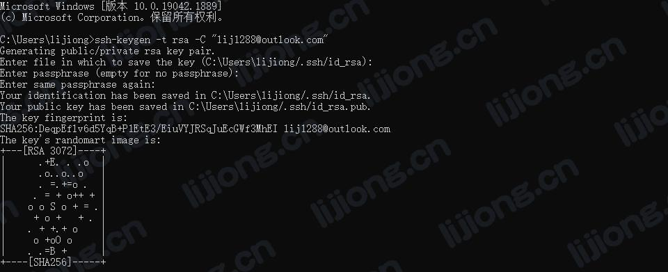
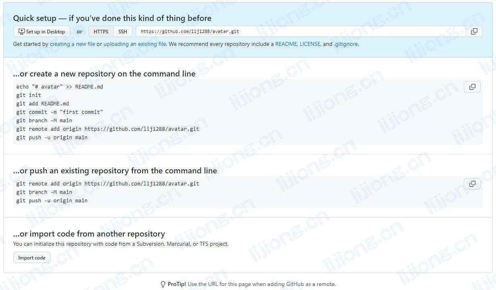
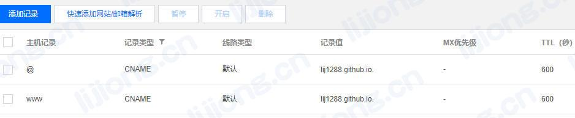
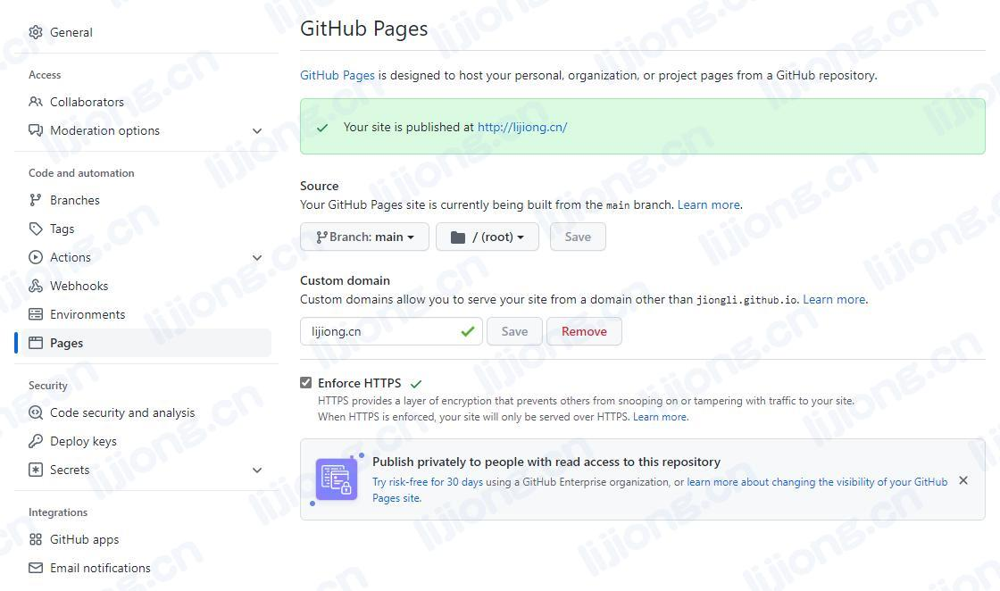
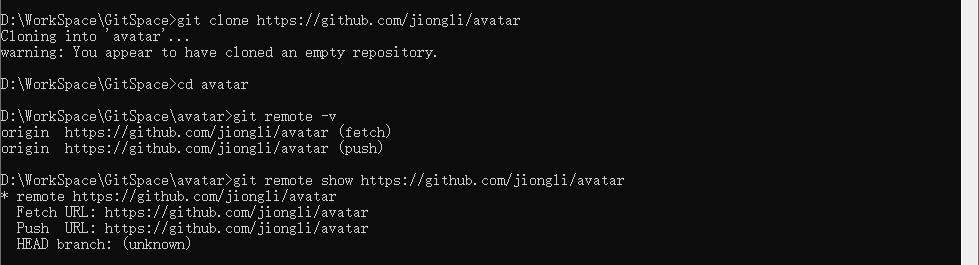

## **Git相关操作**

### 创建仓库

#### git init

初始化Git仓库

- 使用当前目录

  > git init

- 使用指定目录

  > git init [dir]

#### git clone

从现有Git仓库克隆项目

- 克隆到当前目录

  > git clone [repo]

- 克隆到指定目录

  > git clone [repo] [dir]

### 信息与参数配置

- 查看配置信息

  > git config --list

- 编辑配置文件

  > git config -e # 针对当前仓库

  > git config -e --global # 针对所有仓库

- 设置提交代码时的信息

  > git config --global user.name "Avatar"

  > git config --global user.email "lij1288@outlook.com"

### 提交与修改

#### git add

添加文件到暂存区

- 添加文件

  > git add [file1] [file2] ...

- 添加目录

  > git add [dir]

- 添加当前目录所有文件

  > git add .

#### git status

查看状态，显示变更

- 简短显示

  > git status -s

#### git diff

比较暂存区和工作区差异

- 未缓存的改动

  > git diff

- 已缓存的改动

  > git diff --cached

- 未缓存和已缓存的改动

  > git diff HEAD

- 显示摘要

  > git diff --stat

#### git commit

提交到本地仓库

- 提交暂存区

  > git commit -m [message]

- 提交暂存区指定文件

  > git commit [file1] [file2] -m [message]

- 跳过暂存区直接提交

  > git commit -a
  
- 修改描述信息

  > git commit --amend

#### git reset

回退版本

- 撤销所有未提交的修改，回退至上一版本

  > git reset --hard HEAD

- 回退所有内容到上一版本

  > git reset HEAD^

- 回退某文件到上一版本

  > git reset HEAD^ [file]

- 回退到指定版本

  > git reset [版本号]

#### git rm

删除文件

- 从暂存区和工作区删除

  > git rm [file]

- 从暂存区和工作区删除修改过的文件

  > git rm -f [file]

- 从暂存区删除

  > git rm --cached [file]

#### git mv

移动/重命名文件

- 移动/重命名文件

  > git mv [file] [newfile]

- 目标文件名已存在

  > git mv -f [file] [newfile]

### 提交记录查看

#### git log

查看历史提交记录

- 退出：q

#### git blame

以列表形式查看指定文件的提交记录

### 远程操作

#### GitHub

- 创建ssh key

  > ssh-keygen -t rsa -C "lij1288@outlook.com"



- GitHub -> Settings -> SSH and GPG keys -> New SSH key，粘贴~/.ssh/id_rsa.pub中的内容

- 验证

  > ssh -T git@github.com




- GitHub Pages设置





#### git remote

操作远程仓库

- 显示所有远程仓库

  > git remote -v

- 显示某个远程仓库的信息

  > git remote show [remote]

- 删除远程仓库

  > git remote rm [alias]

- 修改仓库名

  > git remote rename [alias1] [alias2]



#### git fetch

从远程获取代码库

- 获取更新内容

  > git fetch [alias]

  将更新合并到当前分支

  > git merge [alias]/[branch]

#### git pull

下载代码并合并，相当于git fetch + git merge FETCH_HEAD

- 合并到指定分支

  > git pull [alias] [remote_branch]:[local_branch]

- 合并到当前分支

  > git pull [alias] [remote_branch]
  
  > git pull origin main

#### git push

上传代码并合并

- 合并到指定版本

  > git push [alias] [local_branch]:[remote_branch]

- 本地分支与远程分支相同

  > git push [alias] [local_branch]

  > git push origin main

- 本地版本和远程版本不同

  > git push --force [alias] [local_branch]

```
git config --global user.name "Avatar"
git config --global user.email "lij1288@outlook.com"

ssh-keygen -t rsa -C "lij1288@outlook.com"
GitHub -> Settings -> SSH and GPG keys -> New SSH key，粘贴~/.ssh/id_rsa.pub中的内容

git init

git branch -M main

git remote add origin https://github.com/jiongli/avatar.git

git pull origin main

git push origin main
```

### 分支管理

- 查看本地分支

  > git branch

- 查看远程分支

  > git branch -r

- 创建分支

  > git branch [branch_name]

- 切换分支

  > git checkout [branch_name]

- 创建分支并切换

  > git checkout -b [branch_name]

- 合并到当前分支

  > git merge [branch_name]

- 删除分支

  > git branch -d [branch_name]

