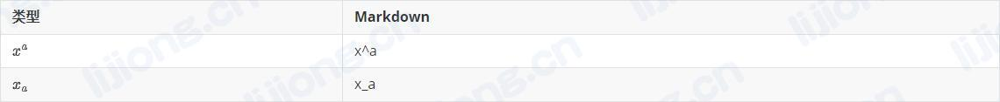
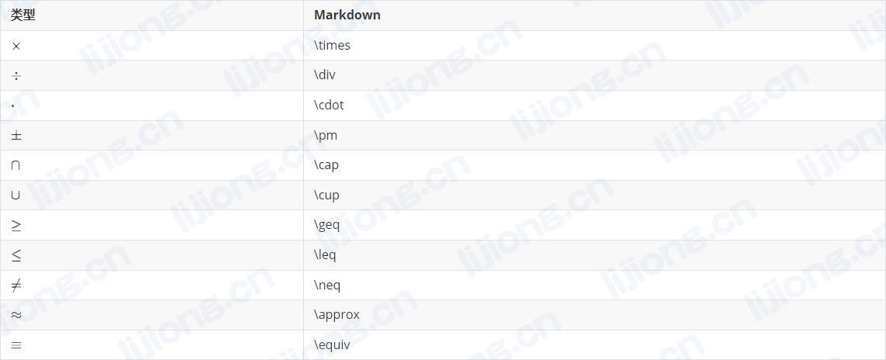
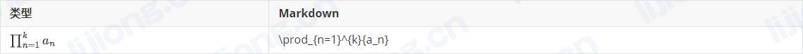
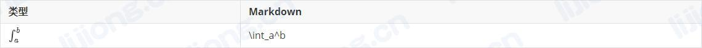

## Markdown公式语法

### 插入数学公式


### 上/下标




### 分式


### 根号


### 省略号


### 矢量


### 运算符




### 空格


### 三角函数


### 对数


### 求和


### 求积




### 积分




### 极限


### 矩阵和行列式

```
A=\left(
\begin{matrix}
a_{11} & a_{12} & \cdots & a_{1n}\\
a_{21} & a_{22} & \cdots & a_{2n}\\
\cdots & \cdots & \cdots & \cdots\\
a_{m1} & a_{m2} & \cdots & a_{mn}
\end{matrix}
\right)
```


***

```
A=\left[
\begin{matrix}
a_{11} & a_{12} & \cdots & a_{1n}\\
a_{21} & a_{22} & \cdots & a_{2n}\\
\cdots & \cdots & \cdots & \cdots\\
a_{m1} & a_{m2} & \cdots & a_{mn}
\end{matrix}
\right]
```


***

```
D=\left|
    \begin{matrix}
        a_{11} & a_{12} & \cdots & a_{1n}\\
        a_{21} & a_{22} & \cdots & a_{2n}\\
        \vdots & \vdots & \ddots & \vdots\\
        a_{n1} & a_{n2} & \cdots & a_{nn}\\
    \end{matrix}
\right|
```


***

### 多行公式

```
\begin{align*}
 f(x) &= (x+a)(x+b) \\
 &= x^2 + (a+b)x + ab
\end{align*}
```


***