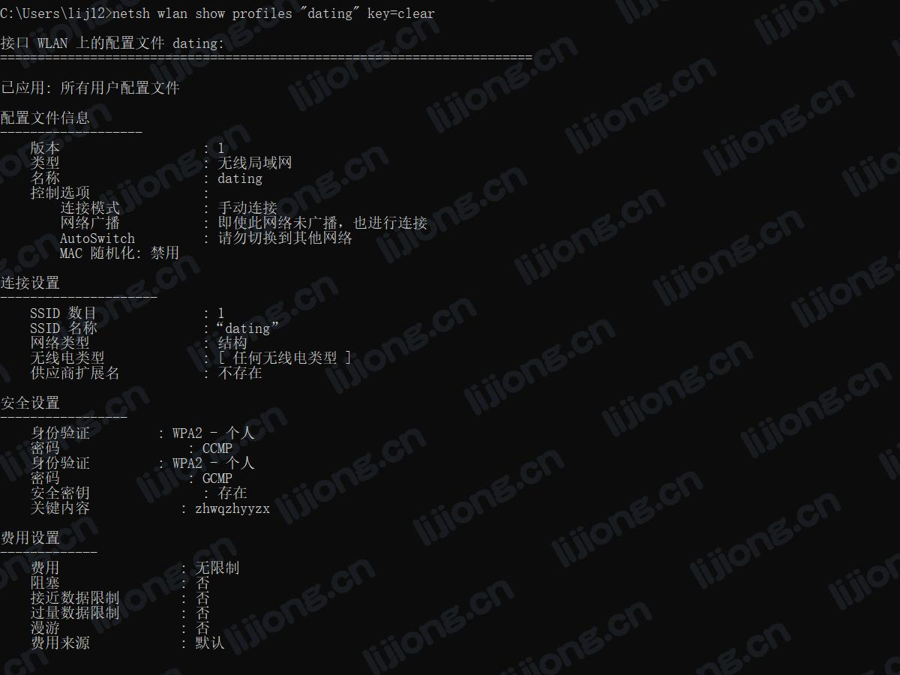

## **Windows相关问题处理**

### 查看保存的WIFI密码

> netsh wlan show profiles "wifiname" key=clear

### Port is already in use问题处理

- 查看占用端口的PID

  > netstat -aon|findstr "PORT"

- 查看指定PID的任务

  > tasklist|findstr "PID"

- 结束指定PID的任务

  > taskkill -pid "PID" -f