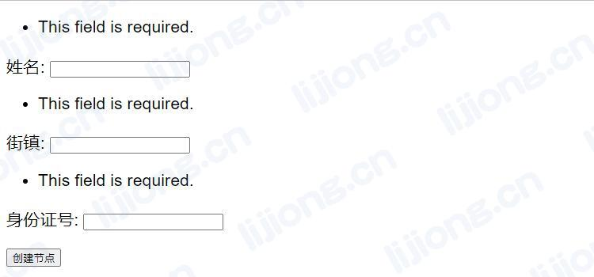

## **Django渲染表单后显示This field is required问题处理**

### 问题记录

- Django通过表单自动渲染的页面显示This field is required




### 解决过程

- 修改视图文件

```python
def index(request):
    form1 = PersonForm(request.POST)
    return render(request, 'kg.html', {'form1': form1})
```

- 修改后

```python
def index(request):
    if request.method == 'POST':
        form1 = PersonForm(request.POST)
    else:
        form1 = PersonForm()
    return render(request, 'kg.html', {'form1': form1})
```

