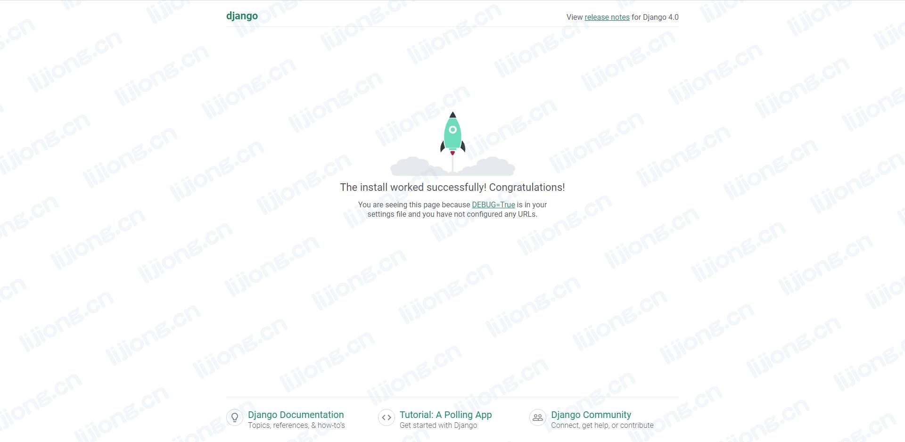

## **Django的项目创建**

### 创建项目

> django-admin startproject avatar

### 目录结构

> tree avatar

```
avatar
├── avatar
│   ├── asgi.py
│   ├── __init__.py
│   ├── settings.py
│   ├── urls.py
│   └── wsgi.py
└── manage.py

1 directory, 6 files
```

- avatar：项目的容器
- manage.py：命令行工具，与Django项目进行交互
- asgi.py：一个ASGI兼容的Web服务器入口，以便运行项目
- \__init__.py：空文件，告诉Python该目录是一个Python包

- settings.py：该Django项目的配置文件
- urls.py：该Django项目的URL声明
- wsgi.py：一个WSGI兼容的Web服务器入口，以便运行项目

### 修改默认数据库

- 创建数据库

```sql
create database djangodb;
```

- avatar/settings.py

```python
DATABASES = {
    # 'default': {
    #     'ENGINE': 'django.db.backends.sqlite3',
    #     'NAME': BASE_DIR / 'db.sqlite3',
    # }
    'default': 
    { 
        'ENGINE': 'django.db.backends.mysql',
        'NAME': 'djangodb',
        'HOST': '192.168.1.100',
        'PORT': 3306,
        'USER': 'root',
        'PASSWORD': '******',
    }  
}
```

- avatar/\__init__.py

```python
import pymysql
pymysql.install_as_MySQLdb()
```

- 进行数据库迁移

> python3 manage.py migrate

### 启动服务

- avatar/settings.py

> Invalid HTTP_HOST header: '192.168.1.101:8000'. You may need to add '192.168.1.101' to ALLOWED_HOSTS.

```python
# ALLOWED_HOSTS：Django网站可以服务的主机/域名列表，用于防止跨站请求伪造
ALLOWED_HOSTS = ['192.168.1.101']
```

> python3 manage.py runserver 192.168.1.101:8000

