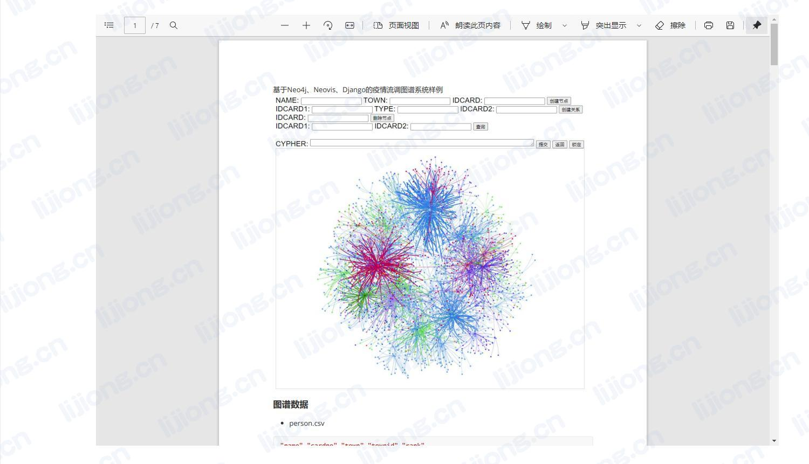
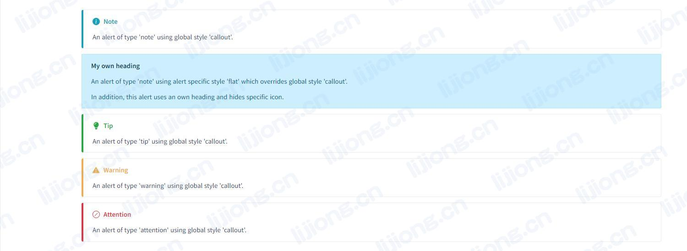

## **Docsify的插件使用**

### 代码高亮

- Docsify使用Prism进行代码高亮，除html、css、xml、js等默认支持的语言外，需添加相应文件
  - 文件引用:https://cdn.jsdelivr.net/npm/prismjs@1/components/

```html
<script src="//cdn.jsdelivr.net/npm/prismjs@1/components/prism-java.min.js"></script>
```

### 代码复制

- https://github.com/jperasmus/docsify-copy-code

```html
<script src="https://unpkg.com/docsify-copy-code"></script>
```

```html
<script>
    window.$docsify = {
        copyCode: {
            buttonText: 'Copy to clipboard',
            errorText: 'Error',
            successText: 'Copied'
        },
    }
</script>
```

```js
!function(){"use strict";function s(o){return(s="function"==typeof Symbol&&"symbol"==typeof Symbol.iterator?function(o){return typeof o}:function(o){return o&&"function"==typeof Symbol&&o.constructor===Symbol&&o!==Symbol.prototype?"symbol":typeof o})(o)}!function(o,e){void 0===e&&(e={});var t=e.insertAt;if(o&&"undefined"!=typeof document){var n=document.head||document.getElementsByTagName("head")[0],c=document.createElement("style");c.type="text/css","top"===t&&n.firstChild?n.insertBefore(c,n.firstChild):n.appendChild(c),c.styleSheet?c.styleSheet.cssText=o:c.appendChild(document.createTextNode(o))}}(".docsify-copy-code-button,.docsify-copy-code-button span{cursor:pointer;transition:all .25s ease}.docsify-copy-code-button{position:absolute;z-index:1;top:0;right:0;overflow:visible;padding:.65em .8em;border:0;border-radius:0;outline:0;font-size:1em;background:grey;background:var(--theme-color,grey);color:#fff;opacity:0}.docsify-copy-code-button span{border-radius:3px;background:inherit;pointer-events:none}.docsify-copy-code-button .error,.docsify-copy-code-button .success{position:absolute;z-index:-100;top:50%;right:0;padding:.5em .65em;font-size:.825em;opacity:0;-webkit-transform:translateY(-50%);transform:translateY(-50%)}.docsify-copy-code-button.error .error,.docsify-copy-code-button.success .success{right:100%;opacity:1;-webkit-transform:translate(-115%,-50%);transform:translate(-115%,-50%)}.docsify-copy-code-button:focus,pre:hover .docsify-copy-code-button{opacity:1}"),document.querySelector('link[href*="docsify-copy-code"]')&&console.warn("[Deprecation] Link to external docsify-copy-code stylesheet is no longer necessary."),window.DocsifyCopyCodePlugin={init:function(){return function(o,e){o.ready(function(){console.warn("[Deprecation] Manually initializing docsify-copy-code using window.DocsifyCopyCodePlugin.init() is no longer necessary.")})}}},window.$docsify=window.$docsify||{},window.$docsify.plugins=[function(o,r){o.doneEach(function(){var o=Array.apply(null,document.querySelectorAll("pre[data-lang]")),c={buttonText:"Copy to clipboard",errorText:"Error",successText:"Copied"};r.config.copyCode&&Object.keys(c).forEach(function(t){var n=r.config.copyCode[t];"string"==typeof n?c[t]=n:"object"===s(n)&&Object.keys(n).some(function(o){var e=-1<location.href.indexOf(o);return c[t]=e?n[o]:c[t],e})});var e=['<button class="docsify-copy-code-button">','<span class="label">'.concat(c.buttonText,"</span>"),'<span class="error">'.concat(c.errorText,"</span>"),'<span class="success">'.concat(c.successText,"</span>"),"</button>"].join("");o.forEach(function(o){o.insertAdjacentHTML("beforeend",e)})}),o.mounted(function(){document.querySelector(".content").addEventListener("click",function(o){if(o.target.classList.contains("docsify-copy-code-button")){var e="BUTTON"===o.target.tagName?o.target:o.target.parentNode,t=document.createRange(),n=e.parentNode.querySelector("code"),c=window.getSelection();t.selectNode(n),c.removeAllRanges(),c.addRange(t);try{document.execCommand("copy")&&(e.classList.add("success"),setTimeout(function(){e.classList.remove("success")},1e3))}catch(o){console.error("docsify-copy-code: ".concat(o)),e.classList.add("error"),setTimeout(function(){e.classList.remove("error")},1e3)}"function"==typeof(c=window.getSelection()).removeRange?c.removeRange(t):"function"==typeof c.removeAllRanges&&c.removeAllRanges()}})})}].concat(window.$docsify.plugins||[])}();
//# sourceMappingURL=docsify-copy-code.min.js.map
```

### 全文检索

```html
<script src="//cdn.jsdelivr.net/npm/docsify/lib/plugins/search.min.js"></script>
```

```html
<script>
    window.$docsify = {
        search: {
            maxAge: 3600000,// 过期时间，默认为一天86400000
            paths: 'auto',
            placeholder: 'Type to search',
            noData: 'No Results',
            depth: 4,// 搜索结果显示的标题等级, 1 - 6
            hideOtherSidebarContent: false,// 搜索时是否暂时隐藏侧边栏
        },
    }
</script>
```

### 分栏设置

- https://github.com/VagnerDomingues/docsify-example-panels

```html
<script src="https://cdn.jsdelivr.net/npm/docsify-example-panels"></script><!-- 分栏设置 -->
```

```markdown
<!-- panels:start -->

<!-- div:left-panel -->

Docsify多页设置

Docsify全文检索

<!-- div:right-panel -->

Docsify代码高亮

Docsify代码复制

<!-- panels:end -->
```

```css
<style>
    :root {
        --docsify-example-panels-document-width: 80%; /* 分栏设置-页边距（影响整体） */
        --docsify-example-panels-left-panel-width : 50%; /* 分栏设置-左栏占比 */
        --docsify-example-panels-right-panel-width : 50%; /* 分栏设置-右栏占比 */
    }
</style>
```


### 标签设置

- https://jhildenbiddle.github.io/docsify-tabs

```html
<script src="https://cdn.jsdelivr.net/npm/docsify-tabs@1"></script>
```

```html
<script>
    window.$docsify = {
        tabs: {
            persist    : true,// 页面刷新是否恢复标签选择，默认true
            sync       : true,// 同名标签联动，默认true
            theme      : 'classic', // 主题：classic（默认）、material
        },
    }
</script>
```

```markdown
<!-- tabs:start -->

### **Java**

### **Scala**

### **Python**

<!-- tabs:end -->
```

```html
<style>
    :root {
        --docsifytabs-border-color: hsl(0, 0%, 89%);/* 标签设置-边框 */
        --docsifytabs-tab-highlight-color: rgb(0, 0, 0);/* 标签设置-标签 */
    }
</style>
```


### PDF嵌入

- https://github.com/lazypanda10117/docsify-pdf-embed

```html
<script src="//cdnjs.cloudflare.com/ajax/libs/pdfobject/2.1.1/pdfobject.min.js"></script><!-- PDF嵌入 -->
<script src="//unpkg.com/docsify-pdf-embed-plugin/src/docsify-pdf-embed.js"></script><!-- PDF嵌入 -->
```

- 路径为相对于页面所在文件夹的路径

````markdown
```pdf
../statics/pdf/基于Django的Neo4j知识图谱系统.pdf
```
````



### 提示设置

- https://github.com/fzankl/docsify-plugin-flexible-alerts

```html
<script src="https://unpkg.com/docsify-plugin-flexible-alerts"></script>
```

- 参数
  - style：样式
  - label：标题
  - labelVisibility：标题是否可见，visible, hidden
  - iconVisibility：标识是否可见，visible, hidden

```markdown
> [!NOTE]
> An alert of type 'note' using global style 'callout'.

> [!NOTE|style:flat]
> An alert of type 'note' using alert specific style 'flat' which overrides global style 'callout'.

> [!TIP]
> An alert of type 'tip' using global style 'callout'.

> [!WARNING]
> An alert of type 'warning' using global style 'callout'.

> [!ATTENTION]
> An alert of type 'attention' using global style 'callout'.
```

```html
<script>
    window.$docsify = {
        'flexible-alerts': {
            style: 'callout',// 样式：callout（默认）、flat
            note: {
                label: "My Note"
            },
            tip: {
                label: "My Tip"
            },
            warning: {
                label: "My Warning"
            },
            attention: {
                label: "My Attention"
            }// 自定义标题
        },
    }
</script>
```



### 页脚设置

- https://github.com/erickjx/docsify-footer-enh

```html
<script src="//unpkg.com/docsify-footer-enh/dist/docsify-footer-enh.min.js"></script>
```

```html
<script>
    window.$docsify = {
        footer: {
            copy: '<hr/><span id="sitetime"></span><br/><span>Copyright &copy; 2014 - 至今</span>',
            auth: '<a href="https://www.lijiong.cn" target="_blank">🏷️ Lijiong Blog</a> <span>操千曲而后晓声，观千剑而后识器</span>',
            style: 'text-align:center;',
        },
    }
</script>
```


