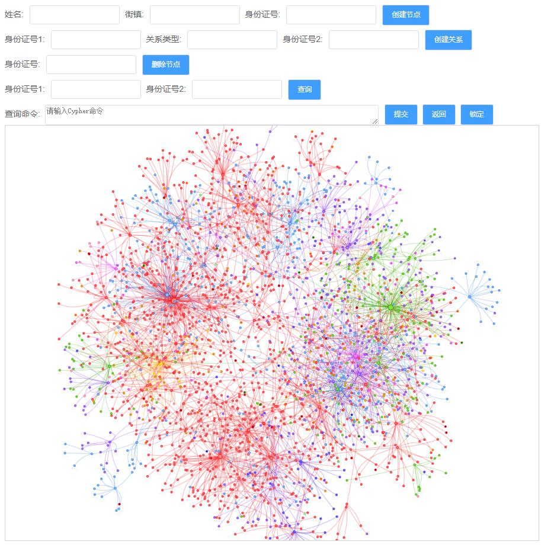
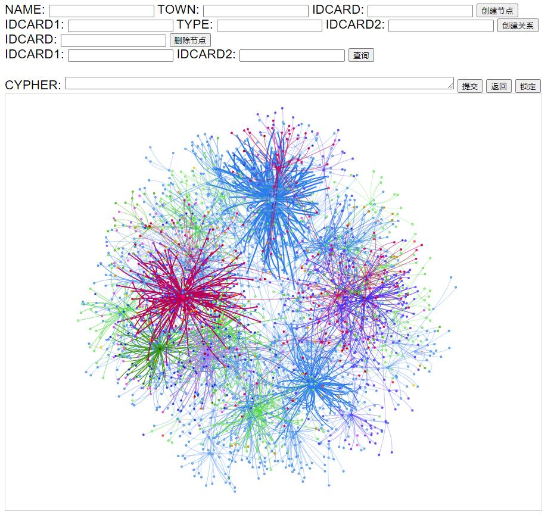

## **基于Django的Neo4j知识图谱系统**




### 图谱数据

- person.csv

```sql
"name","cardno","town","townid","rank"
"王*楠","1201**********048X","***镇","2","24"
"赵*衡","1034**********4611","***镇","1","1"
"陈*南","1201**********1027","***镇","2","36"
"苏*平","1201**********4256","***街道","4","1"
......
```

- relation.csv

```sql
"source","target","type","cnt"
"1201**********1027","4116**********4563","Undirected","36"
"1201**********133X","1201**********1222","Undirected","166"
"1201**********4011","1201**********4017","Undirected","75"
"1201**********4011","1201**********4027","Undirected","75"
......
```

- 导入数据

```cypher
LOAD CSV WITH HEADERS FROM "file:///var/lib/neo4j/import/relation.csv" AS row
MERGE (src:Person {cardno: row.source})
MERGE (tgt:Person {cardno: row.target})
MERGE (src)-[r:Contact]->(tgt) ON CREATE 
SET r.cnt = toInteger(row.cnt)
```

```cypher
LOAD CSV WITH HEADERS FROM "file:///var/lib/neo4j/import/person.csv" AS row
MATCH (n:Person {cardno: row.cardno})
SET n.name = row.name,
    n.town = row.town,
    n.townid = toInteger(row.townid),
    n.rank  = toFloat(row.rank)
```

### 页面模板

- templates/kg.html

```html
<!doctype html>
<html>
<head>
    <title>流调图谱系统样例</title>
    <style type="text/css">
        html, body {
            font: 16pt arial;
        }
        #viz {
            width: 900px;
            height: 700px;
            border: 1px solid lightgray;
            font: 22pt arial;
        }
    </style>
    <script type="text/javascript" src="https://cdn.neo4jlabs.com/neovis.js/v1.5.0/neovis.js"></script>
    <script
            src="https://code.jquery.com/jquery-3.2.1.min.js"
            integrity="sha256-hwg4gsxgFZhOsEEamdOYGBf13FyQuiTwlAQgxVSNgt4="
            crossorigin="anonymous">
	</script>
    <script type="text/javascript">
		// define config car
		// instantiate nodevis object
		// draw
		var viz;
		function draw() {
			var config = {
				container_id: "viz",
				server_url: "bolt://192.168.1.101:7687",
				server_user: "neo4j",
				server_password: "123456",
				labels: {
					"Person": {
						"caption": "name", // 显示名称
						"size": "rank", // 节点大小
						"community": "townid" // 节点颜色
					}
				},
				relationships: {
					"Contact": {
						// "caption": false, // 显示名称
						"thickness": "weight" // 关系粗细
					}
				},
                initial_cypher: "MATCH (n)-[r]->(m) RETURN n,r,m"
			};
			viz = new NeoVis.default(config);
			viz.render();
			console.log(viz);
		}
    </script>
</head>
<body onload="draw()">
<form action="/kgdemo/create_node/" method="post">
	
	{{ form1 }}
	<input type="submit" value="创建节点">
</form>
<form action="/kgdemo/create_relation/" method="post">
	
	{{ form2 }}
	<input type="submit" value="创建关系">
</form>
<form action="/kgdemo/delete_node/" method="post">
	
	{{ form3 }}
	<input type="submit" value="删除节点">
</form>
<label>IDCARD1:</label>
<input type="text" name="search_target" maxlength="100" required="" id="cardno1">
<label>IDCARD2:</label>
<input type="text" name="search_target" maxlength="100" required="" id="cardno2">
<input type="submit" value="查询" id="reload1">
<br/><br/>
CYPHER: <textarea rows="1" cols=90 id="cypher"></textarea>
<input type="submit" value="提交" id="reload">
<input type="submit" value="返回" id="initialize">
<input type="submit" value="锁定" id="stabilize">
<div id="viz"></div>
</body>
<script>
	$("#reload").click(function() {
		var cypher = $("#cypher").val();
		if (cypher.length > 3) {
			viz.renderWithCypher(cypher);
		} else {
			console.log("reload");
			viz.reload();
		}
	});
	$("#reload1").click(function() {
		var cardno1 = $("#cardno1").val();
		var cardno2 = $("#cardno2").val();
		if (cardno1.length > 2 && cardno1.length > 2) {
			viz.renderWithCypher("MATCH (n)-[r]->(m) where (m.cardno = '" + cardno1 + "' and n.cardno = '" + cardno2 + "') or (m.cardno = '" + cardno2 + "' and n.cardno = '" +cardno1 + "')  RETURN n,r,m");
		} else {
			console.log("reload");
			viz.reload();
		}
	});
	$("#initialize").click(function() {
		viz.renderWithCypher("MATCH (n)-[r]->(m) RETURN n,r,m");
	});
	$("#stabilize").click(function() {
		viz.stabilize();
	})
</script>
</html>
```

### 创建表单

- kgdemo/forms.py

```python
from django import forms

class PersonForm(forms.Form):
    name = forms.CharField(label='NAME', max_length=100)
    town = forms.CharField(label='TOWN', max_length=100)
    cardno = forms.CharField(label='IDCARD', max_length=100)

class RelationForm(forms.Form):
    cardno1 = forms.CharField(label='IDCARD1', max_length=100)
    relation = forms.CharField(label='TYPE', max_length=100)
    cardno2 = forms.CharField(label='IDCARD2', max_length=100)

class DeleteForm(forms.Form):
    cardno = forms.CharField(label='IDCARD', max_length=100)
```

### 图谱操作

- kgdemo/neo4jutils.py

```python
from py2neo import Node,Relationship,Graph,NodeMatcher,RelationshipMatcher

# 数据库
graph = Graph('http://192.168.1.101:7474', auth=("neo4j", "123456"))


# 查询节点是否存在
def MatchNode(label,attrs):
    m_n = "_.cardno=" + "\'" + attrs['cardno'] + "\'"
    matcher = NodeMatcher(graph)
    res = matcher.match(label).where(m_n).first()
    return res

# 创建节点
def CreateNode(label,attrs):
    res = MatchNode(label,attrs)
    if res is None:
        node = Node(label,**attrs)
        # 创建节点
        n = graph.create(node)
        return n
    return None

# 创建关系
def CreateRelationship(label1,cardno1,label2,cardno2,m_r_name):
    m_attrs1 = {"cardno":cardno1}
    m_attrs2 = {"cardno":cardno2}
    res1 = MatchNode(label1,m_attrs1)
    res2 = MatchNode(label2,m_attrs2)
    if res1 is None or res2 is None:
        return False
    m_r = Relationship(res1,m_r_name,res2)
    n = graph.create(m_r)
    return n

# 执行cyper
def RunCyper(cypher):
    graph.run(cypher)

# 删除节点
def DeleteNode(cardno):
    # 删除关系
    cyper = "match()-[r]->(:Person{cardno:'" + cardno + "'}) delete r"
    RunCyper(cyper)
    cyper = "match(:Person{cardno:'" + cardno + "'})-[r]->() delete r"
    RunCyper(cyper)
    # 删除节点
    cyper = "match(n:Person) where n.cardno = '" + cardno + "' delete n"
    RunCyper(cyper)
```

### 创建视图

- kgdemo/formviews.py

```python
from django.shortcuts import render,redirect
from .neo4jutils import *
from .forms import *

def index(request):
    if request.method == 'POST':
        form1 = PersonForm(request.POST)
        form2 = RelationForm(request.POST)
        form3 = DeleteForm(request.POST)
    else:
        form1 = PersonForm()
        form2 = RelationForm()
        form3 = DeleteForm()
    return render(request, 'kg.html', {'form1': form1,'form2': form2,'form3': form3})

def create_node(request):
    if request.method == 'POST':
        form = PersonForm(request.POST)
        if form.is_valid():
            print(str(form.cleaned_data))
            CreateNode('Person',form.cleaned_data)
            return redirect('/kgdemo/index/')
    else:
        form = PersonForm()
    return redirect('/kgdemo/index/')

def create_relation(request):
    if request.method == 'POST':
        form = RelationForm(request.POST)
        if form.is_valid():
            print(str(form.cleaned_data))
            print(form.cleaned_data.get('cardno1'))
            print(form.cleaned_data.get('cardno2'))
            CreateRelationship('Person',form.cleaned_data.get('cardno1'),'Person',form.cleaned_data.get('cardno2'),form.cleaned_data.get('relation'))
            return redirect('/kgdemo/index/')
    else:
        form = RelationForm()
    return redirect('/kgdemo/index/')

def delete_node(request):
    if request.method == 'POST':
        form = DeleteForm(request.POST)
        if form.is_valid():
            print(str(form.cleaned_data))
            DeleteNode(form.cleaned_data.get('cardno'))
            return redirect('/kgdemo/index/')
    else:
        form = DeleteForm()
    return redirect('/kgdemo/index/')
```

### 指定映射

- kgdemo/urls.py

```python
from django.urls import path
from . import formviews

urlpatterns = [
    path('index/', formviews.index),
    path('create_node/', formviews.create_node),
    path('create_relation/', formviews.create_relation),
    path('delete_node/', formviews.delete_node),
]
```




### 页面美化

```css
#viz {
    width: 900px;
    height: 700px;
    border: 1px solid lightgray;
    font: 22pt arial;
}
html, body {
    font: 16pt arial;
    background-color: #ffffff;
}
input {
    margin: 5px 3px;/* 外边距 */
}
input[type="submit"]{
    color: #FFF;/* 字体颜色 */
    background-color: #409EFF;/* 背景颜色 */
    border: 1px solid #DCDFE6;/* 边框 */
    border-radius: 3px;/* 圆角 */
    padding: 9px 15px;/* 内边距 */
    font-size: 12px;/* 字体大小 */
    line-height: 1.25;/* 行高 */
    margin: 0px 1px;/* 外边距 */
    cursor: pointer;/* 悬停光标切换 */
    transition: .1s;/* 悬停变化时间 */
}
input[type="submit"]:hover {/* 鼠标悬停变化 */
    background-color: #86c3ff;/* 背景颜色 */
    padding: 8.5px 14.5px;/* 内边距 */
    margin: 0px 1.5px;/* 外边距 */
}
label{
    font-size: 14px;/* 字体大小 */
    color: #606266;/* 字体颜色 */
    padding: 0 1px 0 0px;/* 内边距 */
}
input[type="text"]{
    height: 28px;/* 高度 */
    color: #606266;/* 字体颜色 */
    font-size: 12px;/* 字体大小 */
    border: 1px solid #DCDFE6;/* 边框 */
    border-radius: 3px;/* 圆角 */
}
textarea{
    height: 28px;/* 高度 */
    color: #606266;/* 字体颜色 */
    font-size: 12px;/* 字体大小 */
    border: 1px solid #DCDFE6;/* 边框 */
    border-radius: 3px;/* 圆角 */
    margin: 5px 3px -14px 3px;/* 外边距 */
}
input[type="text"]:focus,textarea:focus {
    outline: 1px solid #409EFF;/* 点击后轮廓 */
}
```

```html
<!doctype html>
<html>
<head>
    <title>图谱系统样例</title>
    <style type="text/css">
        #viz {
            width: 900px;
            height: 700px;
            border: 1px solid lightgray;
            font: 22pt arial;
        }
		html, body {
            font: 16pt arial;
			background-color: #ffffff;
        }
		input {
			margin: 5px 3px;/* 外边距 */
		}
		input[type="submit"]{
		    color: #FFF;/* 字体颜色 */
		    background-color: #409EFF;/* 背景颜色 */
			border: 1px solid #DCDFE6;/* 边框 */
			border-radius: 3px;/* 圆角 */
			padding: 9px 15px;/* 内边距 */
		    font-size: 12px;/* 字体大小 */
			line-height: 1.25;/* 行高 */
			margin: 0px 1px;/* 外边距 */
		    cursor: pointer;/* 悬停光标切换 */
		    transition: .1s;/* 悬停变化时间 */
		}
		input[type="submit"]:hover {/* 鼠标悬停变化 */
			background-color: #86c3ff;/* 背景颜色 */
			padding: 8.5px 14.5px;/* 内边距 */
			margin: 0px 1.5px;/* 外边距 */
		}
		label{
			font-size: 14px;/* 字体大小 */
			color: #606266;/* 字体颜色 */
			padding: 0 1px 0 0px;/* 内边距 */
		}
		input[type="text"]{
			height: 28px;/* 高度 */
			color: #606266;/* 字体颜色 */
			font-size: 12px;/* 字体大小 */
			border: 1px solid #DCDFE6;/* 边框 */
			border-radius: 3px;/* 圆角 */
		}
		textarea{
			height: 28px;/* 高度 */
			color: #606266;/* 字体颜色 */
			font-size: 12px;/* 字体大小 */
			border: 1px solid #DCDFE6;/* 边框 */
			border-radius: 3px;/* 圆角 */
			margin: 5px 3px -14px 3px;/* 外边距 */
		}
		input[type="text"]:focus,textarea:focus {
			outline: 1px solid #409EFF;/* 点击后轮廓 */
		}
    </style>
    <script type="text/javascript" src="https://cdn.neo4jlabs.com/neovis.js/v1.5.0/neovis.js"></script>
    <script
            src="https://code.jquery.com/jquery-3.2.1.min.js"
            integrity="sha256-hwg4gsxgFZhOsEEamdOYGBf13FyQuiTwlAQgxVSNgt4="
            crossorigin="anonymous">
	</script>
    <script type="text/javascript">
		// define config car
		// instantiate nodevis object
		// draw
		var viz;
		function draw() {
			var config = {
				container_id: "viz",
				server_url: "bolt://10.0.43.108:7687",
				server_user: "neo4j",
				server_password: "123456",
				labels: {
					"Person": {
						"caption": "name", // 显示名称
						"size": "rank", // 节点大小
						"community": "townid" // 节点颜色
					}
				},
				relationships: {
					"Contact": {
						// "caption": false, // 显示名称
						"thickness": "weight" // 关系粗细
					}
				},
                initial_cypher: "MATCH (n)-[r]->(m) RETURN n,r,m"
			};
			viz = new NeoVis.default(config);
			viz.render();
			console.log(viz);
		}
    </script>
</head>
<body onload="draw()">
<form action="/kgdemo/create_node/" method="post">
	
	{{ form1 }}
	<input type="submit" value="创建节点">
</form>
<form action="/kgdemo/create_relation/" method="post">
	
	{{ form2 }}
	<input type="submit" value="创建关系">
</form>
<form action="/kgdemo/delete_node/" method="post">
	
	{{ form3 }}
	<input type="submit" value="删除节点">
</form>
<label>身份证号1:</label>
<input type="text" name="search_target" maxlength="100" required="" id="cardno1">
<label>身份证号2:</label>
<input type="text" name="search_target" maxlength="100" required="" id="cardno2">
<input type="submit" value="查询" id="reload1">
<br/>
<label>执行命令: </label><textarea rows="1" cols=90 placeholder="请输入Cypher命令" id="cypher"></textarea>
<input type="submit" value="提交" id="reload">
<input type="submit" value="返回" id="initialize">
<input type="submit" value="锁定" id="stabilize">
<div id="viz"></div>
</body>
<script>
	$("#reload").click(function() {
		var cypher = $("#cypher").val();
		if (cypher.length > 3) {
			viz.renderWithCypher(cypher);
		} else {
			console.log("reload");
			viz.reload();
		}
	});
	$("#reload1").click(function() {
		var cardno1 = $("#cardno1").val();
		var cardno2 = $("#cardno2").val();
		if (cardno1.length > 2 && cardno1.length > 2) {
			viz.renderWithCypher("MATCH (n)-[r]->(m) where (m.cardno = '" + cardno1 + "' and n.cardno = '" + cardno2 + "') or (m.cardno = '" + cardno2 + "' and n.cardno = '" +cardno1 + "')  RETURN n,r,m");
		} else {
			console.log("reload");
			viz.reload();
		}
	});
	$("#initialize").click(function() {
		viz.renderWithCypher("MATCH (n)-[r]->(m) RETURN n,r,m");
	});
	$("#stabilize").click(function() {
		viz.stabilize();
	})
</script>
</html>
```