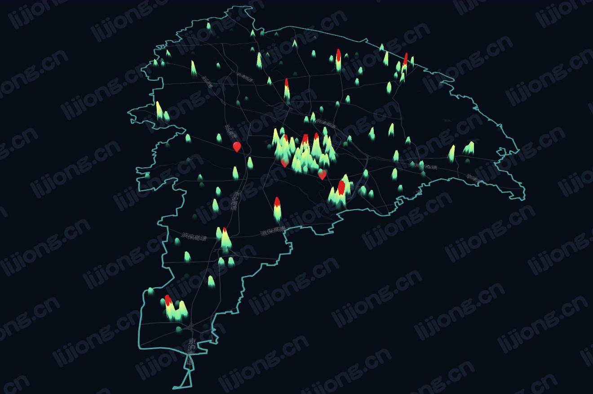

## **基于MapVGL的热力图开发**



### 热力图页面

```html
<!DOCTYPE html>
<html lang="zh-CN">
<head>
    <meta charset="utf-8">
    <title>MapVGL</title>
    <meta http-equiv="X-UA-Compatible" content="IE=Edge">
    <meta name="viewport" content="initial-scale=1.0, user-scalable=no">
    <style>
    html,
    body {
        width: 100%;
        height: 100%;
        margin: 0;
        padding: 0;
    }
    #map_container {
        width: 100%;
        height: 100%;
        margin: 0;
    }

    #tools {
        position: absolute;
        z-index: 100;
        right: 5px;
        bottom: 5px;
        padding: 10px;
        color: #fff;
        background: rgba(0, 0, 0, .5);
    }


    #tools button {
        width: 100px;
        height: 30px;
    }
    </style>
    <script src="http://api.map.baidu.com/api?v=1.0&type=webgl&ak=M********1"></script>
    <script src="http://mapv.baidu.com/build/mapv.min.js"></script>
    <script src="./common.js"></script>
    <script src="https://code.bdstatic.com/npm/mapvgl@1.0.0-beta.159/dist/mapvgl.min.js"></script>
</head>
<body>
    <div id="map_container"></div>
    <script>
    /* global BMapGL */

    /* global mapv */

    /* global mapvgl */

    /* global initMap */
    var map = initMap({
        center: [117.0506, 39.390094],
        zoom: 12,
        tilt: 45,
        // style: whiteStyle
    });

    var view = new mapvgl.View({
        map: map
    });

    fetch('./data.json')
    .then(rs => {
        return rs.json();
    }).then(rs => {
        rs = rs.result.data[0].bound;
        var data = [];
        for (var i = 0; i < rs.length; i++) {
            var item = rs[i];
            data.push({
                geometry: {
                    type: 'Point',
                    coordinates: [item[0], item[1]]
                },
                properties: {
                    count: item[2]
                }
            });
        }
        // 热力图样式
        var heatmap = new mapvgl.HeatmapLayer({
            size: 20, // 单个点绘制大小
            max: 150, // 最大阈值
            height: 80, // 最大高度，默认为0
            unit: 'px', // 单位，m:米，px: 像素
            gradient: { // 对应比例渐变色
                0.25: 'rgba(89, 233, 179, 1)',
                0.55: 'rgba(182, 243, 147, 1)',
                0.85: 'rgba(254, 255, 140, 1)',
                0.9: 'rgba(217, 29, 28, 1)',
            }
        });
        heatmap.setData(data);
        view.addLayer(heatmap);
    });

    // // 部分区域着色
    //     var bd = new BMapGL.Boundary();
    //     bd.get('武清区', function (rs) {
    //     // console.log('外轮廓：', rs.boundaries[0]);
    //     // console.log('内镂空：', rs.boundaries[1]);
    //     var hole = new BMapGL.Polygon(rs.boundaries, {
    //         fillColor: 'blue',
    //         fillOpacity: 0.2
    //     });
    //     map.addOverlay(hole);
    // });

    // 展示部分区域
    var bdary = new BMapGL.Boundary();
    bdary.get('武清区', function (rs) {
        // 绘制行政区
        for (var i = 0; i < rs.boundaries.length; i++) {
            var path = [];
            var xyArr = rs.boundaries[i].split(';');
            var ptArr = [];
            for (var j = 0; j < xyArr.length; j++) {
                var tmp = xyArr[j].split(',');
                var pt = new BMapGL.Point(tmp[0], tmp[1]);
                ptArr.push(pt);
            }
            var mapmask = new BMapGL.MapMask(ptArr, {
                isBuildingMask: true,
                isPoiMask: true,
                isMapMask: true,
                showRegion: 'inside',
                topFillColor: '#5679ea',
                topFillOpacity: 0.5,
                sideFillColor: '#5679ea',
                sideFillOpacity: 0.9
            });
            map.addOverlay(mapmask);
            var border = new BMapGL.Polyline(ptArr, {
                strokeColor: '#4ca7a2',
                strokeWeight: 3,
                strokeOpacity: 1
            });
            map.addOverlay(border);
        }
    });


    // 添加标注
    var marker = new BMapGL.Marker(new BMapGL.Point(117.022788,39.378722));
    map.addOverlay(marker);
    // 创建图文信息窗口
    var sContent = `<h4 style='margin:0 0 5px 0;'>站点1</h4>
        
        <p style='margin:0;line-height:1.5;font-size:13px;text-indent:2em'>
        站点1介绍文字
        </p></div>`;
    var infoWindow = new BMapGL.InfoWindow(sContent);
    // marker添加点击事件
    marker.addEventListener('click', function () {
        this.openInfoWindow(infoWindow);
        // 图片加载完毕重绘infoWindow
        document.getElementById('imgDemo').onload = function () {
            infoWindow.redraw(); // 防止在网速较慢时生成的信息框高度比图片总高度小，导致图片部分被隐藏
        };
    });

    var marker2 = new BMapGL.Marker(new BMapGL.Point(117.072096,39.359721));
    map.addOverlay(marker2);
    // 创建图文信息窗口
    var sContent2 = `<h4 style='margin:0 0 5px 0;'>站点2</h4>
        
        <p style='margin:0;line-height:1.5;font-size:13px;text-indent:2em'>
        站点2介绍文字
        </p></div>`;
    var infoWindow2 = new BMapGL.InfoWindow(sContent2);
    // marker添加点击事件
    marker2.addEventListener('click', function () {
        this.openInfoWindow(infoWindow2);
        // 图片加载完毕重绘infoWindow
        document.getElementById('imgDemo2').onload = function () {
            infoWindow2.redraw(); // 防止在网速较慢时生成的信息框高度比图片总高度小，导致图片部分被隐藏
        };
    });

    var marker3 = new BMapGL.Marker(new BMapGL.Point(116.956466,39.402834));
    map.addOverlay(marker3);
    // 创建图文信息窗口
    var sContent3 = `<h4 style='margin:0 0 5px 0;'>站点3</h4>
        
        <p style='margin:0;line-height:1.5;font-size:13px;text-indent:2em'>
        站点3介绍文字
        </p></div>`;
    var infoWindow3 = new BMapGL.InfoWindow(sContent3);
    // marker添加点击事件
    marker3.addEventListener('click', function () {
        this.openInfoWindow(infoWindow3);
        // 图片加载完毕重绘infoWindow
        document.getElementById('imgDemo3').onload = function () {
            infoWindow3.redraw(); // 防止在网速较慢时生成的信息框高度比图片总高度小，导致图片部分被隐藏
        };
    });
    </script>
</body>
</html>

```

### 坐标数据

- data.json

```json
{"errno":0,"message":"成功","result":{"data":[{"bound":[
["117.064992","39.411958","84"],
["117.041283","39.383373","38"],
["117.269375","39.396231","17"],
......
["116.915257","39.348477","32"]
]}]}}
```

### 初始化地图

- common.js

```javascript
/**
 * 初始化地图
 */

/* global BMapGL */
/* global darkStyle */

function initMap(options) {
    options = Object.assign({
        tilt: 60,
        heading: 0
    }, options);
    var map = new BMapGL.Map('map_container', {
        restrictCenter: false,
        style: {styleJson: options.style || darkStyle }
    });
    map.enableKeyboard();
    map.enableScrollWheelZoom();
    map.enableInertialDragging();
    map.enableContinuousZoom();

    map.setDisplayOptions(options.displayOptions || {
            indoor: false,
            poi: true,
            skyColors: options.skyColors || [
                'rgba(5, 5, 30, 0.01)',
                'rgba(5, 5, 30, 1.0)'
            ]
        });
    if (options.center && options.zoom) {
        let center = options.center;
        if (center instanceof Array) {
            center = new BMapGL.Point(options.center[0], options.center[1])
        }
        map.centerAndZoom(center, options.zoom);
    }

    map.setTilt(options.tilt);
    map.setHeading(options.heading);
    return map;
}

var snowStyle = [{
    featureType: 'background',
    elementType: 'geometry',
    stylers: {
        color: '#fefefeff'
    }
}, {
    featureType: 'poilabel',
    elementType: 'labels.icon',
    stylers: {
        visibility: 'off'
    }
}, {
    featureType: 'road',
    elementType: 'labels',
    stylers: {
        visibility: 'off'
    }
}, {
    featureType: 'road',
    elementType: 'geometry.fill',
    stylers: {
        color: '#f0f1f7ff'
    }
}, {
    featureType: 'road',
    elementType: 'geometry.stroke',
    stylers: {
        color: '#ffffff00'
    }
}, {
    featureType: 'highway',
    elementType: 'geometry.fill',
    stylers: {
        color: '#e8eaf5ff'
    }
}, {
    featureType: 'highway',
    elementType: 'geometry.stroke',
    stylers: {
        color: '#ffffff00'
    }
}, {
    featureType: 'nationalway',
    elementType: 'geometry.fill',
    stylers: {
        color: '#e8eaf5ff'
    }
}, {
    featureType: 'nationalway',
    elementType: 'geometry.stroke',
    stylers: {
        color: '#ffffff00'
    }
}, {
    featureType: 'provincialway',
    elementType: 'geometry.fill',
    stylers: {
        color: '#e8eaf5ff'
    }
}, {
    featureType: 'provincialway',
    elementType: 'geometry.stroke',
    stylers: {
        color: '#ffffff00'
    }
}, {
    featureType: 'railway',
    elementType: 'geometry',
    stylers: {
        visibility: 'off'
    }
}, {
    featureType: 'highwaysign',
    elementType: 'labels',
    stylers: {
        visibility: 'off'
    }
}, {
    featureType: 'highwaysign',
    elementType: 'labels.icon',
    stylers: {
        visibility: 'off'
    }
}, {
    featureType: 'nationalwaysign',
    elementType: 'labels.icon',
    stylers: {
        visibility: 'off'
    }
}, {
    featureType: 'nationalwaysign',
    elementType: 'labels',
    stylers: {
        visibility: 'off'
    }
}, {
    featureType: 'provincialwaysign',
    elementType: 'labels',
    stylers: {
        visibility: 'off'
    }
}, {
    featureType: 'provincialwaysign',
    elementType: 'labels.icon',
    stylers: {
        visibility: 'off'
    }
}, {
    featureType: 'tertiarywaysign',
    elementType: 'labels',
    stylers: {
        visibility: 'off'
    }
}, {
    featureType: 'tertiarywaysign',
    elementType: 'labels.icon',
    stylers: {
        visibility: 'off'
    }
}, {
    featureType: 'subwaylabel',
    elementType: 'labels',
    stylers: {
        visibility: 'off'
    }
}, {
    featureType: 'subwaylabel',
    elementType: 'labels.icon',
    stylers: {
        visibility: 'off'
    }
}, {
    featureType: 'poilabel',
    elementType: 'labels.text.fill',
    stylers: {
        color: '#80868dff'
    }
}, {
    featureType: 'poilabel',
    elementType: 'labels.text.stroke',
    stylers: {
        color: '#ffffff00'
    }
}, {
    featureType: 'districtlabel',
    elementType: 'labels.text.fill',
    stylers: {
        color: '#7d82b0ff'
    }
}, {
    featureType: 'districtlabel',
    elementType: 'labels.text.stroke',
    stylers: {
        color: '#ffffff00'
    }
}, {
    featureType: 'poilabel',
    elementType: 'labels',
    stylers: {
        visibility: 'off'
    }
}, {
    featureType: 'airportlabel',
    elementType: 'labels',
    stylers: {
        visibility: 'on'
    }
}, {
    featureType: 'airportlabel',
    elementType: 'labels.icon',
    stylers: {
        visibility: 'off'
    }
}, {
    featureType: 'airportlabel',
    elementType: 'labels.text.fill',
    stylers: {
        color: '#80868dff'
    }
}, {
    featureType: 'airportlabel',
    elementType: 'labels.text.stroke',
    stylers: {
        color: '#ffffff00'
    }
}, {
    featureType: 'manmade',
    elementType: 'labels',
    stylers: {
        visibility: 'off'
    }
}, {
    featureType: 'manmade',
    elementType: 'geometry',
    stylers: {
        color: '#eef1fbff'
    }
}, {
    featureType: 'water',
    elementType: 'labels',
    stylers: {
        visibility: 'off'
    }
}, {
    featureType: 'water',
    elementType: 'geometry',
    stylers: {
        // "color": "#a7c9ffff"
        color: '#a7c9ffff'
    }
}, {
    featureType: 'green',
    elementType: 'geometry',
    stylers: {
        color: '#eef1fbff',
        visibility: 'off'
    }
}, {
    featureType: 'subway',
    elementType: 'geometry',
    stylers: {
        visibility: 'off'
    }
}, {
    featureType: 'highway',
    elementType: 'labels',
    stylers: {
        visibility: 'on'
    }
}, {
    featureType: 'highway',
    elementType: 'labels.text.stroke',
    stylers: {
        color: '#ffffff00'
    }
}, {
    featureType: 'highway',
    elementType: 'labels.text.fill',
    stylers: {
        color: '#7d82b0ff'
    }
}, {
    featureType: 'town',
    elementType: 'labels',
    stylers: {
        visibility: 'off'
    }
}, {
    featureType: 'village',
    elementType: 'labels',
    stylers: {
        visibility: 'off'
    }
}, {
    featureType: 'highway',
    elementType: 'geometry',
    stylers: {
        weight: 3
    }
}, {
    featureType: 'cityhighway',
    elementType: 'geometry.fill',
    stylers: {
        color: '#e8eaf5ff'
    }
}, {
    featureType: 'arterial',
    elementType: 'geometry.fill',
    stylers: {
        color: '#e8eaf5ff'
    }
}, {
    featureType: 'arterial',
    elementType: 'geometry.stroke',
    stylers: {
        color: '#ffffff00'
    }
}, {
    featureType: 'cityhighway',
    elementType: 'geometry.stroke',
    stylers: {
        color: '#ffffff00'
    }
}];

var darkStyle = [{
    featureType: 'background',
    elementType: 'geometry',
    stylers: {
        color: '#070c17ff'
    }
}, {
    featureType: 'poilabel',
    elementType: 'labels.icon',
    stylers: {
        visibility: 'off'
    }
}, {
    featureType: 'road',
    elementType: 'labels',
    stylers: {
        visibility: 'off'
    }
}, {
    featureType: 'road',
    elementType: 'geometry.fill',
    stylers: {
        color: '#151e25ff'
    }
}, {
    featureType: 'road',
    elementType: 'geometry.stroke',
    stylers: {
        color: '#ffffff00'
    }
}, {
    featureType: 'highway',
    elementType: 'geometry.fill',
    stylers: {
        color: '#27303bff'
    }
}, {
    featureType: 'highway',
    elementType: 'geometry.stroke',
    stylers: {
        color: '#ffffff00'
    }
}, {
    featureType: 'nationalway',
    elementType: 'geometry.fill',
    stylers: {
        color: '#27303bff'
    }
}, {
    featureType: 'nationalway',
    elementType: 'geometry.stroke',
    stylers: {
        color: '#ffffff00'
    }
}, {
    featureType: 'provincialway',
    elementType: 'geometry.fill',
    stylers: {
        color: '#27303bff'
    }
}, {
    featureType: 'provincialway',
    elementType: 'geometry.stroke',
    stylers: {
        color: '#ffffff00'
    }
}, {
    featureType: 'railway',
    elementType: 'geometry',
    stylers: {
        visibility: 'off'
    }
}, {
    featureType: 'highwaysign',
    elementType: 'labels',
    stylers: {
        visibility: 'off'
    }
}, {
    featureType: 'highwaysign',
    elementType: 'labels.icon',
    stylers: {
        visibility: 'off'
    }
}, {
    featureType: 'nationalwaysign',
    elementType: 'labels.icon',
    stylers: {
        visibility: 'off'
    }
}, {
    featureType: 'nationalwaysign',
    elementType: 'labels',
    stylers: {
        visibility: 'off'
    }
}, {
    featureType: 'provincialwaysign',
    elementType: 'labels',
    stylers: {
        visibility: 'off'
    }
}, {
    featureType: 'provincialwaysign',
    elementType: 'labels.icon',
    stylers: {
        visibility: 'off'
    }
}, {
    featureType: 'tertiarywaysign',
    elementType: 'labels',
    stylers: {
        visibility: 'off'
    }
}, {
    featureType: 'tertiarywaysign',
    elementType: 'labels.icon',
    stylers: {
        visibility: 'off'
    }
}, {
    featureType: 'subwaylabel',
    elementType: 'labels',
    stylers: {
        visibility: 'off'
    }
}, {
    featureType: 'subwaylabel',
    elementType: 'labels.icon',
    stylers: {
        visibility: 'off'
    }
}, {
    featureType: 'poilabel',
    elementType: 'labels.text.fill',
    stylers: {
        color: '#80868dff'
    }
}, {
    featureType: 'poilabel',
    elementType: 'labels.text.stroke',
    stylers: {
        color: '#ffffff00'
    }
}, {
    featureType: 'districtlabel',
    elementType: 'labels.text.fill',
    stylers: {
        color: '#71767aff'
    }
}, {
    featureType: 'districtlabel',
    elementType: 'labels.text.stroke',
    stylers: {
        color: '#ffffff00'
    }
}, {
    featureType: 'poilabel',
    elementType: 'labels',
    stylers: {
        visibility: 'off'
    }
}, {
    featureType: 'airportlabel',
    elementType: 'labels',
    stylers: {
        visibility: 'on'
    }
}, {
    featureType: 'airportlabel',
    elementType: 'labels.icon',
    stylers: {
        visibility: 'off'
    }
}, {
    featureType: 'airportlabel',
    elementType: 'labels.text.fill',
    stylers: {
        color: '#80868dff'
    }
}, {
    featureType: 'airportlabel',
    elementType: 'labels.text.stroke',
    stylers: {
        color: '#ffffff00'
    }
}, {
    featureType: 'manmade',
    elementType: 'labels',
    stylers: {
        visibility: 'off'
    }
}, {
    featureType: 'manmade',
    elementType: 'geometry',
    stylers: {
        color: '#070c17ff'
    }
}, {
    featureType: 'water',
    elementType: 'labels',
    stylers: {
        visibility: 'off'
    }
}, {
    featureType: 'water',
    elementType: 'geometry',
    stylers: {
        color: '#141d27ff'
    }
}, {
    featureType: 'green',
    elementType: 'geometry',
    stylers: {
        color: '#122228ff',
        visibility: 'off'
    }
}, {
    featureType: 'subway',
    elementType: 'geometry',
    stylers: {
        visibility: 'off'
    }
}, {
    featureType: 'highway',
    elementType: 'labels',
    stylers: {
        visibility: 'on'
    }
}, {
    featureType: 'highway',
    elementType: 'labels.text.stroke',
    stylers: {
        color: '#ffffff00'
    }
}, {
    featureType: 'highway',
    elementType: 'labels.text.fill',
    stylers: {
        color: '#5f6468ff'
    }
}, {
    featureType: 'town',
    elementType: 'labels',
    stylers: {
        visibility: 'off'
    }
}, {
    featureType: 'village',
    elementType: 'labels',
    stylers: {
        visibility: 'off'
    }
}, {
    featureType: 'highway',
    elementType: 'geometry',
    stylers: {
        weight: 3
    }
}, {
    featureType: 'cityhighway',
    elementType: 'geometry.fill',
    stylers: {
        color: '#27303bff'
    }
}, {
    featureType: 'arterial',
    elementType: 'geometry.fill',
    stylers: {
        color: '#27303bff'
    }
}, {
    featureType: 'arterial',
    elementType: 'geometry.stroke',
    stylers: {
        color: '#ffffff00'
    }
}, {
    featureType: 'cityhighway',
    elementType: 'geometry.stroke',
    stylers: {
        color: '#ffffff00'
    }
}];

var purpleStyle = [{
    featureType: 'water',
    elementType: 'all',
    stylers: {
        color: '#021019ff'
    }
}, {
    featureType: 'highway',
    elementType: 'geometry.fill',
    stylers: {
        color: '#000000ff'
    }
}, {
    featureType: 'highway',
    elementType: 'geometry.stroke',
    stylers: {
        color: '#147a92ff'
    }
}, {
    featureType: 'arterial',
    elementType: 'geometry.fill',
    stylers: {
        color: '#000000ff'
    }
}, {
    featureType: 'arterial',
    elementType: 'geometry.stroke',
    stylers: {
        color: '#0b3d51ff'
    }
}, {
    featureType: 'local',
    elementType: 'geometry',
    stylers: {
        color: '#000000ff'
    }
}, {
    featureType: 'railway',
    elementType: 'geometry.fill',
    stylers: {
        color: '#000000ff'
    }
}, {
    featureType: 'railway',
    elementType: 'geometry.stroke',
    stylers: {
        color: '#08304bff'
    }
}, {
    featureType: 'subway',
    elementType: 'geometry',
    stylers: {
        visibility: 'off'
    }
}, {
    featureType: 'all',
    elementType: 'labels.text.fill',
    stylers: {
        color: '#857f7fff'
    }
}, {
    featureType: 'all',
    elementType: 'labels.text.stroke',
    stylers: {
        color: '#000000ff'
    }
}, {
    featureType: 'green',
    elementType: 'geometry',
    stylers: {
        color: '#062032ff'
    }
}, {
    featureType: 'manmade',
    elementType: 'geometry',
    stylers: {
        color: '#022338ff'
    }
}, {
    featureType: 'poilabel',
    elementType: 'all',
    stylers: {
        visibility: 'off'
    }
}, {
    featureType: 'all',
    elementType: 'labels.icon',
    stylers: {
        visibility: 'off'
    }
}, {
    featureType: 'water',
    elementType: 'all',
    stylers: {
        visibility: 'on',
        color: '#505565ff'
    }
}, {
    featureType: 'green',
    elementType: 'all',
    stylers: {
        color: '#353b4dff'
    }
}, {
    featureType: 'road',
    elementType: 'geometry.fill',
    stylers: {
        visibility: 'on',
        color: '#2a2e3bff'
    }
}, {
    featureType: 'road',
    elementType: 'geometry.stroke',
    stylers: {
        color: '#4b5163ff'
    }
}, {
    featureType: 'administrative',
    elementType: 'labels.text.fill',
    stylers: {
        color: '#8e99bdff'
    }
}, {
    featureType: 'administrative',
    elementType: 'labels.text.stroke',
    stylers: {
        color: '#2f3547ff'
    }
}, {
    featureType: 'poilabel',
    elementType: 'labels.text.fill',
    stylers: {
        color: '#727c9aff'
    }
}, {
    featureType: 'road',
    elementType: 'labels.text.stroke',
    stylers: {
        color: '#293045ff'
    }
}, {
    featureType: 'road',
    elementType: 'labels.text.fill',
    stylers: {
        color: '#777e93ff'
    }
}, {
    featureType: 'town',
    elementType: 'all',
    stylers: {
        visibility: 'on'
    }
}, {
    featureType: 'subway',
    elementType: 'labels.text.fill',
    stylers: {
        visibility: 'off',
        color: '#787f95ff'
    }
}, {
    featureType: 'subway',
    elementType: 'labels.text.stroke',
    stylers: {
        color: '#40475eff'
    }
}, {
    featureType: 'building',
    elementType: 'geometry.fill',
    stylers: {
        color: '#485161ff'
    }
}, {
    featureType: 'manmade',
    elementType: 'geometry.fill',
    stylers: {
        color: '#374053ff'
    }
}, {
    featureType: 'manmade',
    elementType: 'labels.text.fill',
    stylers: {
        color: '#8792adff'
    }
}, {
    featureType: 'manmade',
    elementType: 'labels.text.stroke',
    stylers: {
        color: '#292f48ff'
    }
}, {
    featureType: 'scenicspotslabel',
    elementType: 'labels',
    stylers: {
        visibility: 'off'
    }
}, {
    featureType: 'railway',
    elementType: 'geometry',
    stylers: {
        visibility: 'off'
    }
}, {
    featureType: 'scenicspotslabel',
    elementType: 'labels.icon',
    stylers: {
        visibility: 'off'
    }
}, {
    featureType: 'highwaysign',
    elementType: 'labels',
    stylers: {
        visibility: 'off'
    }
}, {
    featureType: 'highwaysign',
    elementType: 'labels.icon',
    stylers: {
        visibility: 'off'
    }
}, {
    featureType: 'nationalwaysign',
    elementType: 'labels.icon',
    stylers: {
        visibility: 'off'
    }
}, {
    featureType: 'nationalwaysign',
    elementType: 'labels',
    stylers: {
        visibility: 'off'
    }
}, {
    featureType: 'provincialwaysign',
    elementType: 'labels.icon',
    stylers: {
        visibility: 'off'
    }
}, {
    featureType: 'provincialwaysign',
    elementType: 'labels',
    stylers: {
        visibility: 'off'
    }
}, {
    featureType: 'tertiarywaysign',
    elementType: 'labels.icon',
    stylers: {
        visibility: 'off'
    }
}, {
    featureType: 'tertiarywaysign',
    elementType: 'labels',
    stylers: {
        visibility: 'off'
    }
}, {
    featureType: 'subwaylabel',
    elementType: 'labels.icon',
    stylers: {
        visibility: 'off'
    }
}, {
    featureType: 'subwaylabel',
    elementType: 'labels',
    stylers: {
        visibility: 'off'
    }
}, {
    featureType: 'village',
    elementType: 'labels',
    stylers: {
        visibility: 'off'
    }
}, {
    featureType: 'town',
    elementType: 'labels',
    stylers: {
        visibility: 'off'
    }
}, {
    featureType: 'land',
    elementType: 'geometry',
    stylers: {
        color: '#40495aff',
        visibility: 'on'
    }
}];

var whiteStyle = [{
    featureType: 'water',
    elementType: 'geometry',
    stylers: {
        visibility: 'on',
        color: '#ccd6d7ff'
    }
}, {
    featureType: 'green',
    elementType: 'geometry',
    stylers: {
        visibility: 'on',
        color: '#dee5e5ff'
    }
}, {
    featureType: 'building',
    elementType: 'geometry',
    stylers: {
        visibility: 'on'
    }
}, {
    featureType: 'building',
    elementType: 'geometry.fill',
    stylers: {
        color: '#d1dbdbff'
    }
}, {
    featureType: 'building',
    elementType: 'geometry.stroke',
    stylers: {
        color: '#aab6b6ff'
    }
}, {
    featureType: 'subwaystation',
    elementType: 'geometry',
    stylers: {
        visibility: 'off',
        color: '#888fa0ff'
    }
}, {
    featureType: 'education',
    elementType: 'geometry',
    stylers: {
        visibility: 'on',
        color: '#e1e7e7ff'
    }
}, {
    featureType: 'medical',
    elementType: 'geometry',
    stylers: {
        visibility: 'on',
        color: '#d1dbdbff'
    }
}, {
    featureType: 'scenicspots',
    elementType: 'geometry',
    stylers: {
        visibility: 'on',
        color: '#d1dbdbff'
    }
}, {
    featureType: 'highway',
    elementType: 'geometry',
    stylers: {
        visibility: 'on',
        weight: '4'
    }
}, {
    featureType: 'highway',
    elementType: 'geometry.fill',
    stylers: {
        color: '#ffffffff'
    }
}, {
    featureType: 'highway',
    elementType: 'geometry.stroke',
    stylers: {
        color: '#cacfcfff'
    }
}, {
    featureType: 'highway',
    elementType: 'labels',
    stylers: {
        visibility: 'off'
    }
}, {
    featureType: 'highway',
    elementType: 'labels.text.fill',
    stylers: {
        color: '#999999ff'
    }
}, {
    featureType: 'highway',
    elementType: 'labels.text.stroke',
    stylers: {
        color: '#ffffffff'
    }
}, {
    featureType: 'highway',
    elementType: 'labels.icon',
    stylers: {
        visibility: 'on'
    }
}, {
    featureType: 'arterial',
    elementType: 'geometry',
    stylers: {
        visibility: 'on',
        weight: '2'
    }
}, {
    featureType: 'arterial',
    elementType: 'geometry.fill',
    stylers: {
        color: '#fbfffeff'
    }
}, {
    featureType: 'arterial',
    elementType: 'geometry.stroke',
    stylers: {
        color: '#cacfcfff'
    }
}, {
    featureType: 'arterial',
    elementType: 'labels',
    stylers: {
        visibility: 'off'
    }
}, {
    featureType: 'arterial',
    elementType: 'labels.text.fill',
    stylers: {
        color: '#999999ff'
    }
}, {
    featureType: 'arterial',
    elementType: 'labels.text.stroke',
    stylers: {
        color: '#ffffffff'
    }
}, {
    featureType: 'local',
    elementType: 'geometry',
    stylers: {
        visibility: 'on',
        weight: '1'
    }
}, {
    featureType: 'local',
    elementType: 'geometry.fill',
    stylers: {
        color: '#fbfffeff'
    }
}, {
    featureType: 'local',
    elementType: 'geometry.stroke',
    stylers: {
        color: '#cacfcfff'
    }
}, {
    featureType: 'local',
    elementType: 'labels',
    stylers: {
        visibility: 'off'
    }
}, {
    featureType: 'local',
    elementType: 'labels.text.fill',
    stylers: {
        color: '#999999ff'
    }
}, {
    featureType: 'local',
    elementType: 'labels.text.stroke',
    stylers: {
        color: '#ffffffff'
    }
}, {
    featureType: 'railway',
    elementType: 'geometry',
    stylers: {
        visibility: 'off',
        weight: '1'
    }
}, {
    featureType: 'railway',
    elementType: 'geometry.fill',
    stylers: {
        color: '#9494941a'
    }
}, {
    featureType: 'railway',
    elementType: 'geometry.stroke',
    stylers: {
        color: '#ffffff1a'
    }
}, {
    featureType: 'subway',
    elementType: 'geometry',
    stylers: {
        visibility: 'off',
        weight: '1'
    }
}, {
    featureType: 'subway',
    elementType: 'geometry.fill',
    stylers: {
        color: '#c3bed433'
    }
}, {
    featureType: 'subway',
    elementType: 'geometry.stroke',
    stylers: {
        color: '#ffffff33'
    }
}, {
    featureType: 'subway',
    elementType: 'labels',
    stylers: {
        visibility: 'off'
    }
}, {
    featureType: 'subway',
    elementType: 'labels.text.fill',
    stylers: {
        color: '#979c9aff'
    }
}, {
    featureType: 'subway',
    elementType: 'labels.text.stroke',
    stylers: {
        color: '#ffffffff'
    }
}, {
    featureType: 'continent',
    elementType: 'labels',
    stylers: {
        visibility: 'on'
    }
}, {
    featureType: 'continent',
    elementType: 'labels.icon',
    stylers: {
        visibility: 'on'
    }
}, {
    featureType: 'continent',
    elementType: 'labels.text.fill',
    stylers: {
        color: '#333333ff'
    }
}, {
    featureType: 'continent',
    elementType: 'labels.text.stroke',
    stylers: {
        color: '#ffffffff'
    }
}, {
    featureType: 'city',
    elementType: 'labels.icon',
    stylers: {
        visibility: 'on'
    }
}, {
    featureType: 'city',
    elementType: 'labels',
    stylers: {
        visibility: 'on'
    }
}, {
    featureType: 'city',
    elementType: 'labels.text.fill',
    stylers: {
        color: '#454d50ff'
    }
}, {
    featureType: 'city',
    elementType: 'labels.text.stroke',
    stylers: {
        color: '#ffffffff'
    }
}, {
    featureType: 'town',
    elementType: 'labels.icon',
    stylers: {
        visibility: 'on'
    }
}, {
    featureType: 'town',
    elementType: 'labels',
    stylers: {
        visibility: 'off'
    }
}, {
    featureType: 'town',
    elementType: 'labels.text.fill',
    stylers: {
        color: '#454d50ff'
    }
}, {
    featureType: 'town',
    elementType: 'labels.text.stroke',
    stylers: {
        color: '#ffffffff'
    }
}, {
    featureType: 'road',
    elementType: 'labels',
    stylers: {
        visibility: 'off'
    }
}, {
    featureType: 'road',
    elementType: 'geometry.fill',
    stylers: {
        color: '#fbfffeff'
    }
}, {
    featureType: 'poilabel',
    elementType: 'labels.icon',
    stylers: {
        visibility: 'off'
    }
}, {
    featureType: 'districtlabel',
    elementType: 'labels.icon',
    stylers: {
        visibility: 'off'
    }
}, {
    featureType: 'poilabel',
    elementType: 'labels.text.fill',
    stylers: {
        color: '#999999ff'
    }
}, {
    featureType: 'districtlabel',
    elementType: 'labels.text.fill',
    stylers: {
        color: '#888fa0ff'
    }
}, {
    featureType: 'transportation',
    elementType: 'geometry',
    stylers: {
        color: '#d1dbdbff'
    }
}, {
    featureType: 'companylabel',
    elementType: 'labels',
    stylers: {
        visibility: 'off'
    }
}, {
    featureType: 'restaurantlabel',
    elementType: 'labels',
    stylers: {
        visibility: 'off'
    }
}, {
    featureType: 'lifeservicelabel',
    elementType: 'labels',
    stylers: {
        visibility: 'off'
    }
}, {
    featureType: 'carservicelabel',
    elementType: 'labels',
    stylers: {
        visibility: 'off'
    }
}, {
    featureType: 'financelabel',
    elementType: 'labels',
    stylers: {
        visibility: 'off'
    }
}, {
    featureType: 'otherlabel',
    elementType: 'labels',
    stylers: {
        visibility: 'off'
    }
}, {
    featureType: 'village',
    elementType: 'labels',
    stylers: {
        visibility: 'off'
    }
}, {
    featureType: 'district',
    elementType: 'labels',
    stylers: {
        visibility: 'off'
    }
}, {
    featureType: 'land',
    elementType: 'geometry',
    stylers: {
        color: '#edf3f3ff'
    }
}, {
    featureType: 'nationalway',
    elementType: 'geometry.stroke',
    stylers: {
        color: '#cacfcfff'
    }
}, {
    featureType: 'provincialway',
    elementType: 'geometry.stroke',
    stylers: {
        color: '#cacfcfff'
    }
}, {
    featureType: 'cityhighway',
    elementType: 'geometry.stroke',
    stylers: {
        color: '#cacfcfff'
    }
}, {
    featureType: 'road',
    elementType: 'geometry.stroke',
    stylers: {
        color: '#cacfcfff'
    }
}, {
    featureType: 'subwaylabel',
    elementType: 'labels.icon',
    stylers: {
        visibility: 'off'
    }
}, {
    featureType: 'subwaylabel',
    elementType: 'labels',
    stylers: {
        visibility: 'off'
    }
}, {
    featureType: 'tertiarywaysign',
    elementType: 'labels.icon',
    stylers: {
        visibility: 'off'
    }
}, {
    featureType: 'tertiarywaysign',
    elementType: 'labels',
    stylers: {
        visibility: 'off'
    }
}, {
    featureType: 'provincialwaysign',
    elementType: 'labels.icon',
    stylers: {
        visibility: 'off'
    }
}, {
    featureType: 'provincialwaysign',
    elementType: 'labels',
    stylers: {
        visibility: 'off'
    }
}, {
    featureType: 'nationalwaysign',
    elementType: 'labels.icon',
    stylers: {
        visibility: 'off'
    }
}, {
    featureType: 'nationalwaysign',
    elementType: 'labels',
    stylers: {
        visibility: 'off'
    }
}, {
    featureType: 'highwaysign',
    elementType: 'labels.icon',
    stylers: {
        visibility: 'off'
    }
}, {
    featureType: 'highwaysign',
    elementType: 'labels',
    stylers: {
        visibility: 'off'
    }
}, {
    featureType: 'nationalway',
    elementType: 'geometry.fill',
    stylers: {
        color: '#fbfffeff'
    }
}, {
    featureType: 'nationalway',
    elementType: 'labels.text.fill',
    stylers: {
        color: '#999999ff'
    }
}, {
    featureType: 'provincialway',
    elementType: 'labels.text.fill',
    stylers: {
        color: '#999999ff'
    }
}, {
    featureType: 'cityhighway',
    elementType: 'labels.text.fill',
    stylers: {
        color: '#999999ff'
    }
}, {
    featureType: 'cityhighway',
    elementType: 'labels.text.stroke',
    stylers: {
        color: '#ffffffff'
    }
}, {
    featureType: 'highway',
    stylers: {
        level: '6',
        curZoomRegionId: '0',
        curZoomRegion: '6-8'
    }
}, {
    featureType: 'highway',
    stylers: {
        level: '7',
        curZoomRegionId: '0',
        curZoomRegion: '6-8'
    }
}, {
    featureType: 'highway',
    stylers: {
        level: '8',
        curZoomRegionId: '0',
        curZoomRegion: '6-8'
    }
}, {
    featureType: 'highway',
    elementType: 'geometry',
    stylers: {
        visibility: 'off',
        level: '6',
        curZoomRegionId: '0',
        curZoomRegion: '6-8'
    }
}, {
    featureType: 'highway',
    elementType: 'geometry',
    stylers: {
        visibility: 'off',
        level: '7',
        curZoomRegionId: '0',
        curZoomRegion: '6-8'
    }
}, {
    featureType: 'highway',
    elementType: 'geometry',
    stylers: {
        visibility: 'off',
        level: '8',
        curZoomRegionId: '0',
        curZoomRegion: '6-8'
    }
}, {
    featureType: 'highway',
    elementType: 'labels',
    stylers: {
        visibility: 'off',
        level: '6',
        curZoomRegionId: '0',
        curZoomRegion: '6-8'
    }
}, {
    featureType: 'highway',
    elementType: 'labels',
    stylers: {
        visibility: 'off',
        level: '7',
        curZoomRegionId: '0',
        curZoomRegion: '6-8'
    }
}, {
    featureType: 'highway',
    elementType: 'labels',
    stylers: {
        visibility: 'off',
        level: '8',
        curZoomRegionId: '0',
        curZoomRegion: '6-8'
    }
}, {
    featureType: 'nationalway',
    stylers: {
        level: '6',
        curZoomRegionId: '0',
        curZoomRegion: '6-8'
    }
}, {
    featureType: 'nationalway',
    stylers: {
        level: '7',
        curZoomRegionId: '0',
        curZoomRegion: '6-8'
    }
}, {
    featureType: 'nationalway',
    stylers: {
        level: '8',
        curZoomRegionId: '0',
        curZoomRegion: '6-8'
    }
}, {
    featureType: 'nationalway',
    elementType: 'geometry',
    stylers: {
        visibility: 'off',
        level: '6',
        curZoomRegionId: '0',
        curZoomRegion: '6-8'
    }
}, {
    featureType: 'nationalway',
    elementType: 'geometry',
    stylers: {
        visibility: 'off',
        level: '7',
        curZoomRegionId: '0',
        curZoomRegion: '6-8'
    }
}, {
    featureType: 'nationalway',
    elementType: 'geometry',
    stylers: {
        visibility: 'off',
        level: '8',
        curZoomRegionId: '0',
        curZoomRegion: '6-8'
    }
}, {
    featureType: 'nationalway',
    elementType: 'labels',
    stylers: {
        visibility: 'off',
        level: '6',
        curZoomRegionId: '0',
        curZoomRegion: '6-8'
    }
}, {
    featureType: 'nationalway',
    elementType: 'labels',
    stylers: {
        visibility: 'off',
        level: '7',
        curZoomRegionId: '0',
        curZoomRegion: '6-8'
    }
}, {
    featureType: 'nationalway',
    elementType: 'labels',
    stylers: {
        visibility: 'off',
        level: '8',
        curZoomRegionId: '0',
        curZoomRegion: '6-8'
    }
}, {
    featureType: 'provincialway',
    stylers: {
        level: '8',
        curZoomRegionId: '0',
        curZoomRegion: '8-8'
    }
}, {
    featureType: 'provincialway',
    elementType: 'geometry',
    stylers: {
        visibility: 'off',
        level: '8',
        curZoomRegionId: '0',
        curZoomRegion: '8-8'
    }
}, {
    featureType: 'provincialway',
    elementType: 'labels',
    stylers: {
        visibility: 'off',
        level: '8',
        curZoomRegionId: '0',
        curZoomRegion: '8-8'
    }
}, {
    featureType: 'cityhighway',
    stylers: {
        level: '6',
        curZoomRegionId: '0',
        curZoomRegion: '6-8'
    }
}, {
    featureType: 'cityhighway',
    stylers: {
        level: '7',
        curZoomRegionId: '0',
        curZoomRegion: '6-8'
    }
}, {
    featureType: 'cityhighway',
    stylers: {
        level: '8',
        curZoomRegionId: '0',
        curZoomRegion: '6-8'
    }
}, {
    featureType: 'cityhighway',
    elementType: 'geometry',
    stylers: {
        visibility: 'off',
        level: '6',
        curZoomRegionId: '0',
        curZoomRegion: '6-8'
    }
}, {
    featureType: 'cityhighway',
    elementType: 'geometry',
    stylers: {
        visibility: 'off',
        level: '7',
        curZoomRegionId: '0',
        curZoomRegion: '6-8'
    }
}, {
    featureType: 'cityhighway',
    elementType: 'geometry',
    stylers: {
        visibility: 'off',
        level: '8',
        curZoomRegionId: '0',
        curZoomRegion: '6-8'
    }
}, {
    featureType: 'cityhighway',
    elementType: 'labels',
    stylers: {
        visibility: 'off',
        level: '6',
        curZoomRegionId: '0',
        curZoomRegion: '6-8'
    }
}, {
    featureType: 'cityhighway',
    elementType: 'labels',
    stylers: {
        visibility: 'off',
        level: '7',
        curZoomRegionId: '0',
        curZoomRegion: '6-8'
    }
}, {
    featureType: 'cityhighway',
    elementType: 'labels',
    stylers: {
        visibility: 'off',
        level: '8',
        curZoomRegionId: '0',
        curZoomRegion: '6-8'
    }
}, {
    featureType: 'cityhighway',
    elementType: 'geometry.fill',
    stylers: {
        color: '#fbfffeff'
    }
}, {
    featureType: 'water',
    elementType: 'labels.text.fill',
    stylers: {
        color: '#8f5a33ff'
    }
}, {
    featureType: 'water',
    elementType: 'labels.text.stroke',
    stylers: {
        color: '#ffffffff'
    }
}, {
    featureType: 'country',
    elementType: 'labels.text.fill',
    stylers: {
        color: '#8f5a33ff'
    }
}, {
    featureType: 'country',
    elementType: 'labels.text.stroke',
    stylers: {
        color: '#ffffffff'
    }
}, {
    featureType: 'country',
    elementType: 'labels.text',
    stylers: {
        fontsize: '28'
    }
}, {
    featureType: 'manmade',
    elementType: 'geometry',
    stylers: {
        color: '#dfe7e7ff'
    }
}, {
    featureType: 'provincialway',
    elementType: 'geometry.fill',
    stylers: {
        color: '#fbfffeff'
    }
}, {
    featureType: 'tertiaryway',
    elementType: 'geometry.fill',
    stylers: {
        color: '#fbfffeff'
    }
}, {
    featureType: 'manmade',
    elementType: 'labels.text.fill',
    stylers: {
        color: '#999999ff'
    }
}, {
    featureType: 'manmade',
    elementType: 'labels.text.stroke',
    stylers: {
        color: '#ffffffff'
    }
}, {
    featureType: 'scenicspots',
    elementType: 'labels.text.fill',
    stylers: {
        color: '#999999ff'
    }
}, {
    featureType: 'scenicspots',
    elementType: 'labels.text.stroke',
    stylers: {
        color: '#ffffffff'
    }
}, {
    featureType: 'airportlabel',
    elementType: 'labels.text.fill',
    stylers: {
        color: '#999999ff'
    }
}, {
    featureType: 'airportlabel',
    elementType: 'labels.icon',
    stylers: {
        visibility: 'off'
    }
}, {
    featureType: 'scenicspotslabel',
    elementType: 'labels.text.fill',
    stylers: {
        color: '#999999ff'
    }
}, {
    featureType: 'scenicspotslabel',
    elementType: 'labels.icon',
    stylers: {
        visibility: 'off'
    }
}, {
    featureType: 'educationlabel',
    elementType: 'labels.text.fill',
    stylers: {
        color: '#999999ff'
    }
}, {
    featureType: 'educationlabel',
    elementType: 'labels.icon',
    stylers: {
        visibility: 'off'
    }
}, {
    featureType: 'medicallabel',
    elementType: 'labels.text.fill',
    stylers: {
        color: '#999999ff'
    }
}, {
    featureType: 'medicallabel',
    elementType: 'labels.icon',
    stylers: {
        visibility: 'off'
    }
}, {
    featureType: 'companylabel',
    elementType: 'labels.icon',
    stylers: {
        visibility: 'off'
    }
}, {
    featureType: 'restaurantlabel',
    elementType: 'labels.icon',
    stylers: {
        visibility: 'off'
    }
}, {
    featureType: 'hotellabel',
    elementType: 'labels.icon',
    stylers: {
        visibility: 'off'
    }
}, {
    featureType: 'hotellabel',
    elementType: 'labels',
    stylers: {
        visibility: 'off'
    }
}, {
    featureType: 'shoppinglabel',
    elementType: 'labels.icon',
    stylers: {
        visibility: 'off'
    }
}, {
    featureType: 'shoppinglabel',
    elementType: 'labels',
    stylers: {
        visibility: 'off'
    }
}, {
    featureType: 'lifeservicelabel',
    elementType: 'labels.icon',
    stylers: {
        visibility: 'off'
    }
}, {
    featureType: 'carservicelabel',
    elementType: 'labels.icon',
    stylers: {
        visibility: 'off'
    }
}, {
    featureType: 'transportationlabel',
    elementType: 'labels.icon',
    stylers: {
        visibility: 'off'
    }
}, {
    featureType: 'transportationlabel',
    elementType: 'labels',
    stylers: {
        visibility: 'off'
    }
}, {
    featureType: 'financelabel',
    elementType: 'labels.icon',
    stylers: {
        visibility: 'off'
    }
}, {
    featureType: 'entertainment',
    elementType: 'geometry',
    stylers: {
        color: '#d1dbdbff'
    }
}, {
    featureType: 'estate',
    elementType: 'geometry',
    stylers: {
        color: '#d1dbdbff'
    }
}, {
    featureType: 'shopping',
    elementType: 'geometry',
    stylers: {
        color: '#d1dbdbff'
    }
}, {
    featureType: 'education',
    elementType: 'labels.text.fill',
    stylers: {
        color: '#999999ff'
    }
}, {
    featureType: 'education',
    elementType: 'labels.text.stroke',
    stylers: {
        color: '#ffffffff'
    }
}, {
    featureType: 'medical',
    elementType: 'labels.text.fill',
    stylers: {
        color: '#999999ff'
    }
}, {
    featureType: 'medical',
    elementType: 'labels.text.stroke',
    stylers: {
        color: '#ffffffff'
    }
}, {
    featureType: 'transportation',
    elementType: 'labels.text.fill',
    stylers: {
        color: '#999999ff'
    }
}, {
    featureType: 'transportation',
    elementType: 'labels.text.stroke',
    stylers: {
        color: '#ffffffff'
    }
}, {
    featureType: 'road',
    elementType: 'geometry',
    stylers: {
        visibility: 'on'
    }
}, {
    featureType: 'nationalway',
    elementType: 'labels',
    stylers: {
        visibility: 'off'
    }
}, {
    featureType: 'provincialway',
    elementType: 'labels',
    stylers: {
        visibility: 'off'
    }
}, {
    featureType: 'cityhighway',
    elementType: 'labels',
    stylers: {
        visibility: 'off'
    }
}, {
    featureType: 'tertiaryway',
    elementType: 'labels',
    stylers: {
        visibility: 'off'
    }
}, {
    featureType: 'fourlevelway',
    elementType: 'labels',
    stylers: {
        visibility: 'off'
    }
}, {
    featureType: 'water',
    elementType: 'labels',
    stylers: {
        visibility: 'off'
    }
}, {
    featureType: 'manmade',
    elementType: 'labels',
    stylers: {
        visibility: 'off'
    }
}, {
    featureType: 'education',
    elementType: 'labels',
    stylers: {
        visibility: 'off'
    }
}, {
    featureType: 'medical',
    elementType: 'labels',
    stylers: {
        visibility: 'off'
    }
}, {
    featureType: 'scenicspots',
    elementType: 'labels',
    stylers: {
        visibility: 'off'
    }
}, {
    featureType: 'transportation',
    elementType: 'labels',
    stylers: {
        visibility: 'off'
    }
}, {
    featureType: 'entertainmentlabel',
    elementType: 'labels.icon',
    stylers: {
        visibility: 'off'
    }
}, {
    featureType: 'estatelabel',
    elementType: 'labels.icon',
    stylers: {
        visibility: 'off'
    }
}, {
    featureType: 'businesstowerlabel',
    elementType: 'labels.icon',
    stylers: {
        visibility: 'off'
    }
}, {
    featureType: 'governmentlabel',
    elementType: 'labels.icon',
    stylers: {
        visibility: 'off'
    }
}, {
    featureType: 'governmentlabel',
    elementType: 'labels',
    stylers: {
        visibility: 'off'
    }
}, {
    featureType: 'businesstowerlabel',
    elementType: 'labels',
    stylers: {
        visibility: 'off'
    }
}, {
    featureType: 'estatelabel',
    elementType: 'labels',
    stylers: {
        visibility: 'off'
    }
}, {
    featureType: 'entertainmentlabel',
    elementType: 'labels',
    stylers: {
        visibility: 'off'
    }
}, {
    featureType: 'medicallabel',
    elementType: 'labels',
    stylers: {
        visibility: 'off'
    }
}, {
    featureType: 'educationlabel',
    elementType: 'labels',
    stylers: {
        visibility: 'off'
    }
}, {
    featureType: 'scenicspotslabel',
    elementType: 'labels',
    stylers: {
        visibility: 'off'
    }
}, {
    featureType: 'airportlabel',
    elementType: 'labels',
    stylers: {
        visibility: 'off'
    }
}, {
    featureType: 'poilabel',
    elementType: 'labels',
    stylers: {
        visibility: 'off'
    }
}];
```


