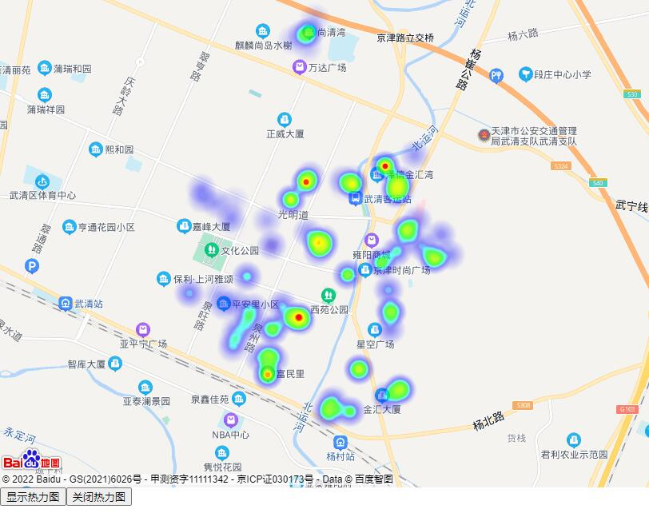

## **基于百度地图的热力图开发**



- Heatmap.html

```html
<!DOCTYPE html>
<html>
<head>
    <meta http-equiv="Content-Type" content="text/html; charset=utf-8" />
    <meta name="viewport" content="initial-scale=1.0, user-scalable=no" />
    <script type="text/javascript" src="./Appkey.js"></script>
    <script type="text/javascript" src="./Heatmap_min.js"></script>
    <title>核酸采集点热力图</title>
    <style type="text/css">
		ul,li{list-style: none;margin:0;padding:0;float:left;}
		html{height:100%}
		body{height:100%;margin:0px;padding:0px;font-family:"微软雅黑";}
		#container{height:80%;width:100%;}
		#r-result{width:100%;}
    </style>	
</head>
<body>
	<div id="container"></div>
	<div id="r-result">
		<input type="button"  onclick="openHeatmap();" value="显示热力图"/><input type="button"  onclick="closeHeatmap();" value="关闭热力图"/>
	</div>
</body>
</html>
<script type="text/javascript">
    var map = new BMap.Map("container"); // 创建地图实例

    var point = new BMap.Point(117.0506, 39.390094);
    map.centerAndZoom(point, 13); // 初始化地图，设置中心点坐标和地图级别
    map.enableScrollWheelZoom(); // 允许滚轮缩放
  
    var points =[
    {"lng":117.074339,"lat":39.395676,"count":35},
    {"lng":117.080389,"lat":39.366215,"count":19},
    {"lng":117.066003,"lat":39.396024,"count":99},
    {"lng":117.082127,"lat":39.395756,"count":47},
    {"lng":117.082077,"lat":39.394876,"count":30},
    {"lng":117.055736,"lat":39.377454,"count":49},
    {"lng":117.05662,"lat":39.378604,"count":37},
    {"lng":117.081084,"lat":39.37812,"count":51},
    {"lng":117.080837,"lat":39.380958,"count":50},
    {"lng":117.081383,"lat":39.377905,"count":57},
    {"lng":117.081173,"lat":39.37557,"count":43},
    {"lng":117.059172,"lat":39.369232,"count":46},
    {"lng":117.066628,"lat":39.416898,"count":19},
    {"lng":117.05124,"lat":39.378905,"count":35},
    {"lng":117.064821,"lat":39.377234,"count":71},
    {"lng":117.062906,"lat":39.376984,"count":52},
    {"lng":117.059394,"lat":39.375799,"count":31},
    {"lng":117.073911,"lat":39.364053,"count":68},
    {"lng":117.069599,"lat":39.364028,"count":42},
    {"lng":117.070423,"lat":39.365222,"count":38},
    {"lng":117.070279,"lat":39.363862,"count":41},
    {"lng":117.071088,"lat":39.365591,"count":36},
    {"lng":117.070944,"lat":39.363778,"count":23},
    {"lng":117.063255,"lat":39.393567,"count":89},
    {"lng":117.052542,"lat":39.39107,"count":38},
    {"lng":117.047298,"lat":39.393831,"count":33},
    {"lng":117.058986,"lat":39.390751,"count":28},
    {"lng":117.049989,"lat":39.393067,"count":33},
    {"lng":117.086073,"lat":39.390648,"count":36},
    {"lng":117.059806,"lat":39.387228,"count":45},
    {"lng":117.069327,"lat":39.387496,"count":32},
    {"lng":117.068039,"lat":39.38765,"count":85},
    {"lng":117.068142,"lat":39.38635,"count":43},
    {"lng":117.069157,"lat":39.387992,"count":44},
    {"lng":117.066368,"lat":39.389088,"count":37},
    {"lng":117.059299,"lat":39.372009,"count":59},
    {"lng":117.075529,"lat":39.369936,"count":30},
    {"lng":117.075745,"lat":39.369836,"count":32},
    {"lng":117.088546,"lat":39.385602,"count":36},
    {"lng":117.091979,"lat":39.385908,"count":38},
    {"lng":117.073468,"lat":39.383089,"count":45},
    {"lng":117.083051,"lat":39.396244,"count":57},
    {"lng":117.082598,"lat":39.395542,"count":32},
    {"lng":117.082212,"lat":39.394494,"count":51},
    {"lng":117.083194,"lat":39.366951,"count":48},
    {"lng":117.052981,"lat":39.37412,"count":31},
    {"lng":117.052865,"lat":39.372971,"count":39},
    {"lng":117.054355,"lat":39.375624,"count":28},
    {"lng":117.047452,"lat":39.379013,"count":3},
    {"lng":117.084096,"lat":39.389367,"count":76},
    {"lng":117.083969,"lat":39.389262,"count":32},
    {"lng":117.084297,"lat":39.387985,"count":21},
    {"lng":117.074339,"lat":39.395676,"count":53},
    {"lng":117.07446,"lat":39.396356,"count":30},
    {"lng":117.072686,"lat":39.395541,"count":14},
    {"lng":117.072637,"lat":39.39638,"count":36},
    {"lng":117.080389,"lat":39.366215,"count":21},
    {"lng":117.066729,"lat":39.396941,"count":44},
    {"lng":117.055957,"lat":39.376089,"count":27},
    {"lng":117.086127,"lat":39.391416,"count":5},
    {"lng":117.059172,"lat":39.369232,"count":51},
    {"lng":117.066628,"lat":39.416898,"count":44},
    {"lng":117.067564,"lat":39.418969,"count":20},
    {"lng":117.065406,"lat":39.416692,"count":44},
    {"lng":117.063649,"lat":39.41587,"count":20},
    {"lng":117.0664,"lat":39.414959,"count":22},
    {"lng":117.050311,"lat":39.380283,"count":25},
    {"lng":117.053401,"lat":39.379189,"count":34},
    {"lng":117.064821,"lat":39.377234,"count":37},
    {"lng":117.065115,"lat":39.376756,"count":67},
    {"lng":117.0617,"lat":39.378894,"count":49},
    {"lng":117.060092,"lat":39.375477,"count":63},
    {"lng":117.090376,"lat":39.388702,"count":40},
    {"lng":117.086921,"lat":39.387135,"count":47},
    {"lng":117.045094,"lat":39.380594,"count":50},
    {"lng":117.05317,"lat":39.393371,"count":16},
    {"lng":117.047151,"lat":39.395148,"count":31},
    {"lng":117.052757,"lat":39.38976,"count":5},
    {"lng":117.069072,"lat":39.387079,"count":44},
    {"lng":117.06026,"lat":39.371399,"count":50},
    {"lng":117.05769,"lat":39.371364,"count":40},
    {"lng":117.075529,"lat":39.369936,"count":50},
    {"lng":117.089256,"lat":39.385345,"count":78},
    {"lng":117.082345,"lat":39.386412,"count":59},
    {"lng":117.079908,"lat":39.384613,"count":26},
    {"lng":117.079563,"lat":39.384914,"count":63},
    {"lng":117.073468,"lat":39.383089,"count":31},
    {"lng":117.083072,"lat":39.394836,"count":37},
    {"lng":117.085551,"lat":39.399855,"count":35},
    {"lng":117.080308,"lat":39.398277,"count":50},
    {"lng":117.080308,"lat":39.398277,"count":55},
    {"lng":117.082536,"lat":39.367009,"count":37},
    {"lng":117.083039,"lat":39.367316,"count":54},
    {"lng":117.055475,"lat":39.382941,"count":56},
    {"lng":117.054066,"lat":39.37409,"count":14},
    {"lng":117.053338,"lat":39.375519,"count":23},
    {"lng":117.080908,"lat":39.36577,"count":21},
    {"lng":117.092176,"lat":39.386119,"count":2}];
   
    if(!isSupportCanvas()){
    	alert('热力图目前只支持有canvas支持的浏览器,您所使用的浏览器不能使用热力图功能')
    }
	//详细的参数,可以查看heatmap.js的文档 https://github.com/pa7/heatmap.js/blob/master/README.md
	//参数说明如下:
	/* visible 热力图是否显示,默认为true
     * opacity 热力的透明度,1-100
     * radius 势力图的每个点的半径大小   
     * gradient  {JSON} 热力图的渐变区间 . gradient如下所示
     *	{
			.2:'rgb(0, 255, 255)',
			.5:'rgb(0, 110, 255)',
			.8:'rgb(100, 0, 255)'
		}
		其中 key 表示插值的位置, 0~1. 
		    value 为颜色值. 
     */
	heatmapOverlay = new BMapLib.HeatmapOverlay({"radius":20});
	map.addOverlay(heatmapOverlay);
	heatmapOverlay.setDataSet({data:points,max:100});
	//是否显示热力图
    function openHeatmap(){
        heatmapOverlay.show();
    }
	function closeHeatmap(){
        heatmapOverlay.hide();
    }
	closeHeatmap();
    function setGradient(){
     	/*格式如下所示:
		{
	  		0:'rgb(102, 255, 0)',
	 	 	.5:'rgb(255, 170, 0)',
		  	1:'rgb(255, 0, 0)'
		}*/
     	var gradient = {};
     	var colors = document.querySelectorAll("input[type='color']");
     	colors = [].slice.call(colors,0);
     	colors.forEach(function(ele){
			gradient[ele.getAttribute("data-key")] = ele.value; 
     	});
        heatmapOverlay.setOptions({"gradient":gradient});
    }
	//判断浏览区是否支持canvas
    function isSupportCanvas(){
        var elem = document.createElement('canvas');
        return !!(elem.getContext && elem.getContext('2d'));
    }
</script>
```

- Heatmap_min.js

```javascript
(function(b,c,a){c[b]=a()})("h337",this,function(){var c={defaultRadius:40,defaultRenderer:"canvas2d",defaultGradient:{0.45:"rgb(0,0,255)",0.55:"rgb(0,255,255)",0.65:"rgb(0,255,0)",0.95:"yellow",1:"rgb(255,0,0)"},defaultMaxOpacity:1,defaultMinOpacity:0,defaultBlur:0.85,defaultXField:"x",defaultYField:"y",defaultValueField:"value",plugins:{}};var g=(function l(){var n=function n(o){this._coordinator={};this._data=[];this._radi=[];this._min=0;this._max=1;this._xField=o.xField||o.defaultXField;this._yField=o.yField||o.defaultYField;this._valueField=o.valueField||o.defaultValueField;if(o.radius){this._cfgRadius=o.radius}};var m=c.defaultRadius;n.prototype={_organiseData:function(o,q){var u=o[this._xField];var s=o[this._yField];var z=this._radi;var w=this._data;var t=this._max;var p=this._min;var v=o[this._valueField]||1;var r=o.radius||this._cfgRadius||m;if(!w[u]){w[u]=[];z[u]=[]}if(!w[u][s]){w[u][s]=v;z[u][s]=r}else{w[u][s]+=v}if(w[u][s]>t){if(!q){this._max=w[u][s]}else{this.setDataMax(w[u][s])}return false}else{return{x:u,y:s,value:v,radius:r,min:p,max:t}}},_unOrganizeData:function(){var r=[];var q=this._data;var p=this._radi;for(var o in q){for(var s in q[o]){r.push({x:o,y:s,radius:p[o][s],value:q[o][s]})}}return{min:this._min,max:this._max,data:r}},_onExtremaChange:function(){this._coordinator.emit("extremachange",{min:this._min,max:this._max})},addData:function(){if(arguments[0].length>0){var p=arguments[0];var o=p.length;while(o--){this.addData.call(this,p[o])}}else{var q=this._organiseData(arguments[0],true);if(q){this._coordinator.emit("renderpartial",{min:this._min,max:this._max,data:[q]})}}return this},setData:function(q){var p=q.data;var r=p.length;this._data=[];this._radi=[];for(var o=0;o<r;o++){this._organiseData(p[o],false)}this._max=q.max;this._min=q.min||0;this._onExtremaChange();this._coordinator.emit("renderall",this._getInternalData());return this},removeData:function(){},setDataMax:function(o){this._max=o;this._onExtremaChange();this._coordinator.emit("renderall",this._getInternalData());return this},setDataMin:function(o){this._min=o;this._onExtremaChange();this._coordinator.emit("renderall",this._getInternalData());return this},setCoordinator:function(o){this._coordinator=o},_getInternalData:function(){return{max:this._max,min:this._min,data:this._data,radi:this._radi}},getData:function(){return this._unOrganizeData()}};return n})();var h=(function j(){var p=function(q){var s=q.gradient||q.defaultGradient;var v=document.createElement("canvas");var u=v.getContext("2d");v.width=256;v.height=1;var t=u.createLinearGradient(0,0,256,1);for(var r in s){t.addColorStop(r,s[r])}u.fillStyle=t;u.fillRect(0,0,256,1);return u.getImageData(0,0,256,1).data};var o=function(s,t){var v=document.createElement("canvas");var r=v.getContext("2d");var q=s;var w=s;v.width=v.height=s*2;if(t==1){r.beginPath();r.arc(q,w,s,0,2*Math.PI,false);r.fillStyle="rgba(0,0,0,1)";r.fill()}else{var u=r.createRadialGradient(q,w,s*t,q,w,s);u.addColorStop(0,"rgba(0,0,0,1)");u.addColorStop(1,"rgba(0,0,0,0)");r.fillStyle=u;r.fillRect(0,0,2*s,2*s)}return v};var n=function(u){var B=[];var t=u.min;var x=u.max;var C=u.radi;var u=u.data;var q=Object.keys(u);var r=q.length;while(r--){var s=q[r];var y=Object.keys(u[s]);var A=y.length;while(A--){var w=y[A];var z=u[s][w];var v=C[s][w];B.push({x:s,y:w,value:z,radius:v})}}return{min:t,max:x,data:B}};function m(t){var q=t.element;var u=this.shadowCanvas=document.createElement("canvas");var s=this.canvas=t.canvas||document.createElement("canvas");var r=this._renderBoundaries=[10000,10000,0,0];var v=getComputedStyle(t.element)||{};s.className="heatmap-canvas";this._width=s.width=u.width=+(v.width.replace(/px/,""));this._height=s.height=u.height=+(v.height.replace(/px/,""));this.shadowCtx=u.getContext("2d");this.ctx=s.getContext("2d");s.style.cssText=u.style.cssText="position:absolute;left:0;top:0;";q.style.position="relative";q.appendChild(s);this._palette=p(t);this._templates={};this._setStyles(t)}m.prototype={renderPartial:function(q){this._drawAlpha(q);this._colorize()},renderAll:function(q){this._clear();this._drawAlpha(n(q));this._colorize()},_updateGradient:function(q){this._palette=p(q)},updateConfig:function(q){if(q.gradient){this._updateGradient(q)}this._setStyles(q)},setDimensions:function(r,q){this._width=r;this._height=q;this.canvas.width=this.shadowCanvas.width=r;this.canvas.height=this.shadowCanvas.height=q},_clear:function(){this.shadowCtx.clearRect(0,0,this._width,this._height);this.ctx.clearRect(0,0,this._width,this._height)},_setStyles:function(q){this._blur=(q.blur==0)?0:(q.blur||q.defaultBlur);if(q.backgroundColor){this.canvas.style.backgroundColor=q.backgroundColor}this._opacity=(q.opacity||0)*255;this._maxOpacity=(q.maxOpacity||q.defaultMaxOpacity)*255;this._minOpacity=(q.minOpacity||q.defaultMinOpacity)*255;this._useGradientOpacity=!!q.useGradientOpacity},_drawAlpha:function(v){var u=this._min=v.min;var B=this._max=v.max;var v=v.data||[];var s=v.length;var t=1-this._blur;while(s--){var F=v[s];var D=F.x;var A=F.y;var z=F.radius;var E=Math.min(F.value,B);var r=D-z;var q=A-z;var C=this.shadowCtx;var w;if(!this._templates[z]){this._templates[z]=w=o(z,t)}else{w=this._templates[z]}C.globalAlpha=(E-u)/(B-u);C.drawImage(w,r,q);if(r<this._renderBoundaries[0]){this._renderBoundaries[0]=r}if(q<this._renderBoundaries[1]){this._renderBoundaries[1]=q}if(r+2*z>this._renderBoundaries[2]){this._renderBoundaries[2]=r+2*z}if(q+2*z>this._renderBoundaries[3]){this._renderBoundaries[3]=q+2*z}}},_colorize:function(){var w=this._renderBoundaries[0];var u=this._renderBoundaries[1];var B=this._renderBoundaries[2]-w;var z=this._renderBoundaries[3]-u;var G=this._width;var A=this._height;var r=this._opacity;var I=this._maxOpacity;var C=this._minOpacity;var v=this._useGradientOpacity;if(w<0){w=0}if(u<0){u=0}if(w+B>G){B=G-w}if(u+z>A){z=A-u}var J=this.shadowCtx.getImageData(w,u,B,z);var H=J.data;var E=H.length;var F=this._palette;for(var D=3;D<E;D+=4){var s=H[D];var t=s*4;if(!t){continue}var q;if(r>0){q=r}else{if(s<I){if(s<C){q=C}else{q=s}}else{q=I}}H[D-3]=F[t];H[D-2]=F[t+1];H[D-1]=F[t+2];H[D]=v?F[t+3]:q}J.data=H;this.ctx.putImageData(J,w,u);this._renderBoundaries=[1000,1000,0,0]},getValueAt:function(r){var w;var t=this.shadowCtx;var s=t.getImageData(r.x,r.y,1,1);var v=s.data[3];var q=this._max;var u=this._min;w=(Math.abs(q-u)*(v/255))>>0;return w},getDataURL:function(){return this.canvas.toDataURL()}};return m})();var e=(function b(){var m=false;if(c.defaultRenderer==="canvas2d"){m=h}return m})();var i={merge:function(){var m={};var n=arguments.length;for(var p=0;p<n;p++){var q=arguments[p];for(var o in q){m[o]=q[o]}}return m}};var f=(function k(){var m=(function o(){function q(){this.cStore={}}q.prototype={on:function(s,u,r){var t=this.cStore;if(!t[s]){t[s]=[]}t[s].push((function(v){return u.call(r,v)}))},emit:function(u,t){var w=this.cStore;if(w[u]){var r=w[u].length;for(var s=0;s<r;s++){var v=w[u][s];v(t)}}}};return q})();var p=function(r){var s=r._renderer;var t=r._coordinator;var q=r._store;t.on("renderpartial",s.renderPartial,s);t.on("renderall",s.renderAll,s);t.on("extremachange",function(u){r._config.onExtremaChange&&r._config.onExtremaChange({min:u.min,max:u.max,gradient:r._config.gradient||r._config.defaultGradient})});q.setCoordinator(t)};function n(){var q=this._config=i.merge(c,arguments[0]||{});this._coordinator=new m();if(q.plugin){var s=q.plugin;if(!c.plugins[s]){throw new Error("Plugin '"+s+"' not found. Maybe it was not registered.")}else{var r=c.plugins[s];this._renderer=new r.renderer(q);this._store=new r.store(q)}}else{this._renderer=new e(q);this._store=new g(q)}p(this)}n.prototype={addData:function(){this._store.addData.apply(this._store,arguments);return this},removeData:function(){this._store.removeData&&this._store.removeData.apply(this._store,arguments);return this},setData:function(){this._store.setData.apply(this._store,arguments);return this},setDataMax:function(){this._store.setDataMax.apply(this._store,arguments);return this},setDataMin:function(){this._store.setDataMin.apply(this._store,arguments);return this},configure:function(q){this._config=i.merge(this._config,q);this._renderer.updateConfig(this._config);this._coordinator.emit("renderall",this._store._getInternalData());return this},repaint:function(){this._coordinator.emit("renderall",this._store._getInternalData());return this},getData:function(){return this._store.getData()},getDataURL:function(){return this._renderer.getDataURL()},getValueAt:function(q){if(this._store.getValueAt){return this._store.getValueAt(q)}else{if(this._renderer.getValueAt){return this._renderer.getValueAt(q)}else{return null}}}};return n})();var a={create:function(m){return new f(m)},register:function(n,m){c.plugins[n]=m}};return a});var BMapLib=window.BMapLib=BMapLib||{};(function(){var a=BMapLib.HeatmapOverlay=function(c){this.conf=c;this.conf.visible=c.visible===undefined?true:c.visible;this.heatmap=null;this.latlngs=[];this.bounds=null};a.prototype=new BMap.Overlay();a.prototype.initialize=function(f){this._map=f;var c=document.createElement("div");c.style.position="absolute";c.style.top=0;c.style.left=0;c.style.border=0;c.style.width=this._map.getSize().width+"px";c.style.height=this._map.getSize().height+"px";this.conf.element=c;if(!b()){return c}f.getPanes().mapPane.appendChild(c);this.conf.valueField=this.conf.valueField||"count";this.heatmap=h337.create(this.conf);var e=this;f.addEventListener("resize",function(h){var g=h.size;c.style.width=g.width+"px";c.style.height=g.height+"px";e.heatmap._renderer.setDimensions(g.width,g.height);e.draw()});this._div=c;return c};a.prototype.draw=function(){if(!b()){return}var k=this._map.getBounds();if(k.equals(this.bounds)){return}this.bounds=k;var j=this._map.pointToOverlayPixel(k.getNorthEast()),p=this._map.pointToOverlayPixel(k.getSouthWest()),c=j.y,i=p.x,l=p.y-j.y,o=j.x-p.x;this.conf.element.style.left=i+"px";this.conf.element.style.top=c+"px";this.conf.element.style.width=o+"px";this.conf.element.style.height=l+"px";if(this.latlngs.length>0){this.heatmap.removeData();var n=this.latlngs.length;d={max:this.heatmap._store.getData().max,data:[]};while(n--){var f=this.latlngs[n].latlng;if(!k.containsPoint(f)){continue}var g=this._map.pointToOverlayPixel(f),i=this._map.pointToOverlayPixel(k.getSouthWest()).x,c=this._map.pointToOverlayPixel(k.getNorthEast()).y,e=new BMap.Pixel(g.x-i,g.y-c);var m=this.pixelTransform(e);d.data.push({x:m.x,y:m.y,count:this.latlngs[n].c})}if(this.conf.radiusChangeByZoom){this.heatmap._store._cfgRadius=this.conf.radiusChangeByZoom(this._map.getZoom())}this.heatmap.setData(d)}};a.prototype.pixelTransform=function(f){var c=this.heatmap.width,e=this.heatmap.height;while(f.x<0){f.x+=c}while(f.x>c){f.x-=c}while(f.y<0){f.y+=e}while(f.y>e){f.y-=e}f.x=(f.x>>0);f.y=(f.y>>0);return f};a.prototype.setDataSet=function(j){this.data=j;if(!b()){return}var i=this._map.getBounds();var l={max:j.max,data:[]};var m=j.data,k=m.length;this.latlngs=[];this.heatmap.removeData();if(this.conf.radiusChangeByZoom){this.heatmap._store._cfgRadius=this.conf.radiusChangeByZoom(this._map.getZoom())}while(k--){var f=new BMap.Point(m[k].lng,m[k].lat);this.latlngs.push({latlng:f,c:m[k].count});if(!i.containsPoint(f)){continue}var g=this._map.pointToOverlayPixel(f),h=this._map.pointToOverlayPixel(i.getSouthWest()).x,c=this._map.pointToOverlayPixel(i.getNorthEast()).y,e=new BMap.Pixel(g.x-h,g.y-c);var n=this.pixelTransform(e);l.data.push({x:n.x,y:n.y,count:m[k].count})}this.heatmap.setData(l)};a.prototype.addDataPoint=function(e,g,f){if(!b()){return}if(this.data&&this.data.data){this.data.data.push({lng:e,lat:g,count:f})}var h=new BMap.Point(e,g),c=this.pixelTransform(this._map.pointToOverlayPixel(h));this.heatmap.store.addDataPoint(c.x,c.y,f);this.latlngs.push({latlng:h,c:f})};a.prototype.toggle=function(){if(!b()){return}if(this.conf.visible===true){this.conf.visible=false}else{this.conf.visible=true}if(this.conf.visible){this.conf.element.style.display="block"}else{this.conf.element.style.display="none"}};a.prototype.setOptions=function(c){if(!b()){return}for(var e in c){if(e=="radius"){this.heatmap._store._cfgRadius=c[e]}if(e=="opacity"){c[e]=c[e]/100}}this.heatmap.configure(c);if(this.data){this.setDataSet(this.data)}};function b(){var c=document.createElement("canvas");return !!(c.getContext&&c.getContext("2d"))}})();
```

- Appkey.js

```javascript
(function(){ window.BMap_loadScriptTime = (new Date).getTime(); document.write('<script type="text/javascript" src="http://api.map.baidu.com/getscript?v=2.0&ak=******&services=&t=20220802122114"></script>');})();
```


