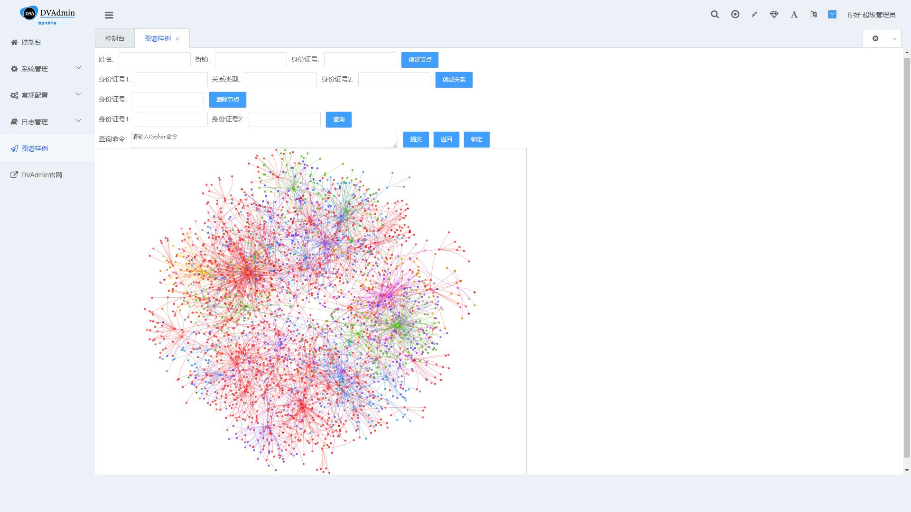
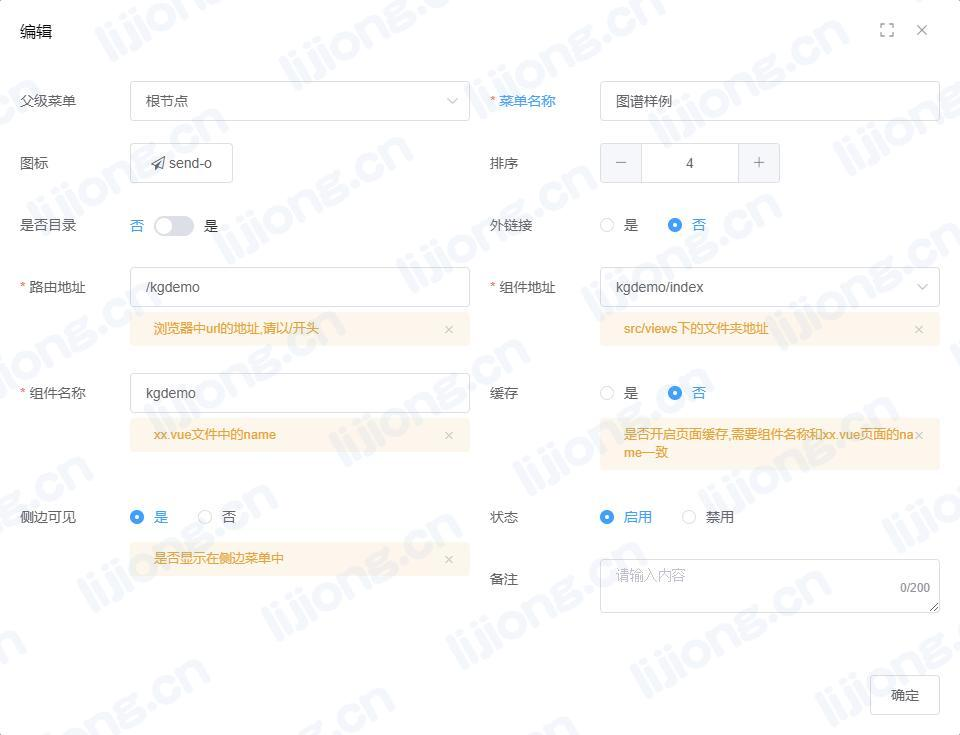

## **知识图谱系统嵌入DVAdmin**



### 被嵌入端设置

> vi settings.py

```python
MIDDLEWARE = [
    'django.middleware.security.SecurityMiddleware',
    'django.contrib.sessions.middleware.SessionMiddleware',
    'django.middleware.common.CommonMiddleware',
    #'django.middleware.csrf.CsrfViewMiddleware',
    'django.contrib.auth.middleware.AuthenticationMiddleware',
    'django.contrib.messages.middleware.MessageMiddleware',
    #'django.middleware.clickjacking.XFrameOptionsMiddleware',
]
```

### 创建页面

> cd /opt/app/django-vue-admin/web/src/views

> mkdir kgdemo
>
> cd kgdemo

> vi index.vue

```vue
<template>
   <div>
    <iframe src="http://10.0.43.108:8000/kgdemo/index/" scrolling="auto" frameborder="0" style="width: 100%;height: 900px;"></iframe>
   </div>
</div>
</template>
<script>
 export default {
    name: 'kgdemo',
 }
```

### 新增菜单设置


