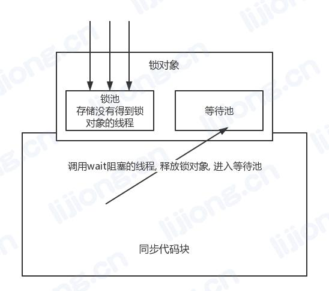

## **Java的多线程**

### 1. 多线程

- 进程（Process）：一个程序的运行，程序在内存中分配的那片空间

  线程（Thread）：进程中的一个执行单元，执行路径

- 进程：至少有一个线程

  多线程的程序：进程中有多个线程

- 并行：某一个时间点，有多个程序同时执行, 多核CPU

  并发：某一个时间段，有多个程序同时执行，并不是真正意义的同事执行 ----- 多线程

- 多线程的优点：提高了用户体验，提高了CPU利用率

- 主线程：用于执行main方法的线程

- 线程生命周期图


### 2. 实现多线程的方式

#### 2.1 继承Thread

- 步骤

  1. 继承Thread
  2. 重写run方法
  3. 创建子类的对象
  4. 调用start方法

- 只有调用start方法才会开启新的线程，开启新的线程后，会自动的调用run方法

- start方法和run方法

  start：开启新的线程，并自动调用run方法在新的线程中执行

  run：不会开启新的线程，只是普通方法的调用，主线程的线程任务，定义在main方法中，自定义线程的线程任务，定义在run方法中

```java
public class ThreadDemo {
	public static void main(String[] args) {
		
		Demo d1 = new Demo();
		Demo d2 = new Demo();
		
		d1.start();
		d2.start();
		
//		d1.run();// 没有开启新线程
//		d2.start();// 开启新的线程，不交替
		
//		d1.start();// 主线程执行到这里开启新线程
//		d2.run();// 主线程继续运行run，交替
		
		System.out.println(Thread.currentThread().getName());// 主线程的名字：main
		
		System.out.println(d1.getName());// 获取线程的名字，Thread-0
		System.out.println(d2.getName());// Thread-1
		d2.setName("new name");// 修改线程的名字
		System.out.println(d2.getName());//new name
	}
}

class Demo extends Thread{
	public void run() {
		for(int i = 0; i < 25; i++) {
			System.out.println(Thread.currentThread().getName() + " --- " + i);
		}
	}
}
```


#### 2.2 实现Runnable

- 步骤:
  1. 实现Runnable
  2. 重写run方法
  3. 创建Runnable子类的对象
  4. 创建Thread类的对象，把第3步的对象传到构造方法中
  5. 使用Thread类的对象，调用start方法

- 特点: 
  1. 解决了单继承的局限性
  2. 把线程对象和线程任务分离开，更加符合面向对象的特点，高内聚低耦合

```java
public class ThreadDemo {
	public static void main(String[] args) {
		Demo d = new Demo();// 是线程任务的对象，不是线程的对象，只有Thread或其子类是线程的对象
		Thread th1 = new Thread(d);// 线程的对象
		Thread th2 = new Thread(d);
		th1.start();
		th2.start();
	}
}

class Demo implements Runnable{

	@Override
	public void run() {
		for(int i = 0; i < 25; i++) {
			System.out.println(Thread.currentThread().getName() + " --- " + i);
		}
	}
	
}
```


#### 2.3 实现Callable

- 步骤:
  1. 实现Callable
  2. 重写call方法
  3. 创建Callable子类的对象
  4. 创建FutureTask类的对象，把第3步的对象传到构造方法中
  5. 创建Thread类的对象，把第4步的对象传到构造方法中
  6. 使用Thread类的对象，调用start方法

```java
import java.util.concurrent.Callable;
import java.util.concurrent.FutureTask;

public class ThreadDemo {
	public static void main(String[] args) throws Exception {
		Demo d = new Demo();
		FutureTask<String> ft = new FutureTask<String>(d);
		new Thread(ft).start();
		System.out.println(ft.get());
	} 
}

class Demo implements Callable<String>{

	@Override
	public String call() throws Exception {
		
		return "返回值";
	}
}
```


### 3. 多线程常用方法

- 阻塞线程
- 中断线程

- sleep

```java
public class SleepDemo {
	public static void main(String[] args) {

//		try {
//			Thread.sleep(3000);// 让主线程阻塞
//		} catch (InterruptedException e) {
//			e.printStackTrace();
//		}

		Demo d1 = new Demo();
		Demo d2 = new Demo();
		d1.start();
		d2.start();

//		try {
//			d2.sleep(3000);// 还是让主线程阻塞，sleep是静态方法，让谁阻塞取决于在哪个线程任务中
//		} catch (InterruptedException e) {
//			e.printStackTrace();
//		}

		System.out.println("over");
	}
}

class Demo extends Thread {
	public void run() {
		try {
			Thread.sleep(3000);// 在哪个线程任务中就让哪个线程阻塞
		} catch (InterruptedException e) {
			e.printStackTrace();
		}
		for (int i = 0; i < 25; i++) {
			System.out.println(Thread.currentThread().getName() + " --- " + i);
		}
	}
}
```


- join

```java
public class JoinDemo {
	public static void main(String[] args) {
		Demo d = new Demo();
		d.start();
		try {
			d.join();// 谁调用，就让哪个线程先执行，执行完毕后再执行所在的线程，阻塞了所在的线程
		} catch (InterruptedException e) {
			e.printStackTrace();
		}
		System.out.println("over");
	}
}

class Demo extends Thread {
	public void run() {
		for(int i = 0; i < 25; i++) {
			System.out.println(i);
		}
	}
}
```


- interrupt

```java
public class InterruptDemo {
	public static void main(String[] args) {
		Demo d = new Demo();
		d.start();
		d.interrupt();//打断线程的阻塞状态，进入可执行状态，会抛出异常
		System.out.println("over");
	}
}

class Demo extends Thread {
	public void run() {
		try {
			Thread.sleep(3000);
		} catch (InterruptedException e) {
			e.printStackTrace();
		}
		for(int i = 0; i < 25; i++) {
			System.out.println(i);
		}
	}
}
```


- 打断阻塞的主线程

```java
public class InterruptDemo {
	public static void main(String[] args) {
		Demo d = new Demo(Thread.currentThread());// 把主线程传给Demo
		d.start();
		
		try {
			Thread.sleep(3000);
		} catch (InterruptedException e) {
			e.printStackTrace();
		}
		
//		Thread.currentThread().interrupt();// 不能打断主线程
		
		System.out.println("over");
	}
}

class Demo extends Thread {
	Thread th;
	public Demo(Thread th) {
		this.th = th;
	}
	
	public void run() {
		th.interrupt();
	}
}
```

### 4. 线程安全问题

#### 4.1 线程安全概述

- 产生原因
  1. 具备多线程的环境
  2. 多个线程操作共享数据

- 解决方案
  1. 同步代码块
  2. 同步方法
  3. Lock

#### 4.2 同步代码块

- 4.2.1 同步代码块格式

```java
synchronized(锁对象){
    容易产生线程安全问题的代码
}
//锁对象：可以是任意对象，要求多个线程使用的是同一个对象
```

- 4.2.2 代码实现

```java
public class SellTicketsDemo {
	public static void main(String[] args) {
		Tickets t = new Tickets();
		Thread th1 = new Thread(t);
		Thread th2 = new Thread(t);
		Thread th3 = new Thread(t);
		
		th1.start();
		th2.start();
		th3.start();
	}
}

class Tickets implements Runnable {
	
	static int tickets = 100;
	Object o = new Object();
	@Override
	public void run() {
		while(true) {
			synchronized (o) {// o所在的Tickets类被new了一次
				if(tickets > 0) {
					try {
						Thread.sleep(30);
					} catch (InterruptedException e) {
						e.printStackTrace();
					}
					System.out.println(Thread.currentThread().getName() + 
                    	" --- 正在出售第" + tickets-- + "张票");
				}else {
					break;
				}
			}
		}
	}
}
```

- 4.2.3 锁对象的选取

问题代码

```java
public class SellTicketsDemo {
	public static void main(String[] args) {
		Tickets t1 = new Tickets();
		Tickets t2 = new Tickets();
		Tickets t3 = new Tickets();
		
		t1.start();
		t2.start();
		t3.start();
	}
}

class Tickets extends Thread {
	static int tickets = 100;
	Object o = new Object();
	
	@Override
	public void run() {
		while(true) {
			synchronized (o) {// o所在的Tickets类被new了多次
				if(tickets > 0) {
					try {
						Thread.sleep(30);
					} catch (InterruptedException e) {
						e.printStackTrace();
					}
					System.out.println(Thread.currentThread().getName() + 
                    	" --- 正在出售第" + tickets-- + "张票");
				}else {
					break;
				}
			}
		}
	}
}
```

解决方案

1. 通过构造方法传入同一个o
2. 使用静态的对象
3. 使用字符串常量
4. 使用Class对象（在JVM中，每一个类的Class对象只有一个）

```java
public class SellTicketsDemo {
	public static void main(String[] args) {
		Object o = new Object();
		Tickets t1 = new Tickets(o);
		Tickets t2 = new Tickets(o);
		Tickets t3 = new Tickets(o);
		
		t1.start();
		t2.start();
		t3.start();
	}
}

class Tickets extends Thread {
	static int tickets = 100;
	Object o;
	public Tickets(Object o) {
		this.o = o;
	}
	
	@Override
	public void run() {
		while(true) {
			synchronized (o) {
				if(tickets > 0) {
					try {
						Thread.sleep(30);
					} catch (InterruptedException e) {
						e.printStackTrace();
					}
					System.out.println(Thread.currentThread().getName() + 
                    	" --- 正在出售第" + tickets-- + "张票");
				}else {
					break;
				}
			}
		}
	}
}
```

```java
public class SellTicketsDemo {
	public static void main(String[] args) {
		Tickets t1 = new Tickets();
		Tickets t2 = new Tickets();
		Tickets t3 = new Tickets();
		
		t1.start();
		t2.start();
		t3.start();
	}
}

class Tickets extends Thread {
	static int tickets = 100;

	@Override
	public void run() {
		while(true) {
			synchronized (SellTicketsDemo.class) {
				if(tickets > 0) {
					try {
						Thread.sleep(30);
					} catch (InterruptedException e) {
						e.printStackTrace();
					}
					System.out.println(Thread.currentThread().getName() + 
                    	" --- 正在出售第" + tickets-- + "张票");
				}else {
					break;
				}
			}
		}
	}
}
```

#### 4.3 同步方法

- 4.3.1 同步方法格式

  - 把synchronized放到方法的修饰符中，锁的是整个方法

  - 默认的锁对象

    成员方法: this（继承Thread创建多个子类对象的方式无法同步）

    静态方法，类名.class

- 4.3.2 代码实现

```java
//解决了线程安全问题，但变成了单线程程序，原因是锁的范围太大了
public class SellTicketsDemo {
	public static void main(String[] args) {
		Tickets t = new Tickets();
		new Thread(t).start();
		new Thread(t).start();
		new Thread(t).start();
	}
}

class Tickets implements Runnable {
	static int tickets = 100;

	@Override
	public synchronized void run() {//默认的锁对象：this
		while(true) {
			if(tickets > 0) {
				try {
					Thread.sleep(30);
				} catch (InterruptedException e) {
					e.printStackTrace();
				}
				System.out.println(Thread.currentThread().getName() + 
                	" --- 正在出售第" + tickets-- + "张票");
			}else {
				break;
			}
		}
	}
}
```

- 4.3.3 单例模式线程问题

```java
//线程安全的懒汉式
public class Singleton {
	private static Singleton s;
	
	private Singleton() {
		
	}
	
	public synchronized static Singleton getInstance() {
		if(s == null) {
			s = new Singleton();
		}
		return s;
	}
}
```

#### 4.4 Lock

- jdk5产生的新特性，ReentrantLock

```java
import java.util.concurrent.locks.Lock;
import java.util.concurrent.locks.ReentrantLock;

public class SellTicketsDemo {
	public static void main(String[] args) {
		Tickets t = new Tickets();
		new Thread(t).start();
		new Thread(t).start();
		new Thread(t).start();
	}
}

class Tickets implements Runnable {
	static int tickets = 100;
	
	Lock lock = new ReentrantLock();// 也要保证该锁对象对于多个线程是同一个

	@Override
	public void run() {
		while(true) {
			lock.lock();
			try {
				if(tickets > 0) {
					try {
						Thread.sleep(30);
					} catch (InterruptedException e) {
						e.printStackTrace();
					}
					System.out.println(Thread.currentThread().getName() + 
				    	" --- 正在出售第" + tickets-- + "张票");
				}else {
					break;
				}
			} finally {
				lock.unlock();// 放在finally代码块中，确保一定会执行到，否则可能会造成程序阻塞
			}
		}
	}
}
```

### 5. 死锁

- 两个或两个以上的线程在执行的过程中，因争夺资源产生的一种互相等待现象

```java
public class DeadLock {
	public static void main(String[] args) {
		new Demo(true).start();
		new Demo(false).start();
	}
}

class Lock{
	public static Object lockA = new Object();
	public static Object lockB = new Object();
}

class Demo extends Thread{
	private boolean flag;
	
	public Demo(boolean flag) {
		this.flag = flag;
	}

	@Override
	public void run() {
		while(true) {
			if(flag) {
				synchronized (Lock.lockA) {
					System.out.println("lockA");
					synchronized (Lock.lockB) {
						System.out.println("lockB");
					}
				}
			}else {
				synchronized (Lock.lockB) {
					System.out.println("lockB");
					synchronized (Lock.lockA) {
						System.out.println("lockA");
					}
				}
			}
		}
	}
}
```

### 6. 线程池

#### 6.1 线程池概述

1. 减少了创建和销毁线程的次数，每个工作线程都可以被重复利用，可执行多个任务
2. 可以根据系统的承受能力，调整线程池中工作线程的数目，防止消耗过多的内存

#### 6.2 Executors

- newCachedThreadPool

创建一个具有缓存功能的线程池，可根据需要创建新线程，若有可用线程则直接使用，若没有则创建一个新线程添加到池中，60s未被使用的线程将被终止并从缓存中移除，最多存在线程数未int得最大值

```java
public static ExecutorService newCachedThreadPool()
```

- newFixedThreadPool

创建一个可重用的，具有固定线程数的线程数

```java
public static ExecutorService newFixedThreadPool(int nThreads)
```

- newSingleThreadExecutor

创建一个只有单线程的线程池

```java
public static ExecutorService newSingleThreadExecutor()
```

#### 6.3 代码实现

```java
import java.util.concurrent.ExecutorService;
import java.util.concurrent.Executors;

public class ThreadPoolDemo {
	public static void main(String[] args) {
		//newCachedThreadPool()
		ExecutorService pool = Executors.newCachedThreadPool();
		pool.execute(new Runnable() {
			@Override
			public void run() {
				System.out.println("newCachedThreadPool()");
			}
		});

		//newFixedThreadPool()
		pool = Executors.newFixedThreadPool(10);
		pool.execute(new Runnable() {
			@Override
			public void run() {
				System.out.println("newFixedThreadPool()");
			}
		});
		
		//newSingleThreadExecutor()
		pool = Executors.newSingleThreadExecutor();
		pool.execute(new Runnable() {
			@Override
			public void run() {
				System.out.println("newSingleThreadExecutor()");
			}
		});
	}
}
```

### 7. 线程等待和唤醒

#### 7.1 等待和唤醒概述

- 获得锁和释放锁

  获得锁：一个线程进入同步代码块，并开始执行里面的代码

  释放锁：执行完毕后，退出代码块，允许其他线程进入同步代码块

- wait、notify、notifyAll这三个方法都是Object中的方法，并且否必须在同步方法或同步代码块中使用（锁对象）

  wait：让线程进入等待状态，进入等待状态的线程会释放锁对象，直到使用相同的锁对象调用notify，notifyAll才会结束阻塞状态

  notify：唤醒, 会从等待池中唤醒一个处于等待状态的线程，使其进入可执行状态

  notifyAll：唤醒全部，会将等待池中所有处于等待状态的线程唤醒，使其进入可执行状态

- notify或notifyAll以后，被唤醒的线程并不是立刻执行，需要等到notify，notifyAll所在的同步代码块执行完毕后才会执行，因为只有同步代码块执行完毕后，才会释放锁对象，其他线程才可以进入

- wait方法会释放锁对象，也就是一个线程使用wait进入等待状态后，允许其他线程进入同步代码块

  sleep方法不会释放锁对象，到时间自己醒

- wait、notify、notifyAll三个方法位于Object中，因为锁对象可以是任意对象



#### 7.2 代码实现

```java
public class WaitNotifyDemo {
	public static void main(String[] args) {
		Object o = new Object();
		new Thread(new Demo(o)).start();
		new Thread(new Demo(o)).start();
		new Thread(new Demo(o)).start();
		new Thread(new Demo2(o)).start();
	}
}

class Demo implements Runnable {
	Object o;
	public Demo(Object o) {
		this.o = o;
	}
	
	@Override
	public void run() {
		synchronized (o) {
			System.out.println(Thread.currentThread().getName() + " WAIT --- START");
			try {
				o.wait();
			} catch (InterruptedException e) {
				e.printStackTrace();
			}
			System.out.println(Thread.currentThread().getName() + " WAIT --- END");
		}
	}
}

class Demo2 implements Runnable{
	Object o;
	public Demo2(Object o) {
		this.o = o;
	}
	
	@Override
	public void run() {
		synchronized (o) {
			System.out.println(Thread.currentThread().getName() + " NOTIFY --- START");
			o.notifyAll();
			System.out.println(Thread.currentThread().getName() + " NOTIFY --- END");
		}
	}
}
```

### 8. 定时器

```java
import java.text.ParseException;
import java.text.SimpleDateFormat;
import java.util.Date;
import java.util.Timer;
import java.util.TimerTask;

public class TimerDemo {
	public static void main(String[] args) throws ParseException {
		//1. 创建Timer对象
		Timer timer = new Timer();
		TimerTask task = new TimerTask() {
			@Override
			public void run() {// 定时器的任务
				System.out.println("倒计时结束");
			}
		};
		timer.schedule(task, 5000);
//		timer.schedule(task, 5000);// 同一个定时任务只能被运行一次（Task already scheduled or cancelled）
		
//		timer.schedule(new TimerTask() {
//			@Override
//			public void run() {
//				System.out.println("倒计时结束");
//				timer.cancel();// 一般放到定时任务中，执行完任务取消
//			}
//		}, 5000);
//		timer.cancel();// 这里的cancel由主线程运行，timer调度任务是使用多线程实现的，cancel放在这里会直接结束
		
		Date d = new SimpleDateFormat("yyyy-MM-dd HH:mm:ss").parse("2019-07-21 08:12:00");
		timer.schedule(new TimerTask() {
			@Override
			public void run() {
				System.out.println("时间到");
			}
		}, d);
	}
}
```

```java
import java.text.SimpleDateFormat;
import java.util.Date;
import java.util.Timer;
import java.util.TimerTask;

public class TimerDemo {
	public static void main(String[] args) {
		new Timer().schedule(new TimerTask() {
			@Override
			public void run() {
				System.out.println(new SimpleDateFormat("yyyy-MM-dd HH:mm:ss").format(new Date()));
			}
		}, 3000, 1000);// 延时三秒，间隔一秒
	}
}
```