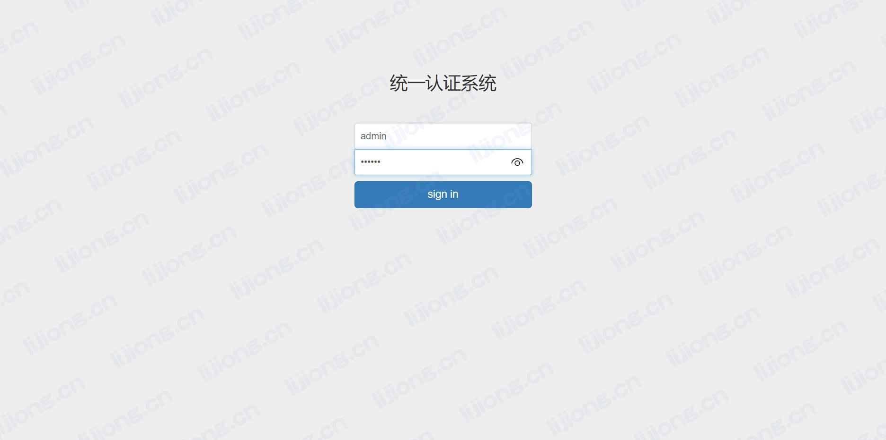
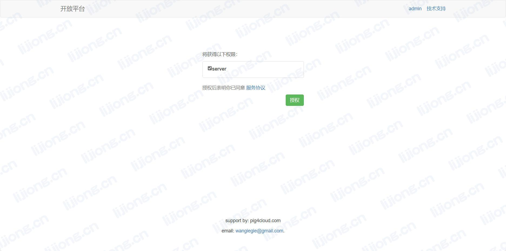
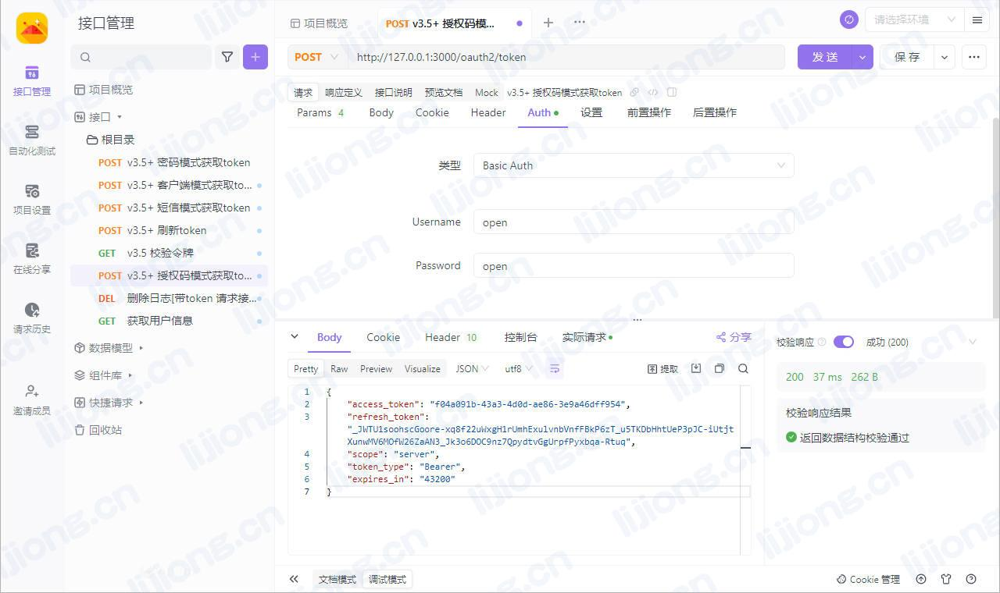
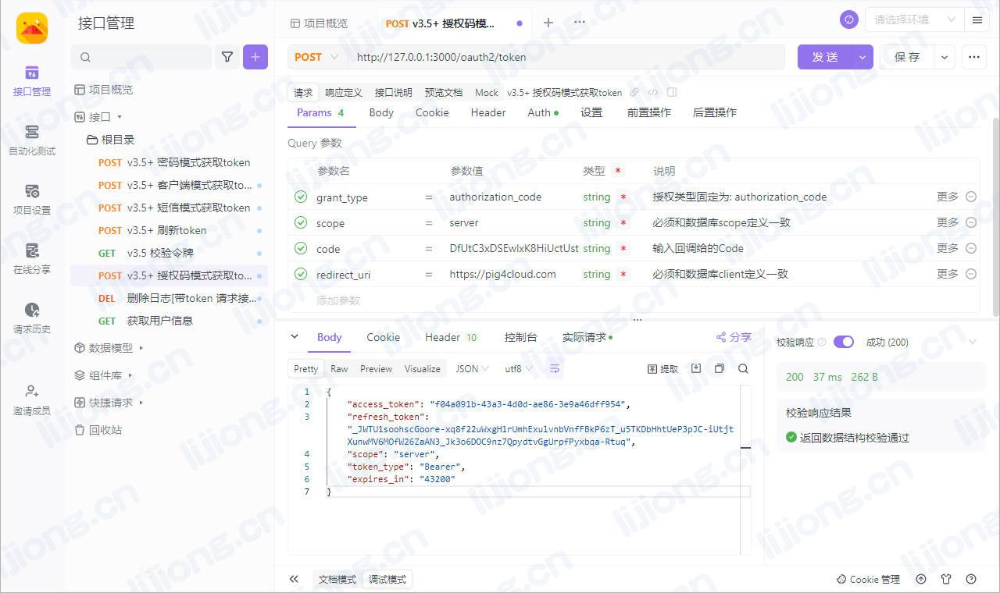

## **PIG开放平台功能使用**

### 注册支持授权码的客户端

```sql
INSERT INTO `pig`.`sys_oauth_client_details`(`id`,`client_id`, `resource_ids`, `client_secret`, `scope`, `authorized_grant_types`, `web_server_redirect_uri`, `authorities`, `access_token_validity`, `refresh_token_validity`, `additional_information`, `autoapprove`, `create_time`, `update_time`, `create_by`, `update_by`) VALUES (10000,'open', NULL, 'open', 'server', 'password,app,refresh_token,authorization_code,client_credentials', 'https://pig4cloud.com', NULL, NULL, NULL, NULL, 'false', NULL, NULL, 'admin', 'admin');
```

### 统一认证登录

- http://localhost:3000/oauth2/authorize?scope=server&client_id=open&response_type=code&redirect_uri=https://pig4cloud.com
- admin/123456





### 获取授权码


### 通过授权码获取令牌



