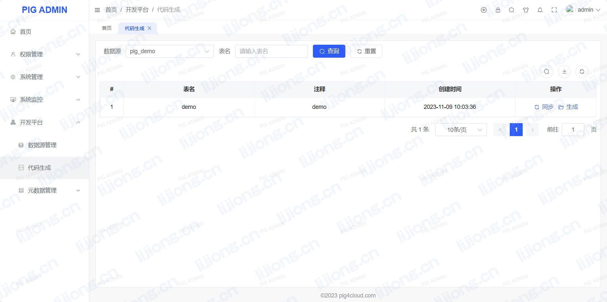
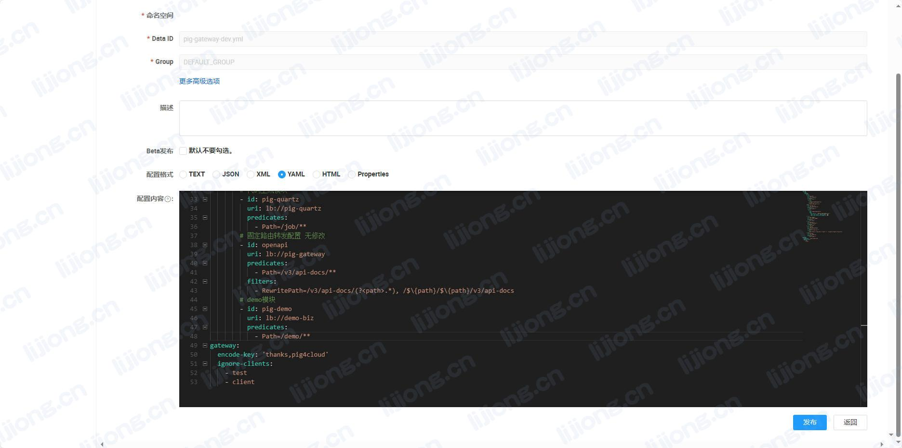

## **PIG微服务二次开发**

### 创建微服务

> https://pig4cloud.com/data/other/archetype.html


### 创建测试库表

```sql
-- 创建测试库
create database `pig_demo` default character set utf8mb4 collate utf8mb4_general_ci;

USE pig_demo;

SET NAMES utf8mb4;
SET FOREIGN_KEY_CHECKS = 0;

-- 创建测试表
DROP TABLE IF EXISTS `demo`;

CREATE TABLE `demo` (
  `id` bigint NOT NULL COMMENT '主键',
  `username` varchar(255) DEFAULT NULL COMMENT '用户名',
  `nickname` varchar(255) DEFAULT NULL COMMENT '昵称',
  `create_time` datetime DEFAULT NULL COMMENT '创建时间',
  `create_by` varchar(64) DEFAULT NULL COMMENT '创建人',
  `update_time` datetime DEFAULT NULL COMMENT '修改时间',
  `update_by` varchar(64) DEFAULT NULL COMMENT '更新人',
  PRIMARY KEY (`id`)
) ENGINE=InnoDB DEFAULT CHARSET=utf8mb4 ROW_FORMAT=DYNAMIC COMMENT='demo';
```

### 新增数据源


### 代码生成




### 导入页面规则

- 在pig库下执行生成的menu/menu_sql


### 修改数据库信息

- demo\demo-biz\src\main\resources\application.yml

### 启动Demo项目

- demo\demo-biz\src\main\java\com\pig4cloud\pig\demo\DemoApplication.java

### 配置网关路由

- pig-gateway-dev.yml

```
spring:
  cloud:
    gateway:
      routes:
        # demo模块
        - id: pig-demo
          uri: lb://demo-biz
          predicates:
            - Path=/demo/**
```



### 添加权限


