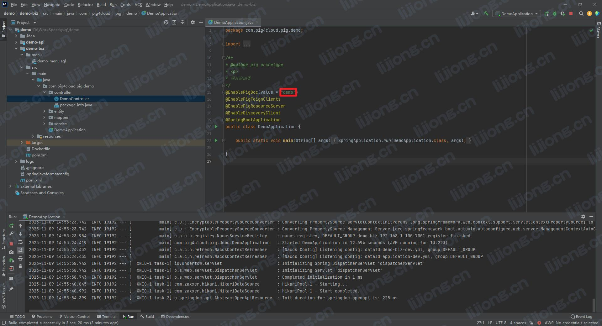

## **PIG新增微服务接入Swagger**

- http://pig-gateway:9999/swagger-ui.html


### 添加依赖

- 代码生成已引入

```xml
		<!--接口文档-->
        <dependency>
            <groupId>com.pig4cloud</groupId>
            <artifactId>pig-common-swagger</artifactId>
        </dependency>
```

### 配置EnablePigDoc 注解

- 和pig-gateway-dev.yml中路由前缀配置对应




### 重启网关和新增服务


### 注意事项

- Controller接口上必须增加@SecurityRequirement(name = HttpHeaders.AUTHORIZATION)声明调试自动添加token。

### 接入并调试接口

- username：admin
- password：YehdBPev
- client_id：test
- client_secret：test

