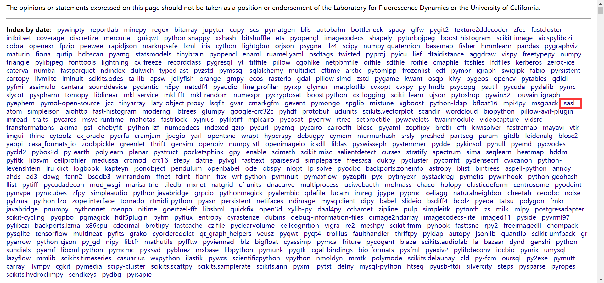
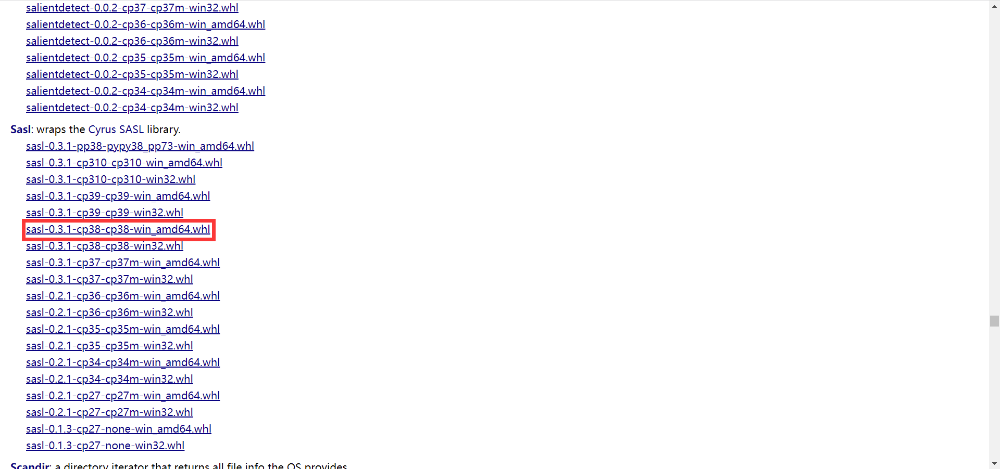
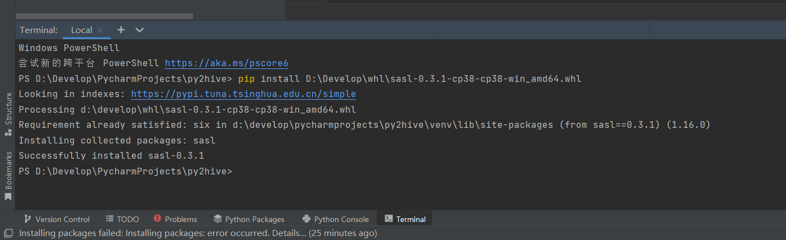

## **Python安装package时的Microsoft Visual C++ 14.0 is required问题处理**

### 问题记录

- PyCharm安装sasl时报错

  > error: Microsoft Visual C++ 14.0 or greater is required. Get it with "Microsoft C++ Build Tools": https://visualstudio.microsoft.com/visual-cpp-build-tools/

### 解决过程

- 下载whl包，访问https://www.lfd.uci.edu/~gohlke/pythonlibs/

- 下载对应版本

  sasl‑0.3.1‑cp38‑cp38‑win_amd64.whl，cp38对应python3.8，amd64为位数

- 安装whl包

  pycharm中view->Tool Windows->Terminal

  > pip install D:\Develop\whl\sasl-0.3.1-cp38-cp38-win_amd64.whl

