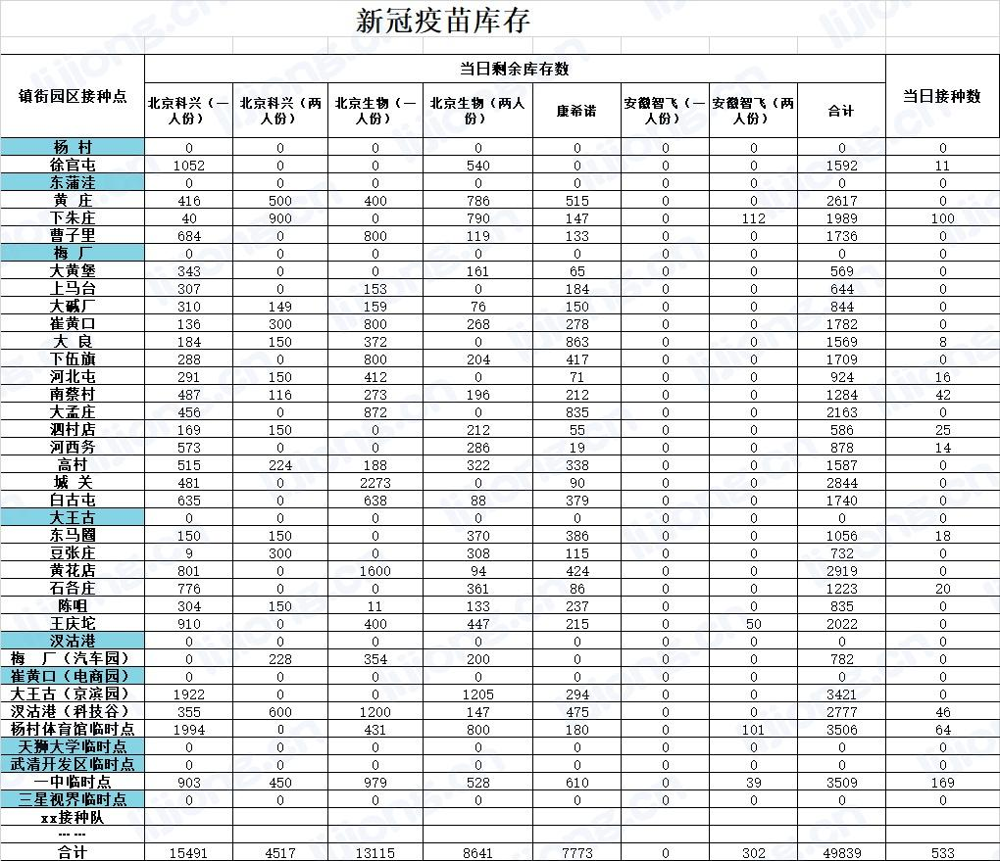

## **pandas导入Excel到数据库**

- 待入库数据



```python
import pandas
from sqlalchemy import create_engine
import pymysql
import datetime
from urllib.parse import quote_plus
import openpyxl

now_time = datetime.datetime.now().strftime('%Y%m%d')
conn_str = 'mysql+pymysql://root:%s@********:3306/ym_log_new?charset=utf8' % quote_plus('********')
conn = create_engine(conn_str, echo=True)


# 数据量查询
def select_count():
    sql = f"""
        select count(1) cnt from kucun{now_time};
        """
    sql_res = conn.execute(sql)
    for row in sql_res:
        cur = dict()
        for k, v in row._mapping.items():
            cur[k] = v
    return cur.get('cnt')


# 数据导入
def data_load(log_file):
    try:
        # 日志处理
        df = pandas.read_excel(log_file, skiprows=2)
        print(df, '\n')
        # 镇街园区接种点
        col1 = [df.columns.tolist()[0]]
        print(col1)
        # 接种信息
        col2 = [col for col in df.iloc[0, :].tolist() if
                col in ('北京科兴（一人份）', '北京科兴（两人份）', '北京生物（一人份）', '北京生物（两人份）', '康希诺', '安徽智飞（一人份）', '安徽智飞（两人份）', '合计')]
        print(col2)
        # 当日接种数
        col3 = [df.columns.tolist()[9]]
        print(col3)
        col_list = col1 + col2 + col3
        df.columns = col_list
        print(df)
        # 删除第一行数据
        df = df.drop(0)

        result = pandas.DataFrame(columns=df.columns)
        for line in range(len(df)):
            result.loc[line] = df.iloc[line]

        result.rename(columns={'康希诺': '康希诺腺病毒'}, inplace=True)
        result.rename(columns={'镇街园区接种点': '接种点'}, inplace=True)

        pandas.io.sql.to_sql(result, f"kucun{now_time}", conn, if_exists="replace", index=False, schema="ym_log_new")

        # 数据量查询
        cnt = select_count()
        if cnt > 0:
            return '【成功】库存数据导入kucun' + now_time + '成功，导入数据量为：' + str(cnt)
        else:
            return '【失败】库存数据导入kucun' + now_time + '失败'
    except Exception as e:
        print(e)
        return '【失败】库存数据导入kucun' + now_time + '失败'


data_load('C:\\Users\\lijiong\\Downloads\\接种日志\\库存\\库存及接种数.xlsx')

```

