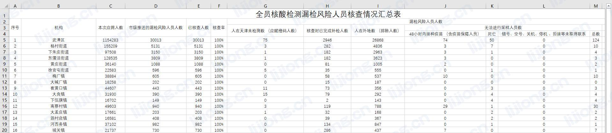

## **pandas导入HTML表格到数据库**

- 待入库数据
  

```python
import os
import pandas
from sqlalchemy import create_engine
import datetime
from urllib.parse import quote_plus
import openpyxl

now_time = datetime.datetime.now().strftime('%Y%m%d')
conn_str = 'mysql+pymysql://root:%s@********:3306/ds_analysis?charset=utf8' % quote_plus('********')
conn = create_engine(conn_str, echo=True)


def file_recognize():
    loujian_path = 'c:\\python_file'
    loujian_dir = os.listdir(loujian_path)
    for file in loujian_dir:
        loujian_file = os.path.join(loujian_path, file)
        return loujian_file


def data_load(log_file):
    # 日志处理
    df = pandas.read_html(log_file, skiprows=4)[0]
    # 删除值为NaN的列（xis：0-行、1-列）
    df = df.drop(labels=[13, 14], axis=1)
    # 设置表头
    col_list = ['序号', '机构', '本次应筛人数', '市级推送的漏检风险人员人数', '已核查人数', '核查率', '人在天津未检测数', '核查时已完成补检人数', '人在外地数', '48小时内街镇疫苗', '死亡', '未取得联系', '总数']
    df.columns = col_list
    print(df)
    result = pandas.DataFrame(columns=df.columns)
    for line in range(len(df)):
        result.loc[line] = df.iloc[line]
    # 导入数据库
    pandas.io.sql.to_sql(result, f"loujian{now_time}", conn, if_exists="replace", index=False, schema="ds_analysis")


# data_load('C:\\Users\\综合运营中心\\Downloads\\********.xls')
```

