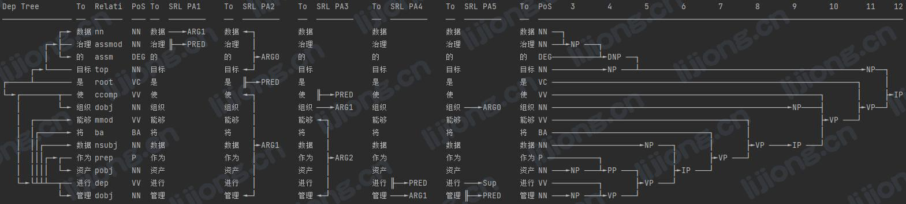

## **基于HanLP的中文分词**

- https://github.com/hankcs/HanLP

### 中文分词

```python
import hanlp

# 粗粒度分词
tok = hanlp.load(hanlp.pretrained.tok.COARSE_ELECTRA_SMALL_ZH)
print(tok(['数据不仅具有生命周期，还具有数据血缘，即数据从产生到使用的路径。了解数据血缘需要记录数据的来源，以及数据在访问和使用它们的系统中的移动和转换。']))

# 合并模式
tok.dict_combine = {'生命周期', '数据血缘'}
print(tok(['数据不仅具有生命周期，还具有数据血缘，即数据从产生到使用的路径。了解数据血缘需要记录数据的来源，以及数据在访问和使用它们的系统中的移动和转换。']))

# 细粒度分词
tok_fine = hanlp.load(hanlp.pretrained.tok.FINE_ELECTRA_SMALL_ZH)
print(tok_fine(['数据不仅具有生命周期，还具有数据血缘，即数据从产生到使用的路径。了解数据血缘需要记录数据的来源，以及数据在访问和使用它们的系统中的移动和转换。']))

# 并行分词（按句并行分词）
HanLP = hanlp.pipeline()\
    .append(hanlp.utils.rules.split_sentence)\
    .append(tok)\
    .append(lambda sents: sum(sents, []))
print(HanLP('数据不仅具有生命周期，还具有数据血缘，即数据从产生到使用的路径。了解数据血缘需要记录数据的来源，以及数据在访问和使用它们的系统中的移动和转换。'))

```
### 关键词提取

```python
from hanlp_restful import HanLPClient

HanLP = HanLPClient('https://www.hanlp.com/api', auth=None, language='zh')
keywords = HanLP.keyphrase_extraction('数据不仅具有生命周期，还具有数据血缘，即数据从产生到使用的路径。了解数据血缘需要记录数据的来源，以及数据在访问和使用它们的系统中的移动和转换。')
print(keywords)
```

### 多任务模型

```python
import hanlp

HanLP = hanlp.load(hanlp.pretrained.mtl.CLOSE_TOK_POS_NER_SRL_DEP_SDP_CON_ELECTRA_SMALL_ZH)

HanLP(['数据治理的目标是使组织能够将数据作为资产进行管理']).pretty_print()

print(HanLP(['数据治理的目标是使组织能够将数据作为资产进行管理']))

print(HanLP(['数据治理的目标是使组织能够将数据作为资产进行管理'], tasks='tok'))
```



### 其他工具

```python
import jieba
import jieba.analyse
import jieba.posseg as pseg

# 精确模式（默认）
seg_list = jieba.cut('数据不仅具有生命周期，还具有数据血缘，即数据从产生到使用的路径。了解数据血缘需要记录数据的来源，以及数据在访问和使用它们的系统中的移动和转换。')
print(", ".join(seg_list))
seg_list = jieba.lcut('数据不仅具有生命周期，还具有数据血缘，即数据从产生到使用的路径。了解数据血缘需要记录数据的来源，以及数据在访问和使用它们的系统中的移动和转换。')
print(seg_list)
# 全模式
seg_list = jieba.cut('数据不仅具有生命周期，还具有数据血缘，即数据从产生到使用的路径。了解数据血缘需要记录数据的来源，以及数据在访问和使用它们的系统中的移动和转换。', cut_all=True)
print(", ".join(seg_list))
# 搜索引擎模式
seg_list = jieba.cut_for_search('数据不仅具有生命周期，还具有数据血缘，即数据从产生到使用的路径。了解数据血缘需要记录数据的来源，以及数据在访问和使用它们的系统中的移动和转换。')
print(", ".join(seg_list))


# 调节词频，使其能/不能被分出，需关闭HMM新词发现
jieba.suggest_freq(('测', '试'), True)
print(', '.join(jieba.cut('[测试]应被分出', HMM=False)))

jieba.suggest_freq('测试', True)
print(', '.join(jieba.cut('[测试]不应被分出', HMM=False)))


# 加载词典（词 词频 词性）
# 数据架构 7 n
# 业务战略 5 n
# 技术执行 10 n
jieba.load_userdict('dict.txt')
print(', '.join(jieba.cut('数据架构的目标是成为业务战略和技术执行之间的桥梁')))
# print(jieba.analyse.extract_tags('数据架构的目标是成为业务战略和技术执行之间的桥梁', topK=20, withWeight=True, allowPOS=()))

# 调整词典
jieba.add_word('数据治理', freq=None, tag=None)
print(', '.join(jieba.cut('数据治理的目标是使组织能够将数据作为资产进行管理')))
jieba.del_word('数据治理')
print(', '.join(jieba.cut('数据治理的目标是使组织能够将数据作为资产进行管理')))


# 词性标注
words = pseg.cut("数据治理的目标是使组织能够将数据作为资产进行管理")
for word, flag in words:
    print(word, flag)


# 关键词提取 topK：返回关键词数量 withWeight：是否返回权重 allowPOS：返回指定词性，默认返回全部
print(jieba.analyse.extract_tags('数据不仅具有生命周期，还具有数据血缘，即数据从产生到使用的路径。了解数据血缘需要记录数据的来源，以及数据在访问和使用它们的系统中的移动和转换。', topK=20, withWeight=False, allowPOS=()))
```


