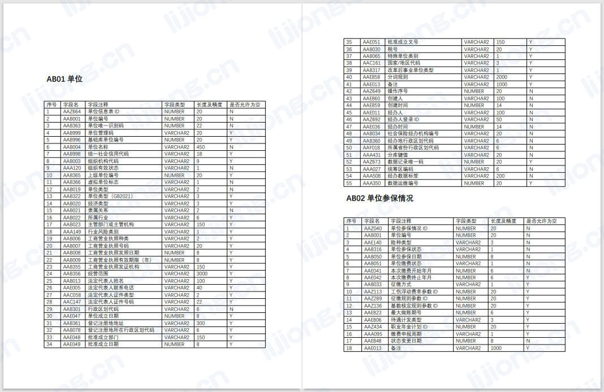

## **基于pdfplumber的PDF文件解析**

### 表格解析

```python
import pdfplumber
import re

pdf = pdfplumber.open('D:/Workspace/test.pdf')
res = []
table = []
for page in pdf.pages:
    # print(page)
    # print(page.extract_text())   # 将页面的所有字符整理成字符串
    # print(page.extract_words())   # 返回字符串及其边框信息
    # print(page.extract_tables())   # 返回从表格中提取的文本
    for t in page.extract_tables():
        for row in t:
            # print(row)
            # 该行第一列为数字，则添加到表格中
            if re.match(r'\d+', row[0]):
                table.append(row)
            # 该行第一列非数字，则已完成一个表格，将该表格添加到结果集
            if re.match(r'\D+', row[0]):
                if len(table) > 0:
                    res.append(table)
                print(table)
                table = []
# 将最后一个表格添加到结果集
res.append(table)
pdf.close()
```



### 文本解析

```python
import pdfplumber
import pandas
import pymysql
from sqlalchemy import create_engine
import datetime
from urllib.parse import quote_plus
import hanlp
import os
import sys

conn_str = 'mysql+pymysql://root:%s@********:3306/seg?charset=utf8' % quote_plus('********')
conn = create_engine(conn_str, echo=True)


def get_time():
    return datetime.datetime.now().strftime('%Y%m%d%H%M%S')


def res_save(table_name, file_path, file_dir, file_name, seg_word, update_time):
    try:
        sql = f"""
            insert into `{table_name}` values('{file_path}','{file_dir}','{file_name}','{seg_word}','{update_time}')
            """
        conn.execute(sql)
    except Exception as e:
        print(e)


tok = hanlp.load(hanlp.pretrained.tok.COARSE_ELECTRA_SMALL_ZH)
sql = f"""
    select word_combine from dict_combine
    """
sql_res = conn.execute(sql)
dict_combine = set()
for row in sql_res:
    for k, v in row._mapping.items():
        dict_combine.add(v)
print(dict_combine)
tok.dict_combine = dict_combine
HanLP = hanlp.pipeline()\
    .append(hanlp.utils.rules.split_sentence)\
    .append(tok)\
    .append(lambda sents: sum(sents, []))


def pdf_seg(file_path, file_dir, file):
    try:
        update_time = get_time()
        pdf = pdfplumber.open(file_path)
        target = ''
        for page in pdf.pages:
            target = target + ' ' + page.extract_text().replace('\n', '')
        print(target)
        seg_list = HanLP(target)
        res = list(set(seg_list))
        print(res)
        for word in res:
            res_save('seg_words', file_path, file_dir, file, word, update_time)
    except Exception as e:
        print(e)


def process(source):
    try:
        for file in os.listdir(source):
            file_path = os.path.join(source, file)
            file_dir = source
            if os.path.isfile(file_path):
                print(file_path)
                pdf_seg(file_path, file_dir, file)

            elif os.path.isdir(file_path):
                print('【处理目录】—> ' + os.path.basename(file_path))
                process(file_path)
            else:
                print('【未处理】—> ' + file_path)
    except Exception as e:
        print(e)


process(sys.argv[1])
```

