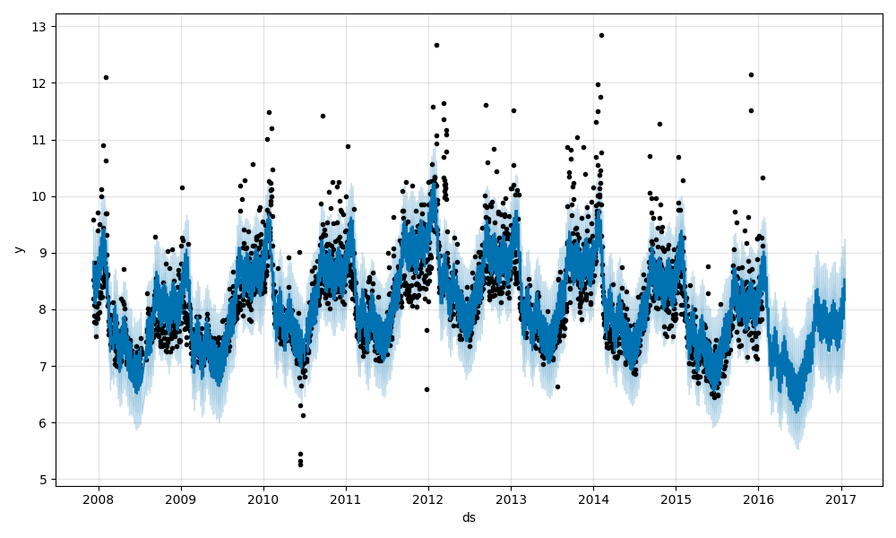
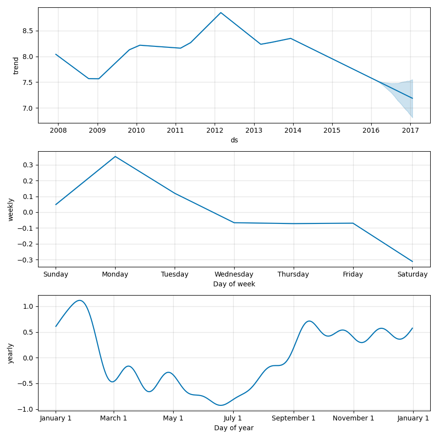

## **时间序列模型Prophet使用**

- 待预测数据格式
  - YYYY-MM-DD或YYYY-MM-DD HH:MM:SS
  - 待预测的数值

```python
import pandas as pd
from prophet import Prophet
import turtle


# 读取数据
df = pd.read_csv('demo.csv')
df.head()

# 拟合模型
m = Prophet()
m.fit(df)

# 指定待预测天数
future = m.make_future_dataframe(periods=365)
future.tail()

# 进行预测
forecast = m.predict(future)
forecast[['ds', 'yhat', 'yhat_lower', 'yhat_upper']].tail()

# 绘制预测结果
fig1 = m.plot(forecast)
fig1.show()

# 绘制整体趋势、周趋势、年趋势
fig2 = m.plot_components(forecast)
fig2.show()

# 点击界面退出
turtle.exitonclick()
```

- 预测结果



- 整体趋势、周趋势、年趋势

