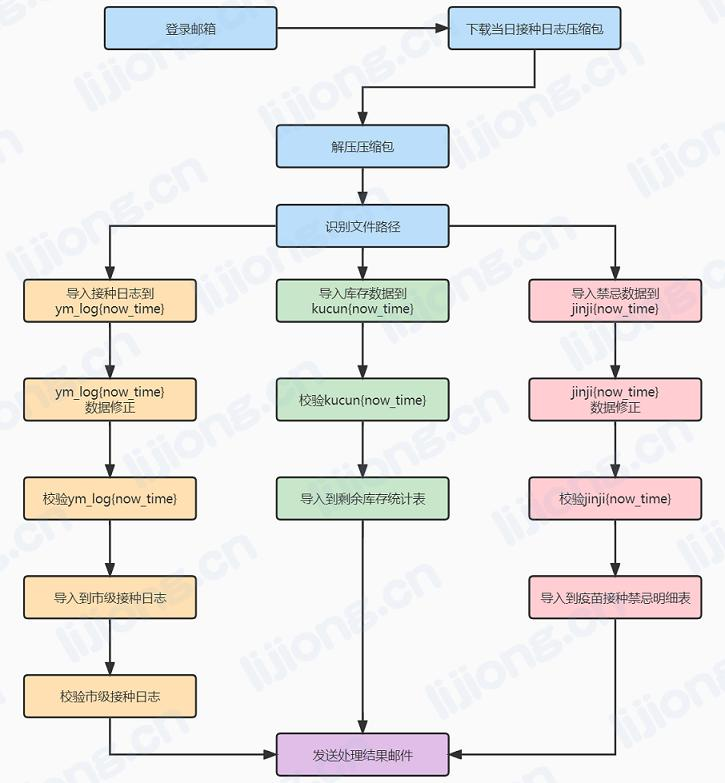

## **每日疫苗接种数据处理流程**



### 处理结果发送

- MailSend

```python
import smtplib
from email.mime.text import MIMEText

import LogDownload,ExtractRarOrZip
import LogDataLoad,LogDataInsert
import JinjiDataLoad,JinjiDataInsert
import KucunDataLoad,KucunDataInsert

import datetime
import time

day = datetime.datetime.now().strftime('%Y%m%d')


def get_time():
    return datetime.datetime.now().strftime('%Y-%m-%d %H:%M:%S.%f')


mail_host = 'smtp.163.com'  # 邮箱服务器地址
mail_user = 'unidata_wq'  # 用户名
mail_pass = '********'  # 授权码
sender = 'unidata_wq@163.com'  # 发送方
receivers = ['unidata_wq@163.com']  # 接受方
title = day + '接种日志入库结果'  # 邮件标题

# 压缩包下载
log_download_res = '【失败】邮件附件下载失败'
log_download = LogDownload.log_download()
if log_download[1:3] != '失败':
    log_download_res = '【成功】邮件附件下载成功，下载文件名为：' + log_download
log_download_msg = get_time() + ' ' + log_download_res
time.sleep(15)

# 解压
extract_res = '【失败】压缩包解压失败'
if log_download_res[1:3] != '失败':
    log_file = ExtractRarOrZip.extract(log_download)
    if isinstance(log_file, dict):
        extract_res = '【成功】压缩包解压成功'
extract_msg = get_time() + ' ' + extract_res
time.sleep(5)
# 入库到ym_log
data_load_res = '【失败】接种日志导入ym_log' + day + '及处理失败'
if extract_res[1:3] != '失败':
    data_load_res = LogDataLoad.data_load(log_file.get('log'))
data_load_msg = get_time() + ' ' + data_load_res

# ym_log数据校验
ym_log_check_res = '【失败】ym_log数据校验失败'
if data_load_res[1:3] != '失败':
    ym_log_check_res = LogDataInsert.data_check()
ym_log_check_msg = get_time() + ' ' + ym_log_check_res

# 数据导入接种日志
data_insert_res = '【失败】ym_log导入市级接种日志失败'
if ym_log_check_res[1:3] != '失败':
    data_insert_res = LogDataInsert.data_insert()
data_insert_msg = get_time() + ' ' + data_insert_res

# 接种日志校验
result_check_res = '【失败】市级接种日志校验失败'
if data_insert_res[1:3] != '失败':
    result_check_res = LogDataInsert.result_check()
result_check_msg = get_time() + ' ' + result_check_res

# 入库到jinji
jinji_load_res = '【失败】禁忌数据导入jinji' + day + '及处理失败'
if extract_res[1:3] != '失败':
    if log_file.get('jinji') == 0 :
        jinji_load_res = '【失败】今日无禁忌数据文件'
    else:
        jinji_load_res = JinjiDataLoad.data_load_all(log_file.get('jinji'))
jinji_load_msg = get_time() + ' ' + jinji_load_res

# jinji数据校验
jinji_check_res = '【失败】jinji数据校验失败'
if jinji_load_res[1:3] != '失败':
    jinji_check_res = JinjiDataInsert.data_check()
jinji_check_msg = get_time() + ' ' + jinji_check_res

# 数据导入禁忌明细表
jinji_insert_res = '【失败】ym_log导入市级接种日志失败'
if jinji_check_res[1:3] != '失败':
    jinji_insert_res = JinjiDataInsert.data_insert()
jinji_insert_msg = get_time() + ' ' + jinji_insert_res

# 入库到kucun
kucun_load_res = '【失败】库存数据导入kucun' + day + '及处理失败'
if extract_res[1:3] != '失败':
    if log_file.get('kucun') == 0 :
        kucun_load_res = '【失败】今日无库存数据文件'
    else:
        kucun_load_res = KucunDataLoad.data_load(log_file.get('kucun'))
kucun_load_msg = get_time() + ' ' + kucun_load_res

# kucun数据校验
kucun_check_res = '【失败】kucun数据校验失败'
if kucun_load_res[1:3] != '失败':
    kucun_check_res = KucunDataInsert.data_check()
kucun_check_msg = get_time() + ' ' + kucun_check_res

# 数据导入剩余库存统计表
kucun_insert_res = '【失败】kucun导入剩余库存统计表失败'
if kucun_check_res[1:3] != '失败':
    kucun_insert_res = KucunDataInsert.data_insert()
kucun_insert_msg = get_time() + ' ' + kucun_insert_res

print(log_download_msg)
print(extract_msg)
print(data_load_msg)
print(ym_log_check_msg)
print(data_insert_msg)
print(result_check_msg)
print(jinji_load_msg)
print(jinji_check_msg)
print(jinji_insert_msg)
print(kucun_load_msg)
print(kucun_check_msg)
print(kucun_insert_msg)

# 邮件内容
message = MIMEText(f"""
    邮件处理：
    {log_download_msg}
    {extract_msg}
    接种日志处理：
    {data_load_msg}
    {ym_log_check_msg}
    {data_insert_msg}
    {result_check_msg}
    禁忌数据处理：
    {jinji_load_msg}
    {jinji_check_msg}
    {jinji_insert_msg}
    库存数据处理：
    {kucun_load_msg}
    {kucun_check_msg}
    {kucun_insert_msg}
    """, 'plain', 'utf-8')
# message = MIMEText('', 'html', 'utf-8')

# 邮件主题
message['Subject'] = title
# 发送方信息
message['From'] = sender
# 接受方信息
message['To'] = receivers[0]

# 登录并发送邮件
try:
    smtpObj = smtplib.SMTP()
    smtpObj.connect(mail_host, 25)  # 连接到服务器
    smtpObj.login(mail_user, mail_pass)  # 登录到服务器
    smtpObj.sendmail(  # 发送
        sender, receivers, message.as_string())
    smtpObj.quit()  # 退出
    print('success')
except Exception as e:
    print('error', e)
```

### 邮件附件获取

- LogDownload

```python
# https://chromedriver.storage.googleapis.com/index.html下载对应版本chromedriver.exe放到Scripts目录
# 或https://developer.microsoft.com/en-us/microsoft-edge/tools/webdriver/下载对应版本msedgedriver.exe放到Scripts目录
from selenium import webdriver
import time
import MHLogin


def log_download():
    global driver
    try:
        # 日志下载
        driver = webdriver.Chrome()
        # driver = webdriver.Edge()
        Keys = webdriver.common.keys.Keys
        By = webdriver.common.by.By
        driver.get(MHLogin.get_addr('jzrj'))
        time.sleep(1)
        # print(driver.page_source)
        driver.find_element(By.NAME, 'F_email').send_keys(MHLogin.get_user('jzrj'))
        driver.find_element(By.NAME, 'F_email').send_keys(Keys.TAB)
        driver.find_element(By.NAME, 'F_password').send_keys(MHLogin.get_pwd('jzrj'))
        driver.find_element(By.NAME, 'action').click()
        time.sleep(3)
        driver.switch_to.frame('main')
        driver.find_element(By.XPATH, '//*[@title="收件箱"]').click()
        time.sleep(5)
        # driver.find_element(By.XPATH, '//*[@title="接种日志' + time.strftime("%#m.12", time.localtime()) + '"]').click()
        driver.find_element(By.XPATH,'//*[@title="接种日志' + time.strftime("%#m.%#d", time.localtime()) + '"]').click()
        time.sleep(15)
        # target = driver.find_element(By.XPATH,'//html//body//div[1]//table//tbody//tr[2]//td//table//tbody//tr//td[2]//div//div//div[3]//div[7]//div[2]//div[3]//div//div//span[1]//a')
        target = driver.find_element(By.XPATH, '//*[@target="download_frname"]')
        target.click()
        return target.text
    except Exception as e:
        print(e)
        return '【失败】邮件附件下载失败'
```

### 解压缩文件

- ExtractRarOrZip

```python
# 在系统环境变量中配置了WinRAR的路径D:\App\WinRAR，重启PyCharm
import rarfile
from zipfile import ZipFile
import os


# 压缩包内目标个数
def file_count(dir_path):
    dir = os.listdir(dir_path)
    return len(dir)


def locate_file(dir_path):
    # 接种日志
    dir = os.listdir(dir_path)
    log_file = ''
    kucun_file = ''
    jinji_files = ''
    for file in dir:
        if os.path.splitext(file)[1] == '.csv':
            log_file = os.path.join(dir_path, file)
    # 库存
    try:
        kucun_path = dir_path + '\\库存'
        kucun_dir = os.listdir(kucun_path)
        for file in kucun_dir:
            kucun_file = os.path.join(kucun_path, file)
    except:
        kucun_file = 0
    # 禁忌
    jinji_files = set()
    try:
        jinji_path = dir_path + '\\禁忌'
        jinji_dir = os.listdir(jinji_path)
        for file in jinji_dir:
            jinji_file = os.path.join(jinji_path, file)
            jinji_files.add(jinji_file)
    except:
        jinji_files = 0

    res = dict()
    res['log'] = log_file
    res['kucun'] = kucun_file
    res['jinji'] = jinji_files

    return res


def extract(target):
    try:
        path = 'C:\\Users\\综合运营中心\\Downloads\\' + target
        dir_path = 'C:\\Users\\综合运营中心\\Downloads\\' + target[:-4]

        if target[-3:] == 'rar':
            rf = rarfile.RarFile(path)
            rf.extractall(dir_path)
            if file_count(dir_path) == 1:
                dir_path = dir_path + '\\' + target[:-4]
            return locate_file(dir_path)
        if target[-3:] == 'zip':
            zip_file = ZipFile(path, 'r')
            # 处理文件名乱码问题
            name_to_info = zip_file.NameToInfo
            for name, info in name_to_info.copy().items():
                new_name = name.encode('cp437').decode('gbk')
                if new_name != name:
                    info.filename = new_name
                    del name_to_info[name]
                    name_to_info[new_name] = info
            for file in zip_file.namelist():
                zip_file.extract(file, dir_path)
            if file_count(dir_path) == 1:
                dir_path = dir_path + '\\' + target[:-4]
            return locate_file(dir_path)
    except Exception as e:
        print(e)
        return '【失败】压缩包解压失败'
```

### 数据入库及处理

- LogDataLoad

```python
import pandas
from sqlalchemy import create_engine
import pymysql
import datetime
from urllib.parse import quote_plus
import openpyxl

now_time = datetime.datetime.now().strftime('%Y%m%d')
conn_str = 'mysql+pymysql://root:%s@********:3306/ym_log_new?charset=utf8' % quote_plus('********')
conn = create_engine(conn_str, echo=True)


# 数据更新
def update_data():
    try:
        sql = f"""
            update tj_inoculate.数据统计专用字典表 a,ym_log{now_time} b set b.所属街镇=a.市级接种日志所属街镇 where a.接种单位编码=b.接种单位编码;
            """
        conn.execute(sql)
    except Exception as e:
        print(e)
    try:
        sql = f"""
            update tj_inoculate.数据统计专用字典表 a,ym_log{now_time} b set b.所属街镇=a.市级接种日志所属街镇 where a.接种单位=b.接种单位;
            """
        conn.execute(sql)
    except Exception as e:
        print(e)
    try:
        sql = f"""
            update ym_log{now_time} set 省内外标识=1;
            """
        conn.execute(sql)

        sql = f"""
            update ym_log{now_time} set 生产企业_new='北京生物' where 疫苗名称='新冠Vero（北京生物）';
            """
        conn.execute(sql)

        sql = f"""
            update ym_log{now_time} set 生产企业_new='北京科兴中维' where 疫苗名称='新冠Vero（科兴中维）';
            """
        conn.execute(sql)

        sql = f"""
            update ym_log{now_time} set 生产企业_new='康希诺生物' where 疫苗名称='新冠疫苗（腺病毒载体）';
            """
        conn.execute(sql)

        sql = f"""
            update ym_log{now_time} set 生产企业_new='安徽智飞龙科马生物制药有限公司' where 疫苗名称='新冠疫苗（CHO细胞）';
            """
        conn.execute(sql)
    except Exception as e:
        print(e)
    try:
        sql = f"""
                update tj_inoculate.市级接种日志_mgc a,ym_log{ now_time } b 
                set b.身份证号 = a.身份证号 
                where
                    a.姓名 = b.姓名 
                    and a.手机 = b.手机 
                    and (b.身份证号 is null or b.身份证号 = '') 
                    and (a.剂次 = 2 or a.剂次 = 3)
                """
        conn.execute(sql)

        sql = f"""
                update ym_log{ now_time } set 身份证号 = '000000000000000000' where 身份证号 is null or 身份证号 = ''
                """
        conn.execute(sql)
    except Exception as e:
        print(e)
    try:
        sql = f"""
                update ym_log{ now_time } set 性别_new = if(性别代码='1','男','女')
                """
        conn.execute(sql)
    except Exception as e:
        print(e)
    try:
        sql = f"""
                update ym_log{ now_time } set 性别_new = 性别
                """
        conn.execute(sql)
    except Exception as e:
        print(e)
    try:
        sql = f"""
                update ym_log{ now_time } set 证件类型_new = 证件类别代码
                """
        conn.execute(sql)
    except Exception as e:
        print(e)
    try:
        sql = f"""
                update ym_log{ now_time } set 证件类型_new = 证件类型
                """
        conn.execute(sql)
    except Exception as e:
        print(e)
    try:
        sql = f"""
                update ym_log{ now_time } set 国籍_new = 国籍代码
                """
        conn.execute(sql)
    except Exception as e:
        print(e)
    try:
        sql = f"""
                update ym_log{ now_time } set 国籍_new = 国籍
                """
        conn.execute(sql)
    except Exception as e:
        print(e)
    try:
        sql = f"""
                update ym_log{ now_time } set 人群分类_new = 人群分类代码
                """
        conn.execute(sql)
    except Exception as e:
        print(e)
    try:
        sql = f"""
                update ym_log{ now_time } set 人群分类_new = 人群分类
                """
        conn.execute(sql)
    except Exception as e:
        print(e)


# 数据量查询
def select_count():
    sql = f"""
        select count(1) cnt from ym_log{now_time};
        """
    sql_res = conn.execute(sql)
    for row in sql_res:
        cur = dict()
        for k, v in row._mapping.items():
            cur[k] = v
    return cur.get('cnt')


def data_load(log_file):
    try:
        # 日志处理
        df = pandas.read_csv(log_file, skiprows=2)

        result = pandas.DataFrame(columns=df.columns)
        for line in range(len(df)):
            result.loc[line] = df.iloc[line]

        result["档案编号"] = result["档案编号"].str.replace("'", "")
        result["档案编号"] = result["档案编号"].str.replace("'", "")
        result["证件号码"] = result["证件号码"].str.replace("'", "")
        result['受种者出生时间'] = pandas.to_datetime(result['受种者出生时间'])
        result['受种者出生时间'] = result['受种者出生时间'].dt.strftime('%Y-%m-%d')
        result['接种时间'] = pandas.to_datetime(result['接种时间'])
        result['接种时间'] = result['接种时间'].dt.strftime('%Y-%m-%d')
        result.rename(columns={'档案编号': '个案编码'}, inplace=True)
        result.rename(columns={'受种者姓名': '姓名'}, inplace=True)
        result.rename(columns={'联系方式': '手机'}, inplace=True)
        result.rename(columns={'证件号码': '身份证号'}, inplace=True)
        result.rename(columns={'受种者出生时间': '出生日期'}, inplace=True)
        result.rename(columns={'接种时间': '接种日期'}, inplace=True)
        result.rename(columns={'接种剂次': '剂次'}, inplace=True)
        result.rename(columns={'疫苗批号': '批号'}, inplace=True)
        result["所属街镇"] = None
        result["省内外标识"] = None
        result["生产企业_new"] = None
        result["性别_new"] = None
        result["证件类型_new"] = None
        result["国籍_new"] = None
        result["人群分类_new"] = None

        pandas.io.sql.to_sql(result, f"ym_log{now_time}", conn, if_exists="replace", index=False, schema="ym_log_new")

        # 数据更新
        update_data()
        # 数据量查询
        cnt = select_count()
        if cnt > 0:
            return '【成功】接种日志导入ym_log' + now_time + '及处理成功，导入数据量为：' + str(cnt)
        else:
            return '【失败】接种日志导入ym_log' + now_time + '及处理失败'
    except Exception as e:
        print(e)
        return '【失败】接种日志导入ym_log' + now_time + '及处理失败'
```

- KucunDataLoad

```python
import pandas
from sqlalchemy import create_engine
import datetime
from urllib.parse import quote_plus

now_time = datetime.datetime.now().strftime('%Y%m%d')
conn_str = 'mysql+pymysql://root:%s@********:3306/ym_log_new?charset=utf8' % quote_plus('********')
conn = create_engine(conn_str, echo=True)


# 数据量查询
def select_count():
    sql = f"""
        select count(1) cnt from kucun{now_time};
        """
    sql_res = conn.execute(sql)
    for row in sql_res:
        cur = dict()
        for k, v in row._mapping.items():
            cur[k] = v
    return cur.get('cnt')


# 数据导入
def data_load(log_file):
    try:
        # 日志处理
        df = pandas.read_excel(log_file, skiprows=2)
        print(df, '\n')
        # 镇街园区接种点
        col1 = [df.columns.tolist()[0]]
        print(col1)
        # 接种信息
        col2 = [col for col in df.iloc[0, :].tolist() if
                col in ('北京科兴（一人份）', '北京科兴（两人份）', '北京生物（一人份）', '北京生物（两人份）', '康希诺', '安徽智飞（一人份）', '安徽智飞（两人份）', '合计')]
        print(col2)
        # 当日接种数
        col3 = [df.columns.tolist()[9]]
        print(col3)
        col_list = col1 + col2 + col3
        df.columns = col_list
        print(df)
        # 删除第一行数据
        df = df.drop(0)

        result = pandas.DataFrame(columns=df.columns)
        for line in range(len(df)):
            result.loc[line] = df.iloc[line]

        result.rename(columns={'康希诺': '康希诺腺病毒'}, inplace=True)
        result.rename(columns={'镇街园区接种点': '接种点'}, inplace=True)

        pandas.io.sql.to_sql(result, f"kucun{now_time}", conn, if_exists="replace", index=False, schema="ym_log_new")

        # 数据量查询
        cnt = select_count()
        if cnt > 0:
            return '【成功】库存数据导入kucun' + now_time + '及处理成功，导入数据量为：' + str(cnt)
        else:
            return '【失败】库存数据导入kucun' + now_time + '及处理失败'
    except Exception as e:
        print(e)
        return '【失败】库存数据导入kucun' + now_time + '及处理失败'
```

- JinjiDataLoad

```python
import pandas
from sqlalchemy import create_engine
import datetime
from urllib.parse import quote_plus

now_time = datetime.datetime.now().strftime('%Y%m%d')
conn_str = 'mysql+pymysql://root:%s@********:3306/ym_log_new?charset=utf8' % quote_plus('********')
conn = create_engine(conn_str, echo=True)


def update_data():
    try:
        sql1 = f"""
            delete from jinji{now_time} where 身份证号 is null;
            """
        conn.execute(sql1)

        sql2 = f"""
            update jinji{now_time} set 上站时间 = substr(replace(上站时间（原始）,'.','-'),1,10);
            """
        conn.execute(sql2)

        sql3 = f"""
            update jinji{now_time} set 禁忌类型 = concat('-',禁忌类型) where 禁忌类型 in (1,2,3,4,5,6) ;
            """
        conn.execute(sql3)

        sql4 = f"""
            update jinji{now_time} set 所属街镇 = 
            case 
                when 街镇自填 regexp '杨村' then '杨村街道'
                when 街镇自填 regexp '下朱庄' then '下朱庄街道'
                when 街镇自填 regexp '东蒲洼' then '东蒲洼街道'
                when 街镇自填 regexp '黄庄' then '黄庄街道'
                when 街镇自填 regexp '徐官屯' then '徐官屯街道'
                when 街镇自填 regexp '梅厂' then '梅厂镇'
                when 街镇自填 regexp '大碱厂' then '大碱厂镇'
                when 街镇自填 regexp '崔黄口' then '崔黄口镇'
                when 街镇自填 regexp '大良' then '大良镇'
                when 街镇自填 regexp '下伍旗' then '下伍旗镇'
                when 街镇自填 regexp '南蔡村' then '南蔡村镇'
                when 街镇自填 regexp '大孟庄' then '大孟庄镇'
                when 街镇自填 regexp '泗村店' then '泗村店镇'
                when 街镇自填 regexp '河西务' then '河西务镇'
                when 街镇自填 regexp '城关' then '城关镇'
                when 街镇自填 regexp '东马圈' then '东马圈镇'
                when 街镇自填 regexp '黄花店' then '黄花店镇'
                when 街镇自填 regexp '石各庄' then '石各庄镇'
                when 街镇自填 regexp '王庆坨' then '王庆坨镇'
                when 街镇自填 regexp '汊沽港' then '汊沽港镇'
                when 街镇自填 regexp '河北屯' then '河北屯镇'
                when 街镇自填 regexp '上马台' then '上马台镇'
                when 街镇自填 regexp '大王古' then '大王古庄镇'
                when 街镇自填 regexp '陈咀' then '陈咀镇'
                when 街镇自填 regexp '豆张庄' then '豆张庄镇'
                when 街镇自填 regexp '曹子里' then '曹子里镇'
                when 街镇自填 regexp '大黄堡' then '大黄堡镇'
                when 街镇自填 regexp '高村' then '高村镇'
                when 街镇自填 regexp '白古屯' then '白古屯镇'
                when 街镇自填 regexp '开发区' then '武清经济技术开发区'
                when 街镇自填 regexp '工业园' then '天津京滨工业园'
                when 街镇自填 regexp '电商园' then '天津京津电子商务产业园'
                when 街镇自填 regexp '汽车产业园' then '天津武清汽车产业园'
                when 街镇自填 regexp '京津科技谷' then '天津京津科技谷'
                when 街镇自填 regexp '高村科技园' then '京津高村科技创新园'
            else null end
            """
        conn.execute(sql4)

        sql5 = f"""
            update jinji{now_time} t1,
            (select 街镇自填,所属街镇 
            from tj_inoculate.疫苗接种禁忌明细表 
            where 所属街镇 in (
            '杨村街道'
            ,'下朱庄街道'
            ,'东蒲洼街道'
            ,'黄庄街道'
            ,'徐官屯街道'
            ,'梅厂镇'
            ,'大碱厂镇'
            ,'崔黄口镇'
            ,'大良镇'
            ,'下伍旗镇'
            ,'南蔡村镇'
            ,'大孟庄镇'
            ,'泗村店镇'
            ,'河西务镇'
            ,'城关镇'
            ,'东马圈镇'
            ,'黄花店镇'
            ,'石各庄镇'
            ,'王庆坨镇'
            ,'汊沽港镇'
            ,'河北屯镇'
            ,'上马台镇'
            ,'大王古庄镇'
            ,'陈咀镇'
            ,'豆张庄镇'
            ,'曹子里镇'
            ,'大黄堡镇'
            ,'高村镇'
            ,'白古屯镇'
            ,'武清经济技术开发区'
            ,'天津京滨工业园'
            ,'天津京津电子商务产业园'
            ,'天津武清汽车产业园'
            ,'天津京津科技谷'
            ,'京津高村科技创新园') 
            group by 街镇自填,所属街镇 
            ) t2
            set t1.所属街镇 = t2.所属街镇
            where t1.街镇自填 = t2.街镇自填 and t1.所属街镇 is null
            """
        conn.execute(sql5)

        sql6 = f"""
            update jinji{now_time} set 工作单位 = '无' where 工作单位 is null;
            """
        conn.execute(sql6)
    except Exception as e:
        print(e)


# 数据量查询
def select_count():
    sql = f"""
        select count(1) cnt from jinji{now_time};
        """
    sql_res = conn.execute(sql)
    for row in sql_res:
        cur = dict()
        for k, v in row._mapping.items():
            cur[k] = v
    return cur.get('cnt')


def data_load(log_file):
    # 日志处理
    df = pandas.read_excel(log_file, skiprows=2, converters={'身份证号':str})
    result = pandas.DataFrame(columns=df.columns)
    for line in range(len(df)):
        result.loc[line] = df.iloc[line]

    result.rename(columns={'所属街镇': '街镇自填'}, inplace=True)
    result.rename(columns={'上站时间': '上站时间（原始）'}, inplace=True)
    result["所属街镇"] = None
    result["上站时间"] = None

    pandas.io.sql.to_sql(result, f"jinji{now_time}", conn, if_exists="append", index=False, schema="ym_log_new")


def data_load_all(kucun_files):
    try:
        for file in kucun_files:
            data_load(file)
        # 数据更新
        update_data()
        # 数据量查询
        cnt = select_count()
        if cnt > 0:
            return '【成功】禁忌数据导入jinji' + now_time + '及处理成功，导入数据量为：' + str(cnt)
        else:
            return '【失败】禁忌数据导入jinji' + now_time + '及处理失败'
    except Exception as e:
        print(e)
        return '【失败】禁忌数据导入jinji' + now_time + '及处理失败'
```

### 数据校验

- LogDataInsert

```python
from sqlalchemy import create_engine
import pymysql
from urllib.parse import quote_plus
import datetime

now_time = datetime.datetime.now().strftime('%Y%m%d')
conn_str = 'mysql+pymysql://root:%s@********:3306/ym_log_new?charset=utf8' % quote_plus('********')
conn = create_engine(conn_str, echo=True)
data1 = 0
data2 = 0
data3 = 0
data4 = 0
day_num = 0


def data_check():
    try:
        sql1 = f"""
        select * from

        #接种总数
        (select count(*) 接种总数 from ym_log{now_time} where date(接种日期) =(DATE_SUB(CURDATE(),INTERVAL {day_num} DAY))) t1,

        #按年龄段
        (select a1.num+a2.num+a3.num+a4.num+a5.num+a6.num+a7.num+a8.num+a9.num+a10.num+a11.num+a12.num+b1.num+b2.num+b3.num+b4.num+b5.num+b6.num+b7.num+b8.num+b9.num+b10.num+b11.num+b12.num+c1.num+c2.num+c3.num+c4.num+c5.num+c6.num+c7.num+c8.num+c9.num+c10.num+c11.num+c12.num+d1.num+d2.num+d3.num+d4.num+d5.num+d6.num+d7.num+d8.num+d9.num+d10.num+d11.num+d12.num+e1.num+e2.num+e3.num+e4.num+e5.num+e6.num+e7.num+e8.num+e9.num+e10.num+e11.num+e12.num 按年龄段 from

        #------------小于11----------
        #生物-第一针
        (select count(*) as num from ym_log{now_time} where date(接种日期) =(DATE_SUB(CURDATE(),INTERVAL {day_num} DAY)) and TIMESTAMPDIFF(YEAR,`出生日期`,`接种日期`) BETWEEN 3 and 11 and 生产企业_new='北京生物' and 剂次='1') e1,
        #生物-第二针
        (select count(*) as num from ym_log{now_time} where date(接种日期) =(DATE_SUB(CURDATE(),INTERVAL {day_num} DAY)) and TIMESTAMPDIFF(YEAR,`出生日期`,`接种日期`) BETWEEN 3 and 11 and 生产企业_new='北京生物' and 剂次='2') e2,
        #生物-第三针
        (select count(*) as num from ym_log{now_time} where date(接种日期) =(DATE_SUB(CURDATE(),INTERVAL {day_num} DAY)) and TIMESTAMPDIFF(YEAR,`出生日期`,`接种日期`) BETWEEN 3 and 11 and 生产企业_new='北京生物' and 剂次='3') e3,
        #科兴-第一针
        (select count(*) as num from ym_log{now_time} where date(接种日期) =(DATE_SUB(CURDATE(),INTERVAL {day_num} DAY)) and TIMESTAMPDIFF(YEAR,`出生日期`,`接种日期`) BETWEEN 3 and 11 and 生产企业_new='北京科兴中维' and 剂次='1') e4,
        #科兴-第二针
        (select count(*) as num from ym_log{now_time} where date(接种日期) =(DATE_SUB(CURDATE(),INTERVAL {day_num} DAY)) and TIMESTAMPDIFF(YEAR,`出生日期`,`接种日期`) BETWEEN 3 and 11 and 生产企业_new='北京科兴中维' and 剂次='2') e5,
        #科兴-第三针
        (select count(*) as num from ym_log{now_time} where date(接种日期) =(DATE_SUB(CURDATE(),INTERVAL {day_num} DAY)) and TIMESTAMPDIFF(YEAR,`出生日期`,`接种日期`) BETWEEN 3 and 11 and 生产企业_new='北京科兴中维' and 剂次='3') e6,
        #康熙诺-第一针
        (select count(*) as num from ym_log{now_time} where date(接种日期) =(DATE_SUB(CURDATE(),INTERVAL {day_num} DAY)) and TIMESTAMPDIFF(YEAR,`出生日期`,`接种日期`) BETWEEN 3 and 11 and 生产企业_new='康希诺生物' and 剂次='1') e7,
        #康熙诺-第二针
        (select count(*) as num from ym_log{now_time} where date(接种日期) =(DATE_SUB(CURDATE(),INTERVAL {day_num} DAY)) and TIMESTAMPDIFF(YEAR,`出生日期`,`接种日期`) BETWEEN 3 and 11 and 生产企业_new='康希诺生物' and 剂次='2') e8,
        #康熙诺-第三针
        (select count(*) as num from ym_log{now_time} where date(接种日期) =(DATE_SUB(CURDATE(),INTERVAL {day_num} DAY)) and TIMESTAMPDIFF(YEAR,`出生日期`,`接种日期`) BETWEEN 3 and 11 and 生产企业_new='康希诺生物' and 剂次='3') e9,
        #安徽智飞-第一针
        (select count(*) as num from ym_log{now_time} where date(接种日期) =(DATE_SUB(CURDATE(),INTERVAL {day_num} DAY)) and TIMESTAMPDIFF(YEAR,`出生日期`,`接种日期`) BETWEEN 3 and 11 and 生产企业_new='安徽智飞' and 剂次='1') e10,
        #安徽智飞-第二针
        (select count(*) as num from ym_log{now_time} where date(接种日期) =(DATE_SUB(CURDATE(),INTERVAL {day_num} DAY)) and TIMESTAMPDIFF(YEAR,`出生日期`,`接种日期`) BETWEEN 3 and 11 and 生产企业_new='安徽智飞' and 剂次='2') e11,
        #安徽智飞-第三针
        (select count(*) as num from ym_log{now_time} where date(接种日期) =(DATE_SUB(CURDATE(),INTERVAL {day_num} DAY)) and TIMESTAMPDIFF(YEAR,`出生日期`,`接种日期`) BETWEEN 3 and 11 and 生产企业_new='安徽智飞' and 剂次='3') e12,

        #------------1214----------
        #生物-第一针
        (select count(*) as num from ym_log{now_time} where date(接种日期) =(DATE_SUB(CURDATE(),INTERVAL {day_num} DAY)) and TIMESTAMPDIFF(YEAR,`出生日期`,`接种日期`) BETWEEN 12 and 14 and 生产企业_new='北京生物' and 剂次='1') a1,
        #生物-第二针
        (select count(*) as num from ym_log{now_time} where date(接种日期) =(DATE_SUB(CURDATE(),INTERVAL {day_num} DAY)) and TIMESTAMPDIFF(YEAR,`出生日期`,`接种日期`) BETWEEN 12 and 14 and 生产企业_new='北京生物' and 剂次='2') a2,
        #生物-第三针
        (select count(*) as num from ym_log{now_time} where date(接种日期) =(DATE_SUB(CURDATE(),INTERVAL {day_num} DAY)) and TIMESTAMPDIFF(YEAR,`出生日期`,`接种日期`) BETWEEN 12 and 14 and 生产企业_new='北京生物' and 剂次='3') a3,
        #科兴-第一针
        (select count(*) as num from ym_log{now_time} where date(接种日期) =(DATE_SUB(CURDATE(),INTERVAL {day_num} DAY)) and TIMESTAMPDIFF(YEAR,`出生日期`,`接种日期`) BETWEEN 12 and 14 and 生产企业_new='北京科兴中维' and 剂次='1') a4,
        #科兴-第二针
        (select count(*) as num from ym_log{now_time} where date(接种日期) =(DATE_SUB(CURDATE(),INTERVAL {day_num} DAY)) and TIMESTAMPDIFF(YEAR,`出生日期`,`接种日期`) BETWEEN 12 and 14 and 生产企业_new='北京科兴中维' and 剂次='2') a5,
        #科兴-第三针
        (select count(*) as num from ym_log{now_time} where date(接种日期) =(DATE_SUB(CURDATE(),INTERVAL {day_num} DAY)) and TIMESTAMPDIFF(YEAR,`出生日期`,`接种日期`) BETWEEN 12 and 14 and 生产企业_new='北京科兴中维' and 剂次='3') a6,
        #康熙诺-第一针
        (select count(*) as num from ym_log{now_time} where date(接种日期) =(DATE_SUB(CURDATE(),INTERVAL {day_num} DAY)) and TIMESTAMPDIFF(YEAR,`出生日期`,`接种日期`) BETWEEN 12 and 14 and 生产企业_new='康希诺生物' and 剂次='1') a7,
        #康熙诺-第二针
        (select count(*) as num from ym_log{now_time} where date(接种日期) =(DATE_SUB(CURDATE(),INTERVAL {day_num} DAY)) and TIMESTAMPDIFF(YEAR,`出生日期`,`接种日期`) BETWEEN 12 and 14 and 生产企业_new='康希诺生物' and 剂次='2') a8,
        #康熙诺-第三针
        (select count(*) as num from ym_log{now_time} where date(接种日期) =(DATE_SUB(CURDATE(),INTERVAL {day_num} DAY)) and TIMESTAMPDIFF(YEAR,`出生日期`,`接种日期`) BETWEEN 12 and 14 and 生产企业_new='康希诺生物' and 剂次='3') a9,
        #安徽智飞-第一针
        (select count(*) as num from ym_log{now_time} where date(接种日期) =(DATE_SUB(CURDATE(),INTERVAL {day_num} DAY)) and TIMESTAMPDIFF(YEAR,`出生日期`,`接种日期`) BETWEEN 12 and 14 and 生产企业_new='安徽智飞' and 剂次='1') a10,
        #安徽智飞-第二针
        (select count(*) as num from ym_log{now_time} where date(接种日期) =(DATE_SUB(CURDATE(),INTERVAL {day_num} DAY)) and TIMESTAMPDIFF(YEAR,`出生日期`,`接种日期`) BETWEEN 12 and 14 and 生产企业_new='安徽智飞' and 剂次='2') a11,
        #安徽智飞-第三针
        (select count(*) as num from ym_log{now_time} where date(接种日期) =(DATE_SUB(CURDATE(),INTERVAL {day_num} DAY)) and TIMESTAMPDIFF(YEAR,`出生日期`,`接种日期`) BETWEEN 12 and 14 and 生产企业_new='安徽智飞' and 剂次='3') a12,


        #------------1517----------
        #生物-第一针
        (select count(*) as num from ym_log{now_time} where date(接种日期) =(DATE_SUB(CURDATE(),INTERVAL {day_num} DAY)) and TIMESTAMPDIFF(YEAR,`出生日期`,`接种日期`) BETWEEN 15 and 17 and 生产企业_new='北京生物' and 剂次='1') b1,
        #生物-第二针
        (select count(*) as num from ym_log{now_time} where date(接种日期) =(DATE_SUB(CURDATE(),INTERVAL {day_num} DAY)) and TIMESTAMPDIFF(YEAR,`出生日期`,`接种日期`) BETWEEN 15 and 17 and 生产企业_new='北京生物' and 剂次='2') b2,
        #生物-第三针
        (select count(*) as num from ym_log{now_time} where date(接种日期) =(DATE_SUB(CURDATE(),INTERVAL {day_num} DAY)) and TIMESTAMPDIFF(YEAR,`出生日期`,`接种日期`) BETWEEN 15 and 17 and 生产企业_new='北京生物' and 剂次='3') b3,
        #科兴-第一针
        (select count(*) as num from ym_log{now_time} where date(接种日期) =(DATE_SUB(CURDATE(),INTERVAL {day_num} DAY)) and TIMESTAMPDIFF(YEAR,`出生日期`,`接种日期`) BETWEEN 15 and 17 and 生产企业_new='北京科兴中维' and 剂次='1') b4,
        #科兴-第二针
        (select count(*) as num from ym_log{now_time} where date(接种日期) =(DATE_SUB(CURDATE(),INTERVAL {day_num} DAY)) and TIMESTAMPDIFF(YEAR,`出生日期`,`接种日期`) BETWEEN 15 and 17 and 生产企业_new='北京科兴中维' and 剂次='2') b5,
        #科兴-第三针
        (select count(*) as num from ym_log{now_time} where date(接种日期) =(DATE_SUB(CURDATE(),INTERVAL {day_num} DAY)) and TIMESTAMPDIFF(YEAR,`出生日期`,`接种日期`) BETWEEN 15 and 17 and 生产企业_new='北京科兴中维' and 剂次='3') b6,
        #康熙诺-第一针
        (select count(*) as num from ym_log{now_time} where date(接种日期) =(DATE_SUB(CURDATE(),INTERVAL {day_num} DAY)) and TIMESTAMPDIFF(YEAR,`出生日期`,`接种日期`) BETWEEN 15 and 17 and 生产企业_new='康希诺生物' and 剂次='1') b7,
        #康熙诺-第二针
        (select count(*) as num from ym_log{now_time} where date(接种日期) =(DATE_SUB(CURDATE(),INTERVAL {day_num} DAY)) and TIMESTAMPDIFF(YEAR,`出生日期`,`接种日期`) BETWEEN 15 and 17 and 生产企业_new='康希诺生物' and 剂次='2') b8,
        #康熙诺-第三针
        (select count(*) as num from ym_log{now_time} where date(接种日期) =(DATE_SUB(CURDATE(),INTERVAL {day_num} DAY)) and TIMESTAMPDIFF(YEAR,`出生日期`,`接种日期`) BETWEEN 15 and 17 and 生产企业_new='康希诺生物' and 剂次='3') b9,
        #安徽智飞-第一针
        (select count(*) as num from ym_log{now_time} where date(接种日期) =(DATE_SUB(CURDATE(),INTERVAL {day_num} DAY)) and TIMESTAMPDIFF(YEAR,`出生日期`,`接种日期`) BETWEEN 15 and 17 and 生产企业_new='安徽智飞龙科马生物制药有限公司' and 剂次='1') b10,
        #安徽智飞-第二针
        (select count(*) as num from ym_log{now_time} where date(接种日期) =(DATE_SUB(CURDATE(),INTERVAL {day_num} DAY)) and TIMESTAMPDIFF(YEAR,`出生日期`,`接种日期`) BETWEEN 15 and 17 and 生产企业_new='安徽智飞龙科马生物制药有限公司' and 剂次='2') b11,
        #安徽智飞-第三针
        (select count(*) as num from ym_log{now_time} where date(接种日期) =(DATE_SUB(CURDATE(),INTERVAL {day_num} DAY)) and TIMESTAMPDIFF(YEAR,`出生日期`,`接种日期`) BETWEEN 15 and 17 and 生产企业_new='安徽智飞龙科马生物制药有限公司' and 剂次='3') b12,


        #------------1859----------
        #生物-第一针
        (select count(*) as num from ym_log{now_time} where date(接种日期) =(DATE_SUB(CURDATE(),INTERVAL {day_num} DAY)) and TIMESTAMPDIFF(YEAR,`出生日期`,`接种日期`) BETWEEN 18 and 59 and 生产企业_new='北京生物' and 剂次='1') c1,
        #生物-第二针
        (select count(*) as num from ym_log{now_time} where date(接种日期) =(DATE_SUB(CURDATE(),INTERVAL {day_num} DAY)) and TIMESTAMPDIFF(YEAR,`出生日期`,`接种日期`) BETWEEN 18 and 59 and 生产企业_new='北京生物' and 剂次='2') c2,
        #生物-第三针
        (select count(*) as num from ym_log{now_time} where date(接种日期) =(DATE_SUB(CURDATE(),INTERVAL {day_num} DAY)) and TIMESTAMPDIFF(YEAR,`出生日期`,`接种日期`) BETWEEN 18 and 59 and 生产企业_new='北京生物' and 剂次='3') c3,
        #科兴-第一针
        (select count(*) as num from ym_log{now_time} where date(接种日期) =(DATE_SUB(CURDATE(),INTERVAL {day_num} DAY)) and TIMESTAMPDIFF(YEAR,`出生日期`,`接种日期`) BETWEEN 18 and 59 and 生产企业_new='北京科兴中维' and 剂次='1') c4,
        #科兴-第二针
        (select count(*) as num from ym_log{now_time} where date(接种日期) =(DATE_SUB(CURDATE(),INTERVAL {day_num} DAY)) and TIMESTAMPDIFF(YEAR,`出生日期`,`接种日期`) BETWEEN 18 and 59 and 生产企业_new='北京科兴中维' and 剂次='2') c5,
        #科兴-第三针
        (select count(*) as num from ym_log{now_time} where date(接种日期) =(DATE_SUB(CURDATE(),INTERVAL {day_num} DAY)) and TIMESTAMPDIFF(YEAR,`出生日期`,`接种日期`) BETWEEN 18 and 59 and 生产企业_new='北京科兴中维' and 剂次='3') c6,
        #康熙诺-第一针
        (select count(*) as num from ym_log{now_time} where date(接种日期) =(DATE_SUB(CURDATE(),INTERVAL {day_num} DAY)) and TIMESTAMPDIFF(YEAR,`出生日期`,`接种日期`) BETWEEN 18 and 59 and 生产企业_new='康希诺生物' and 剂次='1') c7,
        #康熙诺-第二针
        (select count(*) as num from ym_log{now_time} where date(接种日期) =(DATE_SUB(CURDATE(),INTERVAL {day_num} DAY)) and TIMESTAMPDIFF(YEAR,`出生日期`,`接种日期`) BETWEEN 18 and 59 and 生产企业_new='康希诺生物' and 剂次='2') c8,
        #康熙诺-第三针
        (select count(*) as num from ym_log{now_time} where date(接种日期) =(DATE_SUB(CURDATE(),INTERVAL {day_num} DAY)) and TIMESTAMPDIFF(YEAR,`出生日期`,`接种日期`) BETWEEN 18 and 59 and 生产企业_new='康希诺生物' and 剂次='3') c9,
        #安徽智飞-第一针
        (select count(*) as num from ym_log{now_time} where date(接种日期) =(DATE_SUB(CURDATE(),INTERVAL {day_num} DAY)) and TIMESTAMPDIFF(YEAR,`出生日期`,`接种日期`) BETWEEN 18 and 59 and 生产企业_new='安徽智飞龙科马生物制药有限公司' and 剂次='1') c10,
        #安徽智飞-第二针
        (select count(*) as num from ym_log{now_time} where date(接种日期) =(DATE_SUB(CURDATE(),INTERVAL {day_num} DAY)) and TIMESTAMPDIFF(YEAR,`出生日期`,`接种日期`) BETWEEN 18 and 59 and 生产企业_new='安徽智飞龙科马生物制药有限公司' and 剂次='2') c11,
        #安徽智飞-第三针
        (select count(*) as num from ym_log{now_time} where date(接种日期) =(DATE_SUB(CURDATE(),INTERVAL {day_num} DAY)) and TIMESTAMPDIFF(YEAR,`出生日期`,`接种日期`) BETWEEN 18 and 59 and 生产企业_new='安徽智飞龙科马生物制药有限公司' and 剂次='3') c12,

        #------------大于59----------
        #生物-第一针
        (select count(*) as num from ym_log{now_time} where date(接种日期) =(DATE_SUB(CURDATE(),INTERVAL {day_num} DAY)) and TIMESTAMPDIFF(YEAR,`出生日期`,`接种日期`) >59 and 生产企业_new='北京生物' and 剂次='1') d1,
        #生物-第二针
        (select count(*) as num from ym_log{now_time} where date(接种日期) =(DATE_SUB(CURDATE(),INTERVAL {day_num} DAY)) and TIMESTAMPDIFF(YEAR,`出生日期`,`接种日期`) >59 and 生产企业_new='北京生物' and 剂次='2') d2,
        #生物-第三针
        (select count(*) as num from ym_log{now_time} where date(接种日期) =(DATE_SUB(CURDATE(),INTERVAL {day_num} DAY)) and TIMESTAMPDIFF(YEAR,`出生日期`,`接种日期`) >59 and 生产企业_new='北京生物' and 剂次='3') d3,
        #科兴-第一针
        (select count(*) as num from ym_log{now_time} where date(接种日期) =(DATE_SUB(CURDATE(),INTERVAL {day_num} DAY)) and TIMESTAMPDIFF(YEAR,`出生日期`,`接种日期`) >59 and 生产企业_new='北京科兴中维' and 剂次='1') d4,
        #科兴-第二针
        (select count(*) as num from ym_log{now_time} where date(接种日期) =(DATE_SUB(CURDATE(),INTERVAL {day_num} DAY)) and TIMESTAMPDIFF(YEAR,`出生日期`,`接种日期`) >59 and 生产企业_new='北京科兴中维' and 剂次='2') d5,
        #科兴-第三针
        (select count(*) as num from ym_log{now_time} where date(接种日期) =(DATE_SUB(CURDATE(),INTERVAL {day_num} DAY)) and TIMESTAMPDIFF(YEAR,`出生日期`,`接种日期`) >59 and 生产企业_new='北京科兴中维' and 剂次='3') d6,
        #康熙诺-第一针
        (select count(*) as num from ym_log{now_time} where date(接种日期) =(DATE_SUB(CURDATE(),INTERVAL {day_num} DAY)) and TIMESTAMPDIFF(YEAR,`出生日期`,`接种日期`) >59 and 生产企业_new='康希诺生物' and 剂次='1') d7,
        #康熙诺-第二针
        (select count(*) as num from ym_log{now_time} where date(接种日期) =(DATE_SUB(CURDATE(),INTERVAL {day_num} DAY)) and TIMESTAMPDIFF(YEAR,`出生日期`,`接种日期`) >59 and 生产企业_new='康希诺生物' and 剂次='2') d8,
        #康熙诺-第三针
        (select count(*) as num from ym_log{now_time} where date(接种日期) =(DATE_SUB(CURDATE(),INTERVAL {day_num} DAY)) and TIMESTAMPDIFF(YEAR,`出生日期`,`接种日期`) >59 and 生产企业_new='康希诺生物' and 剂次='3') d9,
        #安徽智飞-第一针
        (select count(*) as num from ym_log{now_time} where date(接种日期) =(DATE_SUB(CURDATE(),INTERVAL {day_num} DAY)) and TIMESTAMPDIFF(YEAR,`出生日期`,`接种日期`) >59 and 生产企业_new='安徽智飞龙科马生物制药有限公司' and 剂次='1') d10,
        #安徽智飞-第二针
        (select count(*) as num from ym_log{now_time} where date(接种日期) =(DATE_SUB(CURDATE(),INTERVAL {day_num} DAY)) and TIMESTAMPDIFF(YEAR,`出生日期`,`接种日期`) >59 and 生产企业_new='安徽智飞龙科马生物制药有限公司' and 剂次='2') d11,
        #安徽智飞-第三针
        (select count(*) as num from ym_log{now_time} where date(接种日期) =(DATE_SUB(CURDATE(),INTERVAL {day_num} DAY)) and TIMESTAMPDIFF(YEAR,`出生日期`,`接种日期`) >59 and 生产企业_new='安徽智飞龙科马生物制药有限公司' and 剂次='3') d12) t2,

        #按街镇
        (select count(*) 按街镇 from ym_log{now_time} where date(接种日期) =(DATE_SUB(CURDATE(),INTERVAL {day_num} DAY)) and 所属街镇 in (select 市级接种日志所属街镇 from tj_inoculate.数据统计专用字典表)) t3,

        #身份证号不为空
        (select count(*) 身份证号不为空 from ym_log{now_time} where date(接种日期) =(DATE_SUB(CURDATE(),INTERVAL {day_num} DAY)) AND  身份证号 is NOT null and  身份证号!='') t4
            """
        sql_res = conn.execute(sql1)
        sql_data = []
        for row in sql_res:
            cur = dict()
            for k, v in row._mapping.items():
                cur[k] = v
            sql_data.append(cur)

        res = sql_data.pop(0)
        data1 = res.get('接种总数')
        data2 = res.get('按年龄段')
        data3 = res.get('按街镇')
        data4 = res.get('身份证号不为空')
        if data1 != 0 and data1 == data2 == data3 == data4:
            return '【成功】ym_log' + now_time + '数据校验成功，校验结果：接种总数=' + str(data1) + '，按年龄段=' + str(data2) + '，按街镇=' + str(
                data3) + '，身份证号不为空=' + str(data4)
        else:
            return '【失败】ym_log' + now_time + '数据校验失败，校验结果：接种总数=' + str(data1) + '，按年龄段=' + str(data2) + '，按街镇=' + str(
                data3) + '，身份证号不为空=' + str(data4)
    except Exception as e:
        print(e)
        return '【失败】ym_log数据校验失败'


def data_insert():
    try:
        insert_sql = f"""
            insert into tj_inoculate.市级接种日志_mgc(
             个案编码
            ,姓名
            ,手机
            ,身份证号
            ,证件类型
            ,性别
            ,出生日期
            ,国籍
            ,人群分类
            ,接种日期
            ,剂次
            ,生产企业
            ,批号
            ,疫苗名称
            ,疫苗追溯码
            ,接种单位编码
            ,所属街镇
            ,省内外标识
            )
            select 
                 个案编码
                ,姓名
                ,手机
                ,身份证号
                ,证件类型_new
                ,性别_new
                ,出生日期
                ,国籍_new
                ,人群分类_new
                ,接种日期
                ,剂次
                ,生产企业_new
                ,批号
                ,疫苗名称
                ,疫苗追溯码
                ,接种单位编码
                ,所属街镇
                ,省内外标识
            from ym_log{now_time}
            """

        conn.execute(insert_sql)
        return '【成功】ym_log' + now_time + '导入市级接种日志成功'
    except Exception as e:
        print(e)
        return '【失败】ym_log' + now_time + '导入市级接种日志失败'


def result_check():
    try:
        sql1 = f"""
            select * from

            #接种总数
            (select count(*) 接种总数 from tj_inoculate.市级接种日志_mgc where date(接种日期) =(DATE_SUB(CURDATE(),INTERVAL {day_num} DAY))) t1,

            #按年龄段
            (select a1.num+a2.num+a3.num+a4.num+a5.num+a6.num+a7.num+a8.num+a9.num+a10.num+a11.num+a12.num+b1.num+b2.num+b3.num+b4.num+b5.num+b6.num+b7.num+b8.num+b9.num+b10.num+b11.num+b12.num+c1.num+c2.num+c3.num+c4.num+c5.num+c6.num+c7.num+c8.num+c9.num+c10.num+c11.num+c12.num+d1.num+d2.num+d3.num+d4.num+d5.num+d6.num+d7.num+d8.num+d9.num+d10.num+d11.num+d12.num+e1.num+e2.num+e3.num+e4.num+e5.num+e6.num+e7.num+e8.num+e9.num+e10.num+e11.num+e12.num 按年龄段 from

            #------------小于11----------
            #生物-第一针
            (select count(*) as num from tj_inoculate.市级接种日志_mgc where date(接种日期) =(DATE_SUB(CURDATE(),INTERVAL {day_num} DAY)) and TIMESTAMPDIFF(YEAR,`出生日期`,`接种日期`) BETWEEN 3 and 11 and 生产企业='北京生物' and 剂次='1') e1,
            #生物-第二针
            (select count(*) as num from tj_inoculate.市级接种日志_mgc where date(接种日期) =(DATE_SUB(CURDATE(),INTERVAL {day_num} DAY)) and TIMESTAMPDIFF(YEAR,`出生日期`,`接种日期`) BETWEEN 3 and 11 and 生产企业='北京生物' and 剂次='2') e2,
            #生物-第三针
            (select count(*) as num from tj_inoculate.市级接种日志_mgc where date(接种日期) =(DATE_SUB(CURDATE(),INTERVAL {day_num} DAY)) and TIMESTAMPDIFF(YEAR,`出生日期`,`接种日期`) BETWEEN 3 and 11 and 生产企业='北京生物' and 剂次='3') e3,
            #科兴-第一针
            (select count(*) as num from tj_inoculate.市级接种日志_mgc where date(接种日期) =(DATE_SUB(CURDATE(),INTERVAL {day_num} DAY)) and TIMESTAMPDIFF(YEAR,`出生日期`,`接种日期`) BETWEEN 3 and 11 and 生产企业='北京科兴中维' and 剂次='1') e4,
            #科兴-第二针
            (select count(*) as num from tj_inoculate.市级接种日志_mgc where date(接种日期) =(DATE_SUB(CURDATE(),INTERVAL {day_num} DAY)) and TIMESTAMPDIFF(YEAR,`出生日期`,`接种日期`) BETWEEN 3 and 11 and 生产企业='北京科兴中维' and 剂次='2') e5,
            #科兴-第三针
            (select count(*) as num from tj_inoculate.市级接种日志_mgc where date(接种日期) =(DATE_SUB(CURDATE(),INTERVAL {day_num} DAY)) and TIMESTAMPDIFF(YEAR,`出生日期`,`接种日期`) BETWEEN 3 and 11 and 生产企业='北京科兴中维' and 剂次='3') e6,
            #康熙诺-第一针
            (select count(*) as num from tj_inoculate.市级接种日志_mgc where date(接种日期) =(DATE_SUB(CURDATE(),INTERVAL {day_num} DAY)) and TIMESTAMPDIFF(YEAR,`出生日期`,`接种日期`) BETWEEN 3 and 11 and 生产企业='康希诺生物' and 剂次='1') e7,
            #康熙诺-第二针
            (select count(*) as num from tj_inoculate.市级接种日志_mgc where date(接种日期) =(DATE_SUB(CURDATE(),INTERVAL {day_num} DAY)) and TIMESTAMPDIFF(YEAR,`出生日期`,`接种日期`) BETWEEN 3 and 11 and 生产企业='康希诺生物' and 剂次='2') e8,
            #康熙诺-第三针
            (select count(*) as num from tj_inoculate.市级接种日志_mgc where date(接种日期) =(DATE_SUB(CURDATE(),INTERVAL {day_num} DAY)) and TIMESTAMPDIFF(YEAR,`出生日期`,`接种日期`) BETWEEN 3 and 11 and 生产企业='康希诺生物' and 剂次='3') e9,
            #安徽智飞-第一针
            (select count(*) as num from tj_inoculate.市级接种日志_mgc where date(接种日期) =(DATE_SUB(CURDATE(),INTERVAL {day_num} DAY)) and TIMESTAMPDIFF(YEAR,`出生日期`,`接种日期`) BETWEEN 3 and 11 and 生产企业='安徽智飞龙科马生物制药有限公司' and 剂次='1') e10,
            #安徽智飞-第二针
            (select count(*) as num from tj_inoculate.市级接种日志_mgc where date(接种日期) =(DATE_SUB(CURDATE(),INTERVAL {day_num} DAY)) and TIMESTAMPDIFF(YEAR,`出生日期`,`接种日期`) BETWEEN 3 and 11 and 生产企业='安徽智飞龙科马生物制药有限公司' and 剂次='2') e11,
            #安徽智飞-第三针
            (select count(*) as num from tj_inoculate.市级接种日志_mgc where date(接种日期) =(DATE_SUB(CURDATE(),INTERVAL {day_num} DAY)) and TIMESTAMPDIFF(YEAR,`出生日期`,`接种日期`) BETWEEN 3 and 11 and 生产企业='安徽智飞龙科马生物制药有限公司' and 剂次='3') e12,

            #------------1214----------
            #生物-第一针
            (select count(*) as num from tj_inoculate.市级接种日志_mgc where date(接种日期) =(DATE_SUB(CURDATE(),INTERVAL {day_num} DAY)) and TIMESTAMPDIFF(YEAR,`出生日期`,`接种日期`) BETWEEN 12 and 14 and 生产企业='北京生物' and 剂次='1') a1,
            #生物-第二针
            (select count(*) as num from tj_inoculate.市级接种日志_mgc where date(接种日期) =(DATE_SUB(CURDATE(),INTERVAL {day_num} DAY)) and TIMESTAMPDIFF(YEAR,`出生日期`,`接种日期`) BETWEEN 12 and 14 and 生产企业='北京生物' and 剂次='2') a2,
            #生物-第三针
            (select count(*) as num from tj_inoculate.市级接种日志_mgc where date(接种日期) =(DATE_SUB(CURDATE(),INTERVAL {day_num} DAY)) and TIMESTAMPDIFF(YEAR,`出生日期`,`接种日期`) BETWEEN 12 and 14 and 生产企业='北京生物' and 剂次='3') a3,
            #科兴-第一针
            (select count(*) as num from tj_inoculate.市级接种日志_mgc where date(接种日期) =(DATE_SUB(CURDATE(),INTERVAL {day_num} DAY)) and TIMESTAMPDIFF(YEAR,`出生日期`,`接种日期`) BETWEEN 12 and 14 and 生产企业='北京科兴中维' and 剂次='1') a4,
            #科兴-第二针
            (select count(*) as num from tj_inoculate.市级接种日志_mgc where date(接种日期) =(DATE_SUB(CURDATE(),INTERVAL {day_num} DAY)) and TIMESTAMPDIFF(YEAR,`出生日期`,`接种日期`) BETWEEN 12 and 14 and 生产企业='北京科兴中维' and 剂次='2') a5,
            #科兴-第三针
            (select count(*) as num from tj_inoculate.市级接种日志_mgc where date(接种日期) =(DATE_SUB(CURDATE(),INTERVAL {day_num} DAY)) and TIMESTAMPDIFF(YEAR,`出生日期`,`接种日期`) BETWEEN 12 and 14 and 生产企业='北京科兴中维' and 剂次='3') a6,
            #康熙诺-第一针
            (select count(*) as num from tj_inoculate.市级接种日志_mgc where date(接种日期) =(DATE_SUB(CURDATE(),INTERVAL {day_num} DAY)) and TIMESTAMPDIFF(YEAR,`出生日期`,`接种日期`) BETWEEN 12 and 14 and 生产企业='康希诺生物' and 剂次='1') a7,
            #康熙诺-第二针
            (select count(*) as num from tj_inoculate.市级接种日志_mgc where date(接种日期) =(DATE_SUB(CURDATE(),INTERVAL {day_num} DAY)) and TIMESTAMPDIFF(YEAR,`出生日期`,`接种日期`) BETWEEN 12 and 14 and 生产企业='康希诺生物' and 剂次='2') a8,
            #康熙诺-第三针
            (select count(*) as num from tj_inoculate.市级接种日志_mgc where date(接种日期) =(DATE_SUB(CURDATE(),INTERVAL {day_num} DAY)) and TIMESTAMPDIFF(YEAR,`出生日期`,`接种日期`) BETWEEN 12 and 14 and 生产企业='康希诺生物' and 剂次='3') a9,
            #安徽智飞-第一针
            (select count(*) as num from tj_inoculate.市级接种日志_mgc where date(接种日期) =(DATE_SUB(CURDATE(),INTERVAL {day_num} DAY)) and TIMESTAMPDIFF(YEAR,`出生日期`,`接种日期`) BETWEEN 12 and 14 and 生产企业='安徽智飞龙科马生物制药有限公司' and 剂次='1') a10,
            #安徽智飞-第二针
            (select count(*) as num from tj_inoculate.市级接种日志_mgc where date(接种日期) =(DATE_SUB(CURDATE(),INTERVAL {day_num} DAY)) and TIMESTAMPDIFF(YEAR,`出生日期`,`接种日期`) BETWEEN 12 and 14 and 生产企业='安徽智飞龙科马生物制药有限公司' and 剂次='2') a11,
            #安徽智飞-第三针
            (select count(*) as num from tj_inoculate.市级接种日志_mgc where date(接种日期) =(DATE_SUB(CURDATE(),INTERVAL {day_num} DAY)) and TIMESTAMPDIFF(YEAR,`出生日期`,`接种日期`) BETWEEN 12 and 14 and 生产企业='安徽智飞龙科马生物制药有限公司' and 剂次='3') a12,


            #------------1517----------
            #生物-第一针
            (select count(*) as num from tj_inoculate.市级接种日志_mgc where date(接种日期) =(DATE_SUB(CURDATE(),INTERVAL {day_num} DAY)) and TIMESTAMPDIFF(YEAR,`出生日期`,`接种日期`) BETWEEN 15 and 17 and 生产企业='北京生物' and 剂次='1') b1,
            #生物-第二针
            (select count(*) as num from tj_inoculate.市级接种日志_mgc where date(接种日期) =(DATE_SUB(CURDATE(),INTERVAL {day_num} DAY)) and TIMESTAMPDIFF(YEAR,`出生日期`,`接种日期`) BETWEEN 15 and 17 and 生产企业='北京生物' and 剂次='2') b2,
            #生物-第三针
            (select count(*) as num from tj_inoculate.市级接种日志_mgc where date(接种日期) =(DATE_SUB(CURDATE(),INTERVAL {day_num} DAY)) and TIMESTAMPDIFF(YEAR,`出生日期`,`接种日期`) BETWEEN 15 and 17 and 生产企业='北京生物' and 剂次='3') b3,
            #科兴-第一针
            (select count(*) as num from tj_inoculate.市级接种日志_mgc where date(接种日期) =(DATE_SUB(CURDATE(),INTERVAL {day_num} DAY)) and TIMESTAMPDIFF(YEAR,`出生日期`,`接种日期`) BETWEEN 15 and 17 and 生产企业='北京科兴中维' and 剂次='1') b4,
            #科兴-第二针
            (select count(*) as num from tj_inoculate.市级接种日志_mgc where date(接种日期) =(DATE_SUB(CURDATE(),INTERVAL {day_num} DAY)) and TIMESTAMPDIFF(YEAR,`出生日期`,`接种日期`) BETWEEN 15 and 17 and 生产企业='北京科兴中维' and 剂次='2') b5,
            #科兴-第三针
            (select count(*) as num from tj_inoculate.市级接种日志_mgc where date(接种日期) =(DATE_SUB(CURDATE(),INTERVAL {day_num} DAY)) and TIMESTAMPDIFF(YEAR,`出生日期`,`接种日期`) BETWEEN 15 and 17 and 生产企业='北京科兴中维' and 剂次='3') b6,
            #康熙诺-第一针
            (select count(*) as num from tj_inoculate.市级接种日志_mgc where date(接种日期) =(DATE_SUB(CURDATE(),INTERVAL {day_num} DAY)) and TIMESTAMPDIFF(YEAR,`出生日期`,`接种日期`) BETWEEN 15 and 17 and 生产企业='康希诺生物' and 剂次='1') b7,
            #康熙诺-第二针
            (select count(*) as num from tj_inoculate.市级接种日志_mgc where date(接种日期) =(DATE_SUB(CURDATE(),INTERVAL {day_num} DAY)) and TIMESTAMPDIFF(YEAR,`出生日期`,`接种日期`) BETWEEN 15 and 17 and 生产企业='康希诺生物' and 剂次='2') b8,
            #康熙诺-第三针
            (select count(*) as num from tj_inoculate.市级接种日志_mgc where date(接种日期) =(DATE_SUB(CURDATE(),INTERVAL {day_num} DAY)) and TIMESTAMPDIFF(YEAR,`出生日期`,`接种日期`) BETWEEN 15 and 17 and 生产企业='康希诺生物' and 剂次='3') b9,
            #安徽智飞-第一针
            (select count(*) as num from tj_inoculate.市级接种日志_mgc where date(接种日期) =(DATE_SUB(CURDATE(),INTERVAL {day_num} DAY)) and TIMESTAMPDIFF(YEAR,`出生日期`,`接种日期`) BETWEEN 15 and 17 and 生产企业='安徽智飞龙科马生物制药有限公司' and 剂次='1') b10,
            #安徽智飞-第二针
            (select count(*) as num from tj_inoculate.市级接种日志_mgc where date(接种日期) =(DATE_SUB(CURDATE(),INTERVAL {day_num} DAY)) and TIMESTAMPDIFF(YEAR,`出生日期`,`接种日期`) BETWEEN 15 and 17 and 生产企业='安徽智飞龙科马生物制药有限公司' and 剂次='2') b11,
            #安徽智飞-第三针
            (select count(*) as num from tj_inoculate.市级接种日志_mgc where date(接种日期) =(DATE_SUB(CURDATE(),INTERVAL {day_num} DAY)) and TIMESTAMPDIFF(YEAR,`出生日期`,`接种日期`) BETWEEN 15 and 17 and 生产企业='安徽智飞龙科马生物制药有限公司' and 剂次='3') b12,


            #------------1859----------
            #生物-第一针
            (select count(*) as num from tj_inoculate.市级接种日志_mgc where date(接种日期) =(DATE_SUB(CURDATE(),INTERVAL {day_num} DAY)) and TIMESTAMPDIFF(YEAR,`出生日期`,`接种日期`) BETWEEN 18 and 59 and 生产企业='北京生物' and 剂次='1') c1,
            #生物-第二针
            (select count(*) as num from tj_inoculate.市级接种日志_mgc where date(接种日期) =(DATE_SUB(CURDATE(),INTERVAL {day_num} DAY)) and TIMESTAMPDIFF(YEAR,`出生日期`,`接种日期`) BETWEEN 18 and 59 and 生产企业='北京生物' and 剂次='2') c2,
            #生物-第三针
            (select count(*) as num from tj_inoculate.市级接种日志_mgc where date(接种日期) =(DATE_SUB(CURDATE(),INTERVAL {day_num} DAY)) and TIMESTAMPDIFF(YEAR,`出生日期`,`接种日期`) BETWEEN 18 and 59 and 生产企业='北京生物' and 剂次='3') c3,
            #科兴-第一针
            (select count(*) as num from tj_inoculate.市级接种日志_mgc where date(接种日期) =(DATE_SUB(CURDATE(),INTERVAL {day_num} DAY)) and TIMESTAMPDIFF(YEAR,`出生日期`,`接种日期`) BETWEEN 18 and 59 and 生产企业='北京科兴中维' and 剂次='1') c4,
            #科兴-第二针
            (select count(*) as num from tj_inoculate.市级接种日志_mgc where date(接种日期) =(DATE_SUB(CURDATE(),INTERVAL {day_num} DAY)) and TIMESTAMPDIFF(YEAR,`出生日期`,`接种日期`) BETWEEN 18 and 59 and 生产企业='北京科兴中维' and 剂次='2') c5,
            #科兴-第三针
            (select count(*) as num from tj_inoculate.市级接种日志_mgc where date(接种日期) =(DATE_SUB(CURDATE(),INTERVAL {day_num} DAY)) and TIMESTAMPDIFF(YEAR,`出生日期`,`接种日期`) BETWEEN 18 and 59 and 生产企业='北京科兴中维' and 剂次='3') c6,
            #康熙诺-第一针
            (select count(*) as num from tj_inoculate.市级接种日志_mgc where date(接种日期) =(DATE_SUB(CURDATE(),INTERVAL {day_num} DAY)) and TIMESTAMPDIFF(YEAR,`出生日期`,`接种日期`) BETWEEN 18 and 59 and 生产企业='康希诺生物' and 剂次='1') c7,
            #康熙诺-第二针
            (select count(*) as num from tj_inoculate.市级接种日志_mgc where date(接种日期) =(DATE_SUB(CURDATE(),INTERVAL {day_num} DAY)) and TIMESTAMPDIFF(YEAR,`出生日期`,`接种日期`) BETWEEN 18 and 59 and 生产企业='康希诺生物' and 剂次='2') c8,
            #康熙诺-第三针
            (select count(*) as num from tj_inoculate.市级接种日志_mgc where date(接种日期) =(DATE_SUB(CURDATE(),INTERVAL {day_num} DAY)) and TIMESTAMPDIFF(YEAR,`出生日期`,`接种日期`) BETWEEN 18 and 59 and 生产企业='康希诺生物' and 剂次='3') c9,
            #安徽智飞-第一针
            (select count(*) as num from tj_inoculate.市级接种日志_mgc where date(接种日期) =(DATE_SUB(CURDATE(),INTERVAL {day_num} DAY)) and TIMESTAMPDIFF(YEAR,`出生日期`,`接种日期`) BETWEEN 18 and 59 and 生产企业='安徽智飞龙科马生物制药有限公司' and 剂次='1') c10,
            #安徽智飞-第二针
            (select count(*) as num from tj_inoculate.市级接种日志_mgc where date(接种日期) =(DATE_SUB(CURDATE(),INTERVAL {day_num} DAY)) and TIMESTAMPDIFF(YEAR,`出生日期`,`接种日期`) BETWEEN 18 and 59 and 生产企业='安徽智飞龙科马生物制药有限公司' and 剂次='2') c11,
            #安徽智飞-第三针
            (select count(*) as num from tj_inoculate.市级接种日志_mgc where date(接种日期) =(DATE_SUB(CURDATE(),INTERVAL {day_num} DAY)) and TIMESTAMPDIFF(YEAR,`出生日期`,`接种日期`) BETWEEN 18 and 59 and 生产企业='安徽智飞龙科马生物制药有限公司' and 剂次='3') c12,

            #------------大于59----------
            #生物-第一针
            (select count(*) as num from tj_inoculate.市级接种日志_mgc where date(接种日期) =(DATE_SUB(CURDATE(),INTERVAL {day_num} DAY)) and TIMESTAMPDIFF(YEAR,`出生日期`,`接种日期`) >59 and 生产企业='北京生物' and 剂次='1') d1,
            #生物-第二针
            (select count(*) as num from tj_inoculate.市级接种日志_mgc where date(接种日期) =(DATE_SUB(CURDATE(),INTERVAL {day_num} DAY)) and TIMESTAMPDIFF(YEAR,`出生日期`,`接种日期`) >59 and 生产企业='北京生物' and 剂次='2') d2,
            #生物-第三针
            (select count(*) as num from tj_inoculate.市级接种日志_mgc where date(接种日期) =(DATE_SUB(CURDATE(),INTERVAL {day_num} DAY)) and TIMESTAMPDIFF(YEAR,`出生日期`,`接种日期`) >59 and 生产企业='北京生物' and 剂次='3') d3,
            #科兴-第一针
            (select count(*) as num from tj_inoculate.市级接种日志_mgc where date(接种日期) =(DATE_SUB(CURDATE(),INTERVAL {day_num} DAY)) and TIMESTAMPDIFF(YEAR,`出生日期`,`接种日期`) >59 and 生产企业='北京科兴中维' and 剂次='1') d4,
            #科兴-第二针
            (select count(*) as num from tj_inoculate.市级接种日志_mgc where date(接种日期) =(DATE_SUB(CURDATE(),INTERVAL {day_num} DAY)) and TIMESTAMPDIFF(YEAR,`出生日期`,`接种日期`) >59 and 生产企业='北京科兴中维' and 剂次='2') d5,
            #科兴-第三针
            (select count(*) as num from tj_inoculate.市级接种日志_mgc where date(接种日期) =(DATE_SUB(CURDATE(),INTERVAL {day_num} DAY)) and TIMESTAMPDIFF(YEAR,`出生日期`,`接种日期`) >59 and 生产企业='北京科兴中维' and 剂次='3') d6,
            #康熙诺-第一针
            (select count(*) as num from tj_inoculate.市级接种日志_mgc where date(接种日期) =(DATE_SUB(CURDATE(),INTERVAL {day_num} DAY)) and TIMESTAMPDIFF(YEAR,`出生日期`,`接种日期`) >59 and 生产企业='康希诺生物' and 剂次='1') d7,
            #康熙诺-第二针
            (select count(*) as num from tj_inoculate.市级接种日志_mgc where date(接种日期) =(DATE_SUB(CURDATE(),INTERVAL {day_num} DAY)) and TIMESTAMPDIFF(YEAR,`出生日期`,`接种日期`) >59 and 生产企业='康希诺生物' and 剂次='2') d8,
            #康熙诺-第三针
            (select count(*) as num from tj_inoculate.市级接种日志_mgc where date(接种日期) =(DATE_SUB(CURDATE(),INTERVAL {day_num} DAY)) and TIMESTAMPDIFF(YEAR,`出生日期`,`接种日期`) >59 and 生产企业='康希诺生物' and 剂次='3') d9,
            #安徽智飞-第一针
            (select count(*) as num from tj_inoculate.市级接种日志_mgc where date(接种日期) =(DATE_SUB(CURDATE(),INTERVAL {day_num} DAY)) and TIMESTAMPDIFF(YEAR,`出生日期`,`接种日期`) >59 and 生产企业='安徽智飞龙科马生物制药有限公司' and 剂次='1') d10,
            #安徽智飞-第二针
            (select count(*) as num from tj_inoculate.市级接种日志_mgc where date(接种日期) =(DATE_SUB(CURDATE(),INTERVAL {day_num} DAY)) and TIMESTAMPDIFF(YEAR,`出生日期`,`接种日期`) >59 and 生产企业='安徽智飞龙科马生物制药有限公司' and 剂次='2') d11,
            #安徽智飞-第三针
            (select count(*) as num from tj_inoculate.市级接种日志_mgc where date(接种日期) =(DATE_SUB(CURDATE(),INTERVAL {day_num} DAY)) and TIMESTAMPDIFF(YEAR,`出生日期`,`接种日期`) >59 and 生产企业='安徽智飞龙科马生物制药有限公司' and 剂次='3') d12) t2,

            #按街镇
            (select count(*) 按街镇 from tj_inoculate.市级接种日志_mgc where date(接种日期) =(DATE_SUB(CURDATE(),INTERVAL {day_num} DAY)) and 所属街镇 in (select 市级接种日志所属街镇 from tj_inoculate.数据统计专用字典表)) t3,

            #身份证号不为空
            (select count(*) 身份证号不为空 from tj_inoculate.市级接种日志_mgc where date(接种日期) =(DATE_SUB(CURDATE(),INTERVAL {day_num} DAY)) AND  身份证号 is NOT null and  身份证号!='') t4
            """
        sql_res = conn.execute(sql1)
        sql_data = []
        for row in sql_res:
            cur = dict()
            for k, v in row._mapping.items():
                cur[k] = v
            sql_data.append(cur)

        res = sql_data.pop(0)
        data1 = res.get('接种总数')
        data2 = res.get('按年龄段')
        data3 = res.get('按街镇')
        data4 = res.get('身份证号不为空')
        if data1 != 0 and data1 == data2 == data3 == data4:
            return '【成功】市级接种日志校验成功，校验结果：接种总数=' + str(data1) + '，按年龄段=' + str(data2) + '，按街镇=' + str(
                data3) + '，身份证号不为空=' + str(data4)
        else:
            return '【失败】市级接种日志校验失败，校验结果：接种总数=' + str(data1) + '，按年龄段=' + str(data2) + '，按街镇=' + str(
                data3) + '，身份证号不为空=' + str(data4)

    except Exception as e:
        print(e)
        return '【失败】市级接种日志校验失败'
```

- KucunDataInsert

```python
from sqlalchemy import create_engine
from urllib.parse import quote_plus
import datetime

now_time = datetime.datetime.now().strftime('%Y%m%d')
conn_str = 'mysql+pymysql://root:%s@********:3306/ym_log_new?charset=utf8' % quote_plus('********')
conn = create_engine(conn_str, echo=True)
data1 = 0


def data_check():
    try:
        sql1 = f"""
            select count(1) 数据量 from kucun{now_time}
            """
        sql_res = conn.execute(sql1)
        sql_data = []
        for row in sql_res:
            cur = dict()
            for k, v in row._mapping.items():
                cur[k] = v
            sql_data.append(cur)

        res = sql_data.pop(0)
        data1 = res.get('数据量')
        if data1 > 0:
            return '【成功】kucun' + now_time + '数据校验成功，校验结果：数据量=' + str(data1)
        else:
            return '【失败】kucun' + now_time + '数据校验成功，校验结果：数据量=' + str(data1)
    except Exception as e:
        print(e)
        return '【失败】kucun数据校验失败'


def data_insert():
    try:
        truncate_sql = f"""
                truncate tj_inoculate.剩余库存统计表
            """
        conn.execute(truncate_sql)

        insert_sql = f"""
                insert into tj_inoculate.剩余库存统计表(
                 接种点
                ,北京科兴（一人份）
                ,北京科兴（两人份）
                ,北京生物（一人份）
                ,北京生物（两人份）
                ,康希诺腺病毒
                ,安徽智飞（一人份）
                ,安徽智飞（两人份）
                ,合计)
                select 
                         接种点
                        ,北京科兴（一人份）
                        ,北京科兴（两人份）
                        ,北京生物（一人份）
                        ,北京生物（两人份）
                        ,康希诺腺病毒
                        ,安徽智飞（一人份）
                        ,安徽智飞（两人份）
                        ,合计
                from kucun{now_time}
            """

        conn.execute(insert_sql)
        return '【成功】kucun' + now_time + '导入剩余库存统计表成功'
    except Exception as e:
        print(e)
        return '【失败】kucun' + now_time + '导入剩余库存统计表失败'
```

- JinjiDataInsert

```python
from sqlalchemy import create_engine
from urllib.parse import quote_plus
import datetime

now_time = datetime.datetime.now().strftime('%Y%m%d')
conn_str = 'mysql+pymysql://root:%s@********:3306/ym_log_new?charset=utf8' % quote_plus('********')
conn = create_engine(conn_str, echo=True)
data1 = 0
data2 = 0
data3 = 0
data4 = 0
data5 = 0


def data_check():
    try:
        sql1 = f"""
            select * from

            #所属街镇不合规
            (select count(1) 所属街镇不合规 from jinji{now_time} where 所属街镇 is null or 所属街镇 not in (
            '杨村街道'
            ,'下朱庄街道'
            ,'东蒲洼街道'
            ,'黄庄街道'
            ,'徐官屯街道'
            ,'梅厂镇'
            ,'大碱厂镇'
            ,'崔黄口镇'
            ,'大良镇'
            ,'下伍旗镇'
            ,'南蔡村镇'
            ,'大孟庄镇'
            ,'泗村店镇'
            ,'河西务镇'
            ,'城关镇'
            ,'东马圈镇'
            ,'黄花店镇'
            ,'石各庄镇'
            ,'王庆坨镇'
            ,'汊沽港镇'
            ,'河北屯镇'
            ,'上马台镇'
            ,'大王古庄镇'
            ,'陈咀镇'
            ,'豆张庄镇'
            ,'曹子里镇'
            ,'大黄堡镇'
            ,'高村镇'
            ,'白古屯镇'
            ,'武清经济技术开发区'
            ,'天津京滨工业园'
            ,'天津京津电子商务产业园'
            ,'天津武清汽车产业园'
            ,'天津京津科技谷'
            ,'京津高村科技创新园')) t1,

            #禁忌种类不合规
            (select count(1) 禁忌种类不合规 from jinji{now_time} where 禁忌种类 is null or 禁忌种类 not in ('绝对禁忌','临时禁忌')) t2,

            #禁忌类型不合规
            (select count(1) 禁忌类型不合规 from jinji{now_time} where 禁忌类型 is null or 禁忌类型 not in ('-1','-2','-3','-4','-5','-6')) t3,

            #上站时间不合规
            (select count(1) 上站时间不合规 from jinji{now_time} where 上站时间 is null or 上站时间 not regexp '^202[234]-[0-9]{{2}}-[0-9]{{2}}$') t4,

            #禁忌阶段不合规
            (select count(1) 禁忌阶段不合规 from jinji{now_time} where 禁忌阶段 is null or 禁忌阶段 not in ('第一针禁忌','第二针禁忌','第三针禁忌')) t5
            """
        sql_res = conn.execute(sql1)
        sql_data = []
        for row in sql_res:
            cur = dict()
            for k, v in row._mapping.items():
                cur[k] = v
            sql_data.append(cur)

        res = sql_data.pop(0)
        data1 = res.get('所属街镇不合规')
        data2 = res.get('禁忌种类不合规')
        data3 = res.get('禁忌类型不合规')
        data4 = res.get('上站时间不合规')
        data5 = res.get('禁忌阶段不合规')
        if data1 == 0 and data1 == data2 == data3 == data4:
            return '【成功】jinji' + now_time + '数据校验成功，校验结果：所属街镇不合规=' + str(data1) + '，禁忌种类不合规=' + str(
                data2) + '，禁忌类型不合规=' + str(
                data3) + '，上站时间不合规=' + str(data4) + '，禁忌阶段不合规=' + str(data5)
        else:
            return '【失败】jinji' + now_time + '数据校验失败，校验结果：所属街镇不合规=' + str(data1) + '，禁忌种类不合规=' + str(
                data2) + '，禁忌类型不合规=' + str(
                data3) + '，上站时间不合规=' + str(data4) + '，禁忌阶段不合规=' + str(data5)
    except Exception as e:
        print(e)
        return '【失败】jinji数据校验失败'


def data_insert():
    try:
        insert_sql = f"""
            insert into tj_inoculate.疫苗接种禁忌明细表(
             姓名
            ,身份证号
            ,手机号
            ,家庭住址
            ,工作单位
            ,街镇自填
            ,所属村（居）委会
            ,禁忌种类
            ,禁忌类型
            ,上站时间
            ,上站时间（原始）
            ,禁忌阶段
            ,备注
            ,所属街镇
            )
            select
                     姓名
                    ,身份证号
                    ,手机号
                    ,家庭住址
                    ,工作单位
                    ,街镇自填
                    ,所属村（居）委会
                    ,禁忌种类
                    ,禁忌类型
                    ,上站时间
                    ,上站时间（原始）
                    ,禁忌阶段
                    ,备注
                    ,所属街镇
            from jinji{now_time}
            """

        conn.execute(insert_sql)
        return '【成功】jinji' + now_time + '导入疫苗接种禁忌明细表成功'
    except Exception as e:
        print(e)
        return '【失败】jinji' + now_time + '导入疫苗接种禁忌明细表失败'
```

