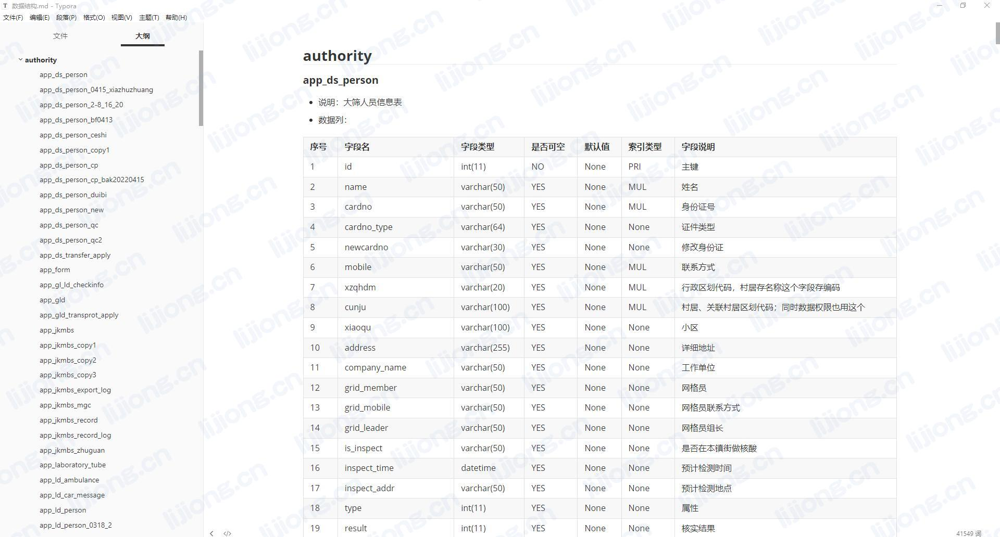

## **输出数据库内容为Markdown文件**

### 输出MySQL数据结构



```python
from sqlalchemy import create_engine
from urllib.parse import quote_plus

conn_str = 'mysql+pymysql://root:%s@********:3306/information_schema?charset=utf8' % quote_plus('********')
conn = create_engine(conn_str, echo=True)

fs = open('数据结构.md', 'w', encoding='utf-8')


def print_schema():
    pre_table_schema = ''
    pre_table_name = ''
    sql = f"""
        select 
             t1.table_schema 数据库
            ,t1.table_name 表名
            ,t2.table_comment 表说明
            ,t1.ordinal_position 字段编号
            ,t1.column_name 字段名
            ,t1.column_type 字段类型
            ,t1.is_nullable 是否可空
            ,t1.column_default 默认值
            ,t1.column_key 索引类型
            ,t1.column_comment 字段说明
        from information_schema.columns t1
        join information_schema.tables t2
        on t1.table_schema = t2.table_schema
        and t1.table_name = t2.table_name
        """
    sql_res = conn.execute(sql)
    for row in sql_res:
        cur = dict()
        for k, v in row._mapping.items():
            cur[k] = v
        table_schema = cur.get('数据库')
        table_name = cur.get('表名')
        table_comment = cur.get('表说明')
        ordinal_position = cur.get('字段编号')
        column_name = cur.get('字段名')
        column_type = cur.get('字段类型')
        is_nullable = cur.get('是否可空')
        column_default = cur.get('默认值')
        column_key = cur.get('索引类型')
        column_comment = cur.get('字段说明')
        if table_schema != pre_table_schema:
            write_table_schema(table_schema)
            pre_table_schema = table_schema
        if table_name != pre_table_name:
            write_table_name(table_name, table_comment)
            pre_table_name = table_name
        write_field(ordinal_position, column_name, column_type, is_nullable, column_default, column_key,
                    column_comment)


def write_table_schema(table_schema):
    print(f"""## {table_schema}
    """, file=fs)


def write_table_name(table_name, table_comment):
    print(f"""#### {table_name}""", file=fs)
    print(f"""- 说明：{table_comment}""", file=fs)
    print(f"""- 数据列：""", file=fs)
    print(f"""|序号|字段名|字段类型|是否可空|默认值|索引类型|字段说明|""", file=fs)
    print(f"""|-|-|-|-|-|-|-|""", file=fs)


def write_field(ordinal_position, column_name, column_type, is_nullable, column_default, column_key, column_comment):
    print(f"""|{ordinal_position}|{column_name}|{column_type}|{is_nullable}|{column_default}|{column_key}|{column_comment}|""",
          file=fs)


print_schema()
```

### 输出整理表结构

```python
from sqlalchemy import create_engine
from urllib.parse import quote_plus
import pinyin

conn_str = 'mysql+pymysql://root:%s@********:3306/avatar?charset=utf8' % quote_plus('********')
conn = create_engine(conn_str, echo=True)

fs = open('数据结构.md', 'w', encoding='utf-8')


def print_schema():
    pre_t_name = ''
    sql = f"""
        select 
             t1.资源名称 资源名称
            ,t1.序号 序号
            ,t1.信息项 信息项
            ,t1.数据类型 数据类型
        from hlj_field t1
        """
    sql_res = conn.execute(sql)
    for row in sql_res:
        cur = dict()
        for k, v in row._mapping.items():
            cur[k] = v
        t_name = cur.get('资源名称')
        xh = cur.get('序号')
        zwmc = cur.get('信息项')
        # 提取中文首字母
        zdm = pinyin.get_initial(zwmc.split(' ')[0], delimiter="")
        sjgs = cur.get('数据类型')
        btx = '是'
        bz = ''

        if t_name != pre_t_name:
            write_table_name(t_name)
            pre_t_name = t_name
        write_field(xh, zdm, zwmc, sjgs, btx, bz)


def write_table_name(t_name):
    print(f"""#### {t_name}""", file=fs)
    print(f"""|序号|字段名|中文名称|数据格式|必填项|备注|""", file=fs)
    print(f"""|-|-|-|-|-|-|""", file=fs)


def write_field(xh, zdm, zwmc, sjgs, btx, bz):
    print(f"""|{xh}|{zdm}|{zwmc}|{sjgs}|{btx}|{bz}|""",
          file=fs)


print_schema()
```

