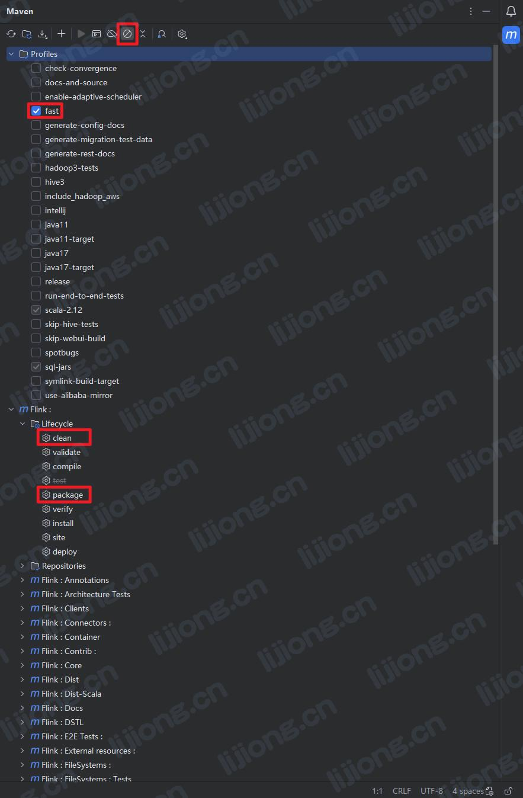
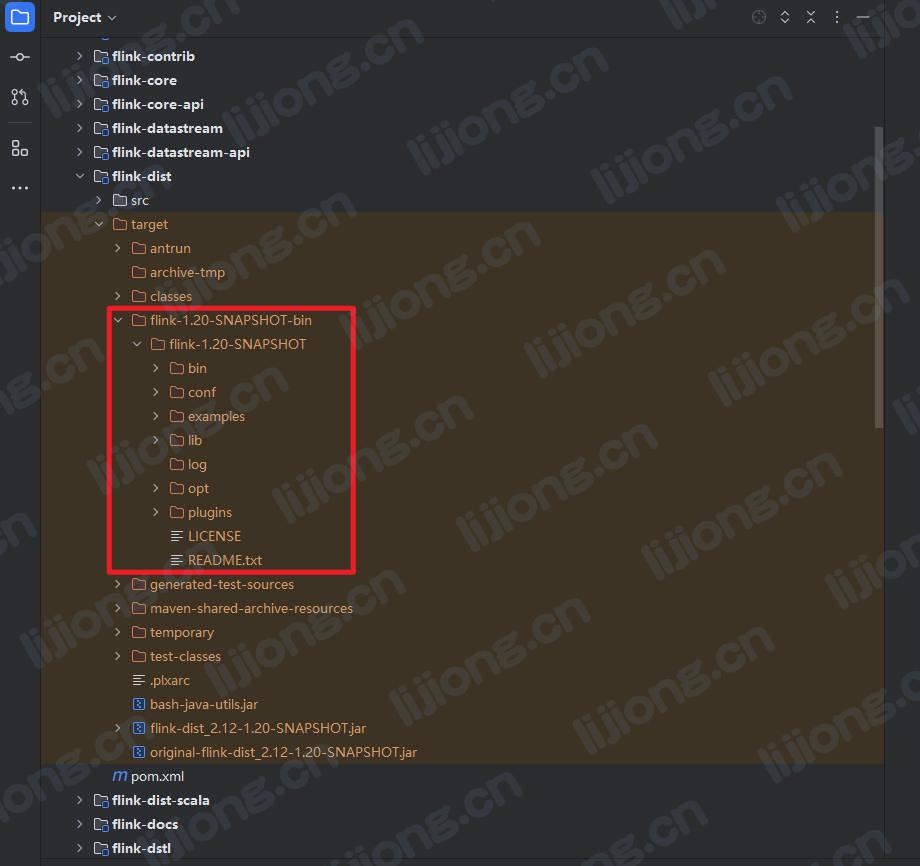

## Flink源码拉取与编译记录

### 拉取Flink源码

- Project from Version Control

### 配置编译环境

- Ctrl + Alt + Shift + S
  - Project Settings
    - SDK：1.8.0_202
  - Platform Settings
    - Global libraries：scala-sdk-2.12.7

### 源码编译生成安装包

- Maven
  - 配置文件勾选fast
  - 勾选skip tests
  - clean
  - package

- 安装包生成目录为flink-disk

