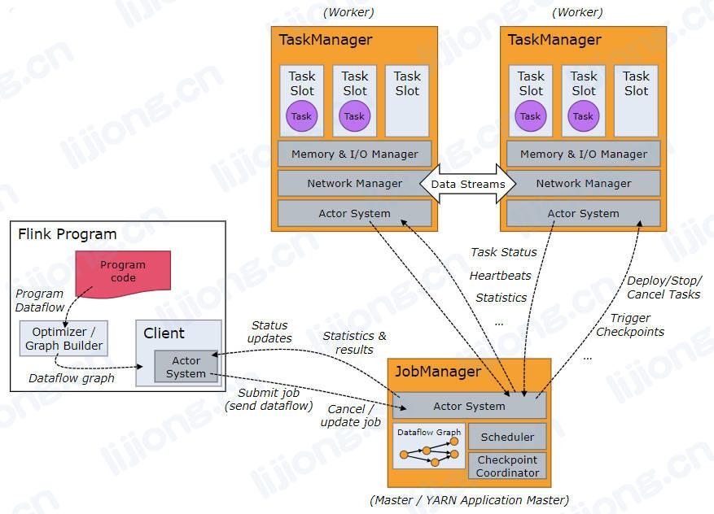

## **Flink的相关概念**

### 流计算相关理解

- 批计算：针对有界流，能够看到有界数据，能给出最终的确定结果。

- 流计算：针对无界流，要计算的数据仍处于不完整状态，持续不断地产生最新的结果，流计算输出的结果数据也是无界流。

- 流计算中也可以把无界流划分为有界流，然后对每一段有界流进行计算并输出结果，如根据条数或时间划分。

- 因为无界流可以划分为一段一段的有界流来计算，所有流计算可以兼容批计算。Flink将流计算和批计算进行了API层面的完全统一。

- 流计算作为批计算的补充存在，流计算擅长事件驱动型应用，批计算擅长报表型应用。

- Flink是一个分布式、有状态的实时流式处理系统。

- 分布式计算引擎：计算本身并不发生在用户所写的程序中，而是会被任务提交系统将代码中的逻辑转为task，然后提交到集群上分布式并行运行。

### Flink的运行时架构

#### Client

- 提交任务的客户端，可通过命令行或浏览器提交任务。负责构建StreamGraph和JobGraph的构建。

#### JobManager

- 负责集群和作业管理
- 协调Flink应用程序分布式执行，负责决定何时调度下一个或下一组task、对完成的task或执行失败做出反应、协调checkpoint、协调从失败中恢复等
- 包括三个组件
  - ResourceManager
    - 负责Flink集群中的资源提供、回收、分配，其管理task slots。Flink为Yarn、Kubernetes、standalone部署实现了对应的ResourceManager。
  - Dispatcher
    - 提供一个REST接口，用于提交Flink应用程序执行，并为每个提交的作业启动一个新的JobMaster，并且运行Flink WebUI来提供作业执行信息。
  - JobMaster
    - 负责管理单个JobGraph的执行，每个作业有自己的JobMaster。

#### TaskManager

- 负责执行计算任务
- 执行作业流的task，并且缓存和交换数据流。

### Flink的特点

- 自带状态管理机制
  - 可在重启时自动恢复宕机前的状态，用户只需专注于业务逻辑开发。
- 准确性保证
  - 精确一致性
  - 事件时间处理
  - 迟到数据处理
- 丰富的多层API
  - Stateful Stream Processing
    - processFunction
  - DataStream/DataSet API
    - 算子API
  - Table API
    - 与SQL逻辑对应的API
  - SQL

- 规模弹性扩展
  - 集群slots资源可扩展，算子任务实例可扩展。
  - 每一个算子都可以成为一个独立的task任务，也可根据需要将连续的多个算子合并为一个task。
    - Spark中一个stage是一个taskset，内部各算子并行度相同，Flink中可以对算子指定不同的并行度（如map—>filter）

### DataStream相关理解

- 代表一个数据流，可以是有界的或无界的。
- 类似于RDD，是不可变的。无法对一个DataStream添加、删除或修改元素，只能通过算子对其中的数据进行转换，将一个DataStrem转为另一个DataStream。
- DataStream可以通过Source算子加载、映射外部数据或从已存在的DataStream转换而来。

### JobManager

- Flink中的管理进程
- 管理TaskManager，生成Task
- 类似Spark中的Master+Driver

### TaskManager

- Flink中负责执行管理计算资源和执行SubTask的进程
- 类似Saprk中的Worker + Executor

### Client

- 提交任务的客户端，可以用命令行提交，也可以用浏览器提交

### Task

- 一个阶段多个功能相同的SubTask的集合
- 类似Spark中的TaskSet

### SubTask

- Flink中任务的最小执行单元，是一个Java类的实例，有属性和方法，完成具体的计算逻辑
- 类似Spark中的Task

### Operator Chain

- 没有shuffle的多个算子合并在SubTask中形成OperatorChain
- 类型Spark中的Pipeline

### Dataflow Graph

- 类似Spark中的DAG

### Slot

- 计算资源进行隔离的单元，一个Slot中可以运行多个SubTask，但这些SubTask必须来自统一Job的不同Task（阶段）

### State

- 任务运行过程中计算的中间结果

### Checkpoint

- 将中间计算结果持久化到指定存储系统的一直定期执行的机制

### StateBackend

- 用来存储中间计算结果的存储系统，Flink支持三种StateBackend：Memory、FsBackend、RocksDB
