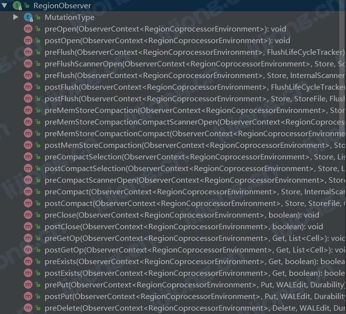

## **HBase的协处理器**

### 协处理器框架

- 协处理器可理解为服务端的拦截器，可根据需求确定拦截点，重写拦截点对应的方法，写的代码在RegionServer执行
- 协处理器允许用户执行region级的操作，使用与mysql中触发器trigger类似的功能
- 协处理器分两种类型
  1. 系统协处理器可以全局导入regionserver上的所有数据表
  2. 表协处理器可以由用户指定表使用协处理器
- 协处理器提供了两个不同方面的插件
  1. Observer：在regionserver上执行，自动执行
  2. Endpoint：在regionserver上执行，需要由客户端通过请求调用执行

### Observer编程接口

- 框架通过RegionCoprocessor接口的getRegionObserver方法，获取一个RegionObserver对象


- 然后调用RegionObserver的preXX或postXX方法对各种操作进行拦截处理





Flush\Put\get\memstoreCompaction

### 装载协处理器到HBase集群

#### 静态加载 --- 全局生效

- 修改配置文件 hbase-site.xml

```xml
<property>
<name>hbase.coprocessor.region.classes</name>
<value>org.myname.hbase.coprocessor.endpoint.SumEndPoint</value>
</property>

```

#### 动态加载 --- 指定表生效

- 将jar包上传到hdfs
- 禁用目标表
- 修改目标表的Coprocessor属性


```shell
alter 'users', METHOD => 'table_att', 'Coprocessor'=>'hdfs://<namenode>:<port>/user/<hadoop-user>/coprocessor.jar| org.myname.hbase.Coprocessor.RegionObserverExample|1073741823|
arg1=1,arg2=2'
```

> alter 'users'	----- 拦截的目标表
>
> METHOD => 'table_att'	----- 表示alter命令要对users表做属性修改操作, 默认
>
> hdfs://<namenode>:<port>/user/<hadoop-user>/coprocessor.jar	----- 协处理器类所在的jar包
>
> org.myname.hbase.Coprocessor.RegionObserverExample	----- 自定义的协处理器实现类
>
> 1073741823	----- 协处理器的执行顺序号
>
> arg1=1,arg2=2	-----  自定义协处理器所需要的参数


删除协处理器

```shell
alter 'user',METHOD => 'table_att_unset', NAME=> 'coprocessor$1'
```

### Observer Coprocessor示例

#### 需求

- 对粉丝 -> 被关注者表插入数据同时, 向被关注者 -> 粉丝表插入数据

  > t_follower
  >
  > rowkey---follower, columnfamily---f, qualifier---followed, value---followed
  >
  > 
  >
  > t_followed
  >
  > rowkey---followed, columnfamily---f, qualifier---follower, value---follower


#### Demo

```java
import org.apache.commons.logging.Log;
import org.apache.commons.logging.LogFactory;
import org.apache.hadoop.conf.Configuration;
import org.apache.hadoop.hbase.Cell;
import org.apache.hadoop.hbase.CellUtil;
import org.apache.hadoop.hbase.HBaseConfiguration;
import org.apache.hadoop.hbase.TableName;
import org.apache.hadoop.hbase.client.*;
import org.apache.hadoop.hbase.coprocessor.ObserverContext;
import org.apache.hadoop.hbase.coprocessor.RegionCoprocessor;
import org.apache.hadoop.hbase.coprocessor.RegionCoprocessorEnvironment;
import org.apache.hadoop.hbase.coprocessor.RegionObserver;
import org.apache.hadoop.hbase.wal.WALEdit;

import java.io.IOException;
import java.util.List;
import java.util.NavigableMap;
import java.util.Optional;

public class FollowerCoprocessor implements RegionCoprocessor, RegionObserver {

    @Override
    public Optional<RegionObserver> getRegionObserver() {

        return Optional.of(this);
    }

    /**
     * 拦截的具体逻辑，拦截put事件，工作在put动作执行之前
     * @param c
     * @param put
     * @param edit
     * @param durability
     * @throws IOException
     */
    @Override
    public void prePut(ObserverContext<RegionCoprocessorEnvironment> c, Put put, WALEdit edit, Durability durability) throws IOException {

        Log log = LogFactory.getLog(FollowerCoprocessor.class);
        log.info("--------------------------------------------entered coprocessor--------------------------------------------");
        
        // 解剖拦截到的put数据内容，rowkey:follower, columnfamily:f, qualifier:followed, value:followed
        // 获取行键 --- 粉丝, 获取列名 --- 被关注者
        NavigableMap<byte[], List<Cell>> familyCellMap = put.getFamilyCellMap();
        List<Cell> cells = familyCellMap.get("f".getBytes());

        Cell cell = cells.get(0);
        byte[] follower = CellUtil.cloneRow(cell);
        byte[] followed = CellUtil.cloneQualifier(cell);

        log.info("--------------------------------------------follower--------------------------------------------" + new String(follower));
        log.info("--------------------------------------------followed--------------------------------------------" + new String(followed));


        // 反转生成反向关注数据, rowkey:followed, columnfamily:f, qualifier:follower, value:follower
        // 将反向数据插入被关注者表
        Configuration conf = HBaseConfiguration.create();
        conf.set("hbase.zookeeper.quorum", "linux01:2181,linux02:2181,linux03:2181");

        Connection conn = ConnectionFactory.createConnection(conf);
        Table t_followed = conn.getTable(TableName.valueOf("t_followed"));

        Put put1 = new Put(followed);
        put1.addColumn("f".getBytes(), follower, follower);

        t_followed.put(put1);

        log.info("--------------------------------------------put is over--------------------------------------------");


        t_followed.close();
        conn.close();

    }
}
```


#### 装载测试

> create 't_follower','f'
>
> create 't_followed','f'
>
> disable 't_follower'
>
> alter 't_follower','coprocessor'=>'hdfs://linux01:9000/copjar/cop.jar|com.phoenixera.coprocessor.FollowerCoprocessor|1001|'
>
> enable 't_follower'


> hbase(main):009:0> put 't_follower','A','f:B','B'
> Took 0.4942 seconds                                                                                                         
> hbase(main):010:0> put 't_follower','A','f:C','C'
> Took 0.1336 seconds                                                                                                         
> hbase(main):011:0> scan 't_follower'
> ROW                              COLUMN+CELL                                                                                
> A                               column=f:B, timestamp=1568019929950, value=B                                               
> A                               column=f:C, timestamp=1568019952147, value=C                                               
> 1 row(s)
> Took 0.0575 seconds                                                                                                         
> hbase(main):012:0> scan 't_followed'
> ROW                              COLUMN+CELL                                                                                
> B                               column=f:A, timestamp=1568019929882, value=A                                               
> C                               column=f:A, timestamp=1568019952108, value=A                                               
> 2 row(s)
> Took 0.1614 seconds 