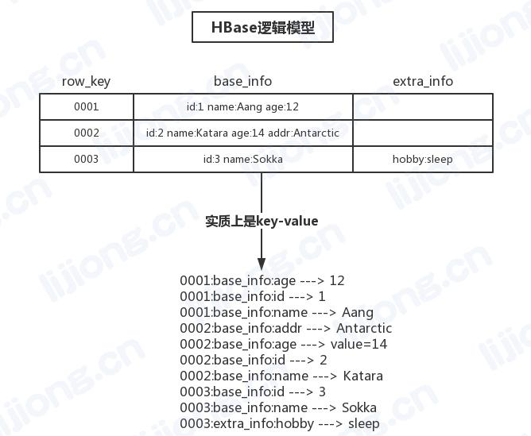
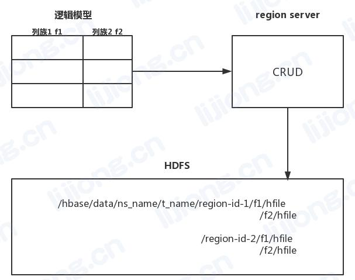

## **HBase的数据模型**

### 逻辑模型

- HBase中的数据存储在表中，HBase的表是schema less的表，没有字段的定义、类型约束
- 表中的数据以key-value的形式存在，而且HBase会对完整key按字典顺序排序
- 一个完整的key包含：rowkey-columnfamily-qualifier
- 一个value是一个任意数据序列化后的二进制字节数组
- HBase的表在纵向上划分为columnfamily，在横向上划分为region[startrow, endrow)
- 一个region只会交给一台regionserver负责

### 物理模型

- 表中的数据在物理上是以key-value的形式存储的
- 不同region种的数据在不同的目录中
- 同意个region中不同列族的数据在不同的目录中