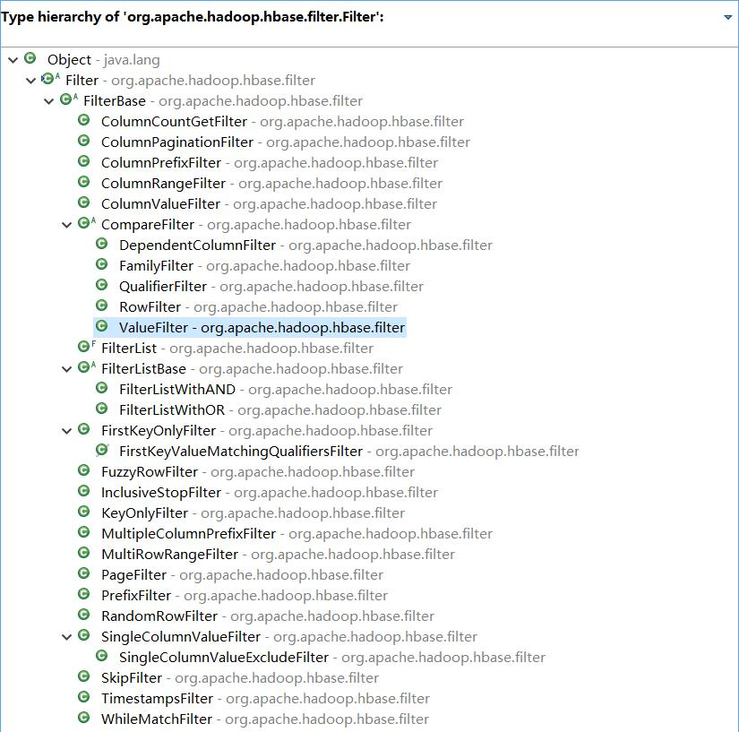
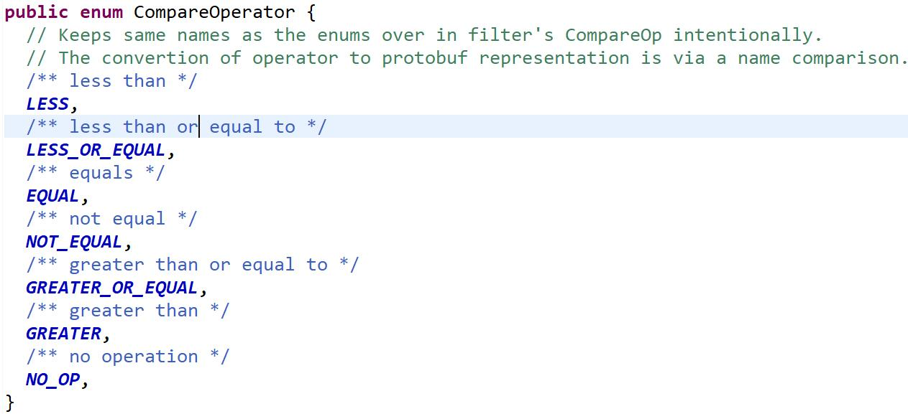
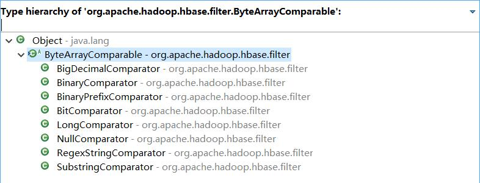

## **HBase的过滤器**

### HBase中提供的过滤器体系




### 比较过滤器CompareFilter

- 一个过滤器对条件的表达分为比较运算符和比较目标
  - 比较运算符：>、>=、<、<=、==、!=
  - 比较目标：字节、long数值、正则、子串、前缀...

- 条件表达中的运算符




- 条件表达中的比较器



### 基于行键的过滤器

#### PrefixFilter

- 行键前缀过滤器

- 筛选出具有特定前缀的行键的数据

```java
PrefixFilter filter = new PrefixFilter(Bytes.toBytes("prefix"));
```

#### PageFilter

- 分页过滤器

- 基于行的分页，返回的行数并不一定是指定的行数，由于Hbase的存储特性，scan在并行扫描不同Region服务器时并不能做到共享他们各自已经筛选的行数，因此返回的行数极有可能超过设定的值

```java
PageFilter filter = new PageFilter(10);
```

#### InclusiveStopFilter

- 包含结束行键的过滤器
- scan操作时不包含结束行的，使用此过滤器可将结束行包含在结果内

```java
InclusiveStopFilter filter = new InclusiveStopFilter("r003".getBytes());
```

#### RandomRowFilter

- 随机行过滤器
- 按照一定的机率返回随机的结果集
- chance小于等于0会过滤所有行，大于等于1会包含所有行

```java
RandomRowFilter filter = new RandomRowFilter(0.5F);
```

### 基于列的过滤器

#### ColumnPaginationFilter

- 列分页过滤器
- 设置参数1返回数量和参数2偏移量

```java
ColumnPaginationFilter filter = new ColumnPaginationFilter(10, 5);
```

#### ColumnCountGetFilter

- 列计数过滤器
- 返回限定数量的列，适合get操作，scan操作时若某一行的列数量超过指定数量，不会继续扫描下一行

```java
ColumnCountGetFilter filter = new ColumnCountGetFilter(5);
```

#### KeyOnlyFilter

- 行键过滤器
- 只返回每行的行键

```java
KeyOnlyFilter filter = new KeyOnlyFilter();
```

#### FirstKeyOnlyFilter

- 首列过滤器
- 只返回每行的第一列key-value

```java
FirstKeyOnlyFilter filter = new FirstKeyOnlyFilter();
```

#### ColumnPrefixfilter

- 列前缀过滤器

```java
ColumnPrefixFilter filter = new ColumnPrefixFilter("a".getBytes());
```

#### MultipleColumnPrefixFilter

- 多个列前缀过滤器

```java
byte[][] prefixes = {"s".getBytes(),"g".getBytes()};
MultipleColumnPrefixFilter filter = new MultipleColumnPrefixFilter(prefixes);
```

#### ColumnRangFilter

- 列名范围匹配过滤器
- 参数1列范围最小值，参数2是否包含最小值，参数3列范围最大值，参数4是否包含最大值

```java
ColumnRangeFilter filter = new ColumnRangeFilter("g".getBytes(), true, "s".getBytes(), false);
```

### 基于单元值的过滤器

#### SingleColumnValueFilter

- 单列值过滤器

- 指定列族和列名，比较列值，进行过滤，返回整行数据
- setFilterIfMissing(true/false)如果某行不存在该列，是否过滤掉

```java
SingleColumnValueFilter filter = new SingleColumnValueFilter("f1".getBytes(), "age".getBytes(),CompareOperator.GREATER , "13".getBytes());
filter.setFilterIfMissing(false);
```

#### SingleColumnValueExcludeFilter

- 单列值不包含过滤器
- 返回的结果不包含指定的列

```java
SingleColumnValueExcludeFilter filter = new SingleColumnValueExcludeFilter("f1".getBytes(), "age".getBytes(),CompareOperator.GREATER , "13".getBytes());
filter.setFilterIfMissing(false);
```

### 其他过滤器

#### SkipFilter

- 搭配其他过滤器使用，若某行有一列不满足条件则过滤掉

```java
ValueFilter filter = new ValueFilter(CompareOperator.GREATER, new BinaryComparator("14".getBytes()));
SkipFilter skipFilter = new SkipFilter(filter);
scan.setFilter(skipFilter);
```

#### TimestampsFilter

- 时间戳过滤器

```java
TimestampsFilter filter = new TimestampsFilter(List<Long> timestamps);
```

### Demo


```java
import java.util.Iterator;

import org.apache.hadoop.conf.Configuration;
import org.apache.hadoop.hbase.Cell;
import org.apache.hadoop.hbase.CellUtil;
import org.apache.hadoop.hbase.CompareOperator;
import org.apache.hadoop.hbase.HBaseConfiguration;
import org.apache.hadoop.hbase.TableName;
import org.apache.hadoop.hbase.client.Connection;
import org.apache.hadoop.hbase.client.ConnectionFactory;
import org.apache.hadoop.hbase.client.Result;
import org.apache.hadoop.hbase.client.ResultScanner;
import org.apache.hadoop.hbase.client.Scan;
import org.apache.hadoop.hbase.client.Table;
import org.apache.hadoop.hbase.filter.BinaryComparator;
import org.apache.hadoop.hbase.filter.BinaryPrefixComparator;
import org.apache.hadoop.hbase.filter.ByteArrayComparable;
import org.apache.hadoop.hbase.filter.ColumnPrefixFilter;
import org.apache.hadoop.hbase.filter.FamilyFilter;
import org.apache.hadoop.hbase.filter.Filter;
import org.apache.hadoop.hbase.filter.PrefixFilter;
import org.apache.hadoop.hbase.filter.RowFilter;
import org.apache.hadoop.hbase.filter.ValueFilter;
import org.junit.After;
import org.junit.Before;
import org.junit.Test;

public class FilterDemo {
	
	Connection conn = null;
	Table t1 = null;
	
	@Before
	public void init() throws Exception {
		
		Configuration conf = HBaseConfiguration.create();
		conf.set("hbase.zookeeper.quorum", "linux01:2181,linux02:2181,linux03:2181");
		conn = ConnectionFactory.createConnection(conf);
		t1 = conn.getTable(TableName.valueOf("t1"));
	}
	
	// 自定义规则的行键过滤器
	@Test
	public void testRowFilter() throws Exception {
		
		Scan scan = new Scan();
		
		// 指定一个比较运算符
		CompareOperator op_less = CompareOperator.LESS;
		
		// 指定一个比较参考对象
		ByteArrayComparable prefixCmp = new BinaryPrefixComparator("r003".getBytes());
		
		// 构造行键过滤器，传入比较运算符和比较的参考对象
		Filter filter = new RowFilter(op_less, prefixCmp);// 条件：数据的行键的前缀小于r003
		
		// 设置过滤器
		scan.setFilter(filter);
		
		ResultScanner scanner = t1.getScanner(scan);
		printResult(scanner);
		
	}
	
	// 封装好的前缀过滤器
	@Test
	public void testPrefixFilter() throws Exception {
		
		Scan scan = new Scan();
		PrefixFilter filter = new PrefixFilter("r".getBytes());
		scan.setFilter(filter);
		ResultScanner scanner = t1.getScanner(scan);
		printResult(scanner);
		
	}
	
	// 自定义规则的列族过滤器
	@Test
	public void testFamilyFilter() throws Exception {
		
		Scan scan = new Scan();
		FamilyFilter filter = new FamilyFilter(CompareOperator.EQUAL, new BinaryComparator("f1".getBytes()));
		scan.setFilter(filter);
		ResultScanner scanner = t1.getScanner(scan);
		printResult(scanner);
		
	}
	
	// 封装好的列名前缀过滤器
	@Test
	public void testColumnPrefixFilter() throws Exception {
		
		Scan scan = new Scan();
		ColumnPrefixFilter filter = new ColumnPrefixFilter("a".getBytes());
		scan.setFilter(filter);
		ResultScanner scanner = t1.getScanner(scan);
		printResult(scanner);
		
	}
	
	// 自定义规则的value过滤器
	@Test
	public void testValueFilter() throws Exception {
		
		Scan scan = new Scan();
		ValueFilter filter = new ValueFilter(CompareOperator.GREATER_OR_EQUAL, new BinaryComparator("14".getBytes()));
		scan.setFilter(filter);
		ResultScanner scanner = t1.getScanner(scan);
		printResult(scanner);
		
	}
	
	public void printResult(ResultScanner scanner) {
		Iterator<Result> iter = scanner.iterator();
		while(iter.hasNext()) {
			Result rs = iter.next();
			while(rs.advance()) {
				Cell cell = rs.current();
				byte[] cloneRow = CellUtil.cloneRow(cell);
				byte[] cloneFamily = CellUtil.cloneFamily(cell);
				byte[] cloneQualifier = CellUtil.cloneQualifier(cell);
				byte[] cloneValue = CellUtil.cloneValue(cell);
				String r = new String(cloneRow);
				String f = new String(cloneFamily);
				String q = new String(cloneQualifier);
				String v = new String(cloneValue);	
				System.out.println(r + " -> " + f + " -> " + q + " -> " + v);
			}
		}
	}
	
	@After
	public void cleanup() throws Exception {
		t1.close();
		conn.close();
	}
}
```