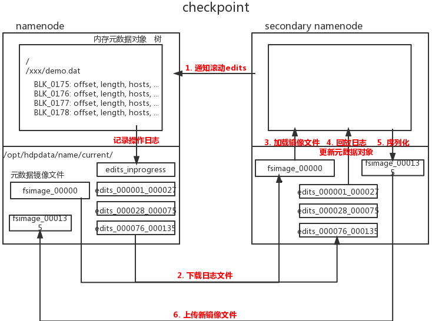

## **HDFS的Checkpoint机制**

### Checkpoint机制

- NameNode负责管理元数据，元数据存在内存中，但在磁盘上有元数据镜像文件FSimage和操作日志文件edits

  内存中的元数据和磁盘镜像文件有状态差，状态差体现在操作日志文件中

  SecondaryNameNode会定期将NameNode上的操作日志文件下载到本地，跟上一个状态的镜像文件合并，得到新的镜像文件并上传给NameNode，让NameNode的镜像文件和内存元数据状态差保持在一个比较小的范围

- 触发条件：时间间隔、操作事件次数、操作日志文件数目

  1分钟检查一次是否触发触发条件，两次checkpoint间的最大周期是1小时，最大操作记录是100万，最大操作日志保留数目是100万

1. 达到触发条件后，Secondary NameNode通知NameNode滚动操作日志
2. Secondary NameNode下载元数据镜像文件和操作日志
3. Secondary NameNode加载镜像文件，回放操作日志更新元数据对象，再序列化为新的镜像文件上传到NaemNode