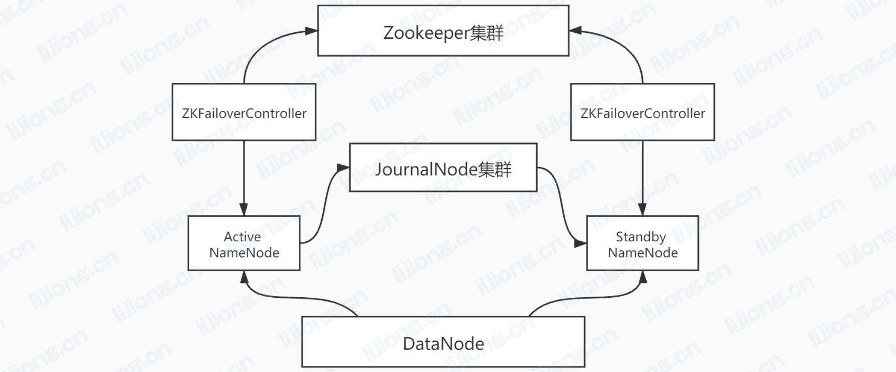
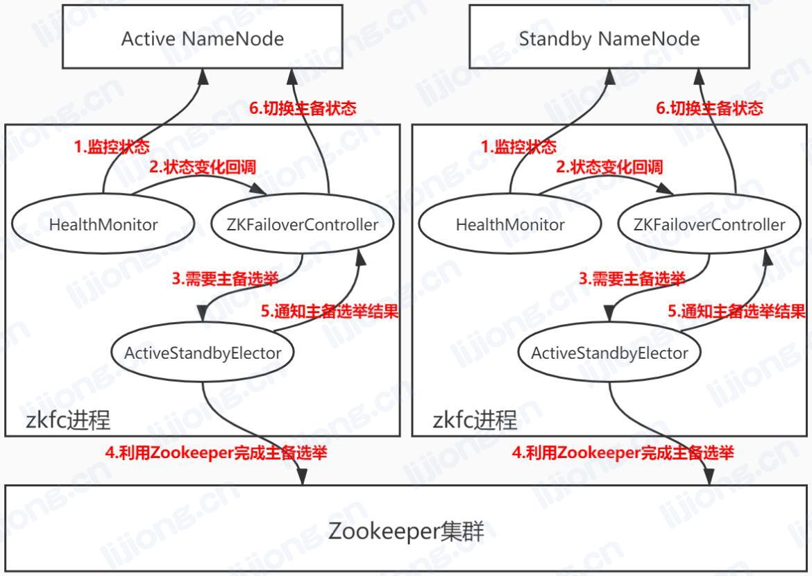

## **HDFS的HA机制**

### ZKFailoverController进程

ZKFailoverController是NameNode机器上的一个独立进程，在启动时会创建HealthMonitor和ActiveStandbyElector两个内部组件，并向这两个组件注册相应的回调方法

HealthMonitor主要负责检测NameNode健康状态，若NameNode状态发生变化，则回调ZKFailoverController相应方法进行自动的主备选举

ActiveStandbyElector负责完成自动的主备选举，内部封装了Zookeeper的处理逻辑，一旦Zookeeper主备选举完成，则回调ZKFailoverController相应方法进行NameNode的主备状态切换

### NameNode主备切换流程

1. HealthMonitor初始化完成后启动内部线程来定时调用NameNode的HAServiceProtocol (RPC)接口的方法，监控健康状态
2. HealthMonitor如果监控到NameNode的健康状态发生变化，会回调ZKFailoverController注册的相应方法进行通知
3. 如果ZKFailoverController判断需要进行主备切换，会通过ActiveStandbyElector来进行自动的主备选举
4. ActiveStandbyElector与Zookeeper进行交互完成自动的主备选举
5. ActiveStandbyElector在主备选举完成后，回调ZKFailoverController的相应方法来通知主备选举结果
6. ZKFailoverController调用对应NameNode的HAServiceProtocol接口的方法将NameNode转换位Active状态或Standby状态

### HAServiceProtocol接口的方法

- getServiceStatus

- monitorHealth
- transitionToActive
- transitionToStandby

### HealthMonitor实现

HealthMonitor在内部启动一个线程来循环调用NameNode的HAServiceProtocol接口的方法来检测NameNode的状态， 并将状态的变化通过回调的方式通知ZKFailoverController

HealthMonitor通过调用HAServiceProtocol接口的方法获取NameNode节点两类状态：健康状态和HA状态

- monitorHealth方法获取健康状态HealthMonitor.State，主要是磁盘存储资源是否充足，起主要作用
  - INITIALIZING：HealthMonitor在初始化过程中，还未开始健康检测
  - SERVICE_HEALTHY：状态正常
  - SERVICE_NOT_RESPONDING：monitorHealth方法无响应或响应超时
  - SERVICE_UNHEALTHY：monitorHealth方法返回状态不正常，磁盘存储资源不足
  - HEALTH_MONITOR_FAILED：HealthMonitor自己发生异常，不能继续检测NameNode健康状态，会导致ZKFailoverController进程退出
- getServiceStatus方法获取HA状态HAServiceStatus，起辅助作用
  - INITIALIZING：NameNode在初始化过程中
  - ACTIVE：当前NameNode为主NameNode
  - STANDBY：当前NameNode为备NameNode
  - STOPPING：当前NameNode已停止

### ActiveStandbyElector实现

利用Zookeeper的写一致性和临时节点机制完成主备选举

- 创建锁节点

  主备选举的过程是尝试在Zookeeper的一个路径下创建临时节点ActiveStandbyElectorLock，Zookeeper的写一致性会保证只有一个ActiveStandbyElector创建成功，创建成功的ActiveStandbyElector对应的NameNode成为主NameNode，失败的成为备NameNode

- 注册Watcher监听

  不管创建节点是否成功，ActiveStandbyElector都会向Zookeeper注册一个Watcher来监听这个节点的状态变化时间，主要是NodeDeleted事件

- 自动触发主备选举

  如果Active NameNode对应的HealthMonitor检测到NameNode状态异常，ZKFailoverController会主动删除在Zookeeper上建立的临时节点

  如果Active NameNode所在的机器整个宕掉，根据Zookeeper的临时节点特性，节点会被自动删除

  处于Standby NameNode上的ActiveStandbyElector注册的监听器就会收到这个节点的NodeDeleted事件，再次进入创建节点流程，如果创建成功，这个处于Standby状态的NameNode就被选举为主NameNode

- 防止假死引发脑裂

  ActiveStandbyElector在创建Zookeeper上的ActiveStandbyElectorLock节点从而成为Active NameNode后，会创建一个ActiveBreadCrumb持久节点，这个节点保存了这个Active NameNode的地址信息

  Active NameNode的ActiveStandbyElector在正常状态下关闭Zookeeeper Session时，会一起删除这个持久节点

  如果在异常状态下关闭Zookeeper Session，不会是删除这个持久节点，当另一个NameNode选主成功后，会注意到这个留下来的节点，回调ZKFailoverController的方法对旧的Active NameNode进行fencing隔离

### ZKFailoverController实现

- 对HealthMonitor状态变化的处理

  - HealthMonitor.State起主要作用

    状态为健康时，当前的NameNode有资格参加主备选举，如果还未进行过主备选举，ZKFailoverController会调用ActiveStandbyElector的joinElection方法发起一次主备选举 

    状态为不健康或未响应，ZKFailoverController会调用ActiveStandbyElector的quitElection方法删除临时节点退出主备选举

  - HAServiceStatus起辅助作用

    HAServiceStatus发生变化时，ZKFailoverController注册到HealthMonitor上的处理HAServiceStatus状态变化的回调函数会判断NameNode返回的HAServiceStatus和ZKFailoverController所期望的是否一致，如果不一致，ZKFailoverController会调用ActiveStandbyElector的quitElection方法删除临时节点退出主备选举

- 对ActiveStandbyElector主备选举状态变化的处理

  - ActiveStandbyElector选主成功，ActiveStandbyElector会回调ZKFailoverController的becomeActive方法，这个方法调用NameNode的HAServiceProtocol接口的transitiontoActive方法
  - ActiveStandbyElector选主失败，ActiveStandbyElector会回调ZKFailoverController的becomeStandby方法，这个方法调用NameNode的HAServiceProtocol接口的transitiontoStandby方法

  - ActiveStandbyElector选主成功后，发现上一个Active NameNode留下的ActiveBreadCrumb节点，ActiveStandbyElector会首先回调ZKFailoverController注册的fenceOldActive方法
    1. 首先尝试调用上一个Active NameNode的HAServiceProtocol接口的transitionToStandby方法
    2. 如果transitionToStandby方法调用失败，执行Hadoop配置文件中预定义的隔离措施，通常是sshfence
       - sshfence：杀死对应进程
       - shellfence：执行用户自定义的shell脚本进行隔离

### 基于QJM的共享存储实现

- 基于QJM（Quorum Journal Manager）的共享存储系统用于保存EditLog，FSImage文件还是在NameNode的本地磁盘上

- 多个JournalNode节点组成集群，每个JournalNode保存同样的EditLog副本

- Active NameNode首先把EditLog提交到JournalNode集群，然后Standby NameNode再从JournalNode集群定时同步EditLog

- 每次NameNode写EditLog时，除了向本地磁盘写入外，会并行地向JournalNode集群中的每个JournalNode发送写请求，只要大多数的JournalNode节点返回成功就认为想JournalNode集群写入成功