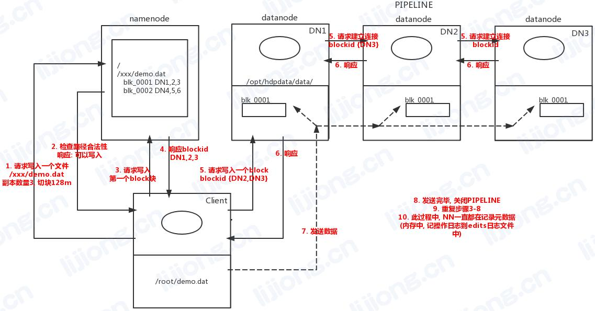

## **HDFS的写入读取机制**

### 写入机制

1. Client向NameNode请求写入一个文件，附带路径、副本数量、切块大小
2. NameNode检查路径合法性，响应可以写入
3. Client请求写入第一个Block块
4. NameNode响应blockid以及三台DataNode1、2、3
5. Client向DataNode1请求写入一个Block，附带blockid，还有DataNode2、3
   DataNode1向DataNode2请求建立连接，附带blockid，还有DataNode3
   DataNode2向DataNode3请求建立连接，附带blockid
6. DataNode3响应DataNode2
   DataNode2响应DataNode1
   DataNode1响应Client，pipeline构建完成
7. Client发送数据给DataNode1
   DataNode1将数据写入同时发送给DataNode2
   DataNode2将数据写入同时发送给DataNode3
8. 发送完毕，关闭pipeline
9. Client请求写入下一个Block
10. 过程中，NameNode记录元数据

***
### 读取机制

1. Client向NameNode请求读取一个文件
2. NameNode响应文件的元数据，blockid、大小、存储位置
3. Client向最近的一台DataNode请求读取第一个Block
4. DataNode向Client发送数据
5. 第一个Block读取完后，若还需要继续读，Client向最近的一台DataNode请求读取下一个Block