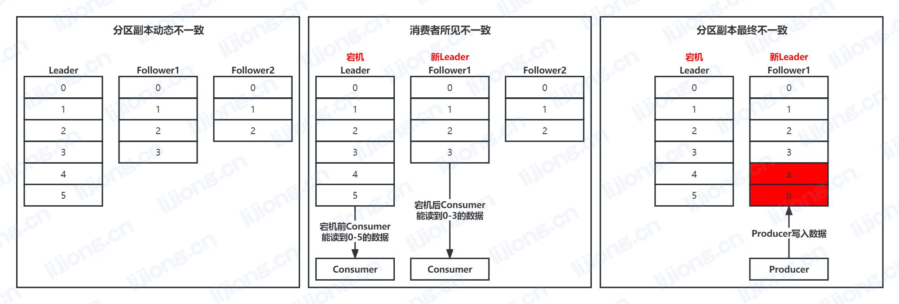
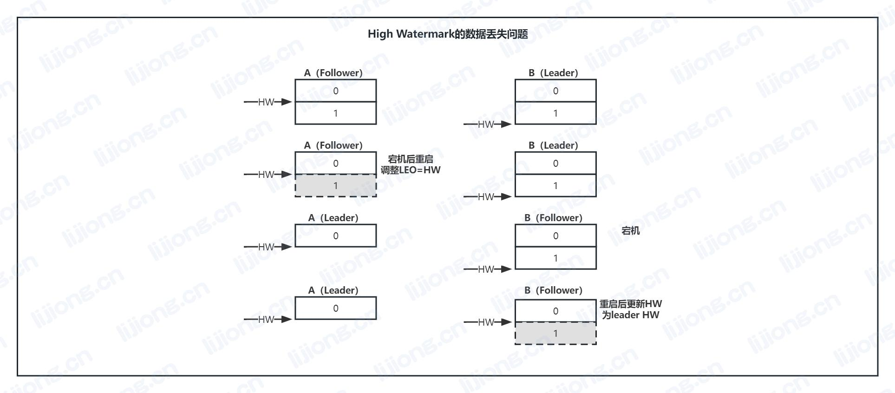
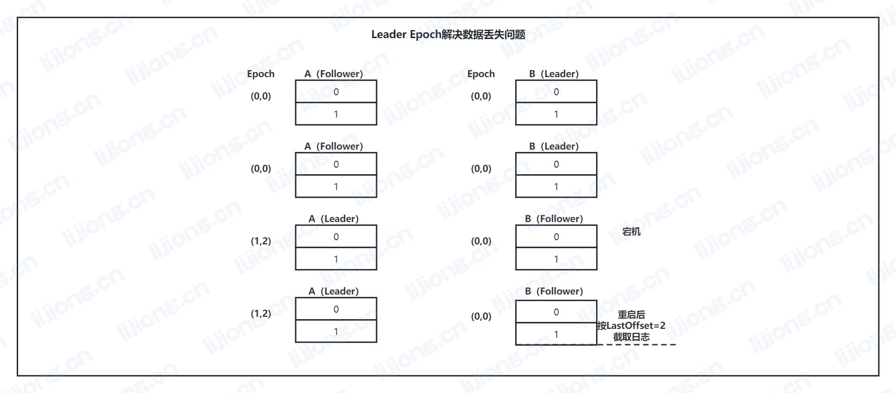

## **Kafka的一致性实现机制**

- Kafka优先考虑**可用性（Availability）**和**分区容错性（Partition tolerance）**，兼顾一致性（Consistency）

### 分区副本机制

- Kafka通过副本和Leader动态选举提高了可用性和分区容错性，同时带来数据一致性问题

  - 分区副本动态不一致

    - Follower定期向Leader请求数据，副本间存在数据不一致

  - 消费者所见不一致

    - 消费者从Leader读取数据，Leader宕机后，从Follower中选举新Leader，消费者能读取到的数据不一致

  - 分区副本最终不一致
    - 消费者从Leader读取数据，Leader宕机后，从Follower中选举新Leader，生产者向新Leader写入数据，同样消费位移的数据不一致

### High Watermark机制

- High Watermark定义消息的可见性，表示数据在多副本间备份的进度

- 尝试解决消费者所见不一致，在动态不一致过程中，维护一条临时一致线High Watermark，消费者只能读到High Watermark以下的数据
- 尝试解决分区副本最终不一致，Follower根据High Watermark对自己的数据进行截断，来保持和新Leader的一致

#### High Watermark的维护

- LEO：last end offset，副本中最大的消费位移+1
- ISR：in-sync replicas，与leader的同步进度处于配置阈值之内的副本，replica.fetch.wait.max.ms（默认30000，30s）

- Leader记录所有副本中的LEO为remote LEO，High Watermark为ISR中最小的LEO，Follower向Leader请求数据时，附带自己的offset，Leader根据Follower的remote LEO响应对应的数据，同时发送目前的High Watermark

  1. Follower向Leader发送fetch请求，附带最新的offset，Leader没有新数据，不会进行数据同步

  2. Producer发送新数据到Leader，写入该消息后Leader更新LEO=2

  3. Follower向Leader发送fetch请求，附带最新的offset=0，Leader更新remote LEO=1，对比LEO，取最小值为HW=1

     Leader响应数据及leader HW=1给Follower，Follower写入消息后，更新LEO=2，同时更新follower HW=1

  4. Follower向Leader发送fetch请求，附带最新的offset=1，Leader更新remote LEO=2，对比LEO，取最小值为HW=2

     Leader没有新数据，响应leader HW=2给Follower，Follower更新follower HW=2

- 存在问题：High Watermark的更新落后于数据同步进度，只依赖High Watermark，acks设为all依然可能数据丢失或不一致，Producer已发送数据并写入各副本，但High Watermark未更新时，更换leader，会截断已发送但未更新HW部分的数据

#### High Watermark的数据丢失问题

1. 最新消息已同步，但B（Leader）的HW比A（Follower）大1
2. A（Follower）在此时宕机，未能通过下一轮请求来更新HW
3. A（Follower）重启后，将LEO值调整到之前的HW值，进行日志截断
4. B（Leader）宕机，A成为新的Leader
5. B（Follower）重启后，向A（Leader）发送fetch请求，根据leader HW更新HW，进行日志截断，导致已同步的offsets=1数据丢失

#### High Watermark的数据不一致问题

1. 最新消息已同步，但B（Leader）的HW比A（Follower）大1
2. A（Follower）在此时宕机，未能通过下一轮请求来更新HW
3. A（Follower）重启后，将LEO值调整到之前的HW值，进行日志截断
4. B（Leader）宕机，A成为新的Leader，并接收新数据，更新HW
5. B（Follower）重启后，向A（Leader）发送fetch请求，根据leader HW不需要更新HW，导致分区副本最终不一致

### Leader Epoch机制

#### Leader Epoch的维护

- Leader Epoch是记录leader版本的机制，leader每换届一次，纪元号增加1

  - 副本成为Leader

    - 更新Leader Epoch及LEO，并写入topic-partition下的leader-epoch-checkpoint文件

  - 副本成为Follower

    - 发送LeaderEpochRequest请求给Leader，附带自己当前的Epoch版本
    - Leader响应LastOffset，如果Follower和Leader的Epoch相同，则LastOffset为Leader的LEO，否则LastOffset为Leader中比Follower的Epoch大的最小Epoch的起始offset
    - Follower按LastOffset截断日志，然后发送fetch请求与Leader保持数据同步，同时更新Epoch（Follower的Epoch在同步新数据时才更新）

#### Leader Epoch解决数据丢失和不一致问题

- Leader Epoch机制下，acks设为all可避免数据丢失或不一致

