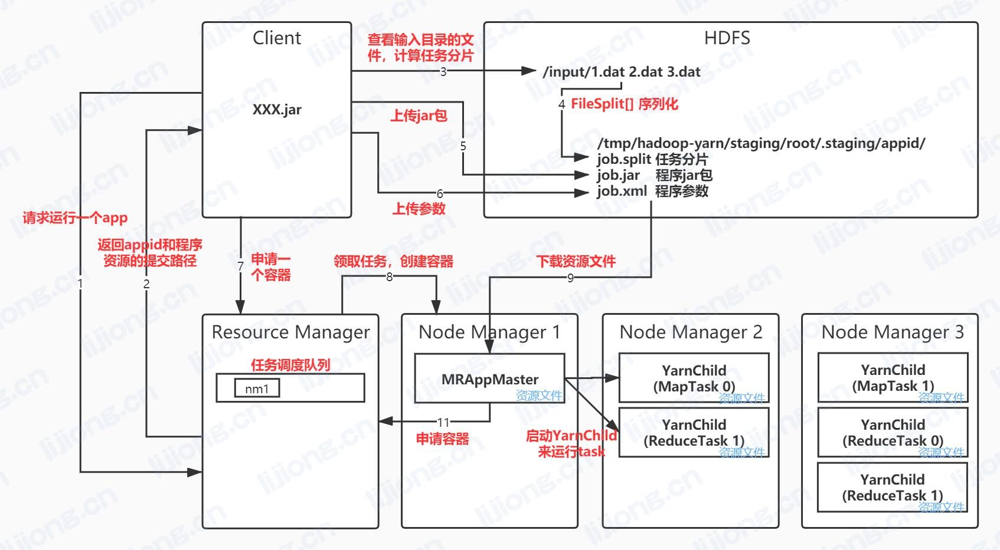

## **MR在Yarn上的运行流程**

1. Client向Resource Manager申请运行一个app
2. Resource Manager返回一个appid和提交app程序资源的路径
3. Client查看输入目录的文件，计算任务分片，得到切片计算结果，一个FileSplit[]数组
4. 序列化任务切片信息数组到资源提交路径
5. 上传app所在的jar包文件
6. 序列化job中设置的所有参数为一个xml文件，上传到资源提交路径
7. Client向Resource Manager申请一个容器，Resource Manager将申请放入任务调度队列
8. Resource Manager将任务指派给其中一台Node Manager
9. Node Manager领取创建容器任务
10. Node Manager创建容器，下载app资源文件(job.jar、split.job、job.xml)到容器的磁盘目录
11. 容器启动MRAppMaster(split文件片->map数，job.xml参数->reduce数)
12. MRAppMaster向Resource Manager申请容器，Resource Manager将申请放入任务调度队列
13. Node Manager领取创建容器任务
14. Node Manager创建容器，下载app资源文件到容器的磁盘目录
15. MRAppMaster发送指令启动各个YarnChild，传参任务类型和编号
16. maptask运行完输出结果到容器目录，MapTask运行完后向MRAppMaster注销自己
17. MRAppMaster通知reducetask文件位置，reducetask通过maptask所在的Node Manager下载文件
18. ReduceTask运行完后向MRAppMaster注销自己
19. 全部任务运行完后MRAppMaster向Resource Manager注销自己