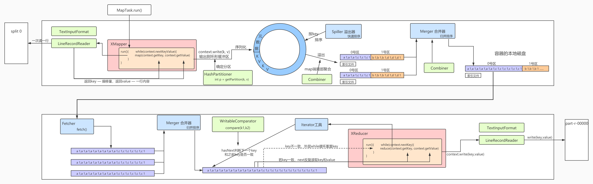

## **MapReduce的数据处理流程**

1. MapTask的run方法调用Mapper对象的run方法

2. run方法通过while(nextKeyValue())反复调用TextInputFormat构造LineRecordReader读取InputSplit数据

   一次读一行，返回偏移量作为key，内容作为value，传给map方法处理

3. map方法中的context.write(key, value)输出序列化后的key、value到环形缓冲区

4. context.write将数据输出到环形缓冲区前会调用Partitioner确定分区，默认HashPartitioner

   getPartition(k, v, numReduceTasks)返回分区编号

5. 环形缓冲区是一个byte数组，默认100M，从equator两侧一侧写kv一侧写kv的元数据meta信息

   元数据为4个字节：keystart、valstart、vallen、partition

6. 环形缓冲区使用空间到80%时，先对数据进行区内排序然后溢出写到文件，附带索引文件

7. Merger将多次溢出的小文件合并，归并排序，输出一个文件，附带索引文件

8. Fetcher的fetch方法下载所有map输出文件中相应区的数据

9. Merger将文件合并，归并排序，附带索引文件

10. Reducer的run方法通过while(context.netKey)先读一个key，传给reduce(key, iter, context)方法，迭代器读取value

11. Iterator工具通过hasNext判断下一个key和之前的key是否一致，若一致则通过next反复读取key和value，key重新传到reduce(key, iter, context)方法，value作为返回值，若key不一致，reduce方法结束，外层while循环重置key

12. 通过GroupingComparator判断相邻的两个key是否同一组，默认WritableComparator

    通过compare(k1, k2)方法，如果key对象有compare方法则调用，若没有则比较序列化后的二进制序列，完全一致返回0则是同一组

13. 每处理完一组，context.write(key, value)方法调用TextOutputFormat构造的LineRecorderWriter将数据写到文件系统