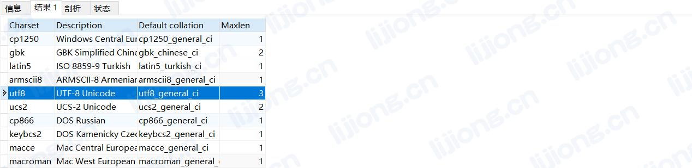
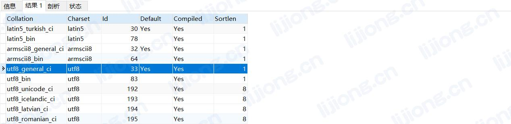

## **MySQL中utf8的校对规则**

Mysql中utf8字符集默认是不区分内容大小写的，因为默认校对规则是utf8_general_ci

**utf8_general_ci**：ci为case insensitive的缩写，不区分大小写

**utf8_bin**：将字符串中的每一个字符用二进制数据存储，区分大小写


```sql
show character set
```




```sql
show collation
```




建表时指定校对规则：

```sql
CREATE TABLE test.test (
	Column1 BIGINT(20) auto_increment NOT NULL COMMENT 'Column1',
	Column2 varchar(100) DEFAULT 0 NULL COMMENT 'Column2',
	CONSTRAINT test_PK PRIMARY KEY (Column1)
)
ENGINE=InnoDB
DEFAULT CHARSET=utf8
COLLATE=utf8_bin
COMMENT='test';
```