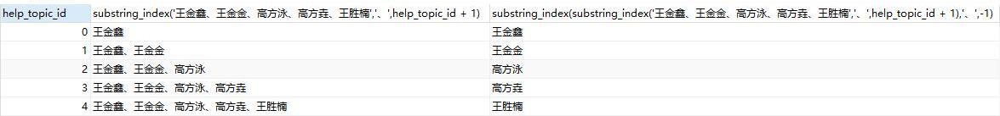

## MySQL拆分字段转为多行

- 通过mysql.help_topic提供自增的字段help_topic_id，通过substring_index截取前若干个拆分项，再截取最后一个

```sql
select
         help_topic_id
        ,substring_index('王金鑫、王金金、高方泳、高方垚、王胜楠','、',help_topic_id + 1)
        ,substring_index(substring_index('王金鑫、王金金、高方泳、高方垚、王胜楠','、',help_topic_id + 1),'、',-1)
from
        mysql.help_topic
where
        help_topic_id < (length('王金鑫、王金金、高方泳、高方垚、王胜楠') - length(replace('王金鑫、王金金、高方泳、高方垚、王胜楠','、','')))/3 + 1
```



- 拆分原表字段

```sql
insert into app_ld_person
(related_patient
,name
,p_type
,related_person
,cardno
,card_type
,touch_type
,town
,addr
,phone)
select
         substring_index(substring_index(t1.related_patient,'、',t2.help_topic_id + 1),'、',-1)
        ,t1.name
        ,t1.p_type
        ,t1.related_person
        ,t1.cardno
        ,t1.card_type
        ,t1.touch_type
        ,t1.town
        ,t1.addr
        ,t1.phone
from
        app_ld_person t1
join
        mysql.help_topic t2
where 
        t1.related_patient regexp '、'
and     
        t2.help_topic_id < (length(t1.related_patient) - length(replace(t1.related_patient, '、', '')))/3 + 1
```

