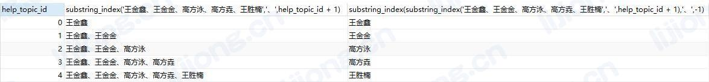

## MySQL拆分字段转为多行

- 通过mysql.help_topic提供自增的字段help_topic_id，通过substring_index截取前若干个拆分项，再截取最后一个

```sql
select
         help_topic_id
        ,substring_index('王金鑫、王金金、高方泳、高方垚、王胜楠','、',help_topic_id + 1)
        ,substring_index(substring_index('王金鑫、王金金、高方泳、高方垚、王胜楠','、',help_topic_id + 1),'、',-1)
from
        mysql.help_topic
where
        help_topic_id < (length('王金鑫、王金金、高方泳、高方垚、王胜楠') - length(replace('王金鑫、王金金、高方泳、高方垚、王胜楠','、','')))/3 + 1
```



- 拆分原表字段

```sql
select
         substring_index(substring_index(t1.related_patient,'、',t2.help_topic_id + 1),'、',-1) related_patient
        ,t1.name
        ,t1.p_type
        ,t1.related_person
        ,t1.cardno
        ,t1.card_type
        ,t1.touch_type
        ,t1.town
        ,t1.addr
        ,t1.phone
from
        app_ld_person t1
join
        mysql.help_topic t2
where 
        t1.related_patient regexp '、'
and     
        t2.help_topic_id < (length(t1.related_patient) - length(replace(t1.related_patient, '、', '')))/3 + 1
```

```sql
select
         t1.区县
        ,t1.一级部门
        ,t1.二级部门
        ,t1.目录名称
        ,substring_index(substring_index(t1.目录中的信息项,',',t2.help_topic_id + 1),',',-1) 目录中的信息项
        ,t1.服务名称
        ,t1.目录更新频率
        ,t1.服务类型
        ,t1.入参
        ,t1.出参
        ,t1.目录状态
        ,t1.服务状态
        ,t1.目录创建时间
        ,t1.目录更新时间
        ,t1.服务创建时间
        ,t1.服务更新时间
        ,t1.开放目录更新周期
        ,t1.开放目录自定义更新周期描述
        ,t1.开放领域
        ,t1.开放行业
        ,t1.表数据条数
        ,t1.访问量
from
        资源目录 t1
join
        mysql.help_topic t2
where 
        t1.目录中的信息项 regexp ','
and     
        t2.help_topic_id < (length(t1.目录中的信息项) - length(replace(t1.目录中的信息项, ',', '')))/1 + 1
```

```sql
select
         t1.资源名称
				,t2.help_topic_id + 1 序号
        ,substring_index(substring_index(t1.信息项,'|',t2.help_topic_id + 1),'|',-1) 信息项
        ,'varchar' 数据类型

from
        hlj_data t1
join
        mysql.help_topic t2
where 
        t1.信息项 regexp '\\|' and t1.信息项 is not null
and     
        t2.help_topic_id < (length(t1.信息项) - length(replace(t1.信息项, '|', '')))/1 + 1
```

