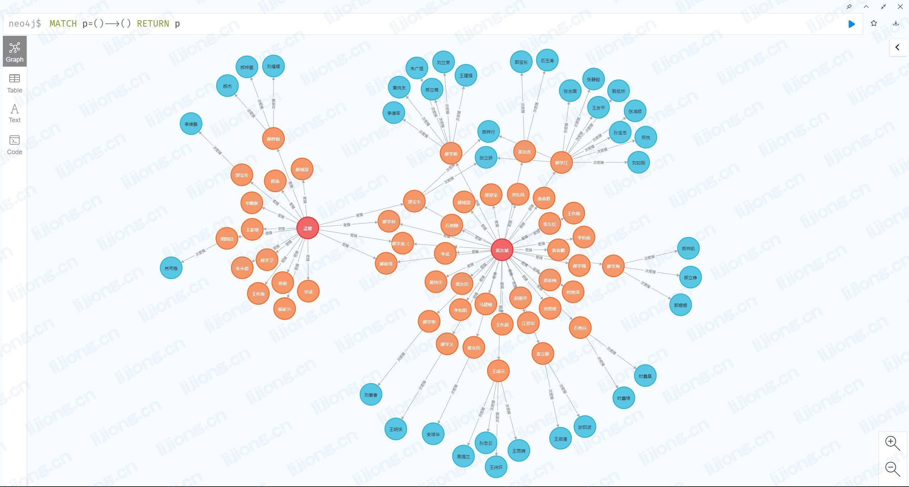

## **Neo4j导入CSV文件**

- 将csv文件（CSV UTF-8逗号分隔）拷贝到neo4j目录下的import后运行命令
- 若配置文件中有dbms.directories.import=import参数，则路径使用file:///ds_hz_four.csv

### 导入数据

```
load csv with headers from 'file:///var/lib/neo4j/import/密接人员.csv' as line
create(:密接人员{
姓名:line.姓名,
性别:line.性别,
身份证号:line.身份证号,
现住址:line.现住址,
联系方式:line.联系方式,
工作单位及工种:line.工作单位及工种,
疫苗情况:line.疫苗情况,
有无症状:line.有无症状,
管控措施:line.管控措施,
预解除集中隔离日期:line.预解除集中隔离日期
})
```

```
load csv with headers from 'file:///var/lib/neo4j/import/次密接人员.csv' as line
create(:次密接人员{
姓名:line.姓名,
性别:line.性别,
身份证号:line.身份证号,
现住址:line.现住址,
联系方式:line.联系方式,
工作单位及工种:line.工作单位及工种,
疫苗情况:line.疫苗情况,
有无症状:line.有无症状,
管控措施:line.管控措施,
预解除集中隔离日期:line.预解除集中隔离日期
})
```

### 创建索引

```
create index on :密接人员(身份证号);
create index on :次密接人员(身份证号);
```

### 查看索引

```
:schema
```

### 建立关系

```
load csv with headers from 'file:///var/lib/neo4j/import/次密接关系.csv' as line
match(from:密接人员{身份证号:line.密接身份证号}),(to:次密接人员{身份证号:line.身份证号})
merge(from)-[r:次密接{接触方式:line.接触方式,末次接触时间:line.末次接触时间}]->(to)
```

