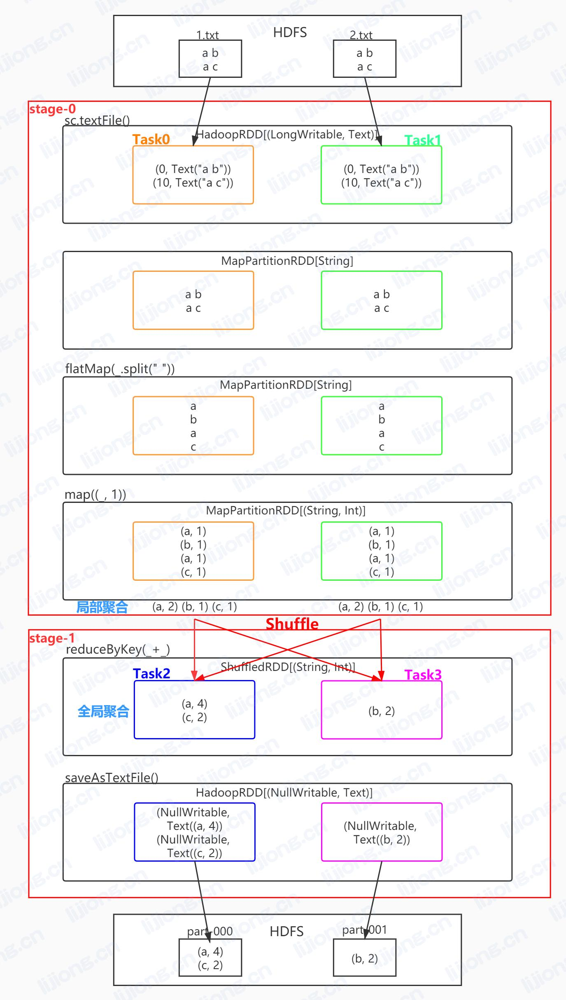

## **Spark的WordCount执行流程**

1. HDFS上有两个小文件，两个数据切片
2. 调用sc.textFile("")，会生成两个RDD，第一个RDD是HadoopRDD[(LongWritable, Text)]，里面装的kv，key是LongWritable，value是Text，内部调用了map()方法，丢掉key，生成MapPartitionRDD[String]，读了两个数据切片，就有两个分区
3. 调用flatMap(_.split(" "))方法，进行切分，生成MapPartitionRDD[String]
4. 调用map((_, 1))方法，将单词和1组合，生成MapPartitionRDD[(String, Int)]
5. 调用reduceByKey(\_+_)方法，生成ShuffledRDD[(String, Int)]，其实分为两个阶段，一个局部聚合阶段，一个全局聚合阶段，Shuffle发生在两个阶段之间，局部聚合后会写到磁盘
6. 最后调用saveAsTextFile("")生成MapPartitonRDD[(NullWritable, Text)]，写回HDFS

- 整体叫做一个DAG，有两个stage，六个RDD，两个分区，四个Task，Task把同一台机器的计算逻辑合在一起，叫做pipeline

