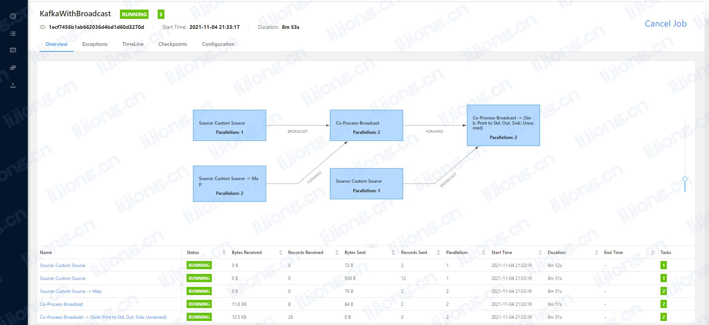

## **基于Flink的实时离线数据整合**

提供离线数据与实时数据整合功能，通过广播变量将离线数据广播，通过connect方法获取广播流数据，实现与实时数据的整合，广播流数据随离线数据的更新进行更新。

### KafkaWithBroadcast

```java
import bean.TestBean;
import com.alibaba.fastjson.JSONObject;
import org.apache.flink.api.common.functions.MapFunction;
import org.apache.flink.api.common.serialization.SimpleStringSchema;
import org.apache.flink.api.common.state.BroadcastState;
import org.apache.flink.api.common.state.MapStateDescriptor;
import org.apache.flink.api.common.state.ReadOnlyBroadcastState;
import org.apache.flink.api.common.typeinfo.TypeHint;
import org.apache.flink.api.common.typeinfo.TypeInformation;
import org.apache.flink.api.common.typeinfo.Types;
import org.apache.flink.api.java.tuple.Tuple2;
import org.apache.flink.streaming.api.datastream.BroadcastStream;
import org.apache.flink.streaming.api.datastream.DataStream;
import org.apache.flink.streaming.api.datastream.DataStreamSource;
import org.apache.flink.streaming.api.datastream.SingleOutputStreamOperator;
import org.apache.flink.streaming.api.environment.StreamExecutionEnvironment;
import org.apache.flink.streaming.api.functions.co.BroadcastProcessFunction;
import org.apache.flink.util.Collector;

public class KafkaWithBroadcast {
    public static void main(String[] args) throws Exception {
        StreamExecutionEnvironment env = FlinkUtils.getEnv();
        DataStreamSource<Tuple2<String, String>> tps = env.addSource(new MysqlSource());
        DataStreamSource<Tuple2<String, String>> tps2 = env.addSource(new MysqlSource2());
        // 定义广播State描述器1
        MapStateDescriptor<String, String> codeToNameDescriptor = new MapStateDescriptor<>(
                "sex-state",
                Types.STRING,
                TypeInformation.of(new TypeHint<String>() {}));

        // 调用broadcast方法将数据广播
        BroadcastStream<Tuple2<String, String>> broadcastDataStream = tps.broadcast(codeToNameDescriptor);

        // 定义广播State描述器2
        MapStateDescriptor<String, String> codeToNameDescriptor2 = new MapStateDescriptor<>(
                "industry-state",
                Types.STRING,
                TypeInformation.of(new TypeHint<String>() {}));

        // 调用broadcast方法将数据广播
        BroadcastStream<Tuple2<String, String>> broadcastDataStream2 = tps2.broadcast(codeToNameDescriptor2);

        // 从kafka中读取数据
        DataStream<String> kafkaStream = FlinkUtils.createKafkaStream("online", SimpleStringSchema.class);
        // 实时流数据处理
        SingleOutputStreamOperator<TestBean> BeanDataStream = kafkaStream.map(new MapFunction<String, TestBean>() {
            @Override
            public TestBean map(String line) throws Exception {
                // "{'industry_code': 'G010100', 'age': 28, 'sex': 1, 'id': '001', 'name': u'\\u4efb\\u9e4f'}"
                String line2 = line.replace("\"","").replace("u'", "'").replace("\\\\","\\");
                JSONObject jsonObject = JSONObject.parseObject(line2);
                String id = jsonObject.getString("id");
                String name = jsonObject.getString("name");
                String age = jsonObject.getString("age");
                String sex_code = jsonObject.getString("sex");
                String industry_code = jsonObject.getString("industry_code");
                return new TestBean(id,name,age,sex_code,industry_code);
            }
        });

        BeanDataStream.addSink(new MysqlSink());

        // kafka数据和广播state进行connect
        SingleOutputStreamOperator<TestBean> stream = BeanDataStream.connect(broadcastDataStream).process(new BroadcastProcessFunction<TestBean, Tuple2<String, String>, TestBean>() {
            // 关联字段1
            @Override
            public void processElement(TestBean value, ReadOnlyContext ctx, Collector<TestBean> out) throws Exception {
                ReadOnlyBroadcastState<String, String> broadcastState = ctx.getBroadcastState(codeToNameDescriptor);
                String sex_code = value.getSexCode();
                //根据code获取name
                String sex_name = broadcastState.get(sex_code);
                value.setSexName(sex_name);
                out.collect(value);
            }

            @Override
            public void processBroadcastElement(Tuple2<String, String> value, Context ctx, Collector<TestBean> out) throws Exception {
//                int index = getRuntimeContext().getIndexOfThisSubtask();
//                System.out.println("广播变量1更新 --> " + index + " " + value);
                BroadcastState<String, String> broadcastState = ctx.getBroadcastState(codeToNameDescriptor);
                //保存或覆盖规则数据
                broadcastState.put(value.f0, value.f1);
            }
        }).connect(broadcastDataStream2).process(new BroadcastProcessFunction<TestBean, Tuple2<String, String>, TestBean>() {
            // 关联字段2
            @Override
            public void processElement(TestBean value, ReadOnlyContext ctx, Collector<TestBean> out) throws Exception {
                ReadOnlyBroadcastState<String, String> broadcastState = ctx.getBroadcastState(codeToNameDescriptor2);
                String industry_code = value.getIndustryCode();
                //根据code获取name
                String industry_name = broadcastState.get(industry_code);
                value.setIndustryName(industry_name);
                out.collect(value);
            }

            @Override
            public void processBroadcastElement(Tuple2<String, String> value, Context ctx, Collector<TestBean> out) throws Exception {
//                int index = getRuntimeContext().getIndexOfThisSubtask();
//                System.out.println("广播变量2更新 --> " + index + " " + value);
                BroadcastState<String, String> broadcastState = ctx.getBroadcastState(codeToNameDescriptor2);
                //保存或覆盖规则数据
                broadcastState.put(value.f0, value.f1);
            }
        });
        stream.print();
        stream.addSink(new MysqlSink2());

        env.execute("KafkaWithBroadcast");
    }
}
```


### FlinkUtils

```java
import org.apache.flink.api.common.serialization.DeserializationSchema;
import org.apache.flink.streaming.api.datastream.DataStream;
import org.apache.flink.streaming.api.environment.CheckpointConfig;
import org.apache.flink.streaming.api.environment.StreamExecutionEnvironment;
import org.apache.flink.streaming.connectors.kafka.FlinkKafkaConsumer;

import java.util.Properties;

public class FlinkUtils {

    private static StreamExecutionEnvironment env = StreamExecutionEnvironment.getExecutionEnvironment();

    public static <T> DataStream<T> createKafkaStream(String src_topic, Class<? extends DeserializationSchema<T>> clazz) throws Exception{
        //开启ChackPointing，同时开启重启策略
        env.enableCheckpointing(5000);

        //取消任务checkpoint不删除
        env.getCheckpointConfig().enableExternalizedCheckpoints(CheckpointConfig.ExternalizedCheckpointCleanup.RETAIN_ON_CANCELLATION);

        Properties props = new Properties();
        //指定Kafka的Broker地址
        props.setProperty("bootstrap.servers", "10.128.18.78:9092");
        //指定组ID
        props.setProperty("group.id", "test");
        //如果没有记录偏移量，第一次从最开始消费
        props.setProperty("auto.offset.reset", "earliest");
        //kafka的消费者不自动提交偏移量
        props.setProperty("enable.auto.commit", "false");

        String topic = src_topic;

        //KafkaSource
        FlinkKafkaConsumer<T> kafkaConsumer = new FlinkKafkaConsumer<T>(
                topic,
                clazz.newInstance(),
                props);

        return env.addSource(kafkaConsumer);
    }

    public static StreamExecutionEnvironment getEnv() {
        return env;
    }
}
```

### TestBean

```java
public class TestBean {

    private String id;
    private String name;
    private String age;
    private String sex_code;
    private String sex_name;
    private String industry_code;
    private String industry_name;
    public TestBean() {
    }
    public TestBean(String id, String name, String age, String sex_code, String industry_code) {
        this.id = id;
        this.name = name;
        this.age = age;
        this.sex_code = sex_code;
        this.industry_code = industry_code;
    }

    public String getId() {
        return id;
    }
    public String getName() {return name;}
    public String getAge() {
        return age;
    }
    public String getSexCode() {
        return sex_code;
    }
    public String getSexName() {
        return sex_name;
    }
    public String getIndustryCode() {
        return industry_code;
    }
    public String getIndustryName() {
        return industry_name;
    }


    public void setSexName(String sex_name) {
        this.sex_name = sex_name;
    }
    public void setIndustryName(String industry_name) {
        this.industry_name = industry_name;
    }

    @Override
    public String toString() {
        return "TestBean{" + "id='" + id + '\''
                + ", name='" + name + '\''
                + ", age='" + age + '\''
                + ", sex_code='" + sex_code + '\''
                + ", sex_name='" + sex_name + '\''
                + ", industry_code='" + industry_code + '\''
                + ", industry_name='" + industry_name + '\''
                + '}';
    }
}
```

### MysqlSource

```java
import org.apache.flink.api.java.tuple.Tuple2;
import org.apache.flink.configuration.Configuration;
import org.apache.flink.streaming.api.functions.source.RichSourceFunction;

import java.sql.Connection;
import java.sql.DriverManager;
import java.sql.PreparedStatement;
import java.sql.ResultSet;

public class MysqlSource extends RichSourceFunction<Tuple2<String, String>> {


    private boolean flag = true;
    private String lastCode = null;
    private Connection connection;

    @Override
    public void open(Configuration parameters) throws Exception {
        connection = DriverManager.getConnection("jdbc:mysql://10.128.18.66:3306/zb_online?characterEncoding=UTF-8&useSSL=false", "root", "ziBoPublic@1");
    }

    @Override
    public void run(SourceContext<Tuple2<String, String>> ctx) throws Exception {

        while (flag) {

            String sql = "SELECT sex_code, sex_name FROM dcde_sex_info WHERE sex_code> ? ORDER BY sex_code DESC";
            PreparedStatement prepareStatement = connection.prepareStatement(sql);
            prepareStatement.setString(1, lastCode != null ? lastCode : "0");
            ResultSet resultSet = prepareStatement.executeQuery();
            int index = 0;
            while (resultSet.next()) {
                String code = resultSet.getString("sex_code");
                String name = resultSet.getString("sex_name");
                //最新的数据，以后根据最大的code作为查询条件
                if(index == 0) {
                    lastCode = code;
                }
                index++;
                ctx.collect(Tuple2.of(code, name));
            }
            resultSet.close();
            prepareStatement.close();

            Thread.sleep(30000);
        }
    }

    @Override
    public void cancel() {
        flag = false;
    }

    @Override
    public void close() throws Exception {
        if(connection != null) {
            connection.close();
        }
    }
}
```

### MysqlSource2

```java
import org.apache.flink.api.java.tuple.Tuple2;
import org.apache.flink.configuration.Configuration;
import org.apache.flink.streaming.api.functions.source.RichSourceFunction;

import java.sql.Connection;
import java.sql.DriverManager;
import java.sql.PreparedStatement;
import java.sql.ResultSet;

public class MysqlSource2 extends RichSourceFunction<Tuple2<String, String>> {


    private boolean flag = true;
    private String lastCode = null;
    private Connection connection;

    @Override
    public void open(Configuration parameters) throws Exception {
        connection = DriverManager.getConnection("jdbc:mysql://10.128.18.66:3306/zb_online?characterEncoding=UTF-8&useSSL=false", "root", "ziBoPublic@1");
    }

    @Override
    public void run(SourceContext<Tuple2<String, String>> ctx) throws Exception {

        while (flag) {

            String sql = "SELECT industry_code, industry_name FROM dcde_industry_info WHERE industry_code> ? ORDER BY industry_code DESC";
            PreparedStatement prepareStatement = connection.prepareStatement(sql);
            prepareStatement.setString(1, lastCode != null ? lastCode : "A000000");
            ResultSet resultSet = prepareStatement.executeQuery();
            int index = 0;
            while (resultSet.next()) {
                String code = resultSet.getString("industry_code");
                String name = resultSet.getString("industry_name");
                //最新的数据，以后根据最大的code作为查询条件
                if(index == 0) {
                    lastCode = code;
                }
                index++;
                ctx.collect(Tuple2.of(code, name));
            }
            resultSet.close();
            prepareStatement.close();

            Thread.sleep(30000);
        }
    }

    @Override
    public void cancel() {
        flag = false;
    }

    @Override
    public void close() throws Exception {
        if(connection != null) {
            connection.close();
        }
    }
}
```

### MysqlSink

```java
import bean.TestBean;
import org.apache.flink.configuration.Configuration;
import org.apache.flink.streaming.api.functions.sink.RichSinkFunction;

import java.sql.Connection;
import java.sql.DriverManager;
import java.sql.PreparedStatement;

public class MysqlSink extends RichSinkFunction<TestBean> {

    private transient Connection connection = null;

    @Override
    public void open(Configuration parameters) throws Exception {
        super.open(parameters);
        connection = DriverManager.getConnection("jdbc:mysql://10.128.18.66:3306/zb_online?characterEncoding=UTF-8&useSSL=false", "root", "ziBoPublic@1");

    }

    @Override
    public void invoke(TestBean bean, Context context) throws Exception {

        PreparedStatement pstm = null;
        try {
            pstm = connection.prepareStatement(
                    "INSERT INTO ddwd_evt_kafka (name,age,sex_code,industry_code) VALUES (?, ?, ?, ?)");

            pstm.setString(1, bean.getName());
            pstm.setString(2, bean.getAge());
            pstm.setString(3, bean.getSexCode());
            pstm.setString(4, bean.getIndustryCode());

            pstm.executeUpdate();
        } finally {
            if(pstm != null) {
                pstm.close();
            }
        }
    }

    @Override
    public void close() throws Exception {
        super.close();
        connection.close();
    }

```

### MysqlSink2

```java
import bean.TestBean;
import org.apache.flink.configuration.Configuration;
import org.apache.flink.streaming.api.functions.sink.RichSinkFunction;

import java.sql.Connection;
import java.sql.DriverManager;
import java.sql.PreparedStatement;

public class MysqlSink2 extends RichSinkFunction<TestBean> {

    private transient Connection connection = null;

    @Override
    public void open(Configuration parameters) throws Exception {
        super.open(parameters);
        connection = DriverManager.getConnection("jdbc:mysql://10.128.18.66:3306/zb_online?characterEncoding=UTF-8&useSSL=false", "root", "ziBoPublic@1");

    }

    @Override
    public void invoke(TestBean bean, Context context) throws Exception {

        PreparedStatement pstm = null;
        try {
            pstm = connection.prepareStatement(
                    "INSERT INTO dmid_pdt_online (name,age,sex_code,sex_name,industry_code,industry_name) VALUES (?, ?, ?, ?, ?, ?)");

            pstm.setString(1, bean.getName());
            pstm.setString(2, bean.getAge());
            pstm.setString(3, bean.getSexCode());
            pstm.setString(4, bean.getSexName());
            pstm.setString(5, bean.getIndustryCode());
            pstm.setString(6, bean.getIndustryName());

            pstm.executeUpdate();
        } finally {
            if(pstm != null) {
                pstm.close();
            }
        }
    }

    @Override
    public void close() throws Exception {
        super.close();
        connection.close();
    }
}
```

**pom.xml**

```xml
<?xml version="1.0" encoding="UTF-8"?>
<project xmlns="http://maven.apache.org/POM/4.0.0"
         xmlns:xsi="http://www.w3.org/2001/XMLSchema-instance"
         xsi:schemaLocation="http://maven.apache.org/POM/4.0.0 http://maven.apache.org/xsd/maven-4.0.0.xsd">
    <modelVersion>4.0.0</modelVersion>

    <groupId>org.example</groupId>
    <artifactId>flinkdemo</artifactId>
    <version>1.0-SNAPSHOT</version>
    <packaging>jar</packaging>

    <name>Flink Quickstart Job</name>
    <url>http://www.myorganization.org</url>

    <properties>
        <project.build.sourceEncoding>UTF-8</project.build.sourceEncoding>
        <flink.version>1.9.1</flink.version>
        <java.version>1.8</java.version>
        <scala.binary.version>2.11</scala.binary.version>
        <maven.compiler.source>${java.version}</maven.compiler.source>
        <maven.compiler.target>${java.version}</maven.compiler.target>
    </properties>

    <repositories>
        <repository>
            <id>apache.snapshots</id>
            <name>Apache Development Snapshot Repository</name>
            <url>https://repository.apache.org/content/repositories/snapshots/</url>
            <releases>
                <enabled>false</enabled>
            </releases>
            <snapshots>
                <enabled>true</enabled>
            </snapshots>
        </repository>
    </repositories>

    <dependencies>
        <dependency>
            <groupId>org.apache.hive</groupId>
            <artifactId>hive-jdbc</artifactId>
            <version>2.1.0</version>
        </dependency>
        <!-- Apache Flink dependencies -->
        <!-- These dependencies are provided, because they should not be packaged into the JAR file. -->
        <dependency>
            <groupId>org.apache.flink</groupId>
            <artifactId>flink-java</artifactId>
            <version>${flink.version}</version>
            <scope>provided</scope>
        </dependency>
        <dependency>
            <groupId>org.apache.flink</groupId>
            <artifactId>flink-streaming-java_${scala.binary.version}</artifactId>
            <version>${flink.version}</version>
            <scope>provided</scope>
        </dependency>


        <dependency>
            <groupId>org.apache.flink</groupId>
            <artifactId>flink-connector-kafka_2.11</artifactId>
            <version>1.9.1</version>
        </dependency>

        <dependency>
            <groupId>mysql</groupId>
            <artifactId>mysql-connector-java</artifactId>
            <version>5.1.47</version>
        </dependency>

        <!-- Redis的Connector -->
        <dependency>
            <groupId>org.apache.bahir</groupId>
            <artifactId>flink-connector-redis_2.11</artifactId>
            <version>1.1-SNAPSHOT</version>
        </dependency>


        <dependency>
            <groupId>com.alibaba</groupId>
            <artifactId>fastjson</artifactId>
            <version>1.2.57</version>
        </dependency>

        <!-- 高效的异步HttpClient -->
        <dependency>
            <groupId>org.apache.httpcomponents</groupId>
            <artifactId>httpasyncclient</artifactId>
            <version>4.1.4</version>
        </dependency>


        <!-- Add logging framework, to produce console output when running in the IDE. -->
        <!-- These dependencies are excluded from the application JAR by default. -->
        <dependency>
            <groupId>org.slf4j</groupId>
            <artifactId>slf4j-log4j12</artifactId>
            <version>1.7.7</version>
            <scope>runtime</scope>
        </dependency>
        <dependency>
            <groupId>log4j</groupId>
            <artifactId>log4j</artifactId>
            <version>1.2.17</version>
            <scope>runtime</scope>
        </dependency>
    </dependencies>


    <build>
        <plugins>

            <!-- Java Compiler -->
            <plugin>
                <groupId>org.apache.maven.plugins</groupId>
                <artifactId>maven-compiler-plugin</artifactId>
                <version>3.1</version>
                <configuration>
                    <source>${java.version}</source>
                    <target>${java.version}</target>
                </configuration>
            </plugin>

            <!-- We use the maven-shade plugin to create a fat jar that contains all necessary dependencies. -->
            <!-- Change the value of <mainClass>...</mainClass> if your program entry point changes. -->
            <plugin>
                <groupId>org.apache.maven.plugins</groupId>
                <artifactId>maven-shade-plugin</artifactId>
                <version>3.0.0</version>
                <executions>
                    <!-- Run shade goal on package phase -->
                    <execution>
                        <phase>package</phase>
                        <goals>
                            <goal>shade</goal>
                        </goals>
                        <configuration>
                            <artifactSet>
                                <excludes>
                                    <exclude>org.apache.flink:force-shading</exclude>
                                    <exclude>com.google.code.findbugs:jsr305</exclude>
                                    <exclude>org.slf4j:*</exclude>
                                    <exclude>log4j:*</exclude>
                                </excludes>
                            </artifactSet>
                            <filters>
                                <filter>
                                    <!-- Do not copy the signatures in the META-INF folder.
                                    Otherwise, this might cause SecurityExceptions when using the JAR. -->
                                    <artifact>*:*</artifact>
                                    <excludes>
                                        <exclude>META-INF/*.SF</exclude>
                                        <exclude>META-INF/*.DSA</exclude>
                                        <exclude>META-INF/*.RSA</exclude>
                                    </excludes>
                                </filter>
                            </filters>
                            <transformers>
                                <transformer implementation="org.apache.maven.plugins.shade.resource.ManifestResourceTransformer">
                                    <mainClass>test.KafkaWithBroadcast</mainClass>
                                </transformer>
                            </transformers>
                        </configuration>
                    </execution>
                </executions>
            </plugin>
        </plugins>

        <pluginManagement>
            <plugins>

                <!-- This improves the out-of-the-box experience in Eclipse by resolving some warnings. -->
                <plugin>
                    <groupId>org.eclipse.m2e</groupId>
                    <artifactId>lifecycle-mapping</artifactId>
                    <version>1.0.0</version>
                    <configuration>
                        <lifecycleMappingMetadata>
                            <pluginExecutions>
                                <pluginExecution>
                                    <pluginExecutionFilter>
                                        <groupId>org.apache.maven.plugins</groupId>
                                        <artifactId>maven-shade-plugin</artifactId>
                                        <versionRange>[3.0.0,)</versionRange>
                                        <goals>
                                            <goal>shade</goal>
                                        </goals>
                                    </pluginExecutionFilter>
                                    <action>
                                        <ignore/>
                                    </action>
                                </pluginExecution>
                                <pluginExecution>
                                    <pluginExecutionFilter>
                                        <groupId>org.apache.maven.plugins</groupId>
                                        <artifactId>maven-compiler-plugin</artifactId>
                                        <versionRange>[3.1,)</versionRange>
                                        <goals>
                                            <goal>testCompile</goal>
                                            <goal>compile</goal>
                                        </goals>
                                    </pluginExecutionFilter>
                                    <action>
                                        <ignore/>
                                    </action>
                                </pluginExecution>
                            </pluginExecutions>
                        </lifecycleMappingMetadata>
                    </configuration>
                </plugin>
            </plugins>
        </pluginManagement>
    </build>

    <!-- This profile helps to make things run out of the box in IntelliJ -->
    <!-- Its adds Flink's core classes to the runtime class path. -->
    <!-- Otherwise they are missing in IntelliJ, because the dependency is 'provided' -->
    <profiles>
        <profile>
            <id>add-dependencies-for-IDEA</id>

            <activation>
                <property>
                    <name>idea.version</name>
                </property>
            </activation>

            <dependencies>
                <dependency>
                    <groupId>org.apache.flink</groupId>
                    <artifactId>flink-java</artifactId>
                    <version>${flink.version}</version>
                    <scope>compile</scope>
                </dependency>
                <dependency>
                    <groupId>org.apache.flink</groupId>
                    <artifactId>flink-streaming-java_${scala.binary.version}</artifactId>
                    <version>${flink.version}</version>
                    <scope>compile</scope>
                </dependency>
            </dependencies>
        </profile>
    </profiles>

</project>
```

