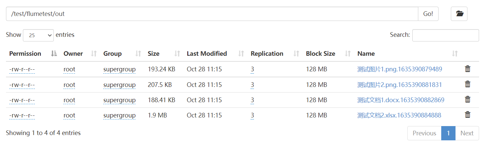

## **基于Flume和LFTP的非结构化文件同步**

### 同步非结构化文件到本地系统

#### lftptest.sh

```shell
#!/bin/bash
 
lftp -u root,Unidata107. sftp://10.0.43.107 << EOF
set net:timeout 15; 
set net:max-retries 4;
set net:reconnect-interval-base 5;
set net:reconnect-interval-multiplier 1;
mirror --delete --only-newer --verbose /opt/tmp/lftptest/in /opt/tmp/lftptest/out
exit
EOF
```

> vi /etc/crontab

```
* * * * * root sh /tmp/test/lftptest.sh >> /tmp/test/lftptest.log
```


### 同步非结构化文件到HDFS

#### test.conf

```
a1.sources = r1
a1.channels = c1
a1.sinks = k1

a1.sources.r1.channels = c1
a1.sources.r1.type = spooldir
a1.sources.r1.spoolDir = /tmp/flumetest/in
a1.sources.r1.deserializer = org.apache.flume.sink.solr.morphline.BlobDeserializer$Builder
a1.sources.r1.deserializer.maxBlobLength = 100000000
a1.sources.r1.basenameHeader = true
a1.sources.r1.basenameHeaderKey = fileName
a1.sources.r1.pollDelay = 1000

a1.channels = c1
a1.channels.c1.type = memory

a1.sinks.k1.channel = c1
a1.sinks.k1.type = hdfs
a1.sinks.k1.hdfs.path = hdfs://linux01:9000/test/flumetest/out/
a1.sinks.k1.hdfs.filePrefix = %{fileName}
a1.sinks.k1.hdfs.fileType = DataStream

```

> /opt/app/apache-flume-1.9.0-bin/bin/flume-ng agent -n a1 -c conf -f /tmp/flumetest/conf/test.conf -Dflume.root.logger=DEBUG,console

- 源目录


- 目标目录

