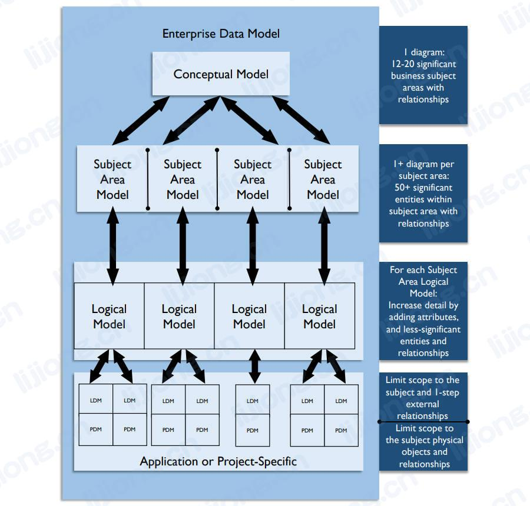
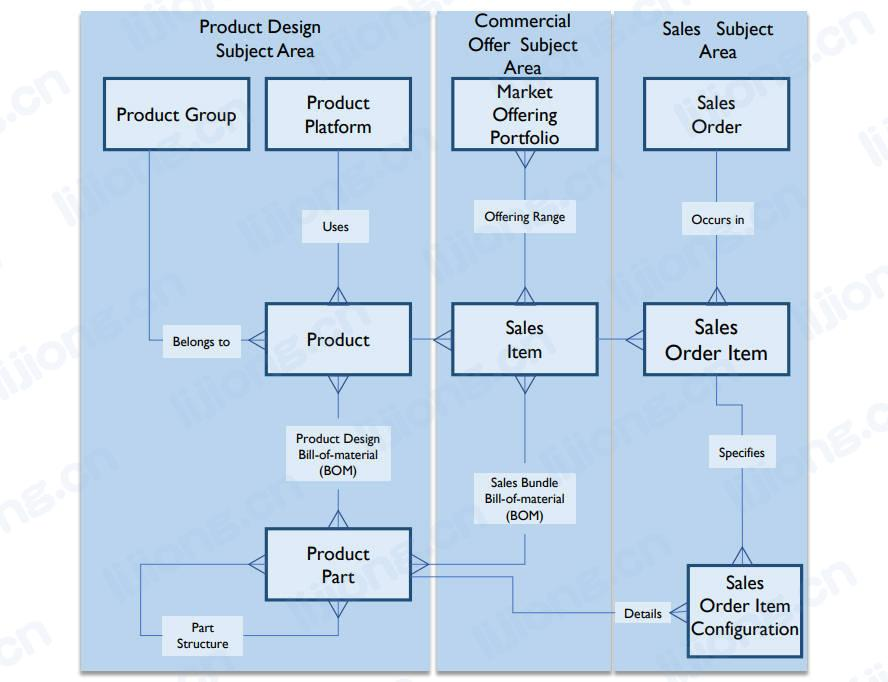
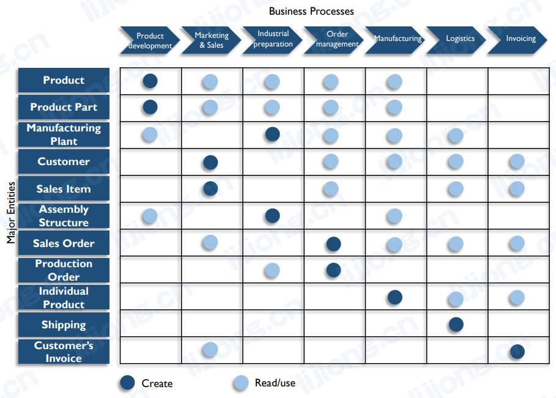
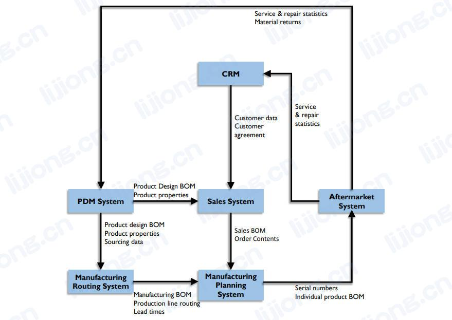

# **企业数据架构**

## 企业数据架构（Enterprise Data Architecture）

- 企业数据架构为对组织重要的元素确定标准术语和设计
- 数据在组织中流动时，其被保护、集成、存储、记录、编目、共享、报告、分析和交付给利益相关者（secured, integrated, stored, recorded, catalogued, shared, reported on, analyzed, and delivered to stakeholders），在此过程中，数据可能被验证、增强、链接、认证、聚合、匿名化、用于分析直到存档或清除（verified, enhanced, linked, certified, aggregated, anonymized, and used for analytics until archived or purged），因此企业数据架构描述必须包括企业数据模型（如数据结构和数据规范）和数据流设计
  - 企业数据模型（EDM, Enterprise Data Model）
    - 一个整体的（holistic）、企业级的（enterprise-level）、独立于实施（implementation-independent）的概念或逻辑数据模型
    - 包括关键企业数据实体（即业务概念）及之间的关系、关键指导业务规则和一些关键属性
    - 应由利益相关者审批，以便就其有效代表企业达成共识
  - 数据流设计（Data Flow Design）
    - 定义跨数据库、应用、平台和网络的存储和处理的需求和主蓝图
    - 数据流将数据移动映射到业务流程、位置、业务角色和技术组件

### 企业数据模型（Enterprise Data Model ）

- 包括通用（企业范围的概念和逻辑模型）和特定于应用或项目的数据模型，以及定义、规范、映射和业务规则
- 企业数据模型通常以层级形式增量和迭代构建
  - 企业主题域的概念性概述
  - 每个主题域的实体和关系视图
  - 归属同一主题域的详细的逻辑视图
  - 特定应用或项目的逻辑和物理模型

- 各层级都是企业数据模型的一部分，并通过链接创建了在横向和纵向上跟踪实体的路径
  - 纵向
    - 每个层级的模型映射到其他层级的模型，模型血缘通过这些映射创建
  - 横向
    - 实体和关系可能出现在同一层级的多个模型中
    - 以一个主题为中心的逻辑模型中的实体可能与其他主题的实体相关，这些实体被标记为主题域的外部（external）
- 关系可能跨越主题域边界，企业数据模型中每个实体都应只处于一个主题域，但可以与其他主题域的实体有联系

- 概念企业数据模型（conceptual enterprise data model）由主题域模型组合而成，可以使用自下而上或自上而下的方法来构建企业数据模型
  - 自下而上
    - 主题域结构基于现有数据模型
  - 自上而下
    - 从形成主题域开始，然后用模型填充主题域
  - 建议结合使用两种方法，使用现有模型自下而上开始，再将主题域建模委派给项目（projects）进行填充以完成企业数据模型
    - starting with bottom-up using existing models and completing the enterprise data model by populating the models by delegating Subject Area modeling to projects
- 主题域鉴别器（discriminator），即形成主题域结构的原则，必须在整个企业数据模型中保持一致
- 常用的主题域划分原则：
  - 使用规范化规则，按系统组合（即资金）划分主题域，按数据治理结构和数据所有权（组织）形成主题域
  - 使用高级过程（基于业务价值链）
  - 使用业务能力（基于企业架构）
- 使用规范化规则形成的主题域通常对数据架构工作最有效

### 数据流设计（Data Flow Design）

- 数据流是一种数据血缘文档，描述数据如何在业务过程和系统中移动，端到端的数据流显示了数据的来源、存储和使用位置，以及数据在不同的流程和系统的内部或其之间如何转换
- 数据流记录数据与以下内容的关系
  - 业务中的应用程序
  - 某个环境中的数据存储或数据库
  - 网段（network segments），对安全映射有用
  - 业务角色，描述哪些角色复杂创建、更新、使用和删除数据
  - 出现地方差异（local differences）的位置
- 数据流可以按不同的详细级别记录，如主题域、业务实体、甚至属性级别，系统可以由网段、平台、通用应用程序集或单个服务器来表示
- 数据流可以用二维矩阵或数据流图表示
  - 矩阵清晰地概述了过程创建和使用的数据
    - 矩阵的优势是考虑到数据不只在一个方向流动，以及过程之间的数据交换是多对多的，任何数据可能出现在任何位置，也可以明确流程的数据采集职责和流程之间的数据依赖关系

    

  - 数据流图描述了系统之间的数据流类型
    - 可以用多种格式和详细级别描述此类图表

    