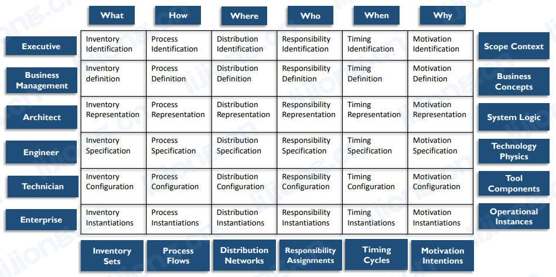

# **企业架构内容**

## 企业架构领域（Enterprise Architecture Domains）

- 企业架构涵盖多个领域，包括业务、数据、应用和技术，管理良好的企业架构实践可以帮助组织了解其系统的当前状态、促进向理想状态的改变、实现监管合规以及提高效率

### 企业业务架构（Enterprise Business Architecture）

- 目的（Purpose）
  - 确定企业如何为客户和其他利益相关者创造价值（To identify how an enterprise creates value for customers and other stakeholder）
- 元素（Elements）
  - 业务模型、流程、能力、服务、事件、策略、术语（Business models, processes, capabilities, services, events, strategies, vocabulary）
- 依赖（Dependencies）
  - 建立其他领域的需求（Establishes requirements for the other domains）
- 角色（Roles）
  - 业务架构师和分析师、业务数据专员（Business architects and analysts, business data stewards）

### 企业数据架构（Enterprise Data Architecture）

- 目的（Purpose）
  - 描述应如何组织和管理数据（To describe how data should be organized and managed）
- 元素（Elements）
  - 数据模型、数据定义、数据映射规范、数据流、结构化数据API（Data models, data definitions, data mapping specifications, data flows, structured data APIs）
- 依赖（Dependencies）
  - 管理业务架构创建和所需的数据（Manages data created and required by business architecture）
- 角色（Roles）
  - 数据架构师和建模师、数据专员（Data architects and modelers, data stewards）

### 企业应用架构（Enterprise Applications Architecture）

- 目的（Purpose）
  - 描述企业中应用程序的结构和功能（To describe the structure and functionality of applications in an enterprise）
- 元素（Elements）
  - 业务系统、软件包、数据库（Business systems, software packages, databases）
- 依赖（Dependencies）
  - 根据业务需求对指定数据进行操作（Acts on specified data according to business requirements）
- 角色（Roles）
  - 应用架构师（Applications architects）

### 企业技术架构（Enterprise Technology Architecture）

- 目的（Purpose）
  - 描述使系统能够工作和交付价值所需的物理技术（To describe the physical technology needed to enable systems to function and deliver value）
- 元素（Elements）
  - 技术平台、网络、安全、集成工具（Technical platforms, networks, security, integration tools）
- 依赖（Dependencies）
  - 托管和执行应用架构（Hosts and executes the application architecture ）
- 角色（Roles）
  - 基础设施架构师（Infrastructure architects）

## 企业架构框架（ Enterprise Architecture Frameworks）

- 架构框架是用于开发范围广泛的相关架构的基础结构，架构框架提供了思考和理解架构的方法，代表架构的架构

### Zachman框架

- 6*6的矩阵包括描述企业所需的完整模型集及其之间的关系，并未定义如何创建模型，只显示应该存在哪些模型，框架分类按单元格（疑问和转换的交集）表示，每个单元格代表一种独特的设计工件，每个工件表示特定视角如何回答基本问题
- 列：沟通的疑问（communication interrogatives），可以询问任何实体的基本问题
  - 什么
  - 清单（inventory），用于构建架构的实体
  - 如何
    - 过程（process），执行的活动
  - 在哪
    - 分布（distribution），业务位置和技术位置
  - 谁
    - 责任（responsibility），角色和组织
  - 何时
    - 定时（timing），间隔、事件、周期和时间表
  - 为什么
    - 动机（motivation），目标、策略和方式
- 行：具体化转换（reification transformations），将抽象实例转化为具体实例的必须步骤，分布代表计划者、所有者、设计者、构建者、实施者和用户的视角
  - 识别（Identification）【计划者】
    - 执行视角（executive perspective）
    - 业务背景（business context）
    - 定义识别模型范围的**业务元素列表**
  - 定义（Definition）【所有者】
    - 业务管理视角（business management perspective）
    - 业务概念（business concepts）
    - 阐明**业务概念之间的关系**，由执行领导作为所有者在定义模型中定义
  - 表示（Representation）【设计者】
    - 架构师视角（architect perspective）
    - 业务逻辑（business logic）
    - **系统逻辑模型**详细说明系统需求和不受约束的设计，由作为表示模型的设计师的架构师表示
  - 规范（Specification）【构建者】
    - 工程师视角（engineer perspective）
    - 业务实体（business physics）
    - 在工程师作为构建的规范模型中指定的特定技术、人员、成本和时间框架的约束下，优化设计以实现特定用途的**物理模型**
  - 配置（Configuration）【实施者】
    - 技术视角（technician perspective）
    - 组件装配（component assemblies）
    - **采用特定技术的、脱离背景的视图**，显示组件如何由技术人员作为实施者在配置模型中组装和操作配置
  - 实例（Instantiation）【用户】
    - 用户视角（user perspective）
    - 操作类（operations classes）
    - 用户作为参与者使用的**实际功能实例**，这个视角没有模型