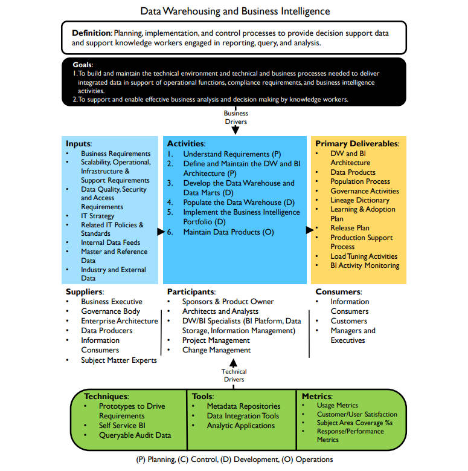

# **数据仓库和商业智能框架**

## 定义

- 规划、实施和控制流程，以提供决策支持数据，并支持知识工作者进行报告、查询和分析（Planning, implementation, and control processes to provide decision support data and support knowledge workers engaged in reporting, query, and analysis.）

## 目标

1. 构建和维护提供集成数据所需的技术环境以及技术和业务流程，以支持运营功能、合规性要求和商业智能活动（To build and maintain the technical environment and technical and business processes needed to deliver integrated data in support of operational functions, compliance requirements, and business intelligence activities.）

2. 支持知识工作者进行有效的业务分析和决策（To support and enable effective business analysis and decision making by knowledge workers.）

## 输入

- 业务需求（Business Requirements）
- 可扩展性、运营、基础设施和支持要求（Scalability, Operational, Infrastructure & Support Requirements）
- 数据质量、安全和访问要求（Data Quality, Security and Access Requirements）
- IT战略（IT Strategy）
- 相关IT政策和标准（Related IT Policies & Standards）
- 内部数据（Internal Data Feeds）
- 主数据和参考数据（Master and Reference Data）
- 行业及外部数据（Industry and External Data）

## 提供者

- 企业主管（Business Executive）
- 治理机构（Governance Body）
- 企业架构（Enterprise Architecture）
- 数据生产者（Data Producers）
- 信息消费者（Information Consumers）
- 主题专家（Subject Matter Experts）

## 活动

1. 【规划】了解需求（Understand Requirements）
2. 【规划】确定和维护数据仓库和商业智能架构（Define and Maintain the DW and BI Architecture）
3. 【开发】开发数据仓库和数据集市（Develop the Data Warehouse and Data Marts）
4. 【开发】加载数据到数据仓库（Populate the Data Warehouse）
5. 【开发】实施商业智能组合（Implement the Business Intelligence Portfolio）
6. 【运营】维护数据产品（Maintain Data Products）

## 参与者

- 赞助人和产品负责人（Sponsors & Product Owner）
- 架构师和分析师（Architects and Analysts）
- 数据仓库/商业智能专家（BI平台、数据存储、信息管理）（DW/BI Specialists (BI Platform, Data Storage, Information Management)）
- 项目管理（Project Management）
- 变更管理（Change Management）

## 交付

- 数据仓库和商业智能架构（DW and BI Architecture）
- 数据产品（Data Products）
- 加载流程（Population Process）
- 治理活动（Governance Activities）
- 血缘字典（Lineage Dictionary）
- 学习和采用计划（Learning & Adoption Plan）
- 发布计划（Release Plan）
- 生成支持流程（Production Support Process）
- 加载调优活动（Load Tuning Activities）
- 商业智能活动监控（BI Activity Monitoring）

## 消费者

- 信息消费者（Information Consumers）
- 客户（Customers）
- 经理和高管（Managers and Executives）

## 技术

- 驱动需求的原型（Prototypes to Drive Requirements）
- 自助式BI（Self Service BI）
- 可查询的审计数据（Queryable Audit Data）

## 工具

- 元数据存储库（Metadata Repositories）
- 数据集成工具（Data Integration Tools）
- 分析应用（Analytic Applications）

## 指标

- 使用指标（Usage Metrics）
- 客户/用户满意度（Customer/User Satisfaction）
- 主题域覆盖率（Subject Area Coverage %s）
- 响应/性能指标（Response/Performance Metrics）