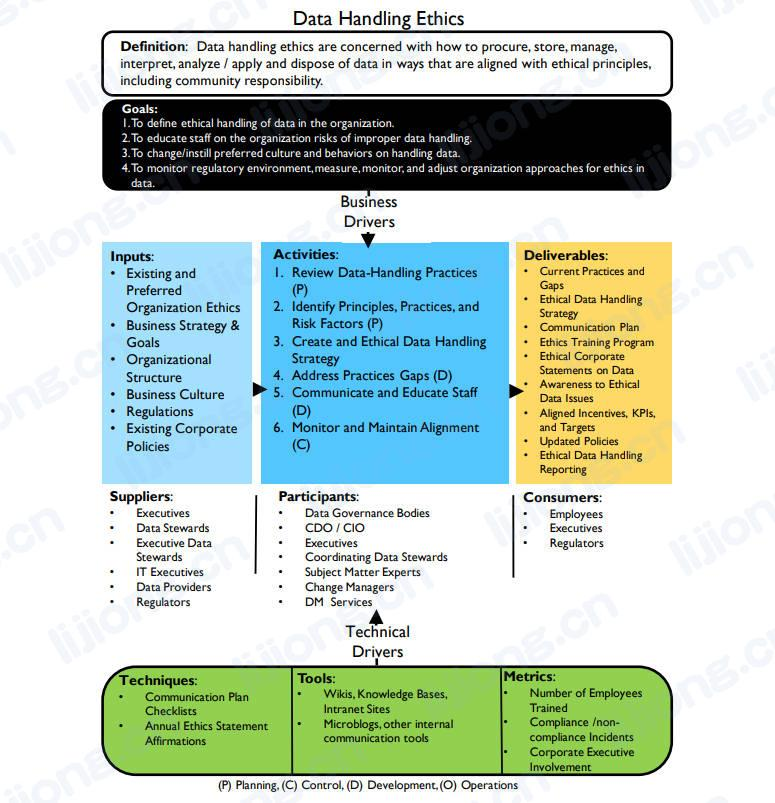

## **数据处理道德框架**

### 定义

- 数据处理道德关注如何以符合道德原则（包括社会责任）的方式获取、存储、管理、解释、分析/应用和销毁数据（Data handling ethics are concerned with how to procure, store, manage, interpret, analyze / apply and dispose of data in ways that are aligned with ethical principles, including community responsibility.）

### 目标

1. 定义组织中合乎道德的数据处理（To define ethical handling of data in the organization.）
2. 教导员工关于不当数据处理的风险（To educate staff on the organization risks of improper data handling.）
3. 改变/逐渐灌输数据处理的文化和行为（To change/instill preferred culture and behaviors on handling data.）
4. 衡量、监控和调整组织以数据道德为目的的方法（To monitor regulatory environment, measure, monitor, and adjust organization approaches for ethics in data.）

### 输入

- 组织现有和倾向的道德原则（Existing and Preferred Organization Ethics）
- 业务战略 & 目标（Business Strategy & Goals）
- 组织结构（Organizational Structure）
- 商业文化（Business Culture）
- 法规（Regulations）
- 当前企业政策（Existing Corporate Policies）

### 提供者

- 管理人员（Executives）
- 数据管理专员（Data Stewards）
- 数据实施管理专员（Executive Data Stewards）
- 信息技术主管（IT Executives）
- 数据提供商（Data Providers）
- 监管人员（Regulators）

### 活动

1. 【计划】审查数据处理做法（Review Data-Handling Practices）
2. 【计划】定义原则、做法和风险因素（Identify Principles, Practices, and Risk Factors）
3. 【计划】创建符合道德的数据处理策略（Create and Ethical Data Handling Strategy）
4. 【执行】解决实践中的差距（Address Practices Gaps）
   - address：to think about a problem or a situation and decide how you are going to deal with it
5. 【执行】沟通和教导员工（Communicate and Educate Staff）
6. 【控制】监控和维持一致性（Monitor and Maintain Alignment）

### 参与者

- 数据治理人员（Data Governance Bodies）
- 首席数据官 / 首席信息官（CDO / CIO, Chief Data Officer / Chief Information Officer）
- 管理人员（Executives）
- 协调数据管理专员（Coordinating Data Stewards）
- 主题专家（Subject Matter Experts）
- 变革经理（Change Managers）
- DM服务者（DM Services）

### 交付

- 现在的做法和差距（Current Practices and Gaps）
- 符合道德的数据处理策略（Ethical Data Handling Strategy）
- 沟通计划（Communication Plan）
- 道德培训课程（Ethics Training Program）
- 企业的数据道德声明（Ethical Corporate Statements on Data）
- 对数据道德问题的认识（Awareness to Ethical Data Issues）
- 一致的激励、KPI和目标（Aligned Incentives, KPIs, and Targets）
- 更新的政策（Updated Policies）
- 数据道德处理报告（Ethical Data Handling Reporting）

### 消费者

- 员工（Employees）
- 管理人员（Executives）
- 监管人员（Regulators）

### 技术

- 沟通计划清单（Communication Plan Checklists）
- 年度道德承诺声明（Annual Ethics Statement Affirmations）

### 工具

- Wikis、知识库和内部网站（Wikis, Knowledge Bases, Intranet Sites）
- 微博，其他内部沟通工具（Microblogs, other internal communication tools）

### 指标

- 被培训的员工数量（Number of Employees Trained）
- 合规 / 不合规事件（Compliance /non-compliance Incidents）
- 企业管理人员的参与（Corporate Executive Involvement）